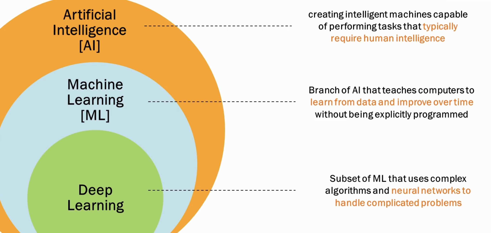
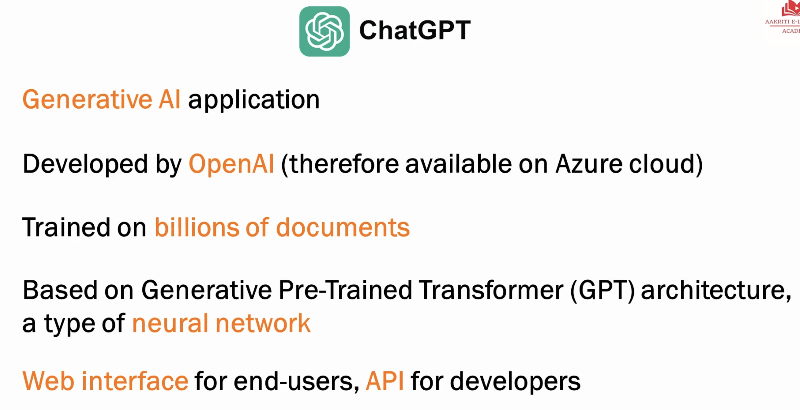
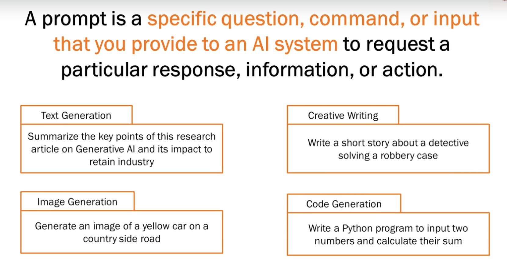
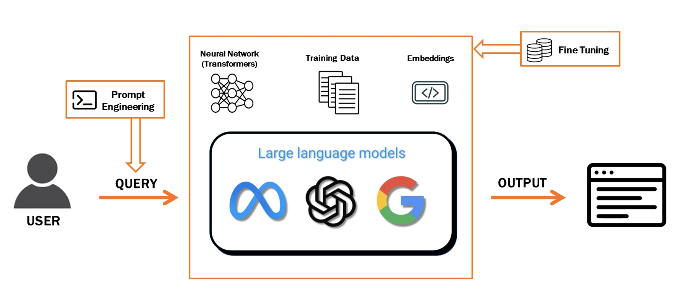
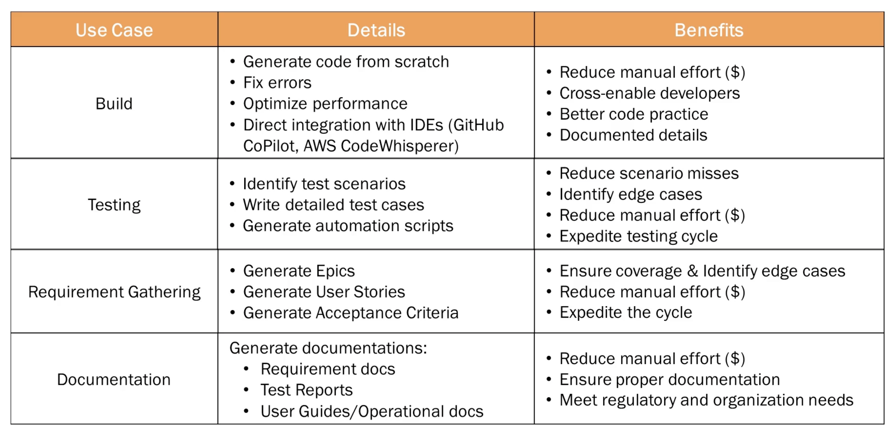
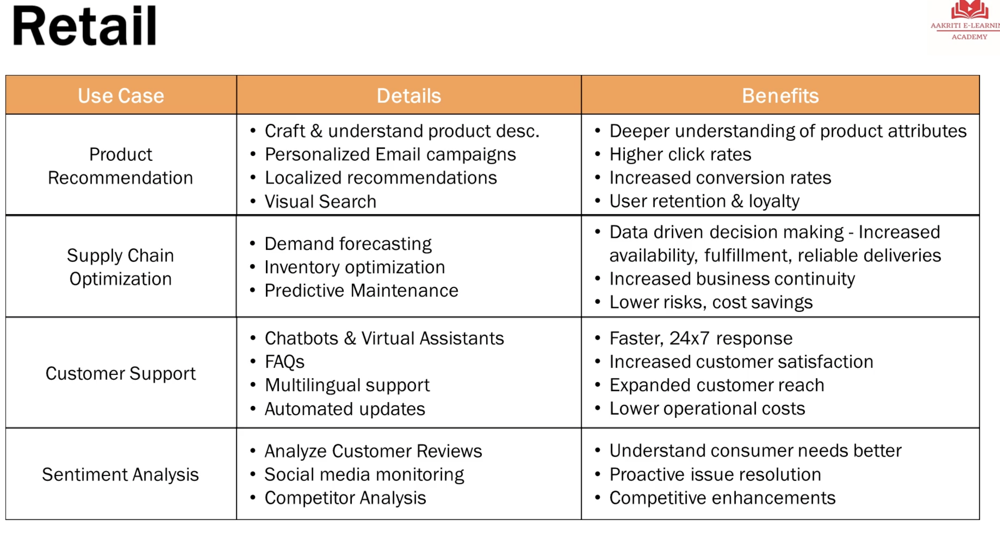
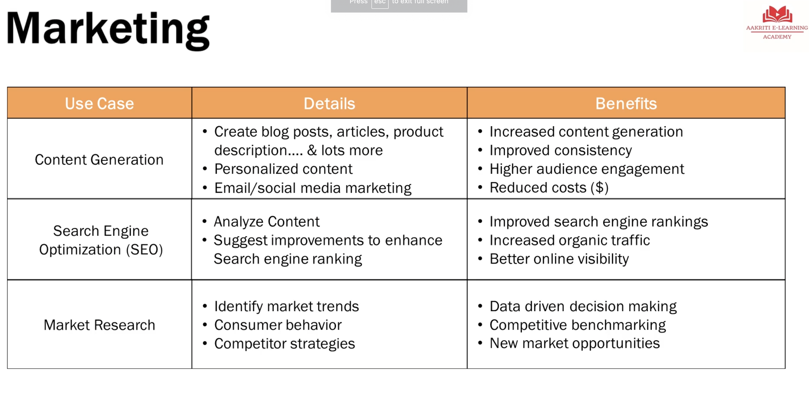
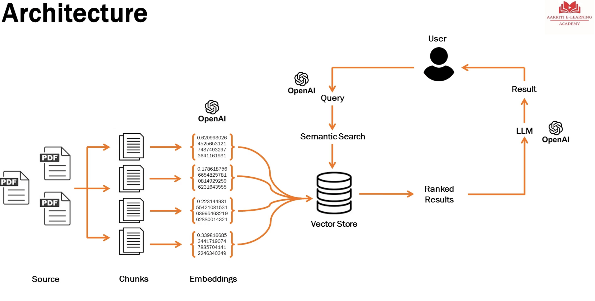

## AI Overview's

- **AI:** Intelligent machines capable of performing tasks that are human intelligence capable of
- **Machine Learning(ML):** subset of AI, that teaches to learn using data and improve overtime.
- **Deep Learning(DL):** subset of ML, that uses complex algorithms, **neural networks** to handle complicated problems.
- **GenAI**: subset of deep learning, understand training data, learn from it, and generate new content.

There are two types of AI's: 

1. **Conventional systems**(i.e existing AI's): You gave them training data, the model learned from it, and then it either made predictions or classified the data into categories, or did language processing like translations, or did computer vision like what an image is.

2. **Generative AI**: We give the AI model lots of training data... much, much more than what we have typically given to the conventional AI system and based on this training data, based on the neural network that operates behind the scene, it is able to generate new content, whether it is text or image or video or anything.

One, for machines to be intelligent, to be accurate, you need to train them on large volume of data.

## key terminologies

### llm

large lang models, powerful AI model designed for understanding and generating human like text
i.e LLM means only text...

the brain behing LM is specific type of nural network a.k.a **trnasformers**
i.e the way they are arch such that they can understand language, meaning, context..etc

key factors:
- pre-trained - trained with huge amt of data.
- size and scale.. you need to proivde more parameters and arguments for it so that they are very well trained.
- fine tuning - more "targeted" traiining for more specific tasks..

examples, where to be used ?

- Content generation
- chatbots and virtual assistants
- lang transulations
- text summarization 
- Q&A 

### prompt engineering
process of crafting well-defined and structured input queries to interact with AI systems in order to get accurate and relevant responses. 

Best practices

- clearly convey the desired response.
- provide context or background info.
- balance simplicity and complexity.
- iterative testing and refinement.

### embedding

it's a numerical representation of text and they are essential for AI models to understand and work with human lang effectively.

### fine tuning

process of adapting a pre-trained model to perform specific tasks or to cater to a particular domain more effectively.

3 types:

- self-supervised 
- supervised (labelled training data)
- reinforcement (based on the scores)

what is not fine-tuning
- Create intelligence from scratch
- eliminating data requirement
- no universal solution, based on the use-cases 
- no magical one-time process

## GenAI usecases

### software development

### retail

### marketing

## chatbot archtecture

