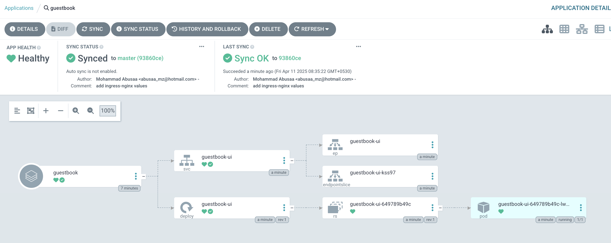

Its a resource object representing a deployed application instance in an environment. Its defined by two key pieces of information. 

- **source**: desired state
- **destination**: reference to target cluster and namespace

All the applications/projects can be created using below three methods.

- declarative(yaml), always recommened
- Web UI
- CLI

```yaml
apiVersion: argoproj.io/v1alpha1
kind: Application
metadata:
  name: guestbook
  namespace: argocd
spec:
  project: default
  source:
    repoURL: https://github.com/argoproj/argocd-example-apps.git
    targetRevision: HEAD
    path: guestbook
  destination:
    server: https://kubernetes.default.svc
    namespace: guestbook
```

## Create application

```yaml
apiVersion: argoproj.io/v1alpha1
kind: Application
metadata: 
  name: guestbook
  namespace: argocd
spec: 
  destination: 
    namespace: guestbook
    server: "https://kubernetes.default.svc"
  project: default
  source: 
    path: guestbook
    repoURL: "https://github.com/mabusaa/argocd-example-apps.git"
    targetRevision: master
  syncPolicy:
    syncOptions:
      - CreateNamespace=true
```

```
➜  labs git:(master) ✗ kubectl get application -n argocd
NAME        SYNC STATUS   HEALTH STATUS
guestbook   OutOfSync     Missing
➜  labs git:(master) ✗ 

➜  labs git:(master) ✗ argocd app list            
NAME              CLUSTER                         NAMESPACE  PROJECT  STATUS     HEALTH   SYNCPOLICY  CONDITIONS  REPO                                                PATH       TARGET
argocd/guestbook  https://kubernetes.default.svc  guestbook  default  OutOfSync  Missing  Manual      <none>      https://github.com/mabusaa/argocd-example-apps.git  guestbook  master
➜  labs git:(master) ✗ 
```

Go to the UI and start "sync" which will then start your deployment by checking with your manifests and so on 



Create application using CLI

```
➜  labs git:(master) ✗ argocd app create app-2 --repo https://github.com/mabusaa/argocd-example-apps.git --revision master --path guestbook --dest-namespace app-2 --dest-server https://kubernetes.default.svc --sync-option CreateNamespace=true

application 'app-2' created
➜  labs git:(master) ✗ 

➜  labs git:(master) ✗ argocd app list
NAME              CLUSTER                         NAMESPACE  PROJECT  STATUS     HEALTH   SYNCPOLICY  CONDITIONS  REPO                                                PATH       TARGET
argocd/app-1      https://kubernetes.default.svc  app-1      default  Synced     Healthy  Manual      <none>      https://github.com/mabusaa/argocd-example-apps.git  guestbook  master
argocd/app-2      https://kubernetes.default.svc  app-2      default  OutOfSync  Missing  Manual      <none>      https://github.com/mabusaa/argocd-example-apps.git  guestbook  master
argocd/guestbook  https://kubernetes.default.svc  guestbook  default  Synced     Healthy  Manual      <none>      https://github.com/mabusaa/argocd-example-apps.git  guestbook  master
➜  labs git:(master) ✗ 

➜  labs git:(master) ✗ argocd app sync app-2
TIMESTAMP                  GROUP        KIND   NAMESPACE                  NAME    STATUS    HEALTH        HOOK  MESSAGE
2025-04-11T08:56:13+05:30            Service       app-2          guestbook-ui  OutOfSync  Missing              
2025-04-11T08:56:13+05:30   apps  Deployment       app-2          guestbook-ui  OutOfSync  Missing              
2025-04-11T08:56:15+05:30          Namespace                             app-2   Running   Synced              namespace/app-2 created
2025-04-11T08:56:15+05:30            Service       app-2          guestbook-ui    Synced  Healthy              
2025-04-11T08:56:15+05:30            Service       app-2          guestbook-ui    Synced   Healthy              service/guestbook-ui created
2025-04-11T08:56:15+05:30   apps  Deployment       app-2          guestbook-ui  OutOfSync  Missing              deployment.apps/guestbook-ui created
2025-04-11T08:56:16+05:30   apps  Deployment       app-2          guestbook-ui    Synced  Progressing              deployment.apps/guestbook-ui created

Name:               argocd/app-2
Project:            default
Server:             https://kubernetes.default.svc
Namespace:          app-2
URL:                https://localhost:8080/applications/app-2
Source:
- Repo:             https://github.com/mabusaa/argocd-example-apps.git
  Target:           master
  Path:             guestbook
SyncWindow:         Sync Allowed
Sync Policy:        Manual
Sync Status:        Synced to master (93860ce)
Health Status:      Progressing

Operation:          Sync
Sync Revision:      93860cefec473c343718a38c99a2e099cc40d209
Phase:              Succeeded
Start:              2025-04-11 08:56:12 +0530 IST
Finished:           2025-04-11 08:56:15 +0530 IST
Duration:           3s
Message:            successfully synced (all tasks run)

GROUP  KIND        NAMESPACE  NAME          STATUS   HEALTH       HOOK  MESSAGE
       Namespace              app-2         Running  Synced             namespace/app-2 created
       Service     app-2      guestbook-ui  Synced   Healthy            service/guestbook-ui created
apps   Deployment  app-2      guestbook-ui  Synced   Progressing        deployment.apps/guestbook-ui created
➜  labs git:(master) ✗ 
```

## Projects

- you can create project for application logical grouping. 
- access restrictions for multiple teams
- allow apps to be deployed into specific clusters and namespaces
- project roles, enables to create a role with set of policies "permission" to grant access to project applications i.e you can set JWT or ODIC etc 
- Always it would create a **default** project 

### Create projects

**Declarative method**

- Allow all sources
- Allow all destination
- Allow all cluster and namespace scopes resources

```yaml
apiVersion: argoproj.io/v1alpha1
kind: AppProject
metadata:
  name: demo-project
  namespace: argocd
spec:
  description: Demo Project
  sourceRepos:
  - '*'

  destinations:
  - namespace: '*'
    server: '*'

  clusterResourceWhitelist:
  - group: '*'
    kind: '*'

  namespaceResourceWhitelist:
  - group: '*'
    kind: '*'
```

Once the project is defined, then you would create application related to this project. 

```
➜  labs git:(master) ✗ kubectl get appproject -n argocd                         
NAME      AGE
default   47h
➜  labs git:(master) ✗ 
```

TODO:

- [ ] Create a new project and deploy application in that project.
- [ ] Create a new project to be allowed only for particular namespace.
- [ ] create application in that namespace to chekc if deployment is successful
- [ ] Describe the logs for the application incase there's issue
- [ ] Modify the logs according to the namespace and you would not be able to run the app