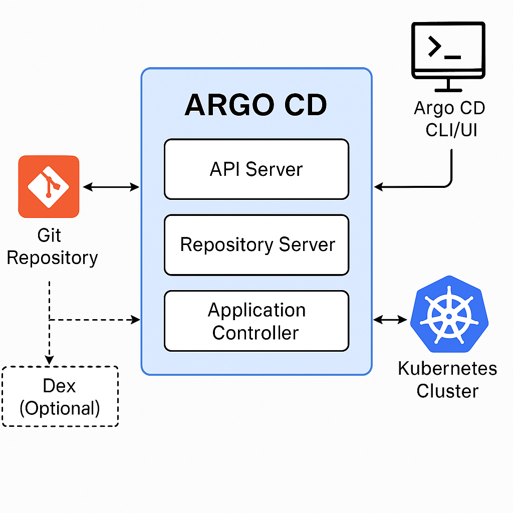

Argo CD (short for Argo Continuous Delivery) is a declarative, GitOps-based continuous delivery tool for Kubernetes. It automates the deployment of the desired application states defined in Git repositories to Kubernetes clusters(actual state).

## ArgoCD Core Concepts

| Concept           | Description                                                                 |
|-------------------|-----------------------------------------------------------------------------|
| **GitOps**         | Uses Git as the single source of truth for declarative infrastructure and applications. |
| **Application**    | A Kubernetes Custom Resource (CR) in Argo CD that defines the desired state of an app. |
| **Sync**           | The process of aligning the live Kubernetes cluster state with what's defined in Git. |
| **Drift Detection**| Identifies any difference between the declared state in Git and the actual state in the cluster. |
| **Reconciliation** | Keeps the cluster in sync with Git either manually or through automated syncing. |

## Gitops

GitOps is a modern DevOps practice that uses Git as the single source of truth for managing infrastructure and application deployment. It enables automated delivery of code and configuration into Kubernetes or any other environment through Git workflows.

### Core Principles of GitOps

| Principle                  | Description                                                                 |
|----------------------------|-----------------------------------------------------------------------------|
| **Git as the source of truth** | All infrastructure and application configuration is versioned and stored in Git repositories. |
| **Declarative configuration** | The desired state of the system is defined declaratively (e.g., YAML files). |
| **Automated reconciliation**  | A GitOps controller ensures the live state matches the desired state in Git, and takes action if there is a drift. |
| **Pull-based delivery**       | Changes are pulled from Git

Tools that support GitOps:

- Argo CD (for Kubernetes)
- Flux CD
- Jenkins X
- Terraform (with GitOps-style workflows)
- Pulumi

**Benefits of GitOps**

Auditability: Every change is tracked in Git
Consistency: No drift between environments
Security: Pull-based model keeps CI/CD tooling outside of your cluster
Speed & Agility: Quick, safe, and repeatable deployments
Self-healing systems: Automated correction of configuration drift

## ArgoCD Architecture

Argo CD follows a controller-based architecture. It continuously monitors a Git repository and ensures that the Kubernetes cluster's state matches the state defined in Git.

[Git Repository]  --->  [Repository Server] ---> [Application Controller]
         |                          |                      |
         |                      renders manifests          |
         v                          v                      v
   (desired state)       <-  compares with ->       (live state in cluster)
                                   |
                              Sync/Drift Detection

### Main Components of Argo CD

| Component              | Description                                                                                      |
|------------------------|--------------------------------------------------------------------------------------------------|
| **API Server**         | Provides the REST and gRPC API. Handles user authentication, RBAC, and serves the CLI/UI.       |
| **Repository Server**  | Clones Git repositories, renders manifests (Helm, Kustomize, etc.), and makes them available to the controller. |
| **Application Controller** | Monitors application resources. Detects drift between desired (Git) and live (cluster) state and triggers sync. |
| **Dex (Optional)**     | An identity service that enables SSO integration with providers like GitHub, LDAP, Google, etc.  |
| **CLI / Web UI**       | User interfaces to interact with Argo CD — `argocd` CLI for terminal, Web UI for visual management. |

### Deployment options

- Can be installed in-cluster (same K8s cluster as apps) or out-of-cluster (to manage remote clusters).
- Supports managing multiple clusters from a single Argo CD instance.