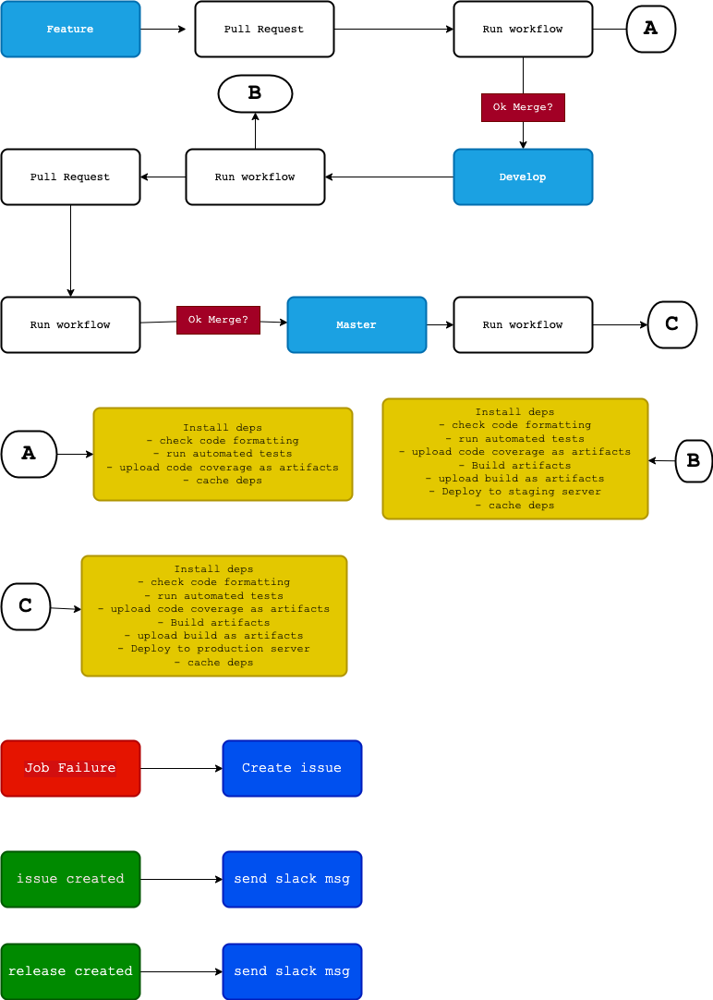
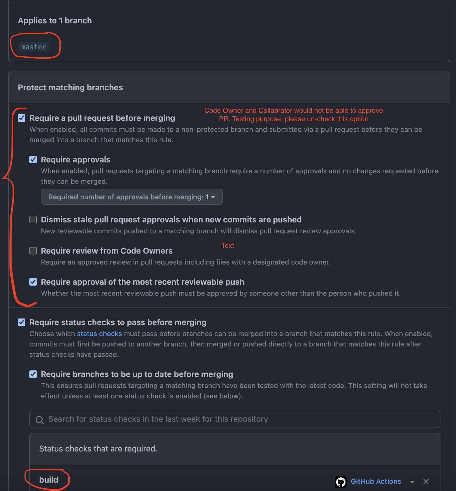

## cicd pipeline

we would have complete version of the cicd pipeline. 


### feature to develop branch

- Developer would create a new `feature branch` and `push`
- Once the push is detected, we would `run the workflow` against it. 
- Once they are successful, you would `create a PR` for the `dev branch` where we run `workflow actions`.
- once the `job is successful`, we would `deploy code in the staging server`. 
  
### develop to master branch

- we would create a` new PR from dev branch to master`, which makes the `actions to run`
- On successful run, we would deploy code to the production server. 

### Post deployments

- Job failures, we would create a new issue 
- successful job, would send a slack message
- successful release, we would send a slack message



## pull_requests

As we discussed earlier, we can't push to `master` or `develop` using the branch. hence we need to create a new `feature` branch and requires a `pull request` to the respective branches. You need to update settings on the `branch protection rules` for both `develop and master`




Here is an example of python project, which builds and let you merge the pull request upon successful

```yaml
name: ci
on:
    pull_request: 
        branches: 
          - develop # PR created from feature to develop
    push:
        branches:
          - develop # merge PR (push to develop branch)
jobs:
    build:
        runs-on: ubuntu-latest
        steps:
            - name: repository checkout
              uses: actions/checkout@v3

            - name: python3.10 setup 
              uses: actions/setup-python@v4
              with:
                python-version: '3.10'
                check-latest: true

            - name: install dependencies
              run: |
                pip install fastapi["all"]
                if [ -f requirements.txt ]; then pip install -r requirements.txt; fi

            - name: cache dependencies
              uses: actions/cache@v3
              with:
                path: ~/.cache/pip
                key: ${{ runner.os }}-pip-${{ hashFiles('**/requirements.txt') }}
                restore-keys: |
                  ${{ runner.os }}-pip-

            - name: code formating
              run: flake8 . --count --exit-zero --max-complexity=10 --max-line-length=127 --statistics

            - name: run testcases
              run: pytest

            - name: test coverage report
              run: pytest --cov=./app ./tests

            - name: upload artifacts test coverage report
              uses: actions/upload-artifact@v1
              with:
                name: code-coverage
                path: ./.coverage

            - name: build fastapi docker image
              if: github.event_name == 'push'
              run: docker build -t '${{ secrets.DOCKER_LOGIN }}'/demo-fastapi:'${{ github.sha }}' .

            - name: login to dockerhub
              if: github.event_name == 'push'
              run: docker login --username '${{ secrets.DOCKER_LOGIN }}' --password '${{ secrets.DOCKER_PASSWORD }}'

            - name: push image to dockerhub
              if: github.event_name == 'push'
              run: docker push '${{ secrets.DOCKER_LOGIN }}'/demo-fastapi:'${{ github.sha }}'
```