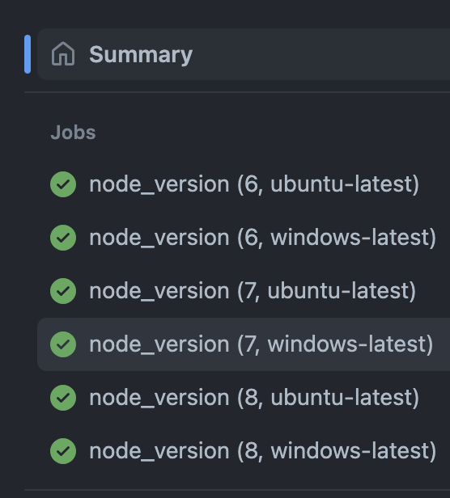
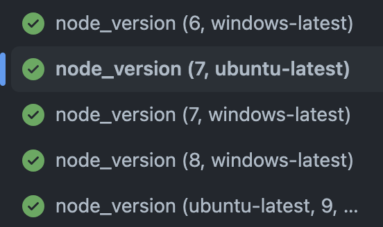

We will be discussing more on the Startergy, matrix and docker container in Jobs. 

## matrix 

Incase we need to run with specific version, then we can use `uses` to defined the versions. 

```yaml
name: versions
on:
    push

jobs:
    node_version:
        runs-on: ubuntu-latest
        steps:
            - name: log node version
              run: node -v
            
            - uses: actions/setup-node@v1
              with:
                node-version: 6

            - name: log node version
              run: node -v
```

If we need to run multiple jobs for multiple versions, then you need to use `strategy` and specify in the array to run all of those parallel. 


```yaml
name: strategy matrix
on:
    push

jobs:
    node_version:
        strategy:
            matrix:
                node_version: [6, 7, 8]
                os: ["ubuntu-latest","windows-latest"]
        runs-on: ${{ matrix.os }}
        steps:
            - name: log node version installed in ubuntu
              run: node -v
            
            - uses: actions/setup-node@v1
              with:
                node-version: ${{ matrix.node_version}}

            - name: log node version currenly set to
              run: node -v
```

Now, you will have totally 6 jobs running at once. 



## include and exclude matrix

Incase we do get a situation, that we need to exclude some of the versions and include few version, then we can use `include` and `exclude` stratergy to run jobs.

```yaml
name: strategy matrix
on:
    push

jobs:
    node_version:
        strategy:
            matrix:
                node_version: [6, 7, 8]
                os: ["ubuntu-latest","windows-latest"]
                exclude:
                    - os: ubuntu-latest
                      node_version: 6
                    - os: ubuntu-latest
                      node_version: 8
                include:
                    - os: ubuntu-latest
                      node_version: 9
                      is_ubuntu_9: 9
        
        env:
            IS_UBUNTU_9: ${{ matrix.is_ubuntu_9 }}
        runs-on: ${{ matrix.os }}
        steps:
            - name: log node version installed in ubuntu
              run: node -v
            
            - uses: actions/setup-node@v1
              with:
                node-version: ${{ matrix.node_version}}

            - name: log node version currenly set to
              run: |
                node -v
                echo $IS_UBUNTU_9

```




## run from docker containers

Till now, we had runners working from the virtual machines, but now we want docker container to initialize and we would run steps from inside container. 

```yaml
name: container
on: push 

jobs:
    node-docker:
        runs-on: ubuntu-latest
        container:
            image: node:20-alpine3.17
        steps:
            - name: log node version
              run: |
                node -v 
                cat /etc/os-release
```