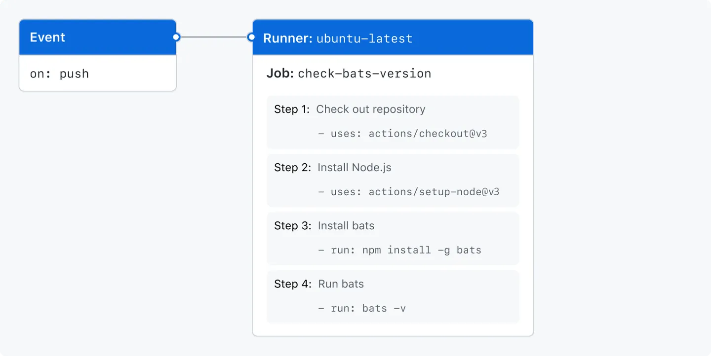

## GitHub actions components

GitHub Actions is a continuous integration and continuous delivery (CI/CD) platform that allows you to **automate your build, test, and deployment pipeline**. You can create workflows that build and test every **pull request to your repository, or deploy merged pull requests to production**.

You can configure a GitHub Actions **workflow** to be triggered when an event occurs in your repository, such as a pull request being opened or an issue being created. workflow contains** one or more jobs** which can run in sequential order or in parallel. Each job will run inside its own virtual machine runner, or inside a container.

### Workflow

A workflow is a configurable automated process that will run one or more jobs, Workflows are defined by a YAML file checked in to your repository(.github/workflows) and will run when **triggered by an event** in your repository, or they can be triggered manually, or at a defined schedule.

### Events

An event is a specific activity in a repository that triggers a workflow run. 
e.g activity can originate from GitHub when someone creates a **pull request**, **opens an issue**, or **pushes a commit to a repository**. 

### Jobs

A job is a set of steps in a workflow that is executed on the same runner. Each step is either a shell script that will be executed, or an action that will be run. Steps are executed in order and are dependent on each other. Since each step is executed on the same runner, you can share data from one step to another

### Actions

An action is a custom application for the GitHub Actions platform that performs a complex but frequently repeated task.Use an action to help reduce the amount of repetitive code that you write in your workflow files

### Runners

A runner is a server that runs your workflows when they're triggered. Each runner can run a single job at a time. GitHub provides Ubuntu Linux, Microsoft Windows, and macOS runners to run your workflows; each workflow run executes in a fresh, newly-provisioned virtual machine.

```yml
name: learn-github-actions
run-name: ${{ github.actor }} is learning GitHub Actions
on: [push]
jobs:
  check-bats-version:
    runs-on: ubuntu-latest
    steps:
      - uses: actions/checkout@v3 # checkout code in runner.
      - uses: actions/setup-node@v3 # install specified version 14 in runner and sets $PATH
        with:
          node-version: '14'
      - run: npm install -g bats # run the command
      - run: bats -v # run the command
```



## References

[GitHub Actions Documentation](https://docs.github.com/en/actions/quickstart)