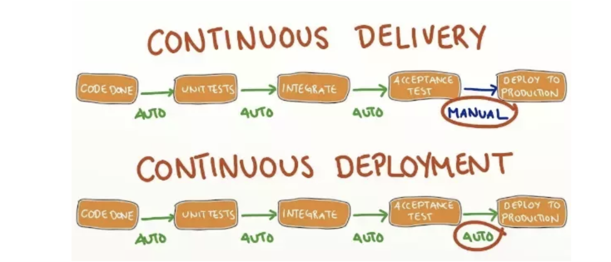

# Overview Of CICD

## Difference between CI/CD

**Continuous Delivery**: Software can be deployed to customers at any time with the "push of a button" (i.e. by running a deployment script).

**Continuous Deployment**: Software is automatically deployed to customers once it passes through the continuous integration system.

## Phases of Continious integrations 

Each of these phases involves incremental improvements to the technical infrastructure as well as, perhaps more importantly, improvements in the practices and culture of the development team itself

### Phase 1 - No Build Server 
Software is built manually on a developer's machine, but developers do not necessarily commit their changes on a regular basis. Some time before a release is scheduled, a developer manually integrates the changes

### Phase 2 - Nightly Builds
the team has a build server, and automated builds are scheduled on a regular (typically nightly) basis. This build simply compiles the code, as there are no reliable or repeatable unit tests. Indeed, automated tests, if they are written, are not a mandatory part of the build process, and may well not run correctly at all. However developers now commit their changes regularly, at least at the end of every day

### Phase 3 - Nightly Builds and Basic Automated Tests
The build server is configured to kick off a build whenever new code is committed to the version control system, and team members are able to easily see what changes in the source code triggered a particular build, and what issues these changes address

### Phase 4 - Enter the Metrics
Automated code quality and code coverage metrics are now run to help evaluate the quality of the code base and (to some extent, at least) the relevance and effectiveness of the tests. The code quality build also automatically generates API documentation for the application. 

### Phase 5 - Getting More Serious About Testing
Test-Driven Development are more widely practiced, resulting in a growing confidence in the results of the automated builds. The application is no longer simply compiled and tested, but if the tests pass, it is automatically deployed to an application server for more comprehensive end-to-end tests and performance tests

### Phase 6 - Automated Acceptance Tests and More Automated Deployment
Acceptance-Test Driven Development is practiced, guiding development efforts and providing high-level reporting on the state of project. These automated tests use Behavior-Driven Development and Acceptance-Test Driven Development tools to act as communication and documentation tools and documentation as mush as testing tools, publishing reports on test results in business terms that non-developers can understand. Since these high-level tests are automated at an early stage in the development process, they also provide a clear idea of what features have been implemented, and which remain to be done. The application is automatically deployed into test environments for testing by the QA team either as changes are committed, or on a nightly basis; a version can be deployed(or "prompted") to UAT and possibly production environments using a manually-triggered build when testers consider it ready. The team is also capable of using the build server to back out a release, rolling back to a previous release, if something goes horribly wrong.

### Phase 7 - Continuous Deployment
Confidence in the automated unit, integration and acceptance tests is now such that teams can apply the automated deployment techniques developed in the previous phase to push out new changes directly into production. The progression between levels here is of course somewhat approximate, and may not always match real-world situations