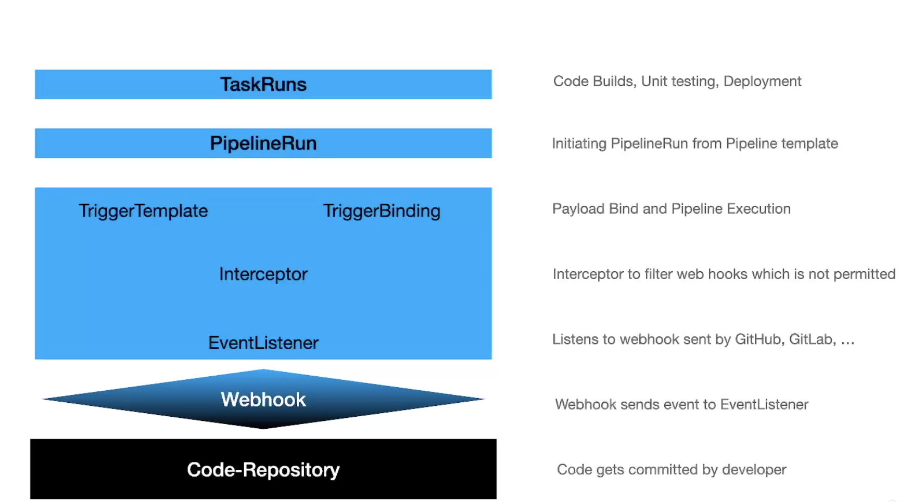

## cicd

- set of practices to streamline software development process.
- achievement of faster deployment cycles, reduce errors, enhance quality & collaboration

### ci 

- encourages developers to frequeently integrate their code into shared repository which detects integration issues, erors very early stage of development. 
- Build is transparent and can be used by tools like 'mavev,docker,gradle' etc
- auotmated testing i.e unit test, integration testing etc 
- linting, checkstyles etc for code quality

### cd

- new git release has been created 
- delivery/deployment pipeline 
  - publish artifacts/images
  - handle stage of release
- human approval process involmenet.
- operation transparent.

## Tekton architecture

### Definition

**steps:** smallest units, its equivalent to container that executes on specific input to produce output.

**task**: composed of one or more steps. represent higher level unit of work of specific job in your CI/CD process. 

**pipelines** series of tasks that should be executed in a specific order. they orchstrate the flow of work through the CICD process. 

^ ^ Complete process but only the blueprint(definition)

### Instatiation

**pipelineRun** is the actual work done.. these components picked up by the **tekton controller** , this controller will create respoective pods 

**eventhandling** 

listens to external events such as code-commits and trigger piprlines executions. this is done by the HTTP which is configured to have a webhooks defined. 

**Interceptors** inspect events and filter external events.. they run through the pipeline so you can customize triggers.. only auth events pass..

**Trigger binding/templates:** extract data from the  incoming event payloads to feed pipelineRun.reusable templates to trigger the pipelines. 

