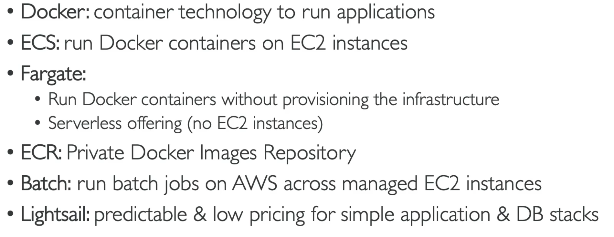
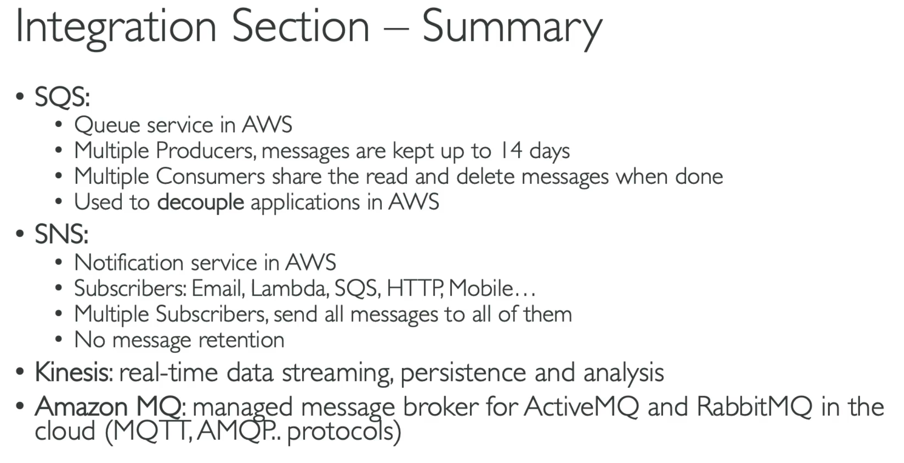

## CLF-C022026

## Shared responsibility Model 


[Official link Shared Responsibility Model](https://aws.amazon.com/compliance/shared-responsibility-model/)

## IAM


## Compute

These are the instance types for EC2. https://aws.amazon.com/ec2/instance-types/

SG: firewall attached to Ec2 instances

Ec2 instance role: link to IAM roles

Purchace options: On demand, spot, reserverd(standard+convertable), dedicated host, dedicated instance.

Userdata: data to be bootstrappoed during the boot time. 
```bash
#!/bin/bash
# Use this for your user data (script from top to bottom)
# install httpd (Linux 2 version)
yum update -y
yum install -y httpd
systemctl start httpd
systemctl enable httpd
echo "<h1>Hello World from $(hostname -f)</h1>" > /var/www/html/index.html
```

### Serverless




## Storage


## Load Balancers and ASG

**Uses of load balancer**

- Spread load across multiple downstream instances 
- Expose a single point of access (DNS) to your application 
- Seamlessly handle failures of downstream instances 
- Do regular health checks to your instances 
- Provide SSL termination (HTTPS) for your websites 
- Enforce stickiness with cookies • High availability across zones 
- Separate public traffic from private traffic

- managed load balancer
  - AWS guarantees that it will be working
  - AWS takes care of upgrades, maintenance, high availability
  - AWS provides only a few configuration knobs

- integrated with many AWS offerings / services
   -  EC2, EC2 Auto Scaling Groups, Amazon ECS
   -  AWS Certificate Manager (ACM), CloudWatch
   -  Route 53, AWS WAF, AWS Global Accelerator

- health checks
   - load balancer to know if instances it forwards traffic to are available to reply to requests
   - health check is done on a port and a route (/health is common)
   - response is not 200 (OK), then the instance is unhealthy

**Classic Load Balancer**

- HTTP, HTTPS, TCP, SSL (secure TCP)

**Application Load Balancer**

- HTTP, HTTPS, WebSocket

- Operates at layer 7(Appliation layer)

- Routing tables to different target groups:
  - Routing based on path in URL (example.com/users & example.com/posts)
  - Routing based on hostname in URL (one.example.com & other.example.com)
  - Routing based on Query String, Headers

-  ALB are a great fit for micro services & container-based application

-  Target Groups:
   -  EC2 instances (can be managed by an Auto Scaling Group)- HTTP
   -  ECS tasks (managed by ECS itself) – HTTP
   -  Lambda functions – HTTP request is translated into a JSON event
   - ALB can route to multiple target groups
   - Health checks are at the target group level

 - Fixed hostname

 - The application servers don’t see the IP of the client directly 
   - The true IP of the client is inserted in the header X-Forwarded-For
   - We can also get Port (X-Forwarded-Port) and proto (X-Forwarded-Proto)

**Network Load Balancer**
- TCP, TLS (secure TCP), UDP
- Operates at layer 4(Network layer)

**Gateway Load Balancer**
- Operates at layer 3 (Network layer) – IP Protocol

registered target groups when doing the lab


## S3


## Infra Deployment@scale


## Global Applications


## Cloud integrations



## Monitoring


## VPC


## security


## Databaase and Analytics


## Account Management & Billing


## Other AWS services


## AWS Machine learning