## CLF-C022026

## Shared responsibility Model 


[Official link Shared Responsibility Model](https://aws.amazon.com/compliance/shared-responsibility-model/)

## IAM


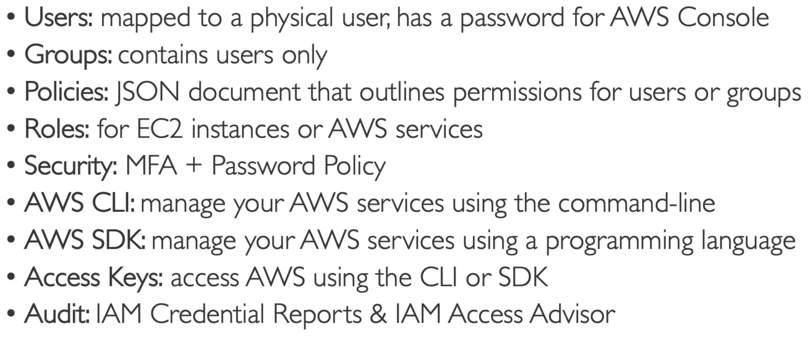

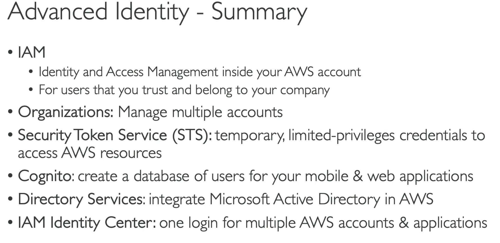


## Compute

These are the instance types for EC2. https://aws.amazon.com/ec2/instance-types/

SG: firewall attached to Ec2 instances

Ec2 instance role: link to IAM roles

Purchace options: On demand, spot, reserverd(standard+convertable), dedicated host, dedicated instance.

Userdata: data to be bootstrappoed during the boot time. 
```bash
#!/bin/bash
# Use this for your user data (script from top to bottom)
# install httpd (Linux 2 version)
yum update -y
yum install -y httpd
systemctl start httpd
systemctl enable httpd
echo "<h1>Hello World from $(hostname -f)</h1>" > /var/www/html/index.html
```

## Serverless Compute


## Storage

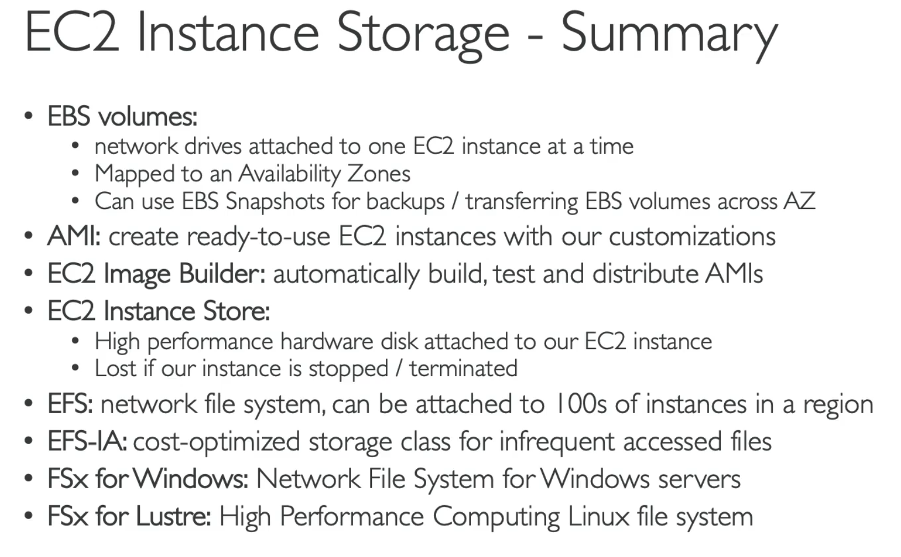

## Load Balancers and ASG

**Uses of load balancer**

- Spread load across multiple downstream instances 
- Expose a single point of access (DNS) to your application 
- Seamlessly handle failures of downstream instances 
- Do regular health checks to your instances 
- Provide SSL termination (HTTPS) for your websites 
- Enforce stickiness with cookies • High availability across zones 
- Separate public traffic from private traffic

- managed load balancer
  - AWS guarantees that it will be working
  - AWS takes care of upgrades, maintenance, high availability
  - AWS provides only a few configuration knobs

- integrated with many AWS offerings / services
   -  EC2, EC2 Auto Scaling Groups, Amazon ECS
   -  AWS Certificate Manager (ACM), CloudWatch
   -  Route 53, AWS WAF, AWS Global Accelerator

- health checks
   - load balancer to know if instances it forwards traffic to are available to reply to requests
   - health check is done on a port and a route (/health is common)
   - response is not 200 (OK), then the instance is unhealthy

**Classic Load Balancer**

- HTTP, HTTPS, TCP, SSL (secure TCP)

**Application Load Balancer**

- HTTP, HTTPS, WebSocket

- Operates at layer 7(Appliation layer)

- Routing tables to different target groups:
  - Routing based on path in URL (example.com/users & example.com/posts)
  - Routing based on hostname in URL (one.example.com & other.example.com)
  - Routing based on Query String, Headers

-  ALB are a great fit for micro services & container-based application

-  Target Groups:
   -  EC2 instances (can be managed by an Auto Scaling Group)- HTTP
   -  ECS tasks (managed by ECS itself) – HTTP
   -  Lambda functions – HTTP request is translated into a JSON event
   - ALB can route to multiple target groups
   - Health checks are at the target group level

 - Fixed hostname

 - The application servers don’t see the IP of the client directly 
   - The true IP of the client is inserted in the header X-Forwarded-For
   - We can also get Port (X-Forwarded-Port) and proto (X-Forwarded-Proto)

**Network Load Balancer**
- TCP, TLS (secure TCP), UDP
- Operates at layer 4(Network layer)

**Gateway Load Balancer**
- Operates at layer 3 (Network layer) – IP Protocol

registered target groups when doing the lab


## S3


## Infra Deployment@scale


## Global Applications


## Cloud integrations


## Monitoring

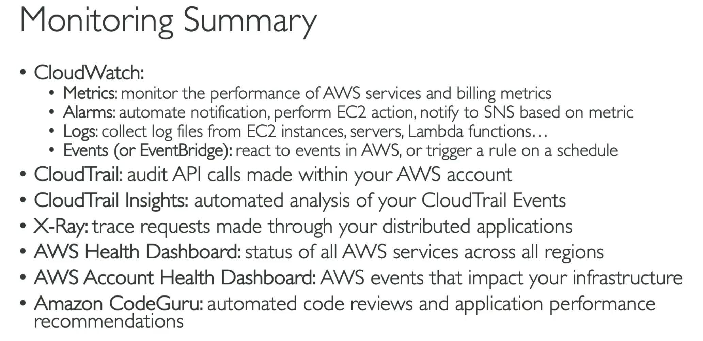

## VPC

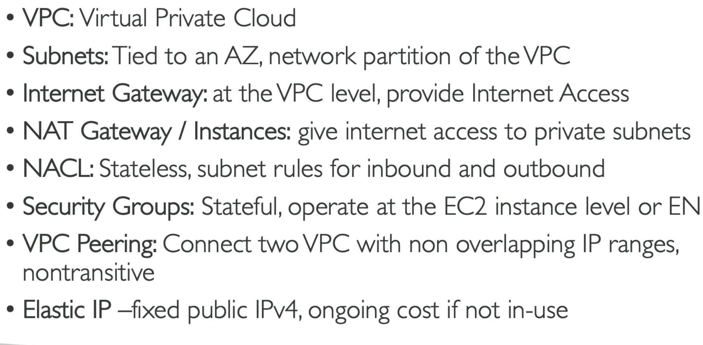

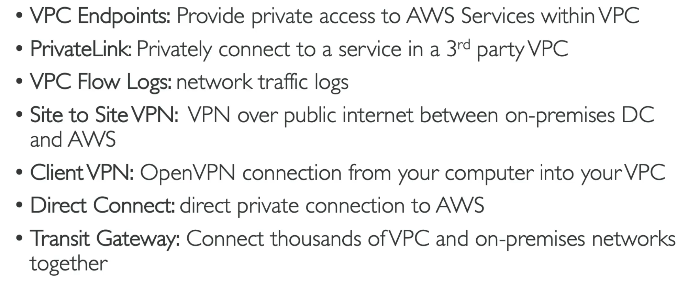

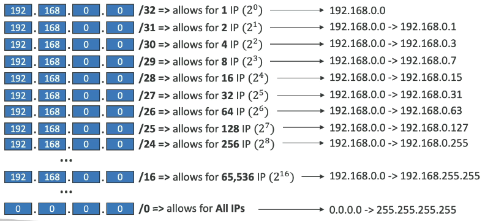

https://www.ipaddressguide.com/cidr

AWS resevres 5 ip address in each subnet, e.g 10.0.0.0/24

10.0.0.0 - network address
10.0.0.1 - reserved by aws for vpc router
10.0.0.2 - reserved by aws for mapping to amazon provided dns
10.0.0.3 - reseced by aws for future aws
10.0.0.255 - netwrok broadcase address. aws does not suppose broacase in a vpc thefor reseverd.

### DemoVPC

**Public Subnet:**


### VPC Peering

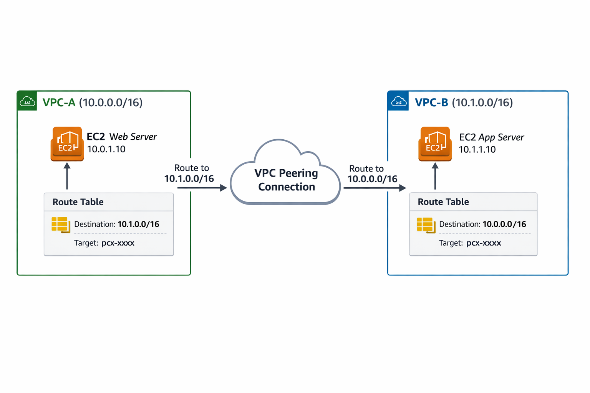

### VPC endpoint

There are two types of endpoints are only for **S3 and Dynamo DB** which are HA and scalable. The main purpose of using this is you dont need to connect to internet to access the AWS services. since they are privately available you can use this service.

- Interface: these would have an cost and would be more useful incase of S2S connectivity or any on-prem
- Gateway: Free of cost and performs same like interface.

Deploy Endpoints in the privatesubnet route entry. earlier this used to be NAT gateway, you can remove entry from NAT, which goes to IGW to get access to your s3 using public, instead remove those NAT and add private GW.


### Site-to-Site VPN (S2S VPN)

A secure IPsec VPN tunnel over the public internet between:
Your on-prem data center +  Your AWS VPC

### Customer Gateway (CGW)

The on-prem side of the VPN. It can be 
firewall / Router /VPN appliance (Cisco, FortiGate, Palo Alto, etc.)

### Virtual Private Gateway (VGW)

The AWS side of the VPN attached to VPC

Its main responsibility is to terminate VPN tunnels and advertise routes to AWS

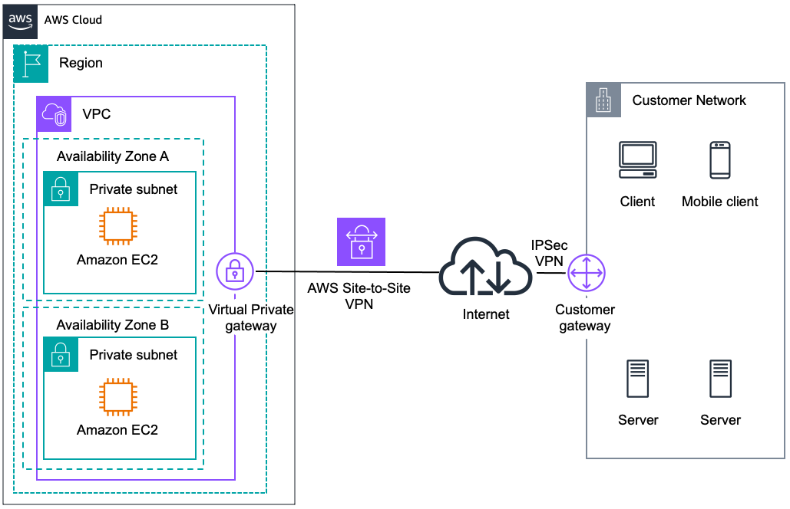

```On-Prem Network
     |
[Customer Gateway]
     |
==== Encrypted IPsec Tunnel ====
     |
[Virtual Private Gateway]
     |
   AWS VPC
```

### AWS Direct Connect (DX)

A dedicated private physical connection(Private fiber link) from your data center to AWS


### Direct Connect Gateway (DXGW)

A global gateway that allows one Direct Connect to connect to multiple VPCs (even across regions).

- Without DXGW → DX is tied to one VPC
- With DXGW → DX can serve many VPCs

Use cases: 
- Multi-account
- Multi-region
- Hub-and-spoke networking

### Transit Gateway (TGW)

Transit Gateway = a central network hub for AWS 
A cloud router that connects many networks together


it can connect:

- Multiple VPCs
- On-prem networks
- VPNs
- Direct Connect

Instead of creating many peer-to-peer connections, everything connects to one hub.

```
Transit Gateway
   ├─ VPC Attachment
   ├─ VPN Attachment
   ├─ DX Gateway Attachment
   └─ TGW Peering
```


### egress-gw

allow instances in your VPC outbound connections over ipv6 while preventing the internet to initiate an ipv6 connection to your instances

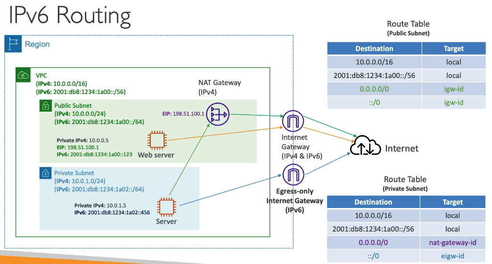


## security


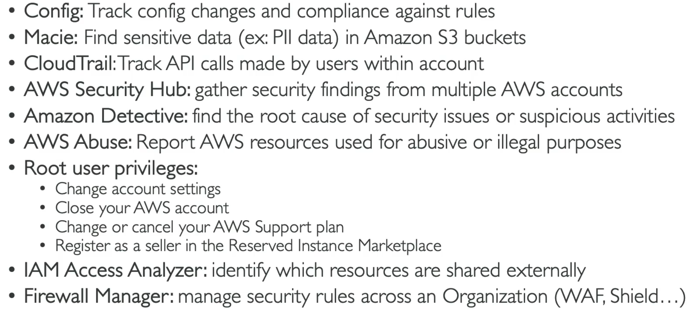

## Databaase and Analytics

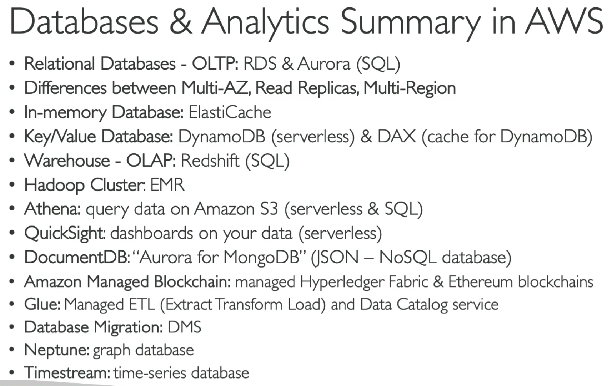

## Account Management & Billing

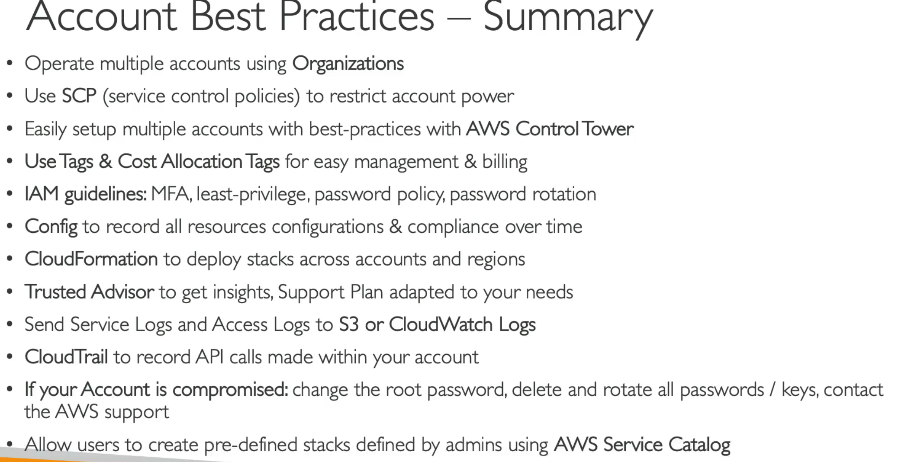

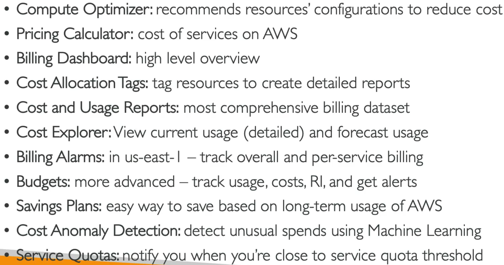

## Other AWS services


## AWS Machine learning