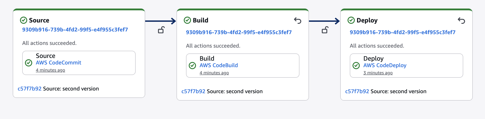

## CICD Workflow




TBD:

This is a simple webserver which would have an index.html with start/stop scripts after deployment. we have ec2 being used as a destination.

```sh
Create a new repo and update all stuff in the README.md

Developer updates code in CodeCommit
        ↓
CodePipeline detects change
        ↓
CodeBuild packages files
        ↓
CodeDeploy deploys to EC2
        ↓
Apache serves updated website
```

https://chatgpt.com/share/69d27da5-5054-83a4-8ac2-dd67b33ca447