HA Web App — tests knowledge of subnet design (public/private), AZ affinity, RDS failover RTOs, and session persistence with ElastiCache.

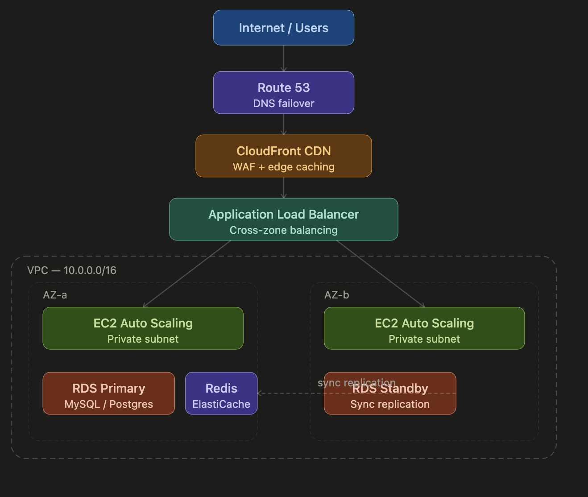

Serverless Pipeline — tests EventBridge vs SNS/SQS trade-offs, Lambda concurrency limits, DLQ handling, and cost optimization (pay-per-invocation).

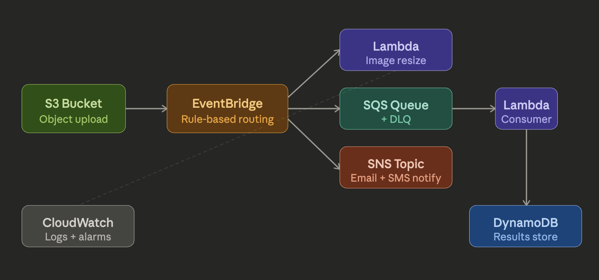

CI/CD Pipeline — tests rollback strategy (blue/green vs canary), IAM roles for cross-service access, artifact signing, and environment promotion gates.

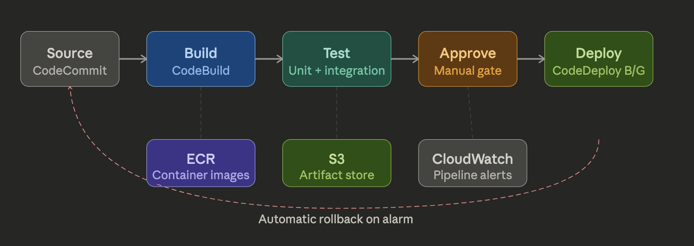

ECS Fargate Microservices — tests task definition design, service-level isolation, secret injection via Secrets Manager, and independent scaling policies per service.

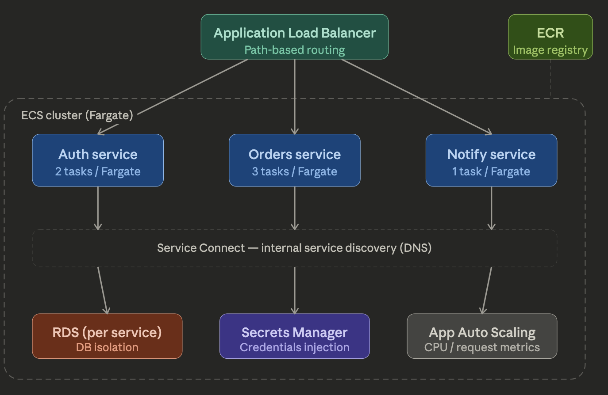

Data Lake — tests medallion architecture (bronze/silver/gold), columnar format choices (Parquet vs ORC), Glue Crawler scheduling, and Athena vs Redshift cost trade-offs.

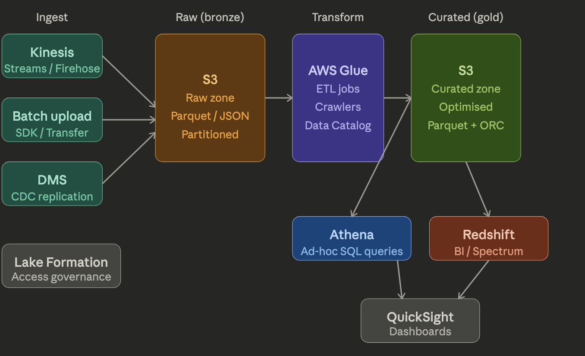

Transit Gateway Hub-and-Spoke — tests multi-account network design, route table segmentation to prevent dev→prod traffic, and Direct Connect bandwidth planning.

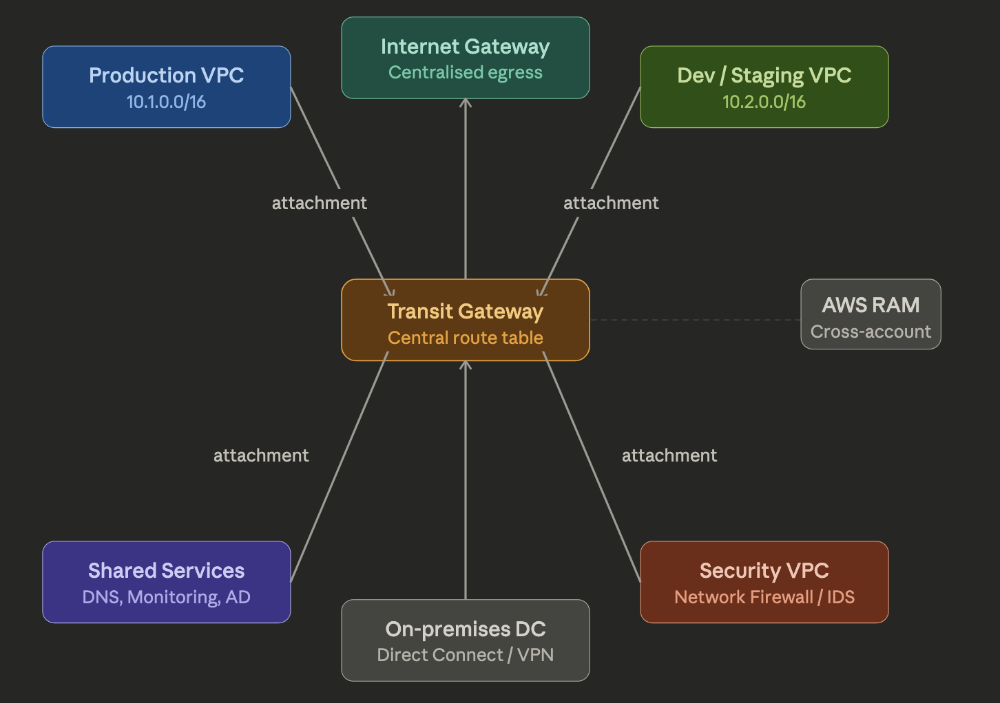

EKS + Karpenter + GitOps — tests node provisioning strategy (Karpenter vs CAS), IRSA for pod-level IAM, and GitOps reconciliation loops with ArgoCD.

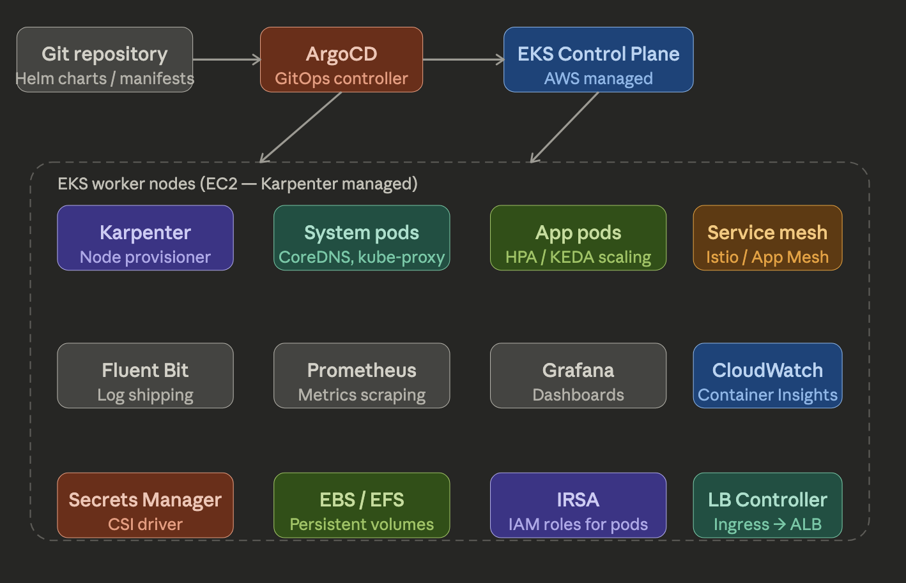

Zero-Trust Security — tests defense-in-depth thinking, the difference between preventive (SCPs, SGs) vs detective (GuardDuty, Config) controls, and data-plane vs control-plane security.

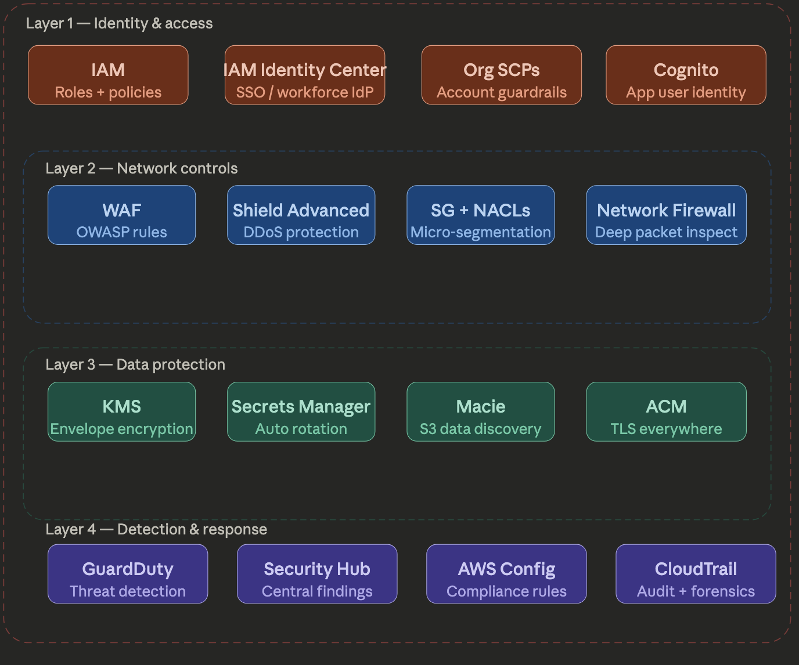

Multi-Region DR — tests RPO/RTO trade-off decisions, Aurora Global vs DynamoDB Global Tables, and Route 53 failover policy types (failover vs latency vs health check weighted).

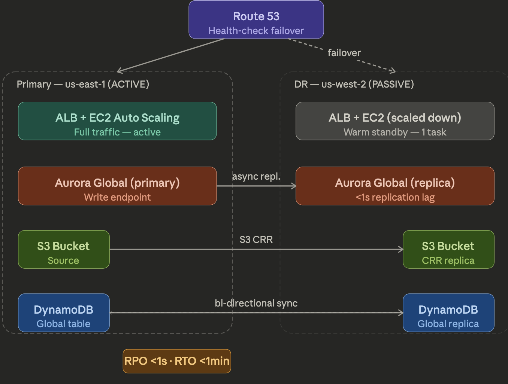

Cost Optimization — tests FinOps maturity, Spot interruption handling in batch workloads, and S3 lifecycle policy design for cold data.

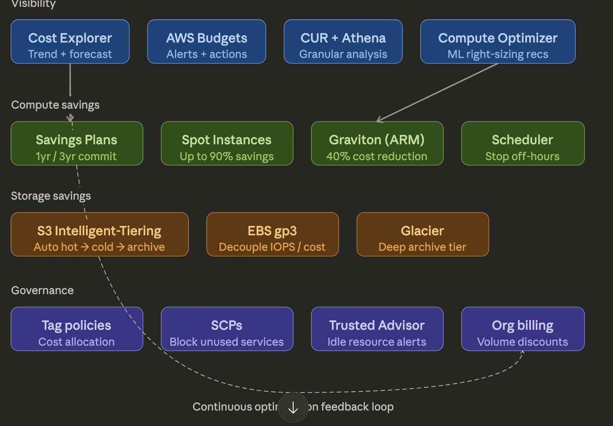

SQS Batch Processing — tests visibility timeout tuning, DLQ retry strategies, and queue-depth–driven ASG scaling policies.

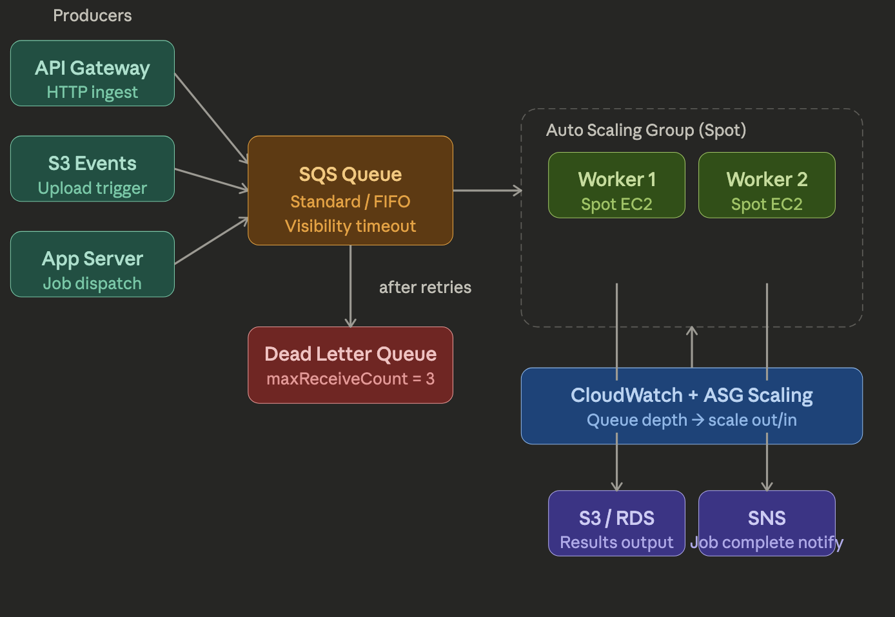