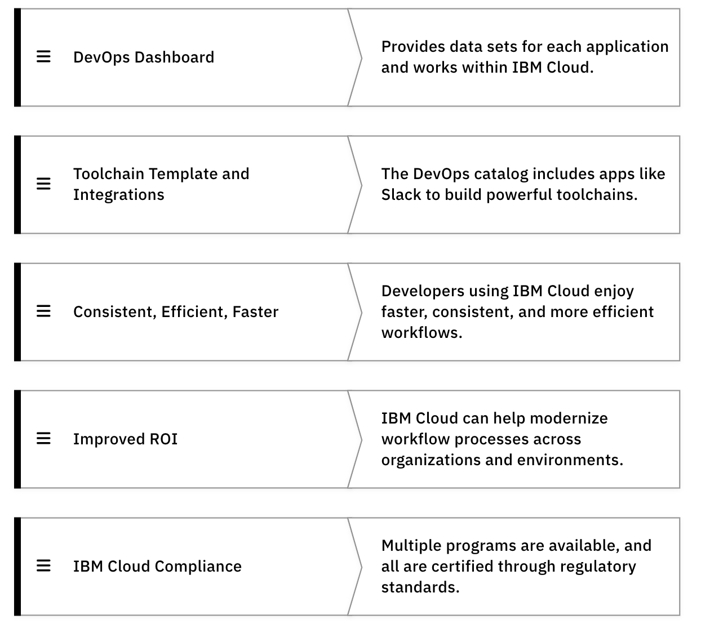

## Objectives

- Recall application development architectures such as full stack and microservices
- Apply working knowledge of IBM Cloud services: PaaS, IaaS, FaaS, and SaaS
- Demonstrate working knowledge of Kubernetes and Docker
- Identify concepts of IBM open innovation on IBM Cloud using Kubernetes and cloud-native, open-source work
- Apply concepts related to IBM security leadership associated with data encryption and configuration
- Identify variances between and across public, private, and hybrid-cloud enterprise grade offerings
- Identify techniques to move workloads between environments
- Recall concepts of open innovation design and implement an automated DevOps deployment
- Identify security concepts, like authentication, authorization, single sign-on, SSL/TLS, certificates, keys, encryption, Kubernetes config maps/secrets, and more.

## Major topics in this curriculum:

- IBM Professional Cloud Developer Overview
- IBM Cloud Features and Benefits
- Continuous Delivery Services
- IBM Cloud Schematics
- Essentials of IBM Cloud Professional Developer
- Application Deployment Choices
- Traditional Compute Options
- Identity Management
- IBM Key and Secrets Management
- Container Security
- Data Security
- IBM Cloud Professional Developer Principles
- Data Services
- Logging, Monitoring, and Event Management Tools
- Extending Applications through IBM Cloud Watson API Services
- Cloud Internet Services

## Cloud Developer Job Role

An IBM Certified Cloud Developer designs and develops secure IBM Cloud applications, services, and products in an agile, collaborative environment. This includes, but is not limited to, back-end, front-end, full-stack, data and application integration, and cloud application deployment. 

The IBM Cloud Developer role is multi-functional and comprises one or more of the following sub-roles:

### Front end 

- Works closely with designers to take wireframes from conception to implementation
- Works closely with back-end developers to ensure implemented UI code is unit tested and production-code ready
- Codes user interfaces, including interactions, responsive layouts, and styling
- Uses and contributes to the IBM Design System to implement UIs
- Ensures user interfaces are accessible and enhance the performance of the application
- Works in programming languages like JavaScript, Node.js, or frameworks such as React, Vue, or Angular
- Skilled in UI development technologies such as HTML, CSS, JSON, and API usage
- Understands back-end concerns

### Backend 

- Works with client-server architectures, networking protocols, application development, and databases
- Uses and develops RESTful APIs and web services
- Understands user and system requirements
- Develops using a combination of object-oriented and functional programming models
- Plans, analyzes, designs, and constructs databases
- Implements industry standards and best practices for database security and is capable of analyzing and - defining database and information security requirements
- Develops structured query language (SQL) queries, back-end database stored procedures, or NoSQL queries
- Works in programming languages like Ruby, Python, Java, Node.js, and server-side languages such as Go and Rust
- Understands front-end concerns

### Devsecops

- Works with development teams to enable a continuous integration environment that sustains high productivity levels and emphasizes defect-prevention techniques
- Ensures delivery pipeline from dev/test, staging, and production and performs A/B testing 
- Automates, measures, and optimizes the system performance and processes
- Designs and implements tools for automated deployment and monitoring of multiple environments
- Works with tools like Jenkins, Maven, Ant, Gradle, Chef, Puppet, Docker, UrbanCode, Tekton, Terraform, and Ansible

### QA test Developers

- Encourages application development that builds tests from the ground up
- Ensures the product is robust and failure scenarios are considered and refactored
- Collaborates with cross-functional team members on story development, from before definition through final  deployment
- Performs exploratory testing using industry-leading practices
- Discovers defects/bugs and works with coders and product owners to determine root cause and how to prevent similar issues from happening in the future
- Drives adoption of test automation - unit tests, integration tests, functional tests

## Skills of a Cloud Professional Developer 

**Benefits for cloud**

Identify IBM Cloud features and benefits for cloud developers. 

**Continious Delievery**

Identify fundamental concepts of Continuous Delivery Services
Identify the features available when using Tekton pipelines on IBM Cloud
Indicate the benefits when using DevOps Toolchains on IBM Cloud

**Cloud Schematics**

Identify the fundamental concepts of IBM Cloud Schematics

**Container registry && Vulnerability advisor**

Indicate the purpose of IBM Cloud Container Registry

**Kubernetes service**

Recognize the considerations when deploying an application using IBM Cloud Kubernetes Service on IBM Cloud

**Openshift** 

Recognize the considerations when deploying an application using Code Engine on IBM Cloud

**Code Engine**

Recognize the considerations when deploying an application using Red Hat® OpenShift® on IBM Cloud

**Traditional compute options**

Distinguish between IBM Cloud Platform compute options
Identify appropriate use cases for VSIs in IBM Cloud Platform
Identify appropriate use cases for using Bare Metal Servers on IBM Cloud Platform
Identify appropriate use cases for VMware solutions on IBM Cloud Platform

**IAM**

Identify access controls when using IBM Cloud Identify and Access Management (IAM)
Indicate the reasons an IBM Cloud Developer would use App ID when developing an application

**Key and secret management**

Indicate the purpose of secure key management on IBM Cloud
Choose the best practices when using Secrets Manager

**Container security**

Identify the role of service accounts in container security
Indicate the use of role-based access control (RBAC) in Kubernetes

**Data security**

Identify the key security aspects of cloud-native applications

**Data Services**

Determine the IBM Cloud Object Storage elements that secure data at rest, data in motion, and data access
Distinguish between the IBM Cloud Databases services

**Logging, Monitoring, and Event management**

Understand the importance of IBM Log Analysis from a DevSecOps perspective

**Watson Services**

Indicate the capabilities of the IBM Watson Text to Speech API
Recognize the functionality provided by IBM Watson® Assistant
Identify the common input and output features of IBM Watson Speech to Text API
Identify appropriate use cases for IBM Watson Natural Language Understanding
Recognize the functionality of Watson Language Translator

**Internet Services**

Identify the use of Cloud Internet Services (CIS) on IBM Cloud

## Features of IBM Cloud for Developers

- Provide securely managed container orchestration for container needs. 
- Secure continuous integration and continuous delivery services built with a security-first focus. 
- Manage Infrastructure-as-code solutions enabling the use of Terraform and Ansible for provisioning and - configuration management needs.
- Provide cloud-wide robust identity and access management services. 
- Provide enterprise-grade container runtimes and orchestration. 
- Provide built-in container image scanning tools.
- Provide security and performance-boosting edge services.




```
That is correct. The DevOps Dashboard: Provides data sets for each application. The dashboard works within IBM Cloud, with multiple integrations and continuous delivery (CI/CD) tools. Toolchain Templates and Integrations: Our DevOps toolchain catalog includes many templates and third-party integrations like Slack to build powerful toolchains. Consistent, efficient, & faster: Developers using IBM Cloud enjoy faster, consistent, and more efficient workflows. Improved ROI: IBM Cloud can help modernize workflow processes across the organization and its environment, lowering costs and increasing value. IBM Cloud Compliance: Multiple compliance programs are available, and all are certified with various regulatory and compliance standards. 
```