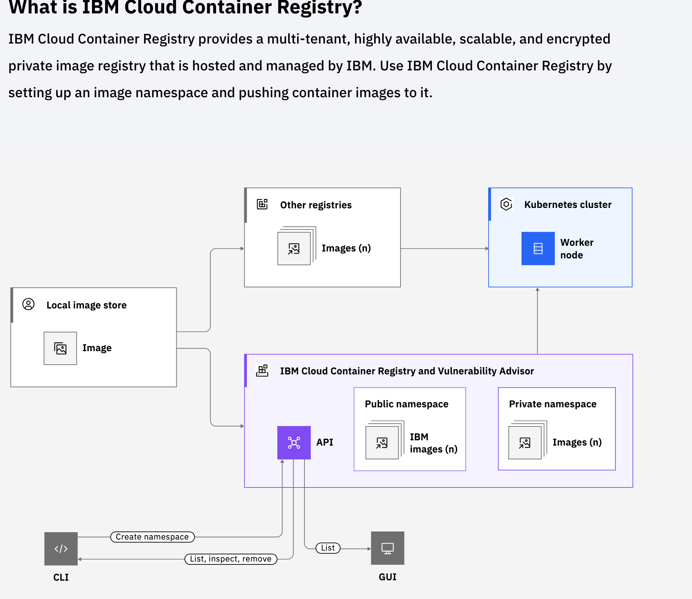

## IBM Cloud Registry

A container registry is a service which provides a collection of repositories in which images can be stored. 

It can also have  API paths and access control rules.  

Container registries can be hosted publicly or privately.  



###  Benefits of the IBM Cloud Container Registry

**HA and scalable.**

Push private images to conveniently run them in the IBM Cloud Kubernetes Service, Red Hat® OpenShift* Kubernetes Service, and other runtime environments. 

Images are checked for security issues, giving users full control and the ability to make informed decisions about their deployments.

IBM Cloud Container Registry can be used by setting up an image namespace and pushing container images to the namespace.

**Image security compliance with vulnerable advisor**

When pushing images to IBM Cloud Container Registry, users can benefit from the built-in Vulnerability Advisor features that scan for potential security issues and vulnerabilities. 

Vulnerability Advisor checks for vulnerable packages in specific Docker base images and known vulnerabilities in app configuration settings. When vulnerabilities are found, information about the vulnerability is provided. This information can be used to resolve security and configuration issues.  

Benefit from automatic scanning of images in a namespace. 

Review recommendations that are specific to the operating system to fix potential vulnerabilities and protect containers from being compromised.

**Quota limits for storage and pull traffic**

Benefit from free storage and pull traffic to private images until the free quota is reached. 

Set custom quota limits for storage and pull traffic per month to avoid exceeding the preferred payment level. 

## namespace

A namespace in IBM Cloud Container Registry is a collection of repositories that store container images. IAM permissions can be granted to manage access control on namespaces, and retention policies can be set on namespaces in IBM Cloud Container Registry.

```
ibmcloud cr namespace-list
ibmcloud cr create yournamespace
ibmcloud cr namespace-rm <my_namespace>
```

## vulnerability advisor

Vulnerability Advisor checks configuration settings in images that use supported operating systems (MySQL, NGINX, and Apache apps) and provides a link to any relevant security notices about the vulnerability. 

The table of vulnerabilities displays essential information about each issue, such as the Vulnerability ID, the policy status, the affected packages, and how to resolve the issue. 

## Using IBM Cloud Kubernetes Service

Provides

Intelligent scheduling 
Horizontal scaling 
Service discovery 
Load balancing 
Automated rollouts and rollbacks 
Secret and configuration management 
Self-healing features for apps

Offers

Advanced tools for secure and efficient management of cluster workloads 
Built-in security and isolation features 
Highly available and secure containerized app delivery on the public cloud 
User-friendly interface


IBM Cloud Kubernetes Service uses a split control plane and data plane model, which refers to the separation of the control plane components (such as the API server, scheduler, and controller manager) from the worker nodes that run the application workloads.  

This separation allows for better scalability and fault tolerance, as well as improved security and ease of management. The control plane manages the cluster's overall state and makes decisions about where to place workloads, while the worker nodes handle the actual execution of the workloads. 

IBM Cloud offers two deployment options for running Kubernetes clusters: Classic and VPC (Virtual Private Cloud). The Classic option uses a shared, multi-tenant infrastructure, while the VPC option provides a dedicated, isolated virtual network for each client.  

The VPC option offers greater security, control, and flexibility compared to Classic but also requires more management overhead. The choice between Classic and VPC depends on the specific needs and priorities of each organization

## Planning App Deployment

Stateless Apps

- Stateless apps are preferred for cloud-native environments like Kubernetes.
- Stateless apps are easy to migrate and scale. 
- Stateless apps declare dependencies and store configurations separately from the code. 
- Stateless apps treat backing services such as databases as attached resources instead of coupled to the app. 
- App pods don't require persistent data storage or a stable network IP address. 
- Pods can be terminated, rescheduled, and scaled in response to workload demands. 
- Stateless apps use a Database-as-a-Service for persistent data. 
- Stateless apps use NodePort, load balancer, or Ingress services to expose the workload on a stable IP address.

Stateful Apps

- Stateful apps are more complicated than stateless apps to set up, manage, and scale. 
- Stateful apps require persistent data and a stable network identity. 
- Stateful apps are often databases or other distributed, data-intensive workloads. 
- Processing is more efficient closer to the data itself. 
- To deploy a stateful app, persistent storage must be set up and mounted to the pod controlled by a StatefulSet object. 
- File, block, or object storage can be added as persistent storage for a stateful set. 
- Portworx can be installed on bare metal worker nodes to manage persistent storage for stateful apps as a highly - available software-defined storage solution. 
- The Kubernetes documentation provides more information on how stateful sets work. 