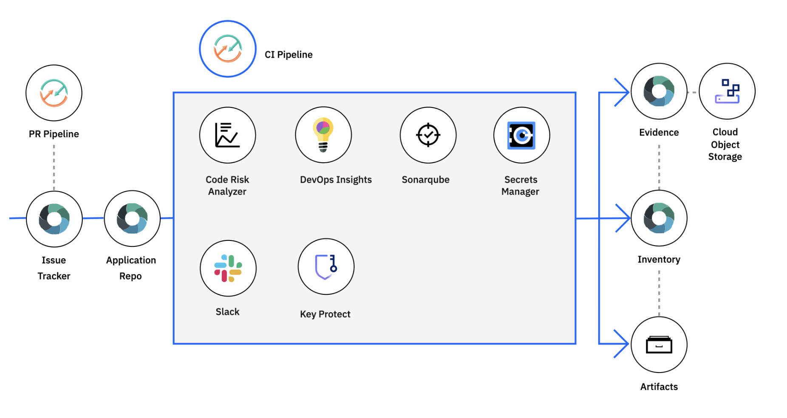

## Continuous Delivery Services

DevOps is an increasingly common approach to agile software development that developers and operations teams use to build, test, deploy, and monitor applications with speed, quality, and control. DevOps is relevant to any kind of software project regardless of architecture, platform, or purpose. DevOps is a software development approach between development and operations that continuously delivers the required functionality. In the process, it also improves collaboration between the two teams. DevOps enables fast and automated deployment of services. 

**Automate Continuous Integration** is the effort required to integrate a system that increases exponentially with time. By integrating the system more frequently, integration issues are identified earlier, when they are easier to fix, and the overall integration effort is reduced. The result is a higher quality product and more predictable delivery schedules. 

**Automated deployment** is the practice of eliminating manual steps from the deployment of code to environments for software testing and delivery. 

**Continuous delivery** requires that code changes constantly flow from development all the way through to production. To continuously deliver in a consistent and reliable way, a team must break down the software delivery process into delivery stages and automate the movement of the code through the stages to create a delivery pipeline.

The efficiency of **working in small batches** is one reason adopting agile development has benefited the software industry. Think about small batches in software development. The team writes and tests a small batch of code, such as a single user story, which provides an end-to-end capability that is valuable to a client. Everything is working, and you can demonstrate the capability to the client and get feedback quickly.

**Automate continuous testing** to enable continuous delivery. An obvious benefit of automated testing, in contrast with manual testing, is that testing can **happen quickly, repeatably, and on demand**. It becomes a simple matter to verify that the software continues to run as it has before. In addition, using the practices of **test-driven development**(TDD) and **behavior-driven development** (BDD) to create test automation has been shown to improve coding quality and design.

By using **unattended automation** to reduce the number of times people need to touch the systems, users can decrease the cost of the solution and improve profitability. Real profitability occurs when users can decrease the number of times people are required to touch the systems. This allows operators to focus on higher-value work and improves the operator-to-server ratio.

**Culture, Shift Left, Traceability Auditability, Security Education, and Visibility** are the six best practices for DevSecOps.

## Toolchains

developers select each tool integration that they want to configure for their toolchain. Successful DevOps implementations generally rely on an integrated set of solutions or a "toolchain" to remove manual steps, reduce errors, increase team agility, and to scale beyond small, isolated teams. 

DevOps tools create **integrated DevOps open toolchains** to enable tool integrations that support development, deployment, and operations tasks. A toolchain is an integrated set of tools that developers can use to collaboratively develop, build, deploy, test, and manage applications and make operations repeatable and easier to manage. Toolchains can include open source tools, IBM Cloud services, such as IBM Cloud DevOps Insights, and third-party tools, such as GitHub, PagerDuty, and Slack. 

DevOps tools deliver continuously by using **automated pipelines** as well as automates builds, unit tests, deployments, and more. Capable of building, testing, and deploying in a repeatable way with minimal human intervention; ready to release into production at any time.

DevOps Tools are able to edit and push code from anywhere by using the web-based Integrated Development Environment (IDE). They can **create, edit, run, and debug, and complete source-control** tasks in GitHub as well as move seamlessly from editing code to deploying it to production. 

DevOps tools allow for team **collaboration** and source code management with a Git repository (repos) and issue tracker that is hosted by IBM and built on GitLab Community Edition. This allows for the management of Git repos through fine-grained access controls that keep code secure. DevOps tools are able to review code and enhance collaboration through merge requests, track issues, and share ideas through the issue tracker, and they are able to document projects on the wiki system.

### Functions of App Development

Think: Plan application by creating bugs, tasks, or ideas using issue tracker.

Code: implementation of application by providing a git as SCM.

Deliver: configure the pipeline, allow users to specify automated build, deployment, testing code after developer pushes code the repository.

Run:  run application in cloud env

IBM **Cloud DevOps Insights** is a tool that aggregates code, test, build, and deployment data to provide visibility of quality for all of your teams. **DevOps Insights is a tool for continuous integration and continuous delivery (CI/CD)**. It evaluates builds to determine if they are safe to release. DevOps Insights is used to increase deployment quality and delivery control in continuous delivery. 

With DevOps Insights users can do the following: 

- Maintain and improve the quality of their code in IBM Cloud.
- Monitor their deployments to identify risks before they are released. 
- Analyze development changes for error probability.
- Improve the interactions of your team.

**Gates** are the mechanism implemented in CI/CD tools to hold back the build if it does not meet the passing threshold. Gates compare the build with the policies configured for an application. A policy contains a set of rules.

A **rule** is the passing criteria that users define for each type of test data they upload. For example, a policy can be created that contains a unit test rule that requires 100 percent success and a test coverage rule that requires 80 percent coverage.

If the code does not meet or exceed a **policy** that is enacted at a particular gate, the deployment is stopped to prevent risky changes from being promoted to the next environment.

## Open source

**Tekton pipelines** are able to build, test, and deploy in a repeatable way with minimal human intervention. It is an open source framework that is vendor neutral that can create continuous integration and delivery (CI/CD) systems. Tekton pipeline contains a Kubernetes-native framework and helps by modernizing continuous delivery. The following are three components of Tekton.

Step: Platform management is one valid role for IBM Cloud Identity and Access Management

Task: A task is a collection of steps in order. Tekton runs a task in the form of a Kubernetes pod, where each step becomes a running container in the pod.

Pipeline: A pipeline is a **collection of tasks in order**. Tekton collects all the tasks, connects them in a directed acyclic graph (DAG), and executes the graph in sequence. In other words, it creates a number of Kubernetes pods and ensures that each pod completes running successfully as desired.

A CI/CD workflow may contain specific executable actions like

A **PipelineRun** is a specific execution of a pipeline. For example, a developer may ask Tekton to run a CI/CD workflow twice a day, and each execution becomes a PipelineRun resource trackable in the Kubernetes cluster. The status of the CI/CD workflow can be viewed and may include specifics of each task execution with PipelineRuns.

A **TaskRun** is a specific execution of a task. TaskRuns are also available when a task is run outside a pipeline. The specifics of each step execution in a task may be viewed in the dashboard.

**Benefits and Features of Tekton**

**Easier and fast deployment:** Consistency and errors are reduced through automated processes. Quickly able to create cloud-native pipelines across multiple cloud providers or in hybrid environments.

**k8 native for agility and control:** Tekton pipelines run on Kubernetes using their clusters as a first-class type, and they use containers as building blocks. 

**Runs on any k8 cluster:** Tekton is a true open source solution, which allows for the creation of continuous delivery pipelines to deploy apps to any Kubernetes environment. 

**Serverless for greater efficiency:** Cloud resources are used only when needed for execution of pipeline tasks. This enhances development team control and reduces costs. 

**Shared pipelines reduce complexity:** To reduce rework and speed up development, developers have access across projects and organizations through open source components that standardize CI/CD tooling.

## IBM Cloud Schematics

