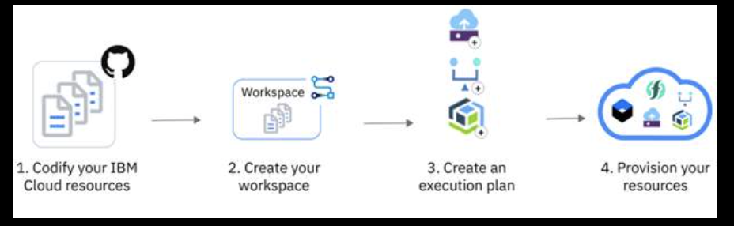
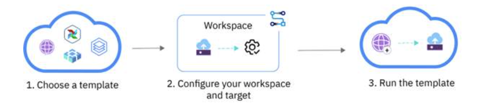

IBM Cloud Schematics provides automation by offering declarative Terraform templates to ensure a desired provisioned cloud infrastructure. Native integration with Red Hat® Ansible extends configuration, management, and provisioning to software and applications and integrates with other IBM Cloud Services. 

## Infrastructure as Code (IaC)

IBM Schematics executes IaC as a service which includes open source Ansible and Terraform amongst others (Git and Helm). IaC automation is hosted as-a-Service in the cloud and when adopted as an approach improves consistency, quickens deployment, and reduces manual errors through its provisioning and automation.    

### Features and Key Capabilities

**Hosted terraform workspace**

Able to easily provision cloud resources, allowing for focus to be on deployment of applications, configuration management, and subsequent daily upkeep in an automated approach for speed, consistency, and time to value benefits.  

**Native ansible actions**

Easily install software packages and application code on infrastructure.

**Collaborative environment**

Deploy and iterate infrastructure automation processes easily as a team.

**Integrate security**

Integrates easily with IBM Cloud IAM, Key Protect, IBM Log Analysis cloud service, and IBM Cloud Monitoring.

### Benefits for the Developer

Faster provisioning
Improved consistency
Efficient development
Improved ROI

### Software Deployment

The IBM Software Solutions Catalog (opens in a new tab)has a wide range of software and infrastructure templates that developers can use to set up cloud resources, and to install IBM and third-party software in an IBM Cloud Kubernetes Service cluster, Red Hat® OpenShift® on IBM Cloud cluster, or a classic server or Virtual Servers for VPC. 

### Security and Compliance

- Monitor for controls and goals that pertain to IBM Cloud Schematics.
  
- Define rules for IBM Cloud Schematics that can help to standardize resource configuration.

- As a security or compliance focal, developers can use the IBM Cloud Schematics goals to help ensure that their organization is adhering to the external and internal standards for their industry. By using the Security and Compliance Center to validate resource configurations in their account, potential issues can be identified as they arise.