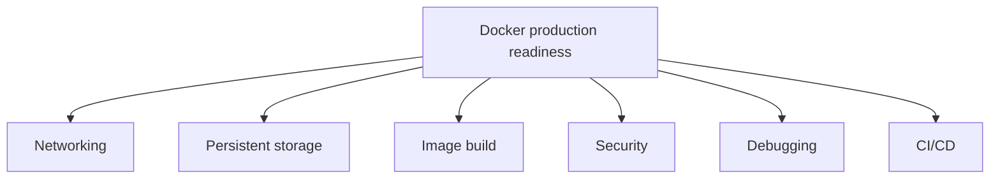

## TL;DR

Docker interview answers should connect container concepts to production operations: networking, persistent storage, image optimization, security, debugging, and CI/CD. A strong answer explains the Docker feature, why it matters, and what can go wrong in real environments. For SRE and DevOps roles, emphasize repeatability, small images, least privilege, observability, and safe rollout.

See also: [Docker overview](overview.md), [Linux networking](../../linux/admin/networking.md), [Linux storage](../../linux/admin/storage.md), and [Linux security](../../linux/admin/security.md).



## Docker networking

**Explain how Docker networking works.**

Docker networking lets containers communicate with other containers, the host, and external systems. Docker provides multiple network drivers, and the right choice depends on whether containers run on one host, many hosts, or need direct access to the physical network.

Common network drivers:

- **Bridge:** default for standalone containers. Containers on the same user-defined bridge network can communicate and resolve each other by container name.
- **Host:** removes network namespace isolation and uses the host network stack directly.
- **Overlay:** used for multi-host networking, especially in Docker Swarm.
- **Macvlan:** assigns a MAC address to containers so they can communicate directly on the physical network.
- **None:** disables external network access for the container.

**How would you connect multiple containers in a production environment?**

For local or small multi-container applications, use Docker Compose and define services in `docker-compose.yml`. For production orchestration, Kubernetes is usually preferred because it provides scheduling, service discovery, health checks, scaling, and rollout controls.

Use a custom Docker network so containers can resolve each other by name.

```bash
# Create a user-defined network and run two containers attached to it.
docker network create my_network
docker run --network=my_network --name=app1 my_app
docker run --network=my_network --name=db my_db
```

This allows `app1` to reach `db` using the container name `db`. Avoid hard-coding container IP addresses because they can change.

## Persistent storage

**How would you persist data in Docker containers to ensure it is not lost when the container restarts?**

Containers have an ephemeral writable layer. If a container is deleted, data written only inside that layer is lost. Use Docker volumes or bind mounts for persistent data.

### Volumes

Volumes are preferred for Docker-managed storage. Docker creates and manages the storage location, and the volume can be reused by new containers.

```bash
# Create a named volume and mount it into a container.
docker volume create my_volume
docker run -d -v my_volume:/data --name my_container my_image
```

### Bind Mounts

Bind mounts map a specific host directory into a container. They are useful when the container must read or write a known host path, but they couple the container to host filesystem layout.

```bash
# Mount a host directory into a container.
docker run -d -v /host/path:/container/path --name my_container my_image
```

For databases, use named volumes.

```bash
# Persist MySQL data in a named Docker volume.
docker run -d -v db_data:/var/lib/mysql --name mysql_container mysql
```

For production databases, also consider backups, restore testing, filesystem performance, encryption, and whether Docker alone is the right runtime.

## Docker image optimization

**Your team is building a large Docker image that takes a long time to build and deploy. How would you optimize it?**

The goal is to reduce build time, image size, pull time, vulnerability surface, and runtime overhead.

Best practices:

- Use a minimal base image, for example `FROM python:3.9-alpine`, when compatible with your dependencies.
- Use multi-stage builds to keep build tools out of the final runtime image.
- Minimize layers and remove unnecessary packages and caches.
- Use `.dockerignore` to exclude logs, `.git`, build artifacts, test data, and local files.
- Order Dockerfile instructions from least frequently changed to most frequently changed so build cache is effective.
- Pin base image versions instead of relying on `latest`.

Example multi-stage build:

```Dockerfile
# Build a Go binary in one stage and copy only the artifact into a small runtime image.
FROM golang:1.18 AS builder
WORKDIR /app
COPY . .
RUN go build -o myapp

FROM alpine:latest
COPY --from=builder /app/myapp /myapp
CMD ["/myapp"]
```

## Docker security

Docker security is about reducing image risk, runtime privileges, network exposure, and secret leakage.

- Use minimal base images to avoid unnecessary packages.
- Scan images for vulnerabilities.
- Run containers as non-root users.
- Restrict container privileges.
- Limit network exposure and avoid publishing unnecessary ports.
- Avoid baking secrets into images or Dockerfile layers.

```bash
# Scan an image for known vulnerabilities with the available scanner in your environment.
docker scan my_image
```

Create a non-root user in the image.

```Dockerfile
# Create and use a non-root user in an Alpine-based image.
RUN addgroup -S appgroup && adduser -S appuser -G appgroup
USER appuser
```

Run with reduced privileges where possible.

```bash
# Run a container with no new privileges, read-only root filesystem, and dropped Linux capabilities.
docker run --security-opt no-new-privileges --read-only --cap-drop=ALL my_app
```

Security settings must be tested with the application. Some apps need writable temp directories, specific capabilities, or mounted paths.

## Container Failures

**Your application runs in Docker containers. A container crashes unexpectedly. How do you debug it?**

Start with evidence: logs, exit code, container state, resource usage, and recent changes. A container exits when its main process exits, so debugging is often process debugging plus Docker runtime context.

```bash
# Check status, logs, inspect output, resource usage, and recent events for a crashing container.
docker ps -a
docker logs container_name
docker inspect container_name
docker stats
docker events --since 30m
```

Check for OOM issues. If the container is being killed for memory, inspect Docker state and host kernel logs if available.

```bash
# Run a container with explicit memory and swap limits.
docker run -m 512m --memory-swap 1G my_app
```

Use a restart policy when the desired behavior is automatic restart.

```bash
# Restart the container automatically when it exits.
docker run --restart=always my_app
```

Do not use restart policies as a substitute for fixing crash loops. They improve availability only when failures are transient and observable.

## CICD Docker

**How would you integrate Docker into a CI/CD pipeline?**

A Docker CI/CD pipeline usually builds the image, runs tests, scans it, tags it immutably, pushes it to a registry, and deploys it through an environment-specific promotion process. Avoid deploying only `latest`; use commit SHA or semantic version tags for traceability.

### GitHub Actions

```yaml
# Build and push a Docker image from GitHub Actions.
name: Docker Build & Push
on:
  push:
    branches:
      - main
jobs:
  build:
    runs-on: ubuntu-latest
    steps:
      - name: Checkout code
        uses: actions/checkout@v2
      - name: Build Docker image
        run: docker build -t myrepo/myapp:${{ github.sha }} .
      - name: Login to Docker Hub
        run: echo "${{ secrets.DOCKER_PASSWORD }}" | docker login -u "${{ secrets.DOCKER_USERNAME }}" --password-stdin
      - name: Push Docker image
        run: docker push myrepo/myapp:${{ github.sha }}
```

### Jenkinsfile

```groovy
// Build and push a Docker image from Jenkins using stored credentials.
pipeline {
    agent any

    environment {
        DOCKER_USERNAME = credentials('docker-username')
        DOCKER_PASSWORD = credentials('docker-password')
        IMAGE_NAME = 'myrepo/myapp:latest'
    }

    stages {
        stage('Checkout Code') {
            steps {
                checkout scm
            }
        }

        stage('Build Docker Image') {
            steps {
                script {
                    sh "docker build -t ${IMAGE_NAME} ."
                }
            }
        }

        stage('Login to Docker Hub') {
            steps {
                script {
                    sh "echo ${DOCKER_PASSWORD} | docker login -u ${DOCKER_USERNAME} --password-stdin"
                }
            }
        }

        stage('Push Docker Image') {
            steps {
                script {
                    sh "docker push ${IMAGE_NAME}"
                }
            }
        }
    }
}
```

In production, add vulnerability scanning, SBOM generation, signing/provenance, promotion between environments, and rollback strategy.

## Troubleshooting Issues

**A container is running but you cannot access the application inside it. How do you troubleshoot?**

Work from outside in: host port, Docker port mapping, container listener, application logs, container network, and firewall.

```bash
# Check container state, logs, networking, shell access, and port publishing.
docker ps -a
docker logs my_container
docker inspect my_container
docker exec -it my_container /bin/sh
docker port my_container
```

If the application listens on container port `80`, publish it to a host port.

```bash
# Publish host port 8080 to container port 80.
docker run -p 8080:80 my_app
```

Common causes:

- The app is listening on `127.0.0.1` inside the container instead of `0.0.0.0`.
- The wrong container port is published.
- The host firewall blocks the published port.
- The app failed startup but the container is still running another process.
- Health checks or logs show dependency failures.

## "/bin/bash" Exited few seconds ago

A container lives as long as the main process inside it is running. If the process exits, the container exits.

Unlike services such as `httpd`, `nginx`, or `mysqld`, `bash` is an interactive shell. If it is started without an interactive terminal or input, it may exit immediately. That is why an Ubuntu container can exit a few seconds after starting.

If you want the container to remain alive for a short lab, run a long-lived command such as `sleep`.

```bash
# Keep an Ubuntu container alive for 30 seconds by running sleep as the main process.
docker run ubuntu:18.04 sleep 30s
```

For real services, the main process should be the application process itself, not `sleep` or an idle shell.

## Common Pitfalls

- Hard-coding container IPs instead of using Docker DNS or service discovery.
- Assuming container filesystem data persists without a volume.
- Using `latest` tags in CI/CD and losing traceability.
- Running containers as root by default.
- Publishing more ports than needed.
- Treating restart policies as a fix for crash loops.
- Baking secrets into images.
- Building large images because `.dockerignore` is missing.

## Interview Questions

- What Docker network driver would you use for multiple containers on one host?
- What is the difference between a Docker volume and a bind mount?
- How do multi-stage builds reduce image size?
- How would you debug a container that exits immediately?
- How would you debug an app that runs but is unreachable?
- What Docker security controls would you apply first?
- How should Docker images be tagged in CI/CD?
- Why should containers usually run as non-root?
- What does `--read-only` do?
- Why is `latest` risky in production?

## Key Takeaways

Docker FAQ answers should always include the operational angle. Containers need networking, storage, image management, security, logs, resource controls, and deployment discipline.

In interviews, explain not only the Docker command but also why you would use it, what it proves, and what failure mode it helps prevent or debug.

See also: [Docker overview](overview.md), [Linux networking](../../linux/admin/networking.md), [Linux storage](../../linux/admin/storage.md), and [Linux security](../../linux/admin/security.md).
