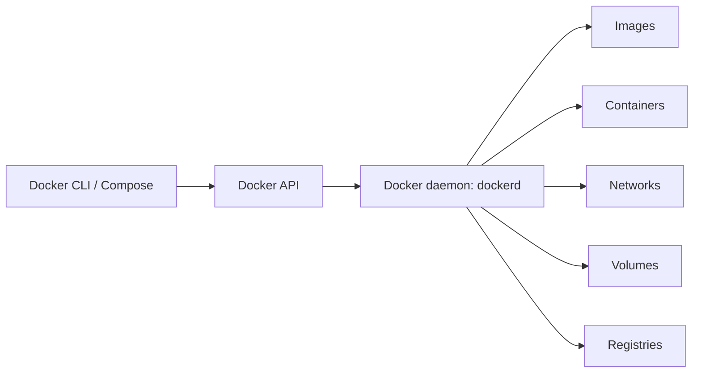
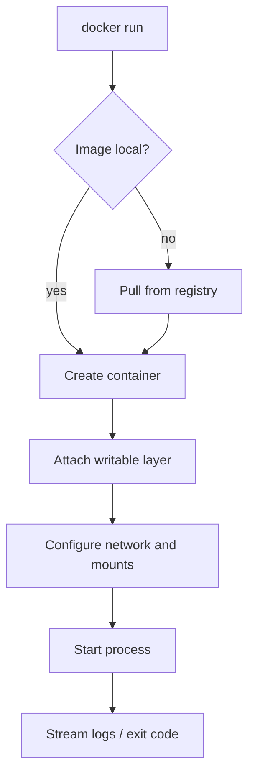
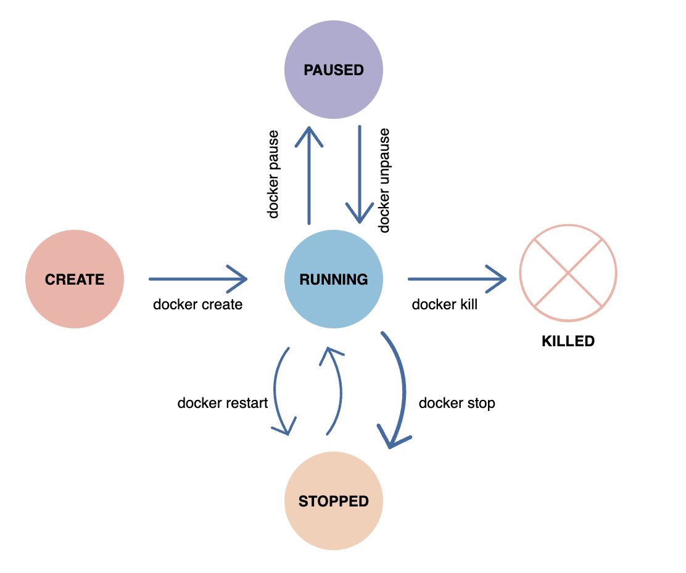
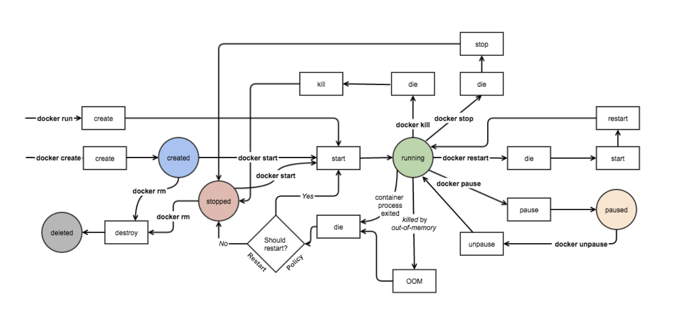

## TL;DR

Docker packages an application and its runtime dependencies into an image, then runs that image as an isolated container process. The core ideas are images, containers, registries, networks, volumes, and Dockerfiles. For an SRE or DevOps engineer, Docker matters because it makes deployments more repeatable, but container reliability still depends on correct process design, storage, networking, logging, resource limits, and image hygiene.

See also: [Docker FAQ](faq.md), [Linux admin basics](../../linux/admin/basics.md), [Linux networking](../../linux/admin/networking.md), and [Linux storage](../../linux/admin/storage.md).

## Docker architecture

Docker uses a client-server architecture. The Docker client talks to the Docker daemon, which does the heavy lifting of building, running, and distributing containers. The client and daemon can run on the same system, or a client can connect to a remote daemon. They communicate using the Docker API over a Unix socket or network interface.

Docker Compose is another client that helps define and run applications made of multiple containers. In production, the same concepts extend into orchestration systems such as Kubernetes.


```mermaid
flowchart LR
    A[Docker CLI / Compose] --> B[Docker API]
    B --> C[Docker daemon: dockerd]
    C --> D[Images]
    C --> E[Containers]
    C --> F[Networks]
    C --> G[Volumes]
    C --> H[Registries]
```

Main Docker architecture components:

- Docker Daemon
- Docker Client
- Docker Registries
- Docker Objects

### Docker Daemon

The Docker daemon, `dockerd`, listens for Docker API requests and manages Docker objects such as images, containers, networks, and volumes. It is the component that actually creates namespaces, configures networking, mounts storage, starts container processes, and talks to registries. A daemon can also communicate with other daemons when managing Docker services.

### Docker Client

The Docker client, `docker`, is the primary way many users interact with Docker. When you run commands such as `docker run`, the client sends those commands to `dockerd`, and the daemon carries them out. The Docker client can communicate with more than one daemon, which is useful for local development, remote build hosts, or administrative workflows.

### Docker registries

A Docker registry stores Docker images. Docker Hub is a public registry, and Docker is configured to look for images there by default. Teams often use private registries for internal applications so they can control access, scanning, provenance, and retention.

### Docker Objects

When you use Docker, you create and use images, containers, networks, volumes, plugins, and other objects.

#### Images

An image is a read-only template with instructions for creating a Docker container. Images are often based on another image, such as `ubuntu`, `alpine`, or a language runtime, with application-specific customizations added on top.

Each instruction in a Dockerfile creates a layer in the image. When you change the Dockerfile and rebuild the image, only changed layers and dependent later layers need to be rebuilt. This layering model is part of what makes images efficient compared with full virtual machine images.

#### Containers

A container is a runnable instance of an image. You can create, start, stop, move, or delete a container using the Docker API or CLI. You can connect a container to one or more networks, attach storage, set environment variables, define resource limits, and expose ports.

By default, a container is isolated from other containers and from the host using Linux primitives such as namespaces and cgroups. You can control how isolated a container's network, storage, process, and other subsystems are.

A container is defined by its image plus runtime configuration. When a container is removed, changes inside the writable container layer disappear unless they were written to persistent storage such as a volume or bind mount.

Docker supports restart policies:

- **On-failure:** the container restarts only when it exits with a failure status and the failure is not due to an explicit user stop.
- **Unless-stopped:** the container restarts unless a user explicitly stopped it.
- **Always:** the container is restarted regardless of exit status or daemon restart behavior.

## Docker Run

`docker run` is a high-level command that pulls an image if needed, creates a container, configures runtime settings, starts the main process, and attaches/logs output depending on flags.

When you run a container, Docker:

- Pulls the image, such as `ubuntu`, if it is not already present locally.
- Creates a new container from the image.
- Allocates a filesystem and mounts a read-write container layer.
- Allocates a network interface, usually on a bridge network by default.
- Sets up an IP address from the network pool.
- Executes the process specified by the image and command.
- Captures and exposes stdout, stderr, and container logs.


```mermaid
flowchart TD
    A[docker run] --> B{Image local?}
    B -- no --> C[Pull from registry]
    B -- yes --> D[Create container]
    C --> D
    D --> E[Attach writable layer]
    E --> F[Configure network and mounts]
    F --> G[Start process]
    G --> H[Stream logs / exit code]
```

For production-like containers, explicitly define ports, environment, volumes, health checks, restart policy, and resource limits instead of relying only on defaults.

## Docker Storage

Container storage has two major parts: image layers and runtime writable data. A Dockerfile builds an image as a series of read-only layers. During `docker run`, Docker adds a writable container layer on top of those image layers. This is called copy-on-write.

Image layers are cached. If a later build reuses unchanged Dockerfile instructions, Docker can reuse the cached layers, making builds faster. This is why Dockerfile ordering matters: put slower-changing dependency steps before frequently changing application source code.

The writable container layer exists for the lifetime of the container. If the container is deleted, data written only to that layer is lost. To retain data, use persistent storage such as volumes or bind mounts.

The classic volume mount syntax is:

```bash
# Run a container with a published port and a volume-style path mapping.
docker run -d -p hostport:containerport -v localdata:containerpath image
```

The newer `--mount` syntax is more explicit and easier to read.

```bash
# Run a container with an explicit bind mount.
docker run -d -p hostport:containerport --mount type=bind,src=localdata,dst=containerpath image
```

Different mount types:

- **Bind mounts:** stored anywhere on the host system and directly expose a host path into the container.
- **Volume mounts:** managed by Docker and usually stored under Docker's data directory, such as `/var/lib/docker/volumes/`.
- **tmpfs mounts:** stored in host memory and never written to the host filesystem.

For SRE work, choose storage intentionally. Use volumes for container-managed persistent data, bind mounts for explicit host integration, and tmpfs for temporary sensitive or high-speed ephemeral data.

## Docker Container lifecycle

A container lifecycle tracks the state of the container process and its runtime configuration.

- Create phase
- Running phase
- Paused/unpaused phase
- Stopped phase
- Killed phase





If the main process exits, the container exits. Containers are meant to run a foreground task or process. If an application in a container crashes, the container exits unless a restart policy or orchestrator restarts it.

## stateful or stateless

Stateless applications are generally easier to run in Docker than stateful applications. A stateless container can be replaced at any time because important state is stored outside the container in a database, object store, cache, queue, or mounted volume. This makes scaling, rolling updates, and recovery much easier.

Stateful containers are possible, but they require deliberate storage, backup, restore, and placement strategy. In Kubernetes, this is usually handled with PersistentVolumes, StatefulSets, and storage classes. In plain Docker, it means you must be explicit about volumes and backup workflows.

## Docker Networks

Docker networking controls how containers communicate with each other, the host, and external systems.

- `bridge`: default network driver for standalone containers when no network is specified.
- `none`: gives the container its own network namespace without external network interfaces.
- `host`: shares the host's network stack with the container.

### default docker network

```bash
# Run Nginx on the default bridge network and publish container port 80 to host port 8088.
docker container run -d -p 8088:80 --name nginx-server1 nginx:alpine
docker inspect nginx-server1
docker container ps
curl http://localhost:8088
```

### custom docker network

```bash
# Create a user-defined bridge network and run Nginx attached to it.
docker network create -d bridge my-bridge-network
docker container run -d -p 8788:80 --network="my-bridge-network" --name nginx-server2 nginx:alpine
docker container ps
curl http://localhost:8788
docker inspect nginx-server2
```

User-defined bridge networks provide better container-to-container DNS behavior than the default bridge network. Prefer named networks when running multiple related containers.

## CMD Vs ENTRYPOINT

`CMD` provides default arguments or a default command for the container. It can be overridden when the container is run.

```Dockerfile
# Dockerfile: CMD provides a default command that can be replaced at runtime.
FROM ubuntu:20.04
CMD ["echo", "Hello from CMD"]

# docker build -t cmd-example .
# docker run cmd-example
# docker run cmd-example echo "hi there"
```

`ENTRYPOINT` provides the fixed command to run when the container starts. Arguments passed during `docker run` are appended to `ENTRYPOINT`.

```Dockerfile
# Dockerfile: ENTRYPOINT fixes the executable and runtime args are appended.
FROM ubuntu:20.04
ENTRYPOINT ["echo", "hello from ENTRYPOINT"]

# docker build -t entrypoint-example .
# docker run entrypoint-example
# docker run entrypoint-example "hi there"
```

The difference between `CMD` and `ENTRYPOINT` is most visible when you pass arguments to `docker run`. `CMD` is replaced by supplied command arguments, while arguments are appended to `ENTRYPOINT`.

```Dockerfile
# Dockerfile: ENTRYPOINT plus CMD gives a fixed executable with default args.
FROM ubuntu:20.04

ENTRYPOINT ["echo"]
CMD ["Hello from CMD"]

# docker build -t combined-example .
# docker run combined-example
# docker run combined-example "Custom Message"
```

### Example

Containers are meant to run a task or process. A container lives as long as the main process is running. Ubuntu's default command is often a shell, but if no interactive input is attached, it may exit immediately.

```bash
# Run Ubuntu and override the command with sleep for 30 seconds.
docker run ubuntu:20.04 sleep 30
```

Equivalent Dockerfile:

```Dockerfile
# Dockerfile: always sleep for 30 seconds by default.
FROM ubuntu:20.04
CMD ["sleep", "30"]

# docker build -t ubuntu-sleep .
# docker run ubuntu-sleep
```

If you want the sleep duration to be configurable, use `ENTRYPOINT` for the executable and `CMD` for default arguments.

```Dockerfile
# Dockerfile: use ENTRYPOINT as the executable and CMD as default arguments.
FROM ubuntu:20.04
ENTRYPOINT ["sleep"]
CMD ["30"]

# docker build -t ubuntu-sleep .
# docker run ubuntu-sleep
# docker run ubuntu-sleep 10
```

Override the entrypoint itself only when necessary.

```bash
# Override ENTRYPOINT at runtime.
docker run --entrypoint new-sleep-command ubuntu-sleep 60
```

## Dockerfile

A Dockerfile defines how an image is built. Each instruction affects image layers, build cache, and runtime behavior.

- **FROM:** sets the base image for subsequent instructions.
- **MAINTAINER:** older author field for generated images. Prefer OCI labels such as `LABEL org.opencontainers.image.authors=...`.
- **RUN:** executes commands in a new image layer and commits the result.
- **CMD:** provides defaults for the running container.
- **WORKDIR:** sets the working directory for later `RUN`, `CMD`, `ENTRYPOINT`, `COPY`, and `ADD` instructions.
- **ENV:** sets environment variables available to later build steps and runtime containers.
- **ADD:** copies files, directories, or remote URLs and can auto-extract local tar archives. Prefer `COPY` unless you need ADD-specific behavior.
- **ENTRYPOINT:** configures the container to run as an executable.

`RUN ["echo", "$HOME"]` will not do shell variable substitution because exec form does not invoke a shell. If you want shell processing, use:

```Dockerfile
# Use shell form explicitly when shell expansion is required.
RUN ["sh", "-c", "echo $HOME"]
```

### Example

Create a Dockerfile and check the instructions.

```Dockerfile
# Dockerfile: install htop, set a working directory, and define an environment variable.
FROM ubuntu:20.04
LABEL org.opencontainers.image.authors="samperay"

RUN apt-get update && apt-get install -y htop && rm -rf /var/lib/apt/lists/*
WORKDIR /root
ENV TAG=Dev

# docker build -t demo .
# docker images
# docker run -it --rm demo /bin/bash
#
# inside docker container:
# pwd
# echo "$TAG"
```

Now create a script and run it from the container.

```bash
# run.sh: print working directory, TAG variable, and runtime arguments.
#!/bin/sh
echo "The current directory: $(pwd)"
echo "The TAG variable: ${TAG}"
echo "There are $# arguments: $*"
```

```Dockerfile
# Dockerfile: copy a script into the image and run it by default.
FROM ubuntu:20.04
WORKDIR /root
ENV TAG=Dev
COPY run.sh /root/run.sh
RUN chmod +x /root/run.sh
CMD ["/root/run.sh"]

# docker build -t demo1 .
# docker run -it --rm demo1
# docker container run -it --rm demo1 /root/run.sh Hello Sunil
```

Use `ENTRYPOINT` when the container should behave like an executable and `CMD` should provide default arguments.

```Dockerfile
# Dockerfile: run run.sh as the executable and provide a default argument.
FROM ubuntu:20.04
WORKDIR /root
ENV TAG=Dev
COPY run.sh /root/run.sh
RUN chmod +x /root/run.sh
ENTRYPOINT ["/root/run.sh"]
CMD ["arg1"]

# docker build -t demo2 .
# docker run -it --rm demo2
# docker container run -it --rm demo2 /bin/bash
```

Expected output for the default run:

```text
# Example output from docker run demo2.
The current directory: /root
The TAG variable: Dev
There are 1 arguments: arg1
```

## Common Pitfalls

- Assuming container data persists after deletion without a volume or bind mount.
- Running multiple long-lived processes in one container without a clear process supervisor model.
- Forgetting that the container exits when PID 1 exits.
- Using `latest` image tags in production without pinning or provenance.
- Building images with secrets in layers.
- Using `ADD` when `COPY` is enough.
- Not using `.dockerignore`, which can make builds slow and leak files into build context.
- Running containers as root when the application does not require it.

## Interview Questions

- Explain Docker client-server architecture.
- What is the difference between an image and a container?
- What happens when you run `docker run nginx`?
- Explain Docker image layers and copy-on-write.
- What is the difference between a volume and a bind mount?
- What happens when the main process in a container exits?
- Compare Docker bridge, host, and none networks.
- What is the difference between `CMD` and `ENTRYPOINT`?
- Why is `.dockerignore` important?
- How would you make a containerized app production-ready?

## Key Takeaways

Docker gives a repeatable packaging and runtime model, but it does not remove operational responsibility. You still need durable storage, safe networking, clear logs, health checks, resource limits, image scanning, and controlled deployment.

For SRE work, think of a container as an isolated process with a filesystem, network, and runtime configuration. If you can reason about those pieces, Docker behavior becomes much easier to troubleshoot.

See also: [Docker FAQ](faq.md), [Linux admin basics](../../linux/admin/basics.md), [Linux networking](../../linux/admin/networking.md), and [Linux storage](../../linux/admin/storage.md).
