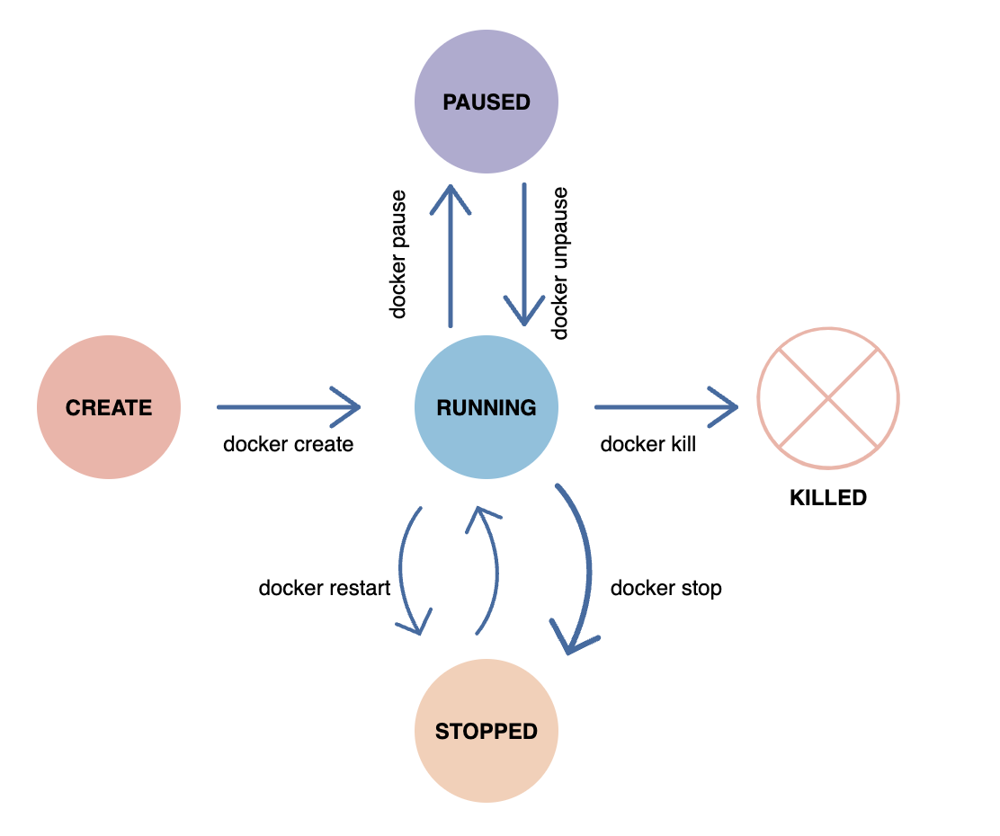
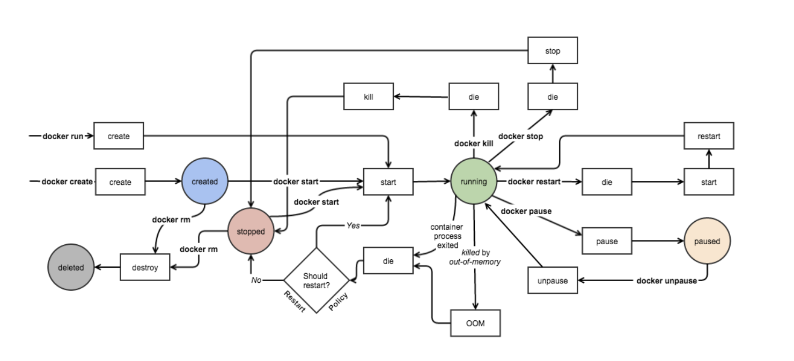

## Docker architecture

- Docker Daemon
- Docker Client
- Docker Registries
- Docker Objects


Docker uses a client-server architecture. The Docker client talks to the Docker daemon, which does the heavy lifting of building, running, and distributing your Docker containers. The Docker client and daemon can run on the same system, or you can connect a Docker client to a remote Docker daemon. The Docker client and daemon communicate using a REST API, over UNIX sockets or a network interface. Another Docker client is Docker Compose, that lets you work with applications consisting of a set of containers

### Docker Daemon 
The Docker daemon (dockerd) listens for Docker API requests and manages Docker objects such as images, containers, networks, and volumes. A daemon can also communicate with other daemons to manage Docker services.

### Docker Client

The Docker client (docker) is the primary way that many Docker users interact with Docker. When you use commands such as docker run, the client sends these commands to dockerd, which carries them out. The docker command uses the Docker API. The Docker client can communicate with more than one daemon. 

### Docker registries

A Docker registry stores Docker images. Docker Hub is a public registry that anyone can use, and Docker is configured to look for images on Docker Hub by default. You can even run your own private registry.

### Docker Objects

When you use Docker, you are creating and using images, containers, networks, volumes, plugins, and other objects

-  Images
    An image is a read-only template with instructions for creating a Docker container. Often, an image is based on another image, with some additional customization.

    Each instruction in a Dockerfile creates a layer in the image. When you change the Dockerfile and rebuild the image, only those layers which have changed are rebuilt. This is part of what makes images so lightweight, small, and fast, when compared to other virtualization technologies.

- Containers

    A container is a runnable instance of an image. You can create, start, stop, move, or delete a container using the Docker API or CLI. You can connect a container to one or more networks, attach storage to it, or even create a new image based on its current state.

    By default, a container is relatively well isolated from other containers and its host machine. You can control how isolated a container’s network, storage, or other underlying subsystems are from other containers or from the host machine.

    A container is defined by its image as well as any configuration options you provide to it when you create or start it. When a container is removed, any changes to its state that are not stored in persistent storage disappear. 

     Docker defines certain policies to restart the container

    - **On-failure:** container restarts only when a failure that occurred is not due to the user,
    - **Unless-stopped**: container restarts only when a user executes the command to stop it,
    - **Always:** the container is always restarted irrespective of error or other issues.

## Docker Run

- Pulls the <ubuntu> image: Docker checks for the presence of the ubuntu image and, if it doesn't exist locally on the host, then Docker downloads it from Docker Hub. If the image already exists, then Docker uses it for the new container. 

- Creates a new container: Once Docker has the image, it uses it to create a container. 

- Allocates a filesystem and mounts a read-write layer: The container is created in the file system and a read-write layer is added to the image. 

- Allocates a network / bridge interface: Creates a network interface that allows the Docker container to talk to the local host. 

- Sets up an IP address: Finds and attaches an available IP address from a pool. 

- Executes a process that you specify: Runs your application, and; 

- Captures and provides application output: Connects and logs standard input, outputs and errors for you to see how your application is running. 


  
## Docker Storage 

Lets discuss about the how containers are run and their association with volume mounts

Once the **Dockerfile** all the commands, and when trying to build, it will create each layer of containers and finally makes a complete readonly snapshot of the image. These layes are called as **image layers** and they are in **read-only**. These intermidiate containers are stored in a cache, so incase if next build uses the same image it would be fetched from these containers, hence it will be taken very less time tp build.

Once the image is built, we will run **docker run image** which will copy the executable from the image layer and writes to an **read-write** layer. These are called as **copy-on-write**. when the container runs, the storage is created in the run time and persists only until the contaniner is up. once the container is destroyed, its volume mounts are destroyed.

In order to make containers retain their data, we would be using something called as **persistant volumes**, where we would explictly say to mount the data of our local paths to container paths. These are available in **/var/lib/docker/volumes/**.

**docker run -d -p hostport:containerport -v localdata:container image**

These types of mount are called as **volume mounts**

Newer version you would be using the same using **mount bind** and they are called as **volume binds**

**docker run -d -p hostport:containerport --mount -bind src=localdata,destination=container image**

Different mount types available:

- **Bind mounts:** These can be stored anywhere on the host system
- **Volume mount:** they are managed by Docker and are stored in a part of the host filesystem.
- **tmpfs mount:** they are stored in the host system's memory. These mounts can never be written to the host's filesystem.


## Docker Container lifecycle

- Create phase
- Running phase
- Paused phase/unpause phase
- Stopped phase
- Killed phase






## stateful or stateless 

Stateless applications should be preferred over a Stateful application for Docker Container. We can create one container from our application and take out the app's configurable state parameters. Once it is one, we can run the same container with different production parameters and other environments. Through the Stateless application, we can reuse the same image in distinct scenarios. It is also easier to scale a Stateless application than a Stateful application when it comes to Docker Containers.


## Docker Networks 

- bridge: Default network which the containers connect to if the network is not specified otherwise
- none: Connects to a container-specific network stack lacking a network interface
- host: Connects to the host’s network stack

**default docker network**
```
docker container run -d -p 8088:80 --name nginx-server1 nginx:alpine
docker inspect nginx-server1
docker container ps
curl http://localhost:<port>
```

**custom docker network**
```
docker network create -d bridge my-bridge-network
docker container run -d -p 8788:80 --network="my-bridge-network" --name nginx-server2 nginx:alpine
docker container ps
curl http://localhost:<port>
docker inspect nginx-server2
```

## CMD Vs ENTRYPOINT

*CMD* provides a default arguments for the container also can be overridden when its running. 

```Dockerfile
FROM Ubuntu:20.04 
CMD ["echo", "Hello from CMD"]

# docker build -t cmd-example . 
# docker run cmd-example # Output: Hello from CMD
# docker run cmd-example "hi there" # Output: hi there
```

An ENTRYPOINT provides a fixed comamnd to run when container starts. its harder to override. Arguments passed during `docker run` are appended to ENTRYPOINT

```Dockerfile
FROM ubuntu:20.04
ENTRYPOINT ["echo", "hello from ENTRYPOINT"]

# docker build -t entrypoint-example . 
# docker run entrypoint-example # output hello from ENTRYPOINT
# docker run entrypoint-example "hi there" # output: hello from ENTRYPOINT hi there
```

Containers are meant to run a task or a process. A container lives as long as a process within it is running. If an application in a container crashes, container exits.

Difference between the CMD and ENTRYPOINT with related to the supplied to the "docker run" command. While the CMD will be completely over-written by the supplied command (or args), for the ENTRYPOINT, the supplied command will be appended to it.

```
# Dockerfile
FROM ubuntu:20.04

ENTRYPOINT ["echo"]
CMD ["Hello from CMD"]

docker build -t combined-example .
docker run combined-example                    # Output: Hello from CMD
docker run combined-example "Custom Message"   # Output: Custom Message
```

### Example

Let's understand it with an ubuntu-sleeper example. 

When you want to make a container run, it would check for the CMD to run the process, but when we have a bash which is just a listening terminal to get the input and if we don't provide it, it would just exit the conatiner. 


```
docker run ubutu:20.04 sleep 30 # provide an input to bash terminal for 30 sec.
```

Let's make a docker equivalent file for above command

```Dockerfile
FROM ubuntu:20.04
CMD ["sleep", "30"]

docker build -t ubuntu-sleep .
docker run ubuntu-sleep
```

Container always sleep 30 sec once it started ! 
So what if we need to change the time ? i.e sleep 10 ? 
Since its hardcoded, we would now want to make it parametrized.. 

```Dockerfile
FROM ubuntu:20.04
CMD ["30"]
ENTRYPOINT ["sleep"]

docker build -t ubuntu-sleep .
docker run ubuntu-sleep # sleep for 30s when no args are passed
docker run ubuntu-sleep 10 # sleep for 10 sec # observe that CMD has been overwritten for ENTRYPOINT
```

incase you want to override the command itself in the ENTRYPOINT, then..

```
docker run --entrypoint new-sleep-command ubuntu-sleep 60
```

## Dockerfile 

- **FROM** -  sets the base image for subsequent instructions, especially easier to start by pulling an image. 

- **MAINTAINER** -  Author field of the generated images

- **RUN** - execute any commands in a new layer on top of the current image and commit the results. The resulting committed image will be used for the next step in the *Dockerfile*..
`RUN [ "echo", "$HOME" ]` will not do variable substitution on $HOME as *exec* won't invoke any command shell. if you want shell processing you need to specify the shell `RUN [ "sh", "-c", "echo", "$HOME" ]`

- **CMD** - Command that needs to be executed while running container. The main purpose of a CMD is to provide defaults for an executing. These defaults can include an executable, or they can omit the executable, in which case we must specify an ENTRYPOINT instruction as well.

    CMD It has 3 forms:

    CMD ["executable","param1","param2"] (exec form, this is the preferred form)
    CMD ["param1","param2"] (as default parameters to ENTRYPOINT)
    CMD command param1 param2 (shell form)

- **WORDDIR** AND **ENV** - The WORKDIR instruction sets the working directory for any RUN, CMD and ENTRYPOINT instructions that follow it in the Dockerfile. The WORKDIR instruction can resolve environment variables previously set using ENV. The ENV instruction sets the environment variable to the value . This value will be passed to all future RUN instructions. The environment variables set using ENV will persist when a container is run from the resulting image.

- **ADD** copies new files, directories or remote file URLs from and adds them to the filesystem of the container at the path .

- **ENTRYPOINT** allows us to configure a container that will run as an executable.

### Example 

lets create Dockerfile and check above actions 

```Dockerfile
FROM ubuntu:20.04
MAINTAINER samperay

RUN apt-get update && apt-get install htop
WORKDIR /root
ENV TAG Dev

# build image

docker build -t demo . 
docker images
docker run -it --rm demo -- /bin/bash

# insise docker image
$ pwd
/root 
$ echo $TAG
Dev
$ 
```

Now, lets create a script and make it to run from the container

```bash
# run.sh

#!/bin/sh
echo "The current directory : $(pwd)"
echo "The Tag variable : $TAG"
echo "There are $# arguments: $@"
```

```Dockerfile
FROM ubnutu:20.04
WORKDIR /root
ENV TAG Dev
ADD run.sh /root/run.sh
RUN chmod +x ./root/run.sh
CMD ["./run.sh"]


docker build -t demo1 . 
docker run -it --rm demo1
docker container run -it --rm demo1 ./run.sh Hello Sunil

# outputs 
echo "The current directory : $(pwd)"
echo "The Tag variable : $TAG"
echo "There are $# arguments: $@"
```

Let's discuss about the `CMD` and `ENTRYPOINT` in above code. since we pass arguments, we can use that using CMD options to provide as an input to ENTRYPOINT.


```Dockerfile
FROM ubnutu:20.04
WORKDIR /root
ENV TAG Dev
ADD run.sh /root/run.sh
RUN chmod +x ./root/run.sh
ENTRYPOINT ["./run.sh"]
CMD ["arg1"]


docker build -t demo2 . 
docker run -it --rm demo2  

# Output: 
echo "The current directory : /root"
echo "The TAG variable : Dev"
echo "There are 1 arguments: arg1"


docker container run -it --rm demo1 /bin/bash

echo "The current directory : /root"
echo "The TAG variable : Dev"
echo "There are 1 arguments: /bin/bash"
```