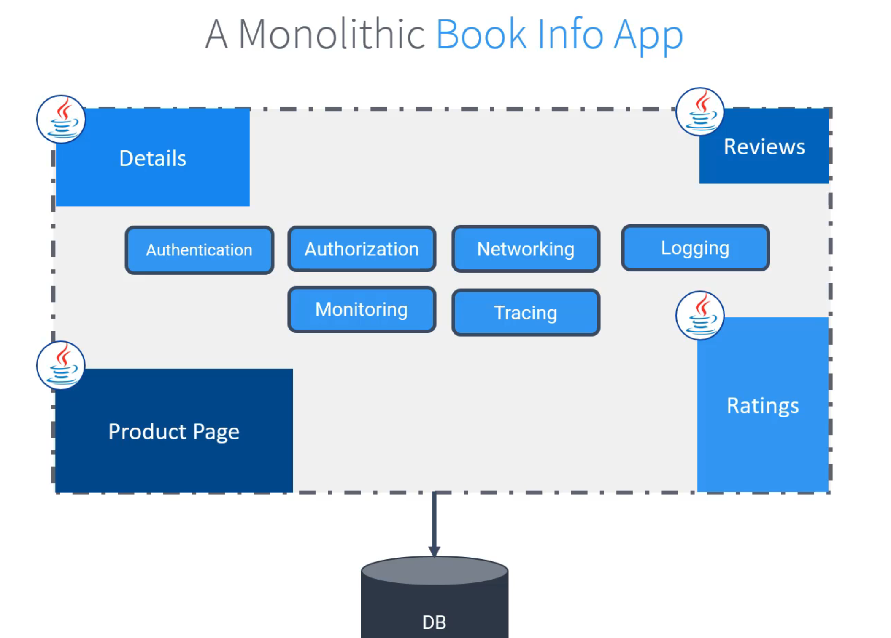
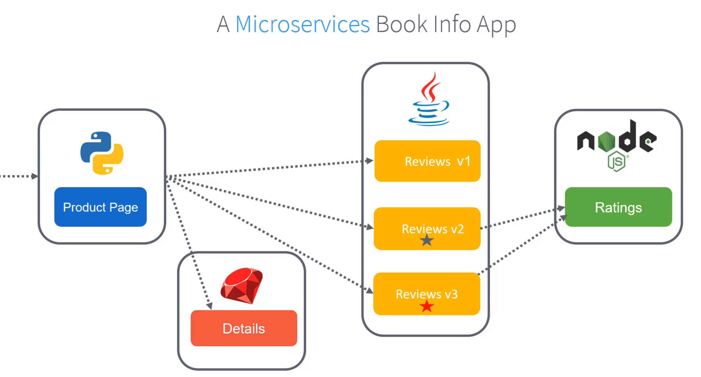
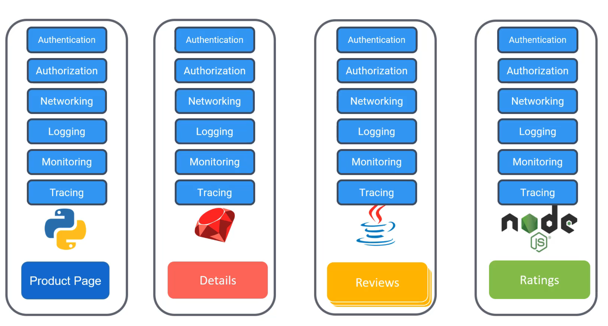
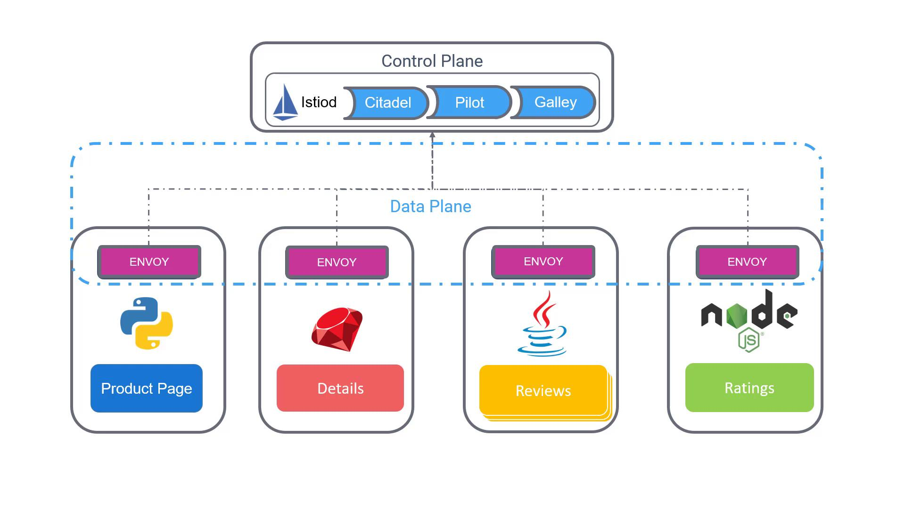

# Istio

## Monolithic 

Includes all the infos of security/auth/code and so on in a big giant of code. Each service depends on a specific version of another, requiring the whole package to be deployed simultaneously and often involving database scripts. 

Since all modules use the same programming language (Java) and share a single database, any issue—such as the Ratings module struggling with heavy data load—affects the entire system. Even minor updates require a full redeployment, making scalability and independent upgrades challenging.

 




benefits of micro services over monolithic

| **Benefit**                | **Description**                                                                                          |
|-----------------------------|----------------------------------------------------------------------------------------------------------|
| Independent Scaling         | The Ratings module can scale based on customer load.                                                    |
| Faster Releases             | Independent deployments lead to smaller, less risky releases.                                           |
| Technological Flexibility   | Teams can choose different programming languages for each service.                                      |
| Enhanced Resilience         | Loose coupling increases the overall system resilience, simplifying monitoring, updates, and rollbacks. |
| Manageability               | Maintaining smaller, autonomous applications reduces the risk of developing a "big ball of mud."        |


pro of microservices:

- scalbility
- faster, smaller releases
- tech and lan agnostic dev lifecycls
- system resilience and isolcation
- indndependent  and easy to underdtand services.



The above one id problem as all the security modules are to be tied in 1 place proviing a very fat code. 

Cons of mictoservices

- complex service netwirking
- security [ serv ice to service is problem as there are independednt]
- observlity ( different languages and different metrics)
- overload of traditional ops models ( diff languages)


## service mesh

A service mesh is a dedicated, configurable infrastructure layer designed to manage service-to-service communications in microservices architectures without requiring modifications to your business code. With a service mesh, these tasks are offloaded to **sidecar proxies deployed alongside every microservice**. The network communication between services is managed by these proxies, which also form the data plane. The network communication between services is managed by these proxies, which also form the **data plane**. The proxies communicate with a central server-side component known as the **Control Plane**. The Control Plane oversees and directs all traffic entering and leaving the services, ensuring a larger, cohesive system.


| **Capability**     | **Description**                                                                                   | **Benefit**                                              |
|--------------------|---------------------------------------------------------------------------------------------------|----------------------------------------------------------|
| Service Discovery  | Automatically identifies the IP addresses and ports where services are exposed.                   | Simplifies inter-service communication without manual setup. |
| Health Checks      | Continuously monitors the status of services and maintains a pool of healthy instances.           | Improves resilience and fault tolerance.                 |
| Load Balancing     | Routes traffic intelligently toward healthy instances, isolating or bypassing failing ones.       | Optimizes resource usage and minimizes downtime.         |


Responsible for ..

- Traffic mgmt 
- security
- observability
- service discovery
  - discovery
  - health check 
  - load balancing


## istio

Istio's architecture is divided into two main parts: the **data plane** and the **control plane** and can be run only in kubernetes cluster.

**Data plane:** 

consists of Envoy proxies that are deployed alongside each service instance (or pod). These proxies handle crucial functions such as load balancing, security, and observability

**control plane**

control plane manages and configures the proxies to **route traffic, enforce policies, and collect telemetry data**

It has three main components

- Citadel - Responsible for generating and managing certificates for secure communications.
- Pilot - Handles service discovery and maintains routing configurations.
- Galley - Validates configuration files to ensure correct settings.

Above 3 combined in single service called `istiod`



Within each pod, an **Istio agent** works in tandem with the **Envoy proxy**. The agent is responsible for **delivering configuration secrets** and other necessary data to ensure that the proxy operates correctly.

### install istion 

- istioctl 
- istio operator install 
- helm chats

It will install istiod along with 2 other components 

- istio-ingressgateway 
- istio-egressgateway

Download link - https://istio.io/latest/docs/setup/getting-started/#download

```
curl -L https://istio.io/downloadIstio | sh -
cd istio-<version-number>
export PATH=$PWD/bin:$PATH
istioctl install --set profile=demo -y

✔ Istio core installed ⛵️                                                                                                                     
✔ Istiod installed 🧠                                                                                                                         
✔ Egress gateways installed 🛫                                                                                                               .
✔ Ingress gateways installed 🛬                                                                                                              
✔ Installation complete     

```

```
root@controlplane ~/istio-1.28.0 ➜  kubectl get pods -n istio-system
NAME                                   READY   STATUS    RESTARTS   AGE
istio-egressgateway-78bfb5f9d8-9jz8b   1/1     Running   0          52s
istio-ingressgateway-74c94955d-q9scw   1/1     Running   0          51s
istiod-6f789f76fc-smdxm                1/1     Running   0          60s

root@controlplane ~/istio-1.28.0 ➜ 


root@controlplane ~/istio-1.28.0 ➜  istioctl version
client version: 1.28.0
control plane version: 1.28.0
data plane version: 1.28.0 (2 proxies)

root@controlplane ~/istio-1.28.0 ➜  

```

### Deploy application


```
kubectl apply -f samples/bookinfo/platform/kube/bookinfo.yaml


root@controlplane ~ ➜  kubectl create -f istio-sample.yml 
service/details created
serviceaccount/bookinfo-details created
deployment.apps/details-v1 created
service/ratings created
serviceaccount/bookinfo-ratings created
deployment.apps/ratings-v1 created
service/reviews created
serviceaccount/bookinfo-reviews created
deployment.apps/reviews-v1 created
deployment.apps/reviews-v2 created
deployment.apps/reviews-v3 created
service/productpage created
serviceaccount/bookinfo-productpage created
deployment.apps/productpage-v1 created


root@controlplane ~ ✖ istioctl analyze
Info [IST0102] (Namespace default) The namespace is not enabled for Istio injection. Run 'kubectl label namespace default istio-injection=enabled' to enable it, or 'kubectl label namespace default istio-injection=disabled' to explicitly mark it as not needing injection.

root@controlplane ~ ➜ 


root@controlplane ~ ➜  kubectl delete -f istio-sample.yml 
service "details" deleted
serviceaccount "bookinfo-details" deleted
deployment.apps "details-v1" deleted
service "ratings" deleted
serviceaccount "bookinfo-ratings" deleted
deployment.apps "ratings-v1" deleted
service "reviews" deleted
serviceaccount "bookinfo-reviews" deleted
deployment.apps "reviews-v1" deleted
deployment.apps "reviews-v2" deleted
deployment.apps "reviews-v3" deleted
service "productpage" deleted
serviceaccount "bookinfo-productpage" deleted
deployment.apps "productpage-v1" deleted

root@controlplane ~ ➜ 


root@controlplane ~ ➜  kubectl label namespace default istio-injection=enabled
namespace/default labeled

root@controlplane ~ ➜  

root@controlplane ~ ➜  

root@controlplane ~ ➜  kubectl create -f istio-sample.yml 
service/details created
serviceaccount/bookinfo-details created
deployment.apps/details-v1 created
service/ratings created
serviceaccount/bookinfo-ratings created
deployment.apps/ratings-v1 created
service/reviews created
serviceaccount/bookinfo-reviews created
deployment.apps/reviews-v1 created
deployment.apps/reviews-v2 created
deployment.apps/reviews-v3 created
service/productpage created
serviceaccount/bookinfo-productpage created
deployment.apps/productpage-v1 created

root@controlplane ~ ➜  


root@controlplane ~ ➜  kubectl get pods
NAME                              READY   STATUS    RESTARTS   AGE
details-v1-67894999b5-md2ns       2/2     Running   0          30s
productpage-v1-7bd5bd857c-v8nc9   2/2     Running   0          30s
ratings-v1-676ff5568f-bgs6q       2/2     Running   0          30s
reviews-v1-f5b4b64f-gwm4c         2/2     Running   0          30s
reviews-v2-74b7dd9f45-jbjgn       2/2     Running   0          30s
reviews-v3-65d744df5c-9m7h9       2/2     Running   0          30s

root@controlplane ~ ➜  


root@controlplane ~ ➜  istioctl analyze

✔ No validation issues found when analyzing namespace: default.

root@controlplane ~ ➜  

```

### visualize - Kiali

kiali can automatically generate istio configuration.

Visualisation of a service mesh.

Health check of a service mesh.

Logs and metric of a service mesh.


```
root@controlplane ~ ➜  kubectl apply -f /root/istio-1.20.8/samples/addons
serviceaccount/grafana created
configmap/grafana created
service/grafana created
deployment.apps/grafana created
configmap/istio-grafana-dashboards created
configmap/istio-services-grafana-dashboards created
deployment.apps/jaeger created
service/tracing created
service/zipkin created
service/jaeger-collector created
serviceaccount/kiali created
configmap/kiali created
clusterrole.rbac.authorization.k8s.io/kiali-viewer created
clusterrole.rbac.authorization.k8s.io/kiali created
clusterrolebinding.rbac.authorization.k8s.io/kiali created
role.rbac.authorization.k8s.io/kiali-controlplane created
rolebinding.rbac.authorization.k8s.io/kiali-controlplane created
service/kiali created
deployment.apps/kiali created
serviceaccount/loki created
configmap/loki created
configmap/loki-runtime created
service/loki-memberlist created
service/loki-headless created
service/loki created
statefulset.apps/loki created
serviceaccount/prometheus created
configmap/prometheus created
clusterrole.rbac.authorization.k8s.io/prometheus created
clusterrolebinding.rbac.authorization.k8s.io/prometheus created
service/prometheus created
deployment.apps/prometheus created

root@controlplane ~ ➜ 

```

## k8 network

### kubernetes services

For internal cluster communication, it’s crucial that pods can reliably locate and interact with each other. Although each pod is assigned its own IP, these addresses are temporary. The challenge then becomes how to enable a front-end, for instance, to consistently reach a back-end service even as individual pod IPs change. This is where Kubernetes Services become essential. 

A backend service can be configured to target a set of backend pods. Because the service itself receives a stable IP address, there is no longer any need to monitor the dynamic IPs of the individual pods.

**ClusterIP:**
The default and most common service type, ClusterIP, exposes the service on an internal IP address within the cluster. This type is ideal for enabling communication between applications within the same cluster.

**NodePort:**
NodePort exposes the service on a specific port across all nodes in the cluster. This makes it possible to access the service externally, directly via the node IP addresses.

**LoadBalancer:**
This service type provisions an external load balancer (supported by select cloud providers) which routes traffic to the service. It extends the functionality of NodePort by providing enhanced traffic distribution and integration with cloud load-balancing solutions.

### sidecar

Understanding sidecars is essential when constructing multi-container Pods, as they enable **auxiliary functionalities that support the main application container**.

the primary container runs the **core business logic of your application**, the sidecar container is dedicated to handling tasks such as:

Log shipping
Monitoring
File loading
Proxying

Understanding and effectively utilizing sidecars in your Kubernetes deployments can lead to more resilient and maintainable applications by offloading supportive tasks from the main application container

### envoy

A proxy acts as an intermediary between a user and an application. Instead of embedding additional functionalities—such as TLS encryption, authentication, and request retries—directly into your application, these tasks can be offloaded to a proxy. This approach enables developers to concentrate on the core business logic while the proxy handles supplementary operations.

Envoy operates both as a proxy and as a communication bus with advanced routing capabilities. Typically, Envoy is deployed as a sidecar container alongside your primary application containers. This design ensures that all inbound and outbound pod traffic is managed by Envoy, which enhances communication handling and offloads additional features from your application.