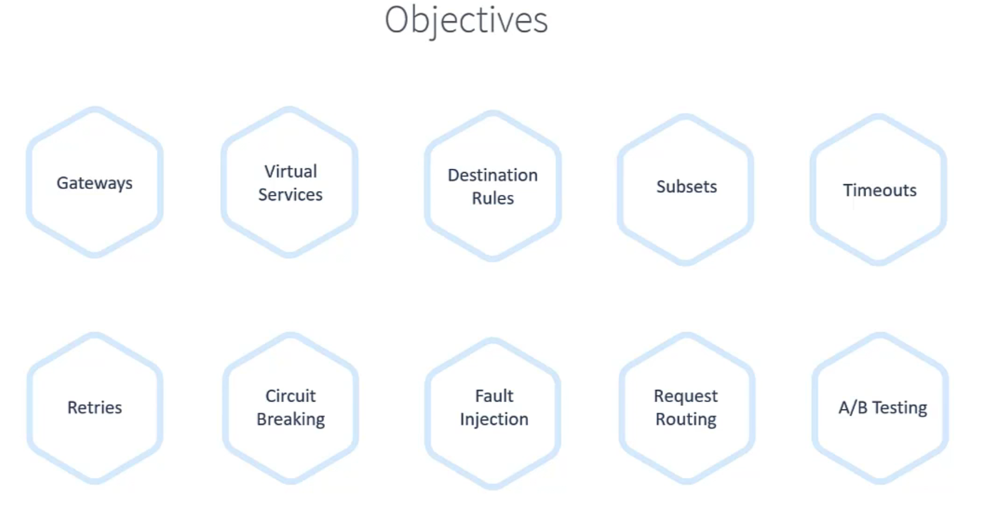

## Introduction





## Monolithic 

Includes all the infos of security/auth/code and so on in a big giant of code. 

 


pro of microservices:

- scalbility
- faster, smaller releases
- tech and lan agnostic dev lifecycls
- system resilience and isolcation
- indndependent  and easy to underdtand services.


The above one id problem as all the security modules are to be tied in 1 place proviing a very fat code. 

Cons of mictoservices

- complex service netwirking
- security [ serv ice to service is problem as there are independednt]
- observlity ( different languages and different metrics)
- overload of traditional ops models ( diff languages)


## service mesh

Dedicated and configurable infra layer that handles the commuication beytween services without having to chanhe the code in the microservices architrecture.

Proxy service is responsible for commucation betwereen the micro services to control plane forming a data plane. we would need to move out from our business logic i.e istio


Responsible for ..

- Traffic mgmt 
- security
- observability
- service discovery
  - discovery
  - health check 
  - load balancing


## istio

It can be run only on the kubernetes cluster

istio implements the proxy using high performance proxy called "envoy". thse talk to control plane using envoy. each of the envoy proxy containes an agent called "istio agent" which is responsible ofr passing configuration secrets for envoy proxy.  

control plane consists of 3 components.

- Citadel - Certificate generation
- Pilot - service discovery 
- Galley - validating config files

Above 3 combined in single service called `istiod`

istio converts proxy of the mictoservices to an envoy 

### install istion 

- istioctl 
- istion operator install 
- helm chats

It will install istiod along with 2 other components 

- istio-ingressgateway 
- istio-egressgateway

Download link - https://istio.io/latest/docs/setup/getting-started/#download

```
curl -L https://istio.io/downloadIstio | sh -
cd istio-<version-number>
export PATH=$PWD/bin:$PATH
istioctl install --set profile=demo -y

✔ Istio core installed ⛵️                                                                                                                     
✔ Istiod installed 🧠                                                                                                                         
✔ Egress gateways installed 🛫                                                                                                               .
✔ Ingress gateways installed 🛬                                                                                                              
✔ Installation complete     

```

```
root@controlplane ~/istio-1.28.0 ➜  kubectl get pods -n istio-system
NAME                                   READY   STATUS    RESTARTS   AGE
istio-egressgateway-78bfb5f9d8-9jz8b   1/1     Running   0          52s
istio-ingressgateway-74c94955d-q9scw   1/1     Running   0          51s
istiod-6f789f76fc-smdxm                1/1     Running   0          60s

root@controlplane ~/istio-1.28.0 ➜ 


root@controlplane ~/istio-1.28.0 ➜  istioctl version
client version: 1.28.0
control plane version: 1.28.0
data plane version: 1.28.0 (2 proxies)

root@controlplane ~/istio-1.28.0 ➜  

```

### Deploy application


```
kubectl apply -f samples/bookinfo/platform/kube/bookinfo.yaml


root@controlplane ~ ➜  kubectl create -f istio-sample.yml 
service/details created
serviceaccount/bookinfo-details created
deployment.apps/details-v1 created
service/ratings created
serviceaccount/bookinfo-ratings created
deployment.apps/ratings-v1 created
service/reviews created
serviceaccount/bookinfo-reviews created
deployment.apps/reviews-v1 created
deployment.apps/reviews-v2 created
deployment.apps/reviews-v3 created
service/productpage created
serviceaccount/bookinfo-productpage created
deployment.apps/productpage-v1 created


root@controlplane ~ ✖ istioctl analyze
Info [IST0102] (Namespace default) The namespace is not enabled for Istio injection. Run 'kubectl label namespace default istio-injection=enabled' to enable it, or 'kubectl label namespace default istio-injection=disabled' to explicitly mark it as not needing injection.

root@controlplane ~ ➜ 


root@controlplane ~ ➜  kubectl delete -f istio-sample.yml 
service "details" deleted
serviceaccount "bookinfo-details" deleted
deployment.apps "details-v1" deleted
service "ratings" deleted
serviceaccount "bookinfo-ratings" deleted
deployment.apps "ratings-v1" deleted
service "reviews" deleted
serviceaccount "bookinfo-reviews" deleted
deployment.apps "reviews-v1" deleted
deployment.apps "reviews-v2" deleted
deployment.apps "reviews-v3" deleted
service "productpage" deleted
serviceaccount "bookinfo-productpage" deleted
deployment.apps "productpage-v1" deleted

root@controlplane ~ ➜ 


root@controlplane ~ ➜  kubectl label namespace default istio-injection=enabled
namespace/default labeled

root@controlplane ~ ➜  

root@controlplane ~ ➜  

root@controlplane ~ ➜  kubectl create -f istio-sample.yml 
service/details created
serviceaccount/bookinfo-details created
deployment.apps/details-v1 created
service/ratings created
serviceaccount/bookinfo-ratings created
deployment.apps/ratings-v1 created
service/reviews created
serviceaccount/bookinfo-reviews created
deployment.apps/reviews-v1 created
deployment.apps/reviews-v2 created
deployment.apps/reviews-v3 created
service/productpage created
serviceaccount/bookinfo-productpage created
deployment.apps/productpage-v1 created

root@controlplane ~ ➜  


root@controlplane ~ ➜  kubectl get pods
NAME                              READY   STATUS    RESTARTS   AGE
details-v1-67894999b5-md2ns       2/2     Running   0          30s
productpage-v1-7bd5bd857c-v8nc9   2/2     Running   0          30s
ratings-v1-676ff5568f-bgs6q       2/2     Running   0          30s
reviews-v1-f5b4b64f-gwm4c         2/2     Running   0          30s
reviews-v2-74b7dd9f45-jbjgn       2/2     Running   0          30s
reviews-v3-65d744df5c-9m7h9       2/2     Running   0          30s

root@controlplane ~ ➜  


root@controlplane ~ ➜  istioctl analyze

✔ No validation issues found when analyzing namespace: default.

root@controlplane ~ ➜  

```

### visualize - Kiali

kiali can automatically generate istio configuration.

Visualisation of a service mesh.

Health check of a service mesh.

Logs and metric of a service mesh.


```
root@controlplane ~ ➜  kubectl apply -f /root/istio-1.20.8/samples/addons
serviceaccount/grafana created
configmap/grafana created
service/grafana created
deployment.apps/grafana created
configmap/istio-grafana-dashboards created
configmap/istio-services-grafana-dashboards created
deployment.apps/jaeger created
service/tracing created
service/zipkin created
service/jaeger-collector created
serviceaccount/kiali created
configmap/kiali created
clusterrole.rbac.authorization.k8s.io/kiali-viewer created
clusterrole.rbac.authorization.k8s.io/kiali created
clusterrolebinding.rbac.authorization.k8s.io/kiali created
role.rbac.authorization.k8s.io/kiali-controlplane created
rolebinding.rbac.authorization.k8s.io/kiali-controlplane created
service/kiali created
deployment.apps/kiali created
serviceaccount/loki created
configmap/loki created
configmap/loki-runtime created
service/loki-memberlist created
service/loki-headless created
service/loki created
statefulset.apps/loki created
serviceaccount/prometheus created
configmap/prometheus created
clusterrole.rbac.authorization.k8s.io/prometheus created
clusterrolebinding.rbac.authorization.k8s.io/prometheus created
service/prometheus created
deployment.apps/prometheus created

root@controlplane ~ ➜ 

```