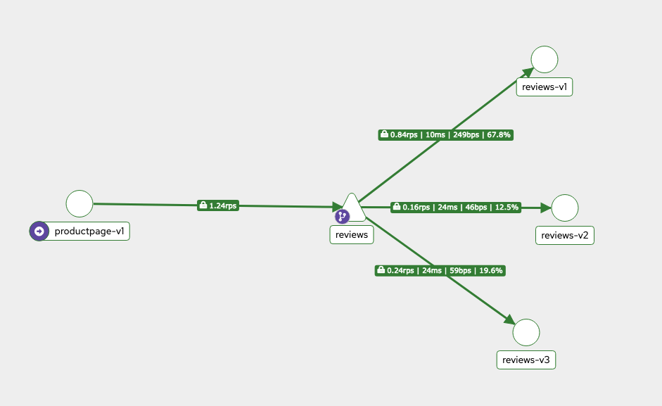

## Gateway 

Istio Gateways function as **load balancers at the edge of the mesh**, handling both inbound and outbound traffic. When Istio is deployed on a cluster, it automatically installs both the Istio Ingress Gateway and Istio Egress Gateway.

the Istio Ingress Gateway intercepts all inbound traffic using Envoy proxies. Every service in the mesh is paired with an Envoy sidecar proxy, while the gateways themselves are standalone proxies positioned at the edge of the mesh.


Our objective is to capture all **traffic arriving at the Istio Ingress Gateway for the hostname "bookinfo.app" and forward it to the product page service.**

Create gateway object to accept HTTP traffic on port 80 for specified hostname.


```yaml
# bookinfo-gateway.yaml
apiVersion: networking.istio.io/v1alpha3
kind: Gateway
metadata:
  name: bookinfo-gateway
spec:
  selector:
    istio: ingressgateway
  servers:
  - port:
      number: 80
      name: http
      protocol: HTTP
    hosts:
    - "192.168.106.3"
```


At this point, **the bookinfo Gateway is configured to capture traffic coming through the default Istio Ingress Gateway for the URL "bookinfo.app"**. The following step is to define Virtual Services to correctly route this traffic to the product page service, which will be covered in a subsequent article.

## virtual services

Virtual Services allow you to configure routing rules, directing incoming traffic through the Ingress Gateway to the appropriate service in your service mesh.

When a user visits http://bookinfo.app, the request first reaches the bookinfo.app Gateway. From there, Istio routes the traffic based on defined rules. For example, you can direct all traffic for the URL bookinfo.app/productpage

Virtual Services offer flexibility by allowing you to specify hostnames, manage traffic among different service versions, and use both standard and regex URI paths. Once a Virtual Service is created, the Istio control plane disseminates the configuration to all Envoy sidecars in the mesh.


```yaml
# virtual-service1.yaml
apiVersion: networking.istio.io/v1alpha3
kind: VirtualService
metadata:
  name: bookinfo
spec:
  hosts:
    - "192.168.106.3"
  gateways:
    - bookinfo-gateway
  http:
    - match:
        - uri:
            exact: /productpage
        - uri:
            prefix: /static
        - uri:
            exact: /login
        - uri:
            exact: /logout
        - uri:
            prefix: /api/v1/products
      route:
        - destination:
            host: productpage
            port:
              number: 9080
```

This configuration instructs Istio to forward any traffic passing through the bookinfo-gateway with the host bookinfo.app and matching the specified URL patterns to the productPage service on port 9080.


**Traffic Routing With Istio Virtual Services**

Istio overcomes these limitations by decoupling traffic routing from pod count. Using Virtual Services in conjunction with destination rules (which define subsets like v1 and v2), you can precisely control traffic percentages. For example, the following Virtual Service configuration directs 99% of traffic to subset v1 and 1% to subset v2:

```yaml
apiVersion: networking.istio.io/v1alpha3
kind: VirtualService
metadata:
  name: reviews
spec:
  hosts:
    - reviews
  http:
    - route:
        - destination:
            host: reviews
            subset: v1
          weight: 99
        - destination:
            host: reviews
            subset: v2
          weight: 1
```

Even if the reviews v2 deployment scales up with more pods, the Virtual Service configuration continues to manage the traffic distribution independently. 99% of the traffic is directed to the subset "v1" and 1% to the subset "v2".  Subsets used in Virtual Services are defined in Destination Rules. These rules allow you to apply specific 
configurations to traffic after it has been routed to a service.

## Destination rules

Destination Rules enable you to define policies that are applied after traffic is routed to a specific service, ensuring controlled distribution and effective load balancing.

Subsets represent groups of service instances identified by labels on the respective pods.

```yaml
apiVersion: networking.istio.io/v1alpha3
kind: DestinationRule
metadata:
  name: reviews-destination
spec:
  host: reviews
  subsets:
    - name: v1
      labels:
        version: v1
    - name: v2
      labels:
        version: v2
```

```yaml
apiVersion: apps/v1
kind: Deployment
metadata:
  name: reviews-v1
spec:
  replicas: 3
  template:
    metadata:
      labels:
        app: reviews
        version: v1
```

### Customizing Load Balancing Policies

By default, Envoy uses a round-robin load-balancing strategy. However, you can modify this behavior by specifying a traffic policy within a Destination Rule

```yaml
apiVersion: networking.istio.io/v1alpha3
kind: DestinationRule
metadata:
  name: reviews-destination
spec:
  host: reviews
  trafficPolicy:
    loadBalancer:
      simple: PASSTHROUGH
  subsets:
    - name: v1
      labels:
        version: v1
    - name: v2
      labels:
        version: v2
```

Other types of alogorithms;

- PASSTHROUGH 
- ROUND_ROBIN 
- RANDOM 
- LEAST_CONN 

```
kubectl apply -f samples/bookinfo/platform/kube/bookinfo.yaml
kubectl get gateway
kubectl delete gateway
kubectl create -f bookinfo-gateway.yaml
kubectl apply -f virtual-service1.yaml
curl -s -HHost:bookinfo.app http://$INGRESS_HOST:$INGRESS_PORT/productpage <- works internally>

From, browser: 

http://192.168.106.3:$INGRESS_PORT/productpage

```

Create diffrent versions of revisions 

```
➜  istio-1.28.0 kubectl apply -f samples/bookinfo/networking/destination-rule-all.yaml
destinationrule.networking.istio.io/productpage created
destinationrule.networking.istio.io/reviews created
destinationrule.networking.istio.io/ratings created
destinationrule.networking.istio.io/details created
➜  istio-1.28.0

➜  istio-1.28.0 kubectl get destinationrules
NAME          HOST          AGE
details       details       48s
productpage   productpage   48s
ratings       ratings       48s
reviews       reviews       48s

➜  istio-1.28.0 kubectl describe destinationrules reviews
Name:         reviews
Namespace:    default
Labels:       <none>
Annotations:  <none>
API Version:  networking.istio.io/v1
Kind:         DestinationRule
Metadata:
  Creation Timestamp:  2025-11-14T11:27:30Z
  Generation:          1
  Resource Version:    46306
  UID:                 79566adc-5d6f-4e2a-afa1-a79686954955
Spec:
  Host:  reviews
  Subsets:
    Labels:
      Version:  v1
    Name:       v1
    Labels:
      Version:  v2
    Name:       v2
    Labels:
      Version:  v3
    Name:       v3
Events:         <none>
➜  istio-1.28.0
```

```yaml
apiVersion: networking.istio.io/v1alpha3
kind: VirtualService
metadata:
  name: reviews
spec:
  hosts:
    - reviews
  http:
    - route:
        - destination:
            host: reviews
            subset: v1
          weight: 75
        - destination:
            host: reviews
            subset: v2
          weight: 25
```

```yaml
➜  istio-1.28.0 kubectl apply -f review-service.yaml
virtualservice.networking.istio.io/reviews created

➜  istio-1.28.0 kubectl get virtualservice
NAME       GATEWAYS               HOSTS               AGE
bookinfo   ["bookinfo-gateway"]   ["192.168.106.3"]   6h58m
reviews                           ["reviews"]         23s
➜  istio-1.28.0
```


```yaml
➜  istio-1.28.0 kubectl get pods -l app=reviews,version=v1
NAME                         READY   STATUS    RESTARTS   AGE
reviews-v1-8cf7b9cc5-2df2j   2/2     Running   0          7h16m
➜  istio-1.28.0
➜  istio-1.28.0 kubectl get pods -l app=reviews,version=v2
NAME                          READY   STATUS    RESTARTS   AGE
reviews-v2-67d565655f-7b88c   2/2     Running   0          7h16m
➜  istio-1.28.0
➜  istio-1.28.0 kubectl get pods -l app=reviews,version=v3
NAME                         READY   STATUS    RESTARTS   AGE
reviews-v3-d587fc9d7-f9fnm   2/2     Running   0          7h16m
➜  istio-1.28.0
```





if you want only specific user to get the reviews page or route traffic.. 

```yaml
➜  istio-1.28.0 kubectl get virtualservice reviews -o yaml
apiVersion: networking.istio.io/v1
kind: VirtualService
metadata:
  name: reviews
  namespace: default
spec:
  hosts:
  - reviews
  http:
  - match:
    - headers:
        end-user:
          exact: sunil
    route:
    - destination:
        host: reviews
        subset: v2
  - route:
    - destination:
        host: reviews
        subset: v1
```

## fault injection

Fault injection is a testing strategy designed to simulate errors and validate the resilience of your error handling mechanisms. Fault injection in Istio supports the simulation of two primary error types in Virtual Services:

Delays
Aborts

### delays

how to inject a delay fault into a Virtual Service. In this configuration, a delay of 5 seconds is applied to 10% of the requests routed to the service.

```yaml
# details-virtual-service.yml
apiVersion: networking.istio.io/v1
kind: VirtualService
metadata:
  name: details
spec:
  hosts:
  - details
  http:
  - fault:
      delay:
        percentage:
          value: 70
        fixedDelay: 7s
    route:
    - destination:
        host: details
        subset: v1
```

```
kubectl apply -f details-virtualservice.yml
virtualservice.networking.istio.io/details created
```

refresh from web browsers. 


### aborts 

you can configure abort faults to simulate scenarios where requests are rejected with specific error codes. Abort faults help test how your service behaves under error conditions, ensuring that fallback mechanisms and error handling policies are effective.

By incorporating both delay and abort fault injections, you can thoroughly assess the robustness of your application and ensure that it remains resilient even under adverse conditions.

## timeouts

In a distributed microservices system, services may experience delays or failures due to various reasons. Such delays can propagate throughout the network, causing a chain reaction that impacts user experience. Timeouts prevent a single slow service from adversely affecting the overall system. When a dependent service exceeds a configured waiting period, it automatically fails and returns an error, keeping the rest of the network responsive.

For example, if the rating service slows down, requests may get queued at the review service and the product page service. Similarly, if the details service becomes unresponsive, the product page service experiences delays, ultimately affecting all users. Implementing timeouts ensures that a service will not wait indefinitely for a slow response, thereby isolating faults and preserving system resilience.

### Configure timeouts

Consider a scenario with a details service and a booking service that routes traffic to the product page. To prevent the system from waiting indefinitely for a response from the product page service, you can configure a timeout such that if the service takes longer than three seconds to respond, the request is automatically rejected. This is accomplished by adding a timeout option in the service configuration.

```yaml
apiVersion: networking.istio.io/v1alpha3
kind: VirtualService
metadata:
  name: bookinfo
spec:
  hosts:
    - "bookinfo.app"
  gateways:
    - bookinfo-gateway
  http:
    - match:
        - uri:
            exact: /productpage
        - uri:
            prefix: /static
      route:
        - destination:
            host: productpage
            port:
              number: 9080
      timeout: 3s
```

details service is as-usual and does not include a timeout, its setup to route traffic normally.


simulate fault injections 

To test how the system handles delayed responses, you can simulate a fault. For instance, introduce a fixed delay of five seconds for 50% of the traffic directed to the details service. This fault injection approach helps in validating the resilience of the system by forcing the product page service's three-second timeout to trigger.
By configuring timeouts and simulating delays through fault injection, you can ensure that your microservices architecture remains agile and responsive even when individual components face issues.


```yaml
apiVersion: networking.istio.io/v1
kind: VirtualService
metadata:
  name: details
spec:
  hosts:
  - details
  http:
  - fault:
      delay:
        percentage:
          value: 100
        fixedDelay: 5s
    route:
    - destination:
        host: details
        subset: v1
```


```
kubectl apply -f details-virtualservice.yml
virtualservice.networking.istio.io/details configured
```

## retries

retries work with Virtual Services to **improve service resiliency**. By offloading retry logic to your Virtual Services configuration, you avoid embedding complex error-handling code within your application, resulting in cleaner and more maintainable code. Retries enable your service to automatically attempt to reconnect when a connection failure occurs between services. This helps mitigate transient network issues without modifying your application code.

When one service fails to connect to another, Virtual Services can be set up to automatically retry the operation. The main parameters for configuration are:

Attempts: The number of times Istio will try to route the request.
Per Try Timeout: The timeout duration for each individual retry.

By default, Istio is configured with a **25-millisecond interval between retries and retries twice before returning an error**. However, these default settings can be customized to better match your environment's requirements.

```yaml
retry-virtual-service.yml
apiVersion: networking.istio.io/v1alpha3
kind: VirtualService
metadata:
  name: my-service
spec:
  hosts:
  - my-service
  http:
  - route:
    - destination:
        host: my-service
        subset: v1
    retries:
      attempts: 3 # The number of retry attempts before giving up.
      perTryTimeout: 2s # The maximum duration to wait for each retry attempt.
```

By adjusting the retry settings, you can control how long to wait between attempts and when to stop retrying, thereby enhancing the overall resilience of your application.

## circuit breaking

Circuit breaking plays a vital role in preventing cascading failures within a microservices ecosystem. When a service—like the product service—relies on other services such as reviews or details, any degradation in performance or failures in these dependencies can lead to a buildup of requests. For example, if the details service becomes unresponsive or slow, it causes requests from the product service to accumulate, leading to increased delays and possible system strain.

Circuit breaking proactively fails requests that depend on an unresponsive service, avoiding long wait times and improving overall system resilience.

In a microservices architecture, when one service fails or becomes slow, the subsequent requests are not allowed to pile up. Instead, the circuit breaker immediately interrupts the request flow, marking them as failed. This approach not only protects the application from being overwhelmed but also serves to limit the number of concurrent requests that can be sent to a particular service endpoint.

### Implementing Circuit Breaking

circuit breaking is configured through Destination Rules. The following example demonstrates the configuration for the Product Page Destination Rule, which restricts the number of concurrent TCP connections to three:

```yaml
circuit_breaking.yaml
apiVersion: networking.istio.io/v1alpha3
kind: DestinationRule
metadata:
  name: productpage
spec:
  host: productpage
  subsets:
    - name: v1
      labels:
        version: v1
  trafficPolicy:
    connectionPool:
      tcp:
        maxConnections: 3
```

```yaml
apiVersion: networking.istio.io/v1
kind: VirtualService
metadata:
  name: productpage
spec:
  hosts:
  - productpage
  http:
  - route:
    - destination:
        host: productpage
```