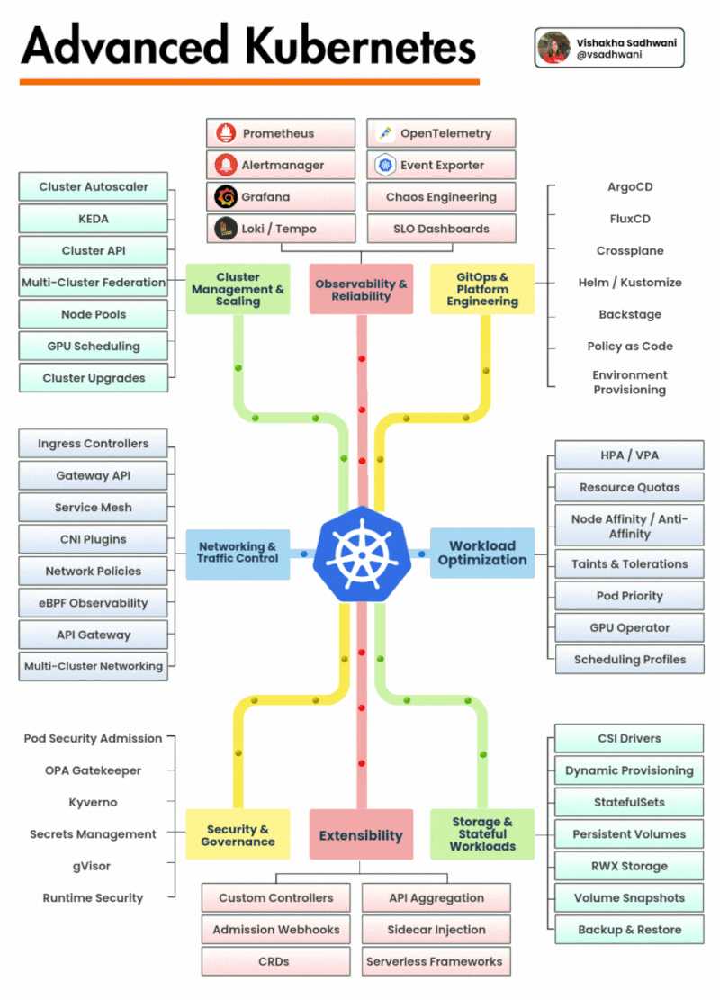

# Kubernetes Advance projects

**3-Tier Application Project**
[Deploying a Three-Tier Application with CI/CD using Jenkins, ReactJS, NodeJS, and MongoDB on Kubernetes](https://arjunmenon.hashnode.dev/deploying-a-three-tier-application-with-cicd-using-jenkins-reactjs-nodejs-and-mongodb-on-kubernetes)

[tTWSThreeTierAppChallenget](https://github.com/LondheShubham153/TWSThreeTierAppChallenge)

**Platform Thinking**

[Step by Step Application Deployment on LKE using Helm](https://www.youtube.com/watch?v=JGtJj_nAA2s)

[Kubernetes RBAC Explained](https://www.youtube.com/watch?v=iE9Qb8dHqWI)

**End-to-End Project**
[tThree-Tier Web Application Deployment on AWS EKS using AWS EKS,ArgoCD, Prometheus, Grafana, and Jenkinst](https://blog.stackademic.com/advanced-end-to-end-devsecops-kubernetes-three-tier-project-using-aws-eks-argocd-prometheus-fbbfdb956d1a)

