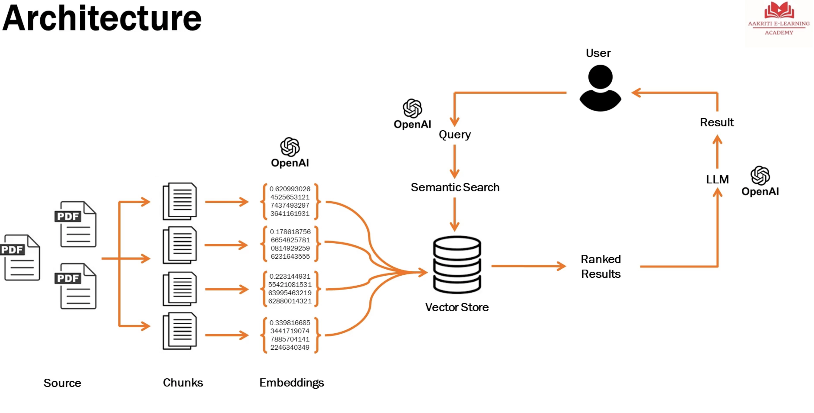

There are 3 components for the architecture...

- access the LLM in the aws bedrock service if the AWS(i.e integrate LLM bedrock). make sure your `.aws/config` is been configured with access creds and regions 

- In oder to store the conversation you need to buffer the pervious conversation i.e `Langchain - conversationalBufferMempry`

- `LangChain-ConversationChain` will be used to store `prompt store` + `Lanfchain-conversationchain` + `langchain - conversationbuffermemory`

