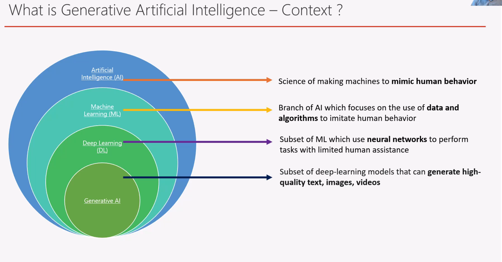

## Gen AI context

## AI Overvierw 

Making intelligient machines especially computer programs that simulate human intelligience and decision making.
e.g: self drivinf cars, recomendation engines from netwfils or ammazon

## ML Overvierw

Algorithm is trained using historical data to make predictions on the new data.

### supervisor learning

algorithms(classic/regression) are trained to use labelled data. i.e raw data you annotate which will be provided to algorithm.

### unsupervisoed learning

algorithms(Clustering/Association) are trained to use unlabelled data. i.e raw data you annotate which will be provided to algorithm.

### reinforcements

train algorith on trail and error approach. 

## Deep learning and Artifical neural networks

Artifical neural networks - mimic the structure of human brain

Deep leanring - subset of ML, that focus on **building artifical neural networks** that can learn from data. 

## Generative AI

model in GenAI **fundational model** which is `[ data + trained alogorithm ]` which generates text, images, videos from trained data.
e.g ChatGPT/GPT

traditional machine learning models have disadvantage which is over come by **fondational models**

key characteristic of **foundational models** and its uses. 

### Working

What are tokens, parameters and temperature ?

### use-cases

### categorization

## AWS AI services

### EC2 Compute AI service

AWS Tranium and Inferentia - Train and deploy models using EC2 machines.

### SageMaker AI

Pre-generative traditional AI/ML service to help you **build, train and deploy** machine learning models. 
you are now using Amazon bedrock service instead of this traditional mode, but this model can be used for analytics. 

### bedrock 

### Q business

### Q developer

