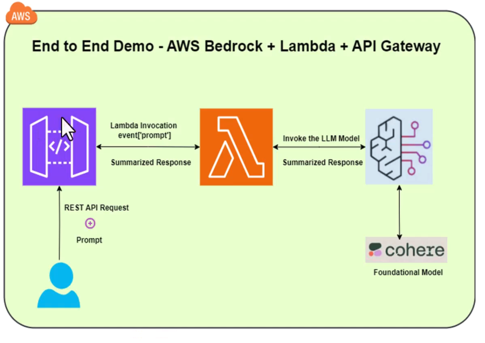

## AWS Demo Services




```python
import json, boto3

def lambda_handler(event, context):
    client = boto3.client("bedrock-runtime")
    prompt = event.get("prompt", "Explain VPC peering simply.")

    body = {
        "messages": [
            {"role": "user", "content": [{"text": prompt}]}
        ],
        "inferenceConfig": {
            "maxTokens": 256,
            "temperature": 0.7,
            "topP": 0.9
        }
    }

    resp = client.invoke_model(
        modelId="amazon.nova-lite-v1:0",
        contentType="application/json",
        accept="application/json",
        body=json.dumps(body),
    )

    data = json.loads(resp["body"].read())
    # Nova chat response:
    text = (data.get("output", {})
                .get("message", {})
                .get("content", [{}])[0]
                .get("text", ""))

    return {"statusCode": 200, "body": json.dumps({"response": text})}
```

## API Gateway

- Create a resource with method as GET. 
    - **Method request** - Validate query string parameters and headers
    - **URL query string parameters** - prompt set to True
    - **Integration request settings** -> integrate with lambda
        - Mapping templates -  ```{"prompt":"$input.params('prompt')"}```

- Deploy - always create a stage called "Dev" and re-deploy couple of times to work properly.

    - **Test method** - Query strings -> prompt=image of a cat