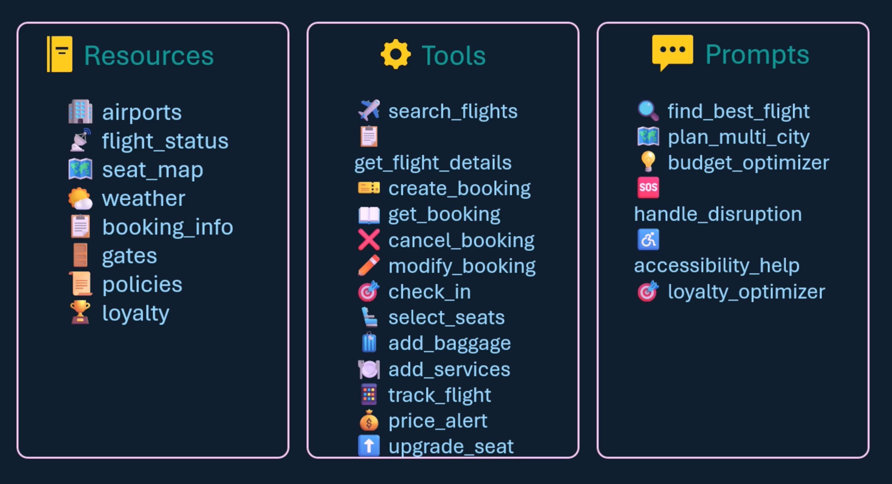

## Model Context Protocol(MCP)

**Model Context Protocol (MCP)**, a standard that enables **AI agents** to move beyond simple text generation and perform real-world actions. While traditional **large language models** are limited to providing information, agents use **MCP** to securely interact with third-party **APIs**, such as booking flights or managing databases. The documentation details how this protocol acts as a universal translator, allowing diverse applications to communicate without custom manual coding for every integration. 

The Model Context Protocol (MCP) enables AI agents to perform complex actions by serving as a standardised guide that helps them navigate and interact with diverse third-party platforms. While Large Language Models (LLMs) can natively generate text or images, they cannot take real-world actions on their own. **MCP bridges this gap by providing agents with the necessary context to make the correct API calls to external services**.

The protocol facilitates complex tasks through several key mechanisms:

• Standardising API Interactions: Different services, such as various airlines, often use unique API formats, URL paths, and data structures. Instead of requiring developers to write custom "adapter code" for every single service, MCP provides a universal standard that informs the agent about a service's specific capabilities, as well as its required input and output formats.

• A Client-Server Architecture: MCP operates on a client-server model where the AI agent acts as a client that communicates with various MCP servers. These servers act as intermediaries for specific applications—such as MongoDB, Google BigQuery, or flight systems—allowing the agent to retrieve information and make data modifications without interacting with the raw API directly.

• Capability Discovery: Through MCP, an agent can "discover" what a tool is capable of doing. For example, an MCP server for an airline might tell an agent it has "search flights" and "book flights" functions, specifying exactly what passenger details are required to complete a booking.

• Enabling Multi-Step Workflows: Unlike a simple chatbot that provides a single response, an agent using MCP can perform a sequence of multiple calls. It can interact with a database, scan a codebase, check a terminal, and review transaction history across different sources until a complex task—like troubleshooting a software bug or booking a complete trip—is finished.

• Agent-to-Agent Collaboration: For extremely complex scenarios, MCP and the agent-to-agent model allow specialised agents to communicate. A "flight agent" can discover the capabilities of a "hotel agent," tasking it with finding accommodation while sharing relevant context and results back and forth to complete a multi-faceted request.

In essence, if an AI agent is like a traveller, the Model Context Protocol is its universal translator and guidebook, providing the exact instructions needed to interact with the unique "laws" and "languages" of every different service it visits.

## MCP Components

M - Model (AI LLM)
C - Context (Giving AI context )
P - Prtocol ( Define set of standards)

https://modelcontextprotocol.io/docs/getting-started/intro

## MCP Architecture

The architecture of an MCP server is designed around a client-server model where the server acts as a standardised intermediary between an AI agent (the client) and external data or services. Instead of an agent interacting with a third-party API directly, it communicates with the MCP server, which provides the necessary context and interface for the agent to function

 Core Functional Components

 - Tools: These are specific executable functions that allow the agent to take actions, such as "search flights" or "book flights". The server defines the exact input structure (e.g., passenger name, email) and output structure the agent should expect (function calls and returns data i.e decorators kind of)

 - Resources: These provide the agent with data or files it can read and use as context, such as database records or local file structures 
 (just a function call)

 - Prompts: These are predefined templates or instructions that guide the LLM on how to interact with the server's specific data or tools effectively

## Build MCP Server

You just need **SDK** to build an MCP server. 

## MCP Inspector

In order to test the MCP set, you use inspector

## MCP client

- Roots - folders to see the MCP servers can see..

- Sampling - server to interact with LLM, so it won't directly connect with LLM instead ask client to check with LLM

- Elicitiation - sometims server wants information from user, so it would ask the MCP client to check with user for more information