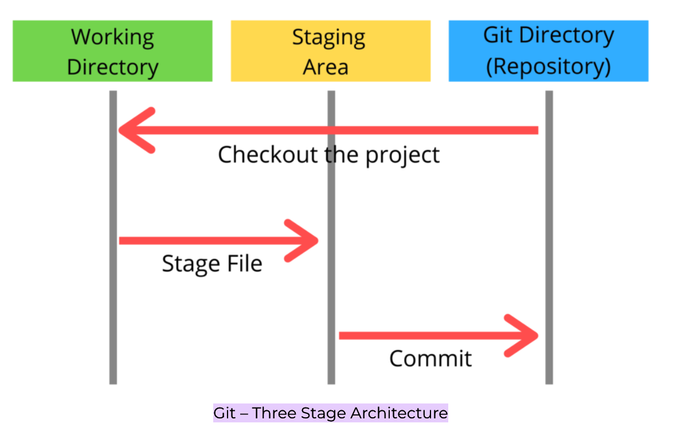

## Overview

## Git Arch



**Working directory** - current files that are stored, it's also called as **untracked files**
**Staging area - files that you wish to commit(to create snapshot of the files).
**Git directory** - after commit is fired, files which are in staging area will move to git repository.
    
## Checkout
you would use the commit id and move your **HEAD** to that particular commit and then you would **branch** from there. 

```
git commit <commit_id>
git checkout -b <new_branch>```

Incase you don't need to branch out, this method is not suitable

second way,

```
git log --oneline
git checkout <commit-id> -- filename.txt
git status
git log --oneline
git commit -m 'new commit id'
```

## branching 

**fast-forward:** 

Developers create a feature branch, work on it, and when it's ready to be integrated into the main development branch, they perform a fast-forward merge if the conditions are met. This keeps the commit history clean and straightforward.

Default merging startergy would be `ff`

```
git branch -b feature/feature1
git checkout main
git merge feature/feature1
```

## git reset

reset cannot be used when working with a remote repository. 

you would undo the commit using git commit id. there are three modes, **soft**, **mixed** and **hard**. all are the same, but they differ in how they treat changes in the working directory and the staging area. 

**soft** - won't effect working directory or staging area. e.g if just a commit needs to be changed. 
```git reset --soft commitid```

**mixed** - revert changes in staging area. **DEFAULT** 
```git reset --mixed commitid```


**hard** - revert changes in the working directory along with the staging area and repository. e.g if commit is complete failure, and you want to undo the changes involved in the commit as well.

```git reset --hard commitid```

- what happens when you do "hard reset" in git
- whats the difference between fast-forward merge with commit and without commit
- Explain difference between git fetch and git pull
- what is rebase and explain
- Explain about the branchinig startergy
- How do you resolve conflicts in branches


## Git Oneliners

```
git reset HEAD -- path/to/file -> rm file from staged repo

git commit --amend -m 'created new files' --no-edit -> modify recent commit

git reset --hard HEAD~1  -> revert previous commit
```

## References
https://www.bogotobogo.com/cplusplus/Git/Git_GitHub_Express.php

https://www.codementor.io/@alexershov/11-painful-git-interview-questions-and-answers-you-will-cry-on-lybbrqhvs`
