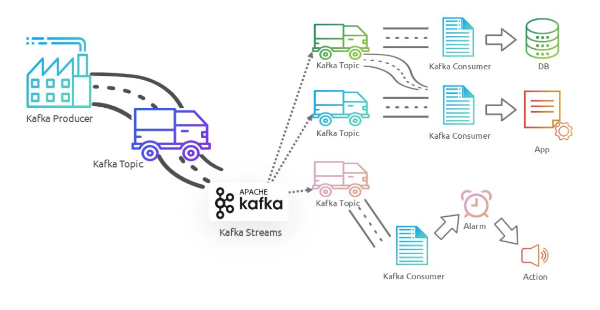

## Components

**Producers**: producers are applications that send records to kafka topics. they are responsible for choosing which partition within the topic the record has to be sent 

**Consumer:**: applications that read from kafka topics. they subscribe to topics and process message in real time

**Broker**: server that runs kafka. they receive messages from producers, store then in disk, serve them to consumers. they have multiple brokers to ensure load balancing and fault tolerance. 

**Topic**: logical channel to which producers send records and from which consumers read. they are partitoned for scalability and parallelism

**Partition:**: each topic divided into partitions which are ordered, immutable and sequence of records. partitions allow kafka to scale horizontally and maintain the order of records withtin each partition. 

**Zookeeper:** kafka uses this for distributed coridination, config mgmt, and leader election for kafka brokers and topics. 

## Kafka role 

**Real-Time Data Ingestion:** Kafka is widely used for ingesting real-time data from various sources such as logs, sensors, and user interactions. It provides a scalable and fault-tolerant way to collect and store large volumes of data.

**Stream Processing:** Kafka integrates seamlessly with stream processing frameworks like Apache Flink, Apache Spark, and Kafka Streams. This allows organizations to process and analyze data in real time, enabling use cases like fraud detection, recommendation engines, and monitoring.

**Data Integration:** Kafka acts as a central hub for data integration, enabling the movement of data between different systems and applications. It supports connectors for various data sources and sinks, making it easy to build data pipelines.

**Event Sourcing:** Kafka is used for event sourcing, where state changes in an application are logged as a sequence of events. This approach provides a reliable and auditable way to track changes over time.

**Message Queue:** Kafka can function as a distributed message queue, enabling asynchronous communication between different parts of an application. It supports decoupling of producers and consumers, which enhances the scalability and resilience of applications.

**Log Aggregation:** Kafka is commonly used for log aggregation, where logs from multiple services are collected, centralized, and processed. This helps in monitoring, troubleshooting, and gaining insights from log data.

**Metrics Collection and Monitoring:** Kafka can be used to collect and aggregate metrics from various systems, enabling real-time monitoring and alerting. This helps in maintaining the health and performance of applications and infrastructure.

## Use Cases

**Real-Time Analytics:** Companies use Kafka to analyze data in real time, providing insights and enabling proactive decision-making.

**Event-Driven Architectures:** Kafka enables event-driven architectures where different services communicate through events, enhancing scalability and decoupling. 

**Microservices:** Kafka facilitates communication between microservices, allowing them to exchange messages asynchronously and reliably.

**Log Aggregation and Monitoring:** Kafka is widely used for collecting and aggregating logs from various services, enabling centralized monitoring and alerting.

**Data Integration:** Kafka serves as a backbone for data integration, moving data between different systems and ensuring consistency and reliability.

## Kafka USP

### High Throughput and Low Latency

Kafka is designed to handle high-throughput, real-time data streams with minimal latency. It achieves this through efficient disk storage mechanisms and high-performance networking capabilities. Kafka’s architecture allows it to process millions of messages per second, making it suitable for applications requiring high throughput.

### Scalability

**Horizontal Scalability:** Kafka’s distributed nature allows it to scale horizontally by adding more brokers to a cluster. Each topic in Kafka is partitioned, and these partitions can be spread across multiple brokers. This architecture ensures that Kafka can handle increasing loads without degradation in performance.

**Elasticity:** Kafka’s partition-based architecture allows for dynamic scaling. As the load increases, more partitions and brokers can be added without downtime, providing elastic scalability.

### Durability and Fault Tolerance

**Replication:** Kafka replicates data across multiple brokers, ensuring data durability and availability. This replication mechanism guarantees that even if one or more brokers fail, the data remains accessible.

**Log-Based Storage:** Kafka’s use of log-based storage ensures that data is persisted on disk in an append-only fashion. This approach minimizes data corruption and allows for efficient data recovery.

### Flexibility and Versatility

**Multiple Use Cases:** Kafka is versatile and supports various use cases, including real-time analytics, event sourcing, log aggregation, metrics collection, and stream processing. Its ability to handle a wide range of scenarios makes it a preferred choice for many organizations.

**Integration with Ecosystem:** Kafka integrates seamlessly with a wide array of tools and frameworks, such as Kafka Connect for data integration, Kafka Streams for stream processing, and external processing frameworks like Apache Flink and Apache Spark. This extensibility makes it a central component of many data architectures.

### Message Ordering and Guarantee
Message Ordering: Kafka ensures strict ordering of messages within a partition, which is crucial for applications where the order of events is important.

Delivery Semantics: Kafka supports various delivery semantics, including at-most-once, at-least-once, and exactly-once delivery. This flexibility allows developers to choose the appropriate level of guarantee based on their application requirements.

### High Availability

Leader-Follower Architecture: Kafka’s leader-follower model ensures high availability. Each partition has one leader and multiple followers. If the leader fails, one of the followers automatically takes over, ensuring continuous availability without manual intervention.

### Cost Efficiency

Efficient Resource Utilization: Kafka’s design allows for efficient use of resources, both in terms of storage and compute. Its log-structured storage mechanism minimizes disk I/O, and its distributed nature ensures load balancing across the cluster.

Open Source: As an open-source project, Kafka eliminates licensing costs associated with proprietary messaging systems, making it a cost-effective solution for many organizations.

### Active Community and Support
Vibrant Community: Kafka has a large and active open-source community. This community continuously contributes to the platform, ensuring it evolves with new features, performance improvements, and bug fixes.

Commercial Support: Organizations like Confluent offer commercial support and additional features, making Kafka a viable choice for enterprises that require professional support and enhanced capabilities.

### Stream Processing Capabilities
Kafka Streams: Kafka provides a native stream processing library called Kafka Streams, which allows for building real-time processing applications directly within the Kafka ecosystem. This integration simplifies the development and deployment of stream processing applications.

KSQL: Kafka also offers KSQL, a SQL-like language for stream processing. KSQL enables users to perform stream processing tasks using SQL queries, making it accessible to users who are more familiar with SQL than with traditional programming languages.

