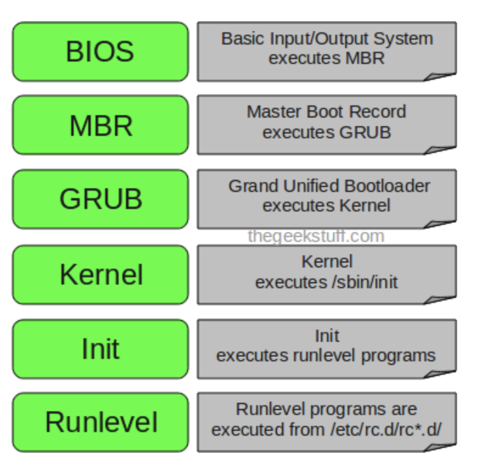
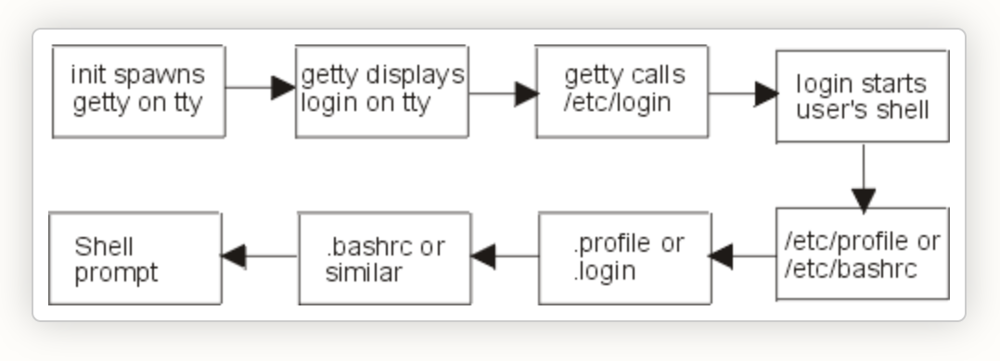

## linux boot process



**BIOS**

upon booting the system, it would perform system integrity checks and searches, loads and executes the body loader program (e.g CDROM, Floppy, Network..etc). Once the boot loader is detached and loaded into the memory, BIOS gives control to it, BIOS would then load the MBR boot loader.

**MBR**

located in the first sector of the bootlabel disk(/dev/hda or /dev/sda) which is 512MB, i.e 446Bytes of primary boot loader info, partition table of 64 bytes and last 2 bytes of validation checks, which contains info about the GRUB or LILO. MBR loads and executes GRUB boot loader.

**GRUB**

It has the complete knowledge of the system information and would load the file in **/etc/grub/grub.conf** which loads the kernel images and initrd images.

**kernel**

Mounts the root file system specified in the grub and executes /sbin/init program which is the first process in the linux system and loads all the necessary drivers compilied inside which helps to access the hard drive and other hardware devices.

**init**

looks **/etc/inittab** file to decide the runlevel and loads all the appropriate programs from it.

**runlevel**

depending on your runlevel from the **/etc/inittab** all the services from the **/etc/rc3.d/<runlevel>**
which start from 'S' will be executed which has all the services coming up.

## login process



once the init process completes the run-level and finally it would be executing **/etc/rc.local**. it will start process called *getty*(get terminal) which initiates the login command and opens termial device, initializes it and prints **login:** and waits for user to to enter username.

once user enters his name it starts **/etc/login** and prompts for the password which is hidden. it would next checks the credentials by verifying with **/etc/passwd** and **/etc/shadow** password matches then it initiates user properties gathering and starts users shell. If password doesn’t match then getty terminates login process and re-initiates again with new prompt.

In next stage the getty process reads the user properties (username, UID, GID, home directory, user shell etc.) from /etc/passwd file. After that it reads `/etc/motd` file for displaying content banner message.

shell related properties, user aliases and variables getty process reads appropriate system wide default files /etc/profile or /etc/bashrc . After the system wide default files are read the shell reads user specific login files `.profile` or `.login`

At last stage it reads shell specific configuration files (.bashrc, .bash_profile etc. for bash shell) of that user which it gets on the users home directory.

## job scheduler

**Cron**

Field    Description    Allowed Value
MIN      Minute field    0 to 59
HOUR     Hour field      0 to 23
DOM      Day of Month    1-31
MON      Month field     1-12
DOW      Day Of Week     0-6
CMD      Command         Any command to be executed.

```markdown
- schedule a cron to execute at 2 am daily
0 2 * * * /bin/sh backup.sh

- Schedule a cron to execute twice a day.
0 5,17 * * * /scripts/script.sh

- Schedule a cron to execute every Sunday at 5 PM
0 17 * * sun  /scripts/script.sh

- Schedule a cron to execute every 10 minutes
*/10 * * * * /scripts/monitor.sh

- Schedule a cron to execute on selected months.
\* \* \* jan,may,aug *  /script/script.sh

- Schedule a cron to execute on selected days
0 17 * * sun,fri  /script/script.sh

- Schedule a cron to execute on the first Sunday of every month.
0 2 * * sun  [ $(date +%d) -le 07 ] && /script/script.sh

- Schedule a cron to execute every four hours.
0 */4 * * * /scripts/script.sh

- Schedule a cron to execute twice every Sunday and Monday
0 4,17 * * sun,mon /scripts/script.sh

- Schedule tasks to execute yearly/monthly/weekly/daily/hourly
@yearly/@monthly/@weekly/@daily/@hourly /bin/script.sh
```

**at**

Jobs created with at command are executed only once.

Schedule a job for the coming Monday at a time twenty minutes later than the current time
`at Monday +20 minutes`

Schedule a job to run at 1:45 Aug 12 2020
`at 1:45 081220`

Schedule a job to run at 3pm four days from now
`at 3pm + 4 days`

Schedule a job to shutdown the system at 4:30 today
`echo "shutdown -h now" | at -m 4:30`

Schedule a job to run five hour from now
`at now +5 hours`

## login & non-login shells

**login**

When a user successfully logs in to a Linux system via terminal/SSH/switches to a user with the **su -** command, a login shell is created.

*echo $0* prints **hypen** then its a non-login shell

- login shell invokes `/etc/profile`
- `/etc/profile` invokes scripts in `/etc/profile.d/*.sh`, then executes users `~/.bash_profile`
- `~/.bash_profile` invokes users `~/.bashrc`
- `~/.bashrc` invokes `/etc/bashrc`

**non-login shell**

A non-login shell is started by a login shell. shell that you start from another shell or from a program is a non-login shell.

*echo $0* prints **no-hypen** then its a non-login shell

- Non login shell first executes ~/.bashrc
- Then ~/.bashrc executes /etc/bashrc
- /etc/bashrc calls the scripts in /etc/profile.d

## softlinks Vs hardlinks

- `hard link`can only be created for a file but cannot be created for directories, where as `soft link` can link to a directory.

- Removing the original file that hard link points to does not remove the hardlink itself, the hardlink still provides the content of the underlying file.

- If we remove the hard link or the symlink itself, the original file will stay intact.

## user addition process

When invoked, useradd creates a new user account according to the options specified on the command line and the
default values set in the **/etc/default/useradd**

useradd also reads the content of the **/etc/login.defs** file. This file contains configuration for the shadow password suite such as password expiration policy, ranges of user IDs used when creating system and regular users, and more..The command adds an entry to the **/etc/passwd**, **/etc/shadow**, **/etc/group** and **/etc/gshadow** files

password fields:
  - Login username 
  - Hash password 
  - Number of days since password has changed 01-01-1979
  - Mininum days for a user to change his password
  - Days available for password expiry
  - Password expiry warining
  - Empty. 

## umask

umask lets you create the default permission for the files and folders, user can choose to restrict
permissions by using a permission masks.

```
0    ---    No permission
1    --x    Execute
2    -w-    Write
3    -wx    Write and execute
4    r--    Read
5    r-x    Read and execute
6    rw-    Read and write
7    rwx    Read, write, and execute
```

system default permission values are 777 (rwxrwxrwx) for folders and 666 (rw-rw-rw-) for files

- The default mask for a non-root user is 002, changing the folder permissions to 775 (rwxrwxr-x), and file permissions to 664 (rw-rw-r--).
- The default mask for a root user us 022, changing the folder permissions to 755 (rwxr-xr-x), and file permissions to 644 (rw-r--r--).

## file special permissions

special permission bit are set on file or folder, thereby permitting only the owner or root user of the file or folder to modify, rename or delete the concerned directory or file. No other user would be permitted to have these privileges on a file which has a sticky bit.

### suid

we set SUID(set-user-ID) bit on the executable this behavior can be changed, then the file will always run with privileges of the owner of the file, no matter who runs the executable. instead of 'x' in the file permission you would be getting 's' in the user's permission

Octal String: 4

chmod: u+s

e.g **/usr/bin/passwd**, **/usr/bin/gpasswd**

### sgid

Set-group-ID bit on a file: Set-group-ID (SGID) is similar to SUID except that, an executable with SGID bit set runs with the privileges of the group which owns of the file

Octal String: 2

chmod : g+s

### sticky

This special permission is useful to prevent users from deleting other user’s file inside a shared folder where everyone has read, write, and execute access

Octal String: 1

chmod: 't'

## swap size

```
sudo swapoff -a
sudo dd if=/dev/zero of=/swapfile bs=1G count=8
sudo mkswap /swapfile
sudo swapon
```

## /etc/fstab fields

The block device
The mountpoint
The filesystem type
Mount options:
    rw (read-write);
    suid (respect setuid and setgid bits);
    dev (interpret characters and block devices on the filesystem);
    exec (allow executing binaries and scripts);
    auto (mount the filesystem when the -a option of the mount command is used);
    nouser(make the filesystem not mountable by a standard user);
    async (perform I/O operations on the filesystem asynchronously).

file system dump
Fsck order:
    default = 0
    root = 1
    non-root = 2

## password policy

**/etc/login.defs**  - all the password related informations can be found here.

```
PASS_MAX_DAYS    99999
PASS_MIN_DAYS    0
PASS_MIN_LEN    5
PASS_WARN_AGE    7
```

## cpu utilization calculation

Linux load averages are "system load averages" that show the running thread (task) demand on the system as an average number of running plus waiting threads. This measures demand, which can be greater than what the system is currently processing. Most tools show three averages, for 1, 5, and 15 minutes

The “load” is not the utilization but the total queue length.

When load averages first appeared in Linux, they reflected CPU demand, as with other operating systems. But later on Linux changed them to include not only runnable tasks, but also tasks in the uninterruptible state (TASK_UNINTERRUPTIBLE or nr_uninterruptible). This state is used by code paths that want to avoid interruptions by signals, which includes tasks blocked on disk I/O and some locks. You may have seen this state before: it shows up as the "D" state in the output ps and top. The ps(1) man page calls it "uninterruptible sleep (usually IO)".

Adding the uninterruptible state means that Linux load averages can increase due to a disk (or NFS) I/O workload, not just CPU demand


## use of nohup

Nohup (stands for no hangup) is a command that ignores the HUP signal. You might be wondering what the HUP signal is. It is basically a signal that is delivered to a process when its associated shell is terminated. Usually, when we log out, then all the running programs and processes are hangup or stopped. If we want to continue running the process even after logout or disconnection from the current shell, we can use the nohup command

`nohup command &`

- how do you set priority for the process ?
- Explain how DNS works in Linux ?
- What is NFS and how would you configure it ?
- what is autofs and how's it configured ?
- what are TCP wrappers ?
- Explain about the IPtables and its chains ?
- How will you find out the system activity ?
- How will you trace all the system calls ?


## search the largest or empty file

```
-exec CMD: The file being searched which meets the above criteria and returns 0 for as its exit status for successful command execution.
-ok CMD : It works same as -exec except the user is prompted first.
-inum N : Search for files with inode number ‘N’.
-links N : Search for files with ‘N’ links.
-name demo : Search for files that are specified by ‘demo’.
-newer file : Search for files that were modified/created after ‘file’.
-perm octal : Search for the file if permission is ‘octal’.
-print : Display the path name of the files found by using the rest of the criteria.
-empty : Search for empty files and directories.
-size +N/-N : Search for files of ‘N’ blocks; ‘N’ followed by ‘c’can be used to measure size in characters; ‘+N’ means size > ‘N’ blocks and ‘-N’ means size < ‘N’ blocks.
-user name : Search for files owned by user name or ID ‘name’.
\(expr \) : True if ‘expr’ is true; used for grouping criteria combined with OR or AND.
! expr : True if ‘expr’ is false.
```

examples:

- Search a file with pattern.  `find ./GFG -name *.txt`
- How to find and delete a file with confirmation. `find ./GFG -name sample.txt -exec rm -i {} \;`
- Search for empty files and directories `find ./GFG -empty`
- Search for file with entered permissions `find ./GFG -perm 664`
- Search text within multiple files `find ./ -type f -name "*.txt" -exec grep 'Geek'  {} \;`


## open files in linux

Graceful shutdown of relevant process would have not done for an On Linux or Unix systems, deleting a file via rm or through a file manager application will unlink the file from the file system's directory structure; however, if the file is still open (in use by a running process) it will still be accessible to this process and will continue to occupy space on disk. Therefore such processes may need to be restarted before that file's space will be cleared up on the filesystem.

```lsof | egrep "deleted|COMMAND"```

After a file has been identified, free the file used space by shutting down the affected process. If a graceful shutdown does not work, then issue the kill command to forcefully stop it by referencing the PID.

[link](https://access.redhat.com/solutions/2316)

## diff yum Vs rpm

Difference between RPM and YUM.

| parameter                     | RPM                                                                                                   | YUM                                                                                                                                         |
| ----------------------------- | ----------------------------------------------------------------------------------------------------- | ------------------------------------------------------------------------------------------------------------------------------------------- |
| Depencies resolvement         | no                                                                                                    | yes                                                                                                                                         |
| Multiple package instllations | no                                                                                                    | yes                                                                                                                                         |
| automatic upgrades            | no                                                                                                    | yes                                                                                                                                         |
| online repo support           | no                                                                                                    | yes                                                                                                                                         |
| Autonomy                      | RPM is autonomous and utilizes its own database to keep information about the packages on the system. | YUM is a front-end utility that uses the RPM package manager for package management. The utility also uses the RPM database in the backend. |
| Ease of use                   | RPM package management and handling gets complicated at times.                                        | It is the easiest way to manage RPM packages.                                                                                               |
| Rollback                      | RPM doesn't support change rollback.                                                                  | YUM allows any changes to be rolled back.                                                                                                   |

## configure local yum repo

/etc/yum.conf - Main config file for yum.

```
[main]
cachedir=/var/cache/yum/$basearch/$releasever
keepcache=0
debuglevel=2
logfile=/var/log/yum.log
exactarch=1
obsoletes=1
gpgcheck=1
plugins=1
installonly_limit=3

[comments abridged]

# PUT YOUR REPOS HERE OR IN separate files named file.repo
# in /etc/yum.repos.d
```

/etc/yum.repos.d/redhat.repo

```
[redhat]
name = Red Hat Enterprise Linux
baseurl = file:/// or http:///
enabled = 1
gpgcheck = 1
gpgkey = file:///etc/pki/rpm-gpg/RPM-GPG-KEY-redhat-release
sslverify = 1
sslcacert = /etc/rhsm/ca/redhat-uep.pem
sslclientkey = /etc/pki/entitlement/key.pem
sslclientcert = /etc/pki/entitlement/11300387955690106.pem
```

## Recover corrupted rpmdb

```
tar -zcvf /backups/rpmdb-$(date +"%d%m%Y").tar.gz  /var/lib/rpm
rm -f /var/lib/rpm/__db*
/usr/lib/rpm/rpmdb_verify /var/lib/rpm/Packages
```

In case the above operation fails, meaning you still encounter errors, then you should dump and load a new database

```
# cd /var/lib/rpm/
# mv Packages Packages.back
# /usr/lib/rpm/rpmdb_dump Packages.back | /usr/lib/rpm/rpmdb_load Packages
# rpm -qa
# rpm -vv --rebuilddb
# /usr/lib/rpm/rpmdb_verify Packages
```

## Webserver issues

- Application is suffering from the performance problem issues, how would you troubleshoot ?
- Need to create an FTP server to my localteam to help them setup yum server by creating a new ext3 volume ?
- user is unable to login to the system, what all could be the issues ?
- How do you set the user quota enabled in linux for user's homed irectory ?
- One of the NFS client is unable to access the share, how would you troubleshoot ?
- How would configure to authenticate nginx/httpd server ?
- Webserver is unable to access, explain the troubleshooting steps ?

# References

[linuxatemyram](https://www.linuxatemyram.com/)

[dns client issue troubleshooting](https://www.rootusers.com/how-to-troubleshoot-dns-client-issues-in-linux/)
