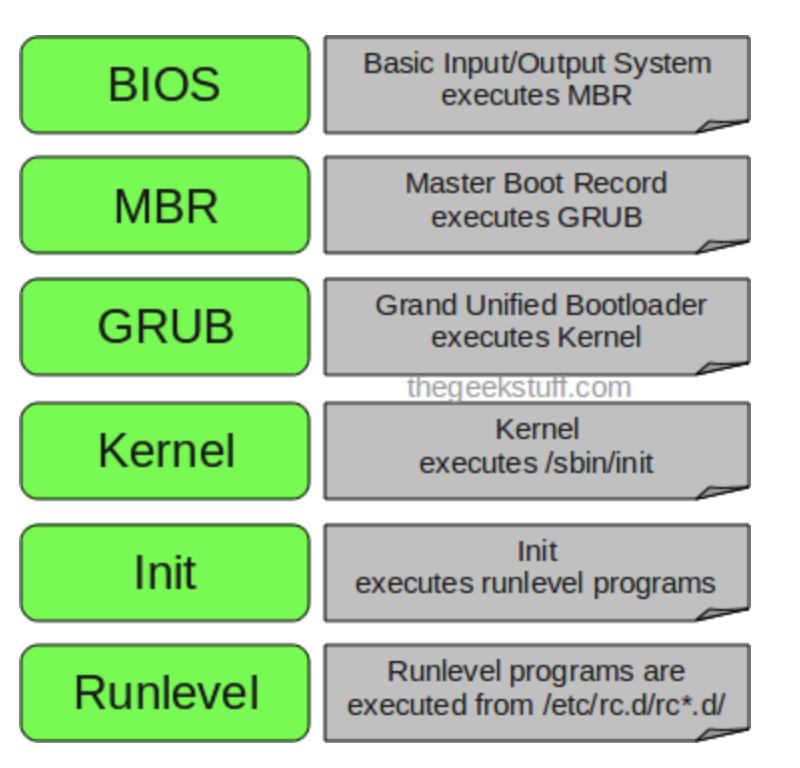
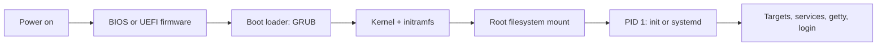
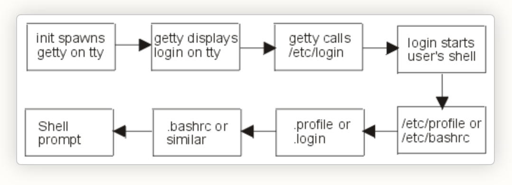
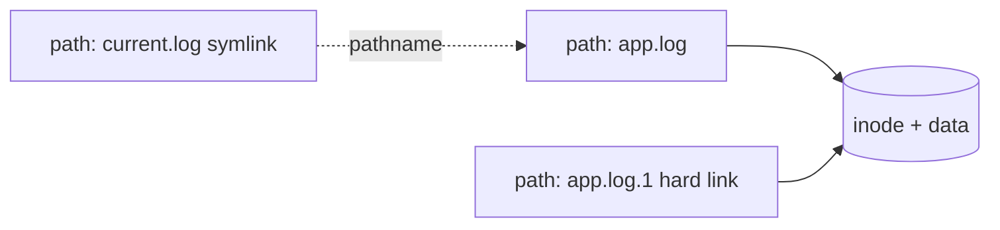
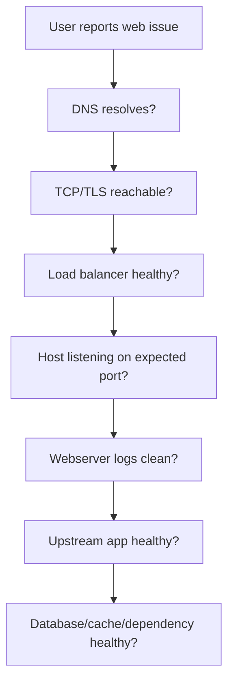

## TL;DR

Linux administration starts with understanding how a host boots, how users log in, how jobs run, how permissions are evaluated, and how packages and filesystems are maintained. For an SRE, these basics matter because many production incidents still reduce to a small set of host-level questions: Did the machine boot correctly, can the service account log in, did a scheduled job run, is a filesystem full, or did a package/database state become inconsistent? Strong Linux fundamentals make troubleshooting faster and reduce the risk of changing the wrong layer during an outage.

See also: [Linux networking](networking.md), [Linux storage](storage.md), [Linux security](security.md), and [Linux troubleshooting](troubleshooting.md).

## linux boot process



The Linux boot process is the sequence that takes a machine from powered-off hardware to a running operating system with services available. In modern systems this flow often uses UEFI and `systemd`, while older systems use BIOS, MBR, GRUB, and SysV init. The concepts are still useful because production hosts, cloud images, appliances, and legacy enterprise systems may use different boot implementations.

For an SRE, boot knowledge matters when an instance fails health checks after reboot, a kernel upgrade breaks networking, an initramfs cannot mount the root volume, or a node never rejoins a Kubernetes cluster. Boot failures are often easier to diagnose when you can identify which stage handed control to the next stage.


```mermaid
flowchart LR
    A[Power on] --> B[BIOS or UEFI firmware]
    B --> C[Boot loader: GRUB]
    C --> D[Kernel + initramfs]
    D --> E[Root filesystem mount]
    E --> F[PID 1: init or systemd]
    F --> G[Targets, services, getty, login]
```

### BIOS

BIOS runs when the system starts. It performs basic hardware checks, identifies bootable devices such as disk, CD-ROM, USB, or network boot targets, and loads the first-stage boot loader into memory. On older Linux systems, BIOS commonly loads code from the Master Boot Record (MBR) and then transfers control to that boot loader.

In newer systems, UEFI often replaces BIOS and reads boot entries from firmware-managed NVRAM. Even when the implementation differs, the operational question is the same: can the firmware find a valid boot target and hand off execution successfully?

### MBR

The MBR is located in the first sector of a bootable disk such as `/dev/sda`. It is 512 bytes in total: traditionally 446 bytes for boot loader code, 64 bytes for the partition table, and 2 bytes for the boot signature. The MBR does not contain the whole operating system; it contains just enough information to start the next boot loader stage, such as GRUB.

This matters during disk migration, bare-metal recovery, and image build work. If the MBR or partition table is damaged, the operating system may still be present on disk but unreachable during boot.

### GRUB

GRUB is the boot loader responsible for selecting and loading the Linux kernel and initial RAM disk image. Older GRUB configurations commonly used `/boot/grub/grub.conf`, while modern distributions often use `/boot/grub2/grub.cfg` or `/boot/efi/EFI/...` paths depending on BIOS versus UEFI boot. GRUB understands enough filesystem and kernel metadata to pass kernel parameters such as the root device, rescue mode, or console settings.

SREs encounter GRUB when rolling back a failed kernel update, booting into rescue mode, enabling serial console logs, or changing kernel parameters for debugging.

### kernel

The kernel initializes CPU, memory, process scheduling, device drivers, and core filesystem support. It mounts the root filesystem specified by the boot loader and starts the first user-space process, traditionally `/sbin/init`; on most modern distributions this is `systemd`. The first process runs as PID 1 and is responsible for supervising the rest of user space.

Kernel-level failures often show up as panic messages, missing drivers, storage mount failures, or networking devices that never become available. In cloud environments, serial console output is often the fastest way to see these early boot errors.

### init

The init process starts system services and brings the machine to the desired operating state. Older SysV init systems read `/etc/inittab` to decide the runlevel and then execute scripts from directories such as `/etc/rc3.d/`. Modern `systemd` systems use units and targets, such as `multi-user.target` and `graphical.target`, instead of classic runlevels.

For production administration, PID 1 is the service supervisor of last resort. If a service does not start after boot, check the relevant unit, target, dependency, and logs before assuming the application itself is broken.

### runlevel

A runlevel describes the operating mode of a SysV init system. For example, runlevel 3 traditionally means multi-user text mode, while runlevel 5 traditionally means multi-user graphical mode. Services in `/etc/rc3.d/` that start with `S` are start scripts, while entries that start with `K` are stop scripts.

On `systemd` hosts, runlevels are compatibility aliases for targets. This is important during interviews and real operations because older documentation may say "runlevel" while the host itself uses `systemctl get-default` and `systemctl isolate`.

## login process



The login process authenticates a user, initializes the session, and starts the user's shell. It touches several security-sensitive files and components, including `getty`, `login`, PAM, `/etc/passwd`, `/etc/shadow`, shell profiles, and message-of-the-day files. A login failure may be caused by credentials, account state, PAM policy, expired passwords, missing home directories, shell misconfiguration, or filesystem permissions.

```mermaid
flowchart TD
    A[getty opens terminal] --> B[login prompt]
    B --> C[User enters username]
    C --> D[Password or auth method]
    D --> E[PAM and account checks]
    E --> F[/etc/passwd and /etc/shadow]
    F --> G[Session setup]
    G --> H[Read profile files]
    H --> I[Start user shell]
```

After init or `systemd` reaches the appropriate target, a `getty` process may start on a terminal. `getty` opens the terminal device, initializes it, prints the `login:` prompt, and waits for the username. After the username is entered, the login program prompts for the password and validates credentials through the configured authentication stack.

On traditional local accounts, account metadata is read from `/etc/passwd`, while password hashes are stored in `/etc/shadow`. On enterprise systems, this step may involve PAM modules backed by LDAP, SSSD, Kerberos, Active Directory, MFA, or centralized access control. If authentication succeeds, the session gathers user properties such as username, UID, GID, home directory, and shell.

The session may display `/etc/motd` as a banner message. It then reads system-wide shell configuration files such as `/etc/profile` or `/etc/bashrc`, followed by user-specific files such as `~/.profile`, `~/.login`, `~/.bash_profile`, and `~/.bashrc` depending on the shell and session type.

For an SRE, this matters during "user cannot log in" incidents. The failure may not be SSH itself; it could be PAM, expired credentials, a locked account, a missing shell, a full filesystem, broken permissions on the home directory, or a profile script that exits unexpectedly.

## job scheduler

Scheduled jobs are a simple but important automation mechanism. They are commonly used for backups, cleanup, report generation, certificate renewal, log rotation, and lightweight maintenance tasks. In modern production systems, many scheduled workloads move to Kubernetes `CronJob`, CI/CD pipelines, or workflow engines, but host-level `cron` and `at` remain common on servers and appliances.

### Cron

Cron runs recurring jobs based on a five-field schedule. It is reliable and simple, but it has a minimal runtime environment, so scripts should use absolute paths, explicit environment variables, logging, and safe locking when needed. A cron job that works manually but fails in production often depends on environment state that cron does not provide.

| Field | Description | Allowed Value |
| --- | --- | --- |
| `MIN` | Minute field | `0` to `59` |
| `HOUR` | Hour field | `0` to `23` |
| `DOM` | Day of month | `1` to `31` |
| `MON` | Month field | `1` to `12` |
| `DOW` | Day of week | `0` to `6` or names such as `sun` |
| `CMD` | Command | Any command to be executed |

The following examples show common cron schedules.

```cron
# Run a backup script every day at 02:00.
0 2 * * * /bin/sh backup.sh

# Run a script twice a day, at 05:00 and 17:00.
0 5,17 * * * /scripts/script.sh

# Run a script every Sunday at 17:00.
0 17 * * sun /scripts/script.sh

# Run a monitor script every 10 minutes.
*/10 * * * * /scripts/monitor.sh

# Run a script only during January, May, and August.
* * * jan,may,aug * /script/script.sh

# Run a script on Sundays and Fridays at 17:00.
0 17 * * sun,fri /script/script.sh

# Run a script at 02:00 on the first Sunday of every month.
0 2 * * sun [ $(date +%d) -le 07 ] && /script/script.sh

# Run a script every four hours.
0 */4 * * * /scripts/script.sh

# Run a script twice every Sunday and Monday.
0 4,17 * * sun,mon /scripts/script.sh

# Run periodic tasks using cron aliases.
@yearly /bin/script.sh
@monthly /bin/script.sh
@weekly /bin/script.sh
@daily /bin/script.sh
@hourly /bin/script.sh
```

### at

Jobs created with `at` are executed only once. Use `at` for one-time operational actions, such as scheduling a reboot window, running a cleanup later, or testing delayed execution without creating a recurring cron entry. Because `at` jobs can be easy to forget, document them during incidents and review the queue with `atq`.

These commands schedule one-time jobs with `at`.

```bash
# Schedule a job for the coming Monday, twenty minutes later than the current time.
at Monday +20 minutes

# Schedule a job to run at 01:45 on August 12, 2020.
at 1:45 081220

# Schedule a job to run at 15:00 four days from now.
at 3pm + 4 days

# Schedule a system shutdown at 04:30 today and email the command output.
echo "shutdown -h now" | at -m 4:30

# Schedule a job to run five hours from now.
at now +5 hours
```

## login & non-login shells

Shell startup behavior matters because environment variables, aliases, paths, language runtimes, and credentials are often initialized in shell configuration files. A command may work in an interactive SSH session but fail in cron, systemd, CI, or a non-login shell because different files were sourced.

### login

When a user logs in via console, SSH, or `su -`, the system creates a login shell. In Bash, `echo $0` often prints a shell name prefixed with a hyphen, such as `-bash`, when the shell is a login shell. A login shell usually reads `/etc/profile`, then scripts in `/etc/profile.d/*.sh`, then a user file such as `~/.bash_profile`, which often sources `~/.bashrc`.

Typical Bash login shell order:

- `/etc/profile` initializes system-wide login settings.
- `/etc/profile` may invoke scripts in `/etc/profile.d/*.sh`.
- `~/.bash_profile`, `~/.bash_login`, or `~/.profile` initializes user-specific login settings.
- `~/.bash_profile` often invokes `~/.bashrc` so interactive aliases and functions are available.
- `~/.bashrc` may invoke `/etc/bashrc` or `/etc/bash.bashrc` depending on the distribution.

### non-login shell

A non-login shell is started from another shell or from a program, such as opening a new terminal tab, running `bash`, or starting a script. In Bash, `echo $0` usually prints `bash` without a leading hyphen for a non-login shell. Non-login interactive shells typically read `~/.bashrc`, which may then read distribution-specific system files such as `/etc/bashrc`.

Typical Bash non-login shell order:

- The non-login shell executes `~/.bashrc`.
- `~/.bashrc` may execute `/etc/bashrc` or `/etc/bash.bashrc`.
- `/etc/bashrc` may call scripts in `/etc/profile.d/`.

For SRE work, keep non-interactive scripts explicit. Set `PATH`, use absolute binary paths for critical commands, and avoid depending on aliases or shell startup files for production automation.

## softlinks Vs hardlinks

Links are filesystem references that let multiple paths point to content. Hard links point directly to the same inode, while symbolic links point to another pathname. Understanding the difference helps prevent surprises during log rotation, release symlink swaps, backup deduplication, and disk-space investigations.

- A `hard link` can be created for a regular file but generally cannot be created for directories. A `soft link`, also called a symbolic link or symlink, can point to either a file or a directory.
- Removing the original path that a hard link points to does not remove the underlying file content if another hard link still references the same inode. The data is freed only when the final hard link is removed and no process keeps the file open.
- If we remove the hard link or the symlink itself, the original file stays intact. A symlink can become broken if its target path no longer exists.


```mermaid
flowchart LR
    A[path: app.log] --> I[(inode + data)]
    B[path: app.log.1 hard link] --> I
    C[path: current.log symlink] -. pathname .-> A
```

## user addition process

When invoked, `useradd` creates a new user account according to command-line options and the default values in `/etc/default/useradd`. It also reads `/etc/login.defs`, which contains settings for the shadow password suite, password aging, UID/GID ranges, and related account policy. The command adds entries to files such as `/etc/passwd`, `/etc/shadow`, `/etc/group`, and `/etc/gshadow`.

On production systems, user creation should be policy-driven. Prefer identity providers, configuration management, or infrastructure automation where possible so that UID ranges, groups, shells, home directories, and sudo access remain consistent across hosts.

The `/etc/shadow` password fields include:

- Login username.
- Hashed password or account lock marker.
- Number of days since the password was changed, measured from January 1, 1970.
- Minimum number of days before the user can change the password again.
- Maximum number of days before password expiry.
- Number of warning days before password expiry.
- Number of inactive days after password expiry before the account is disabled.
- Account expiration date.
- Reserved field for future use.

## umask

`umask` controls the default permissions for newly created files and directories by subtracting permissions from the system defaults. The usual starting permissions are `777` for directories and `666` for files because files normally should not be executable by default. A restrictive umask reduces accidental exposure of secrets, logs, and application data.

This table maps octal permission values to symbolic permissions.

```text
# Permission values used when calculating file and directory modes.
0    ---    No permission
1    --x    Execute
2    -w-    Write
3    -wx    Write and execute
4    r--    Read
5    r-x    Read and execute
6    rw-    Read and write
7    rwx    Read, write, and execute
```

System default permission values are `777` (`rwxrwxrwx`) for directories and `666` (`rw-rw-rw-`) for files before applying the umask.

- The default mask for a non-root user is often `002`, changing directory permissions to `775` (`rwxrwxr-x`) and file permissions to `664` (`rw-rw-r--`). This works well when users collaborate through a shared primary group.
- The default mask for a root user is often `022`, changing directory permissions to `755` (`rwxr-xr-x`) and file permissions to `644` (`rw-r--r--`). This prevents group and world write access by default.

For SREs, umask matters in deployment scripts and service units. A service that writes private keys, tokens, logs, or artifacts with overly broad permissions can create a security incident even when the application code is correct.

## file special permissions

Special permission bits change how files and directories behave beyond ordinary read, write, and execute permissions. They are powerful because they can grant effective user or group privileges, or control deletion in shared directories. Use them intentionally and audit them regularly.

### suid

SUID, or set-user-ID, makes an executable run with the privileges of the file owner rather than the user who launched it. This is why tools such as `/usr/bin/passwd` can update password-related files even when started by an unprivileged user. In a file listing, SUID appears as `s` in the owner's execute position.

Octal string: `4`

chmod form: `u+s`

Examples: `/usr/bin/passwd`, `/usr/bin/gpasswd`

### sgid

SGID, or set-group-ID, makes an executable run with the privileges of the group that owns the file. On directories, SGID causes newly created files and subdirectories to inherit the parent directory's group, which is useful for shared team directories. In a file listing, SGID appears as `s` in the group's execute position.

Octal string: `2`

chmod form: `g+s`

### sticky

The sticky bit is commonly used on shared writable directories such as `/tmp`. It prevents users from deleting or renaming files owned by other users, even when the directory itself is world-writable. In a directory listing, the sticky bit appears as `t` in the others execute position.

Octal string: `1`

chmod form: `+t`

## swap size

Swap provides overflow memory and can help the kernel avoid killing processes immediately during transient memory pressure. It is not a substitute for adequate RAM, and heavy swap usage usually indicates memory pressure that should be investigated. On latency-sensitive production systems, excessive swapping can turn a partial degradation into a full incident.

The following commands create and enable an 8 GiB swap file.

```bash
# Disable active swap before changing swap configuration.
sudo swapoff -a

# Create an 8 GiB swap file filled with zeroes.
sudo dd if=/dev/zero of=/swapfile bs=1G count=8

# Format the file as swap space.
sudo mkswap /swapfile

# Enable swap devices listed in /etc/fstab, or use "sudo swapon /swapfile" for this file.
sudo swapon -a
```

Before enabling a swap file permanently, set secure permissions with `chmod 600 /swapfile` and add a correct `/etc/fstab` entry. On cloud hosts and Kubernetes nodes, validate your platform guidance because swap behavior can affect scheduling and node stability.

## /etc/fstab fields

`/etc/fstab` defines filesystems that should be mounted automatically or made available to the `mount` command. A bad entry can prevent a host from booting normally, so changes should be tested carefully with `mount -a` before rebooting. For production systems, use stable identifiers such as UUIDs rather than device names that may change across reboots.

The main `/etc/fstab` fields are:

- The block device, UUID, label, network share, or pseudo-filesystem.
- The mount point where the filesystem should be attached.
- The filesystem type, such as `ext4`, `xfs`, `nfs`, `tmpfs`, or `swap`.
- Mount options that control behavior.
- Filesystem dump flag.
- Fsck order.

Common mount options include:

- `rw`: mount read-write.
- `suid`: respect setuid and setgid bits.
- `dev`: interpret character and block devices on the filesystem.
- `exec`: allow executing binaries and scripts.
- `auto`: mount the filesystem when `mount -a` is used.
- `nouser`: prevent a standard user from mounting the filesystem.
- `async`: perform I/O operations asynchronously.

Fsck order:

- `0`: do not check automatically.
- `1`: check the root filesystem first.
- `2`: check non-root filesystems after the root filesystem.

## password policy

`/etc/login.defs` contains default account and password-aging settings for local Linux users. These settings are important on standalone systems, but enterprise authentication may also be controlled by PAM, LDAP, SSSD, Kerberos, or an identity provider. Always verify the actual authentication path before assuming `/etc/login.defs` is the only source of policy.

The following values show common password-aging settings.

```text
# Example password-aging defaults from /etc/login.defs.
PASS_MAX_DAYS    99999
PASS_MIN_DAYS    0
PASS_MIN_LEN     5
PASS_WARN_AGE    7
```

For SREs, password policy matters most on break-glass accounts, service accounts, bastion hosts, and systems outside centralized identity management. Overly strict expiration on service accounts can cause outages, while weak local account policy can create avoidable security exposure.

## cpu utilization calculation

Linux load averages are system load averages that show demand on the machine as an average number of runnable tasks plus tasks waiting in uninterruptible sleep. Most tools show three averages: 1, 5, and 15 minutes. Load is not the same as CPU utilization; it is closer to queue length.

When load averages first appeared in Linux, they primarily reflected CPU demand, as on many other operating systems. Linux later included tasks in the uninterruptible state, also known as `TASK_UNINTERRUPTIBLE` or the `D` state in tools such as `ps` and `top`. This means Linux load average can rise because of disk I/O, NFS stalls, kernel locks, or other blocked operations, not only because CPUs are busy.

As a rule of thumb, compare load average to CPU count, then validate with CPU, run queue, I/O wait, disk latency, and blocked task metrics. A load of `8` on an 8-core host may be normal under CPU-bound work, while a load of `8` on a mostly idle CPU can indicate I/O or kernel blocking.

## use of nohup

`nohup` stands for "no hangup." It runs a command while ignoring the `HUP` signal, which is commonly sent to child processes when the controlling shell exits. This is useful when you need a simple process to continue after logout or SSH disconnection.

The following command starts a process in the background and keeps it running after logout.

```bash
# Run a command in the background and ignore SIGHUP when the shell exits.
nohup command &
```

For production services, prefer a real supervisor such as `systemd`, Kubernetes, Supervisor, or a batch scheduler. `nohup` is useful for one-off administrative work, but it does not provide health checks, restarts, dependency ordering, logging policy, or clear ownership.

## search the largest or empty file

The `find` command searches directory trees based on metadata such as name, size, owner, permissions, link count, and modification time. It is one of the most useful tools during disk-full incidents, cleanup work, permission audits, and forensic triage. Pair it carefully with destructive actions because a broad search path can affect far more files than intended.

The following options are commonly used with `find`.

```text
# Common find predicates and actions for file searches.
-exec CMD     Run CMD for each matching file.
-ok CMD       Run CMD for each matching file after prompting the user.
-inum N       Search for files with inode number N.
-links N      Search for files with N hard links.
-name demo    Search for files named demo.
-newer file   Search for files modified or created after file.
-perm octal   Search for files matching the specified permission mode.
-print        Display the matching path names.
-empty        Search for empty files and directories.
-size +N/-N   Search for files larger or smaller than N blocks; use c for bytes.
-user name    Search for files owned by user name or ID.
\( expr \)    Group criteria combined with OR or AND.
! expr        Match when expr is false.
```

Examples:

- Search for files matching a pattern: `find ./GFG -name "*.txt"`
- Find and delete a file with confirmation: `find ./GFG -name sample.txt -exec rm -i {} \;`
- Search for empty files and directories: `find ./GFG -empty`
- Search for files with specific permissions: `find ./GFG -perm 664`
- Search text within multiple files: `find ./ -type f -name "*.txt" -exec grep 'Geek' {} \;`

For SRE operations, start with read-only searches and review results before deleting. During incidents, it is safer to move or truncate known log files than to run a broad delete command under pressure.

## open files in linux

On Linux and Unix systems, deleting a file with `rm` unlinks it from the directory structure. If a running process still has the file open, the process can continue writing to it and the disk space will not be freed until the file descriptor is closed. This is a common reason a filesystem stays full after large logs are deleted.

The following command lists processes that still have deleted files open.

```bash
# Show open file descriptors that reference deleted files.
lsof | egrep "deleted|COMMAND"
```

After a file has been identified, free the used space by gracefully restarting or stopping the affected process. If graceful shutdown does not work and the incident requires immediate action, use `kill` against the relevant PID with care. Prefer service-aware commands such as `systemctl restart service-name` so the supervisor state remains correct.

[link](https://access.redhat.com/solutions/2316)

## diff yum Vs rpm

RPM is the low-level package format and package database used by RPM-based distributions. YUM is a higher-level package manager that uses RPM underneath while adding repository management, dependency resolution, and easier operational workflows. On newer distributions, `dnf` replaces YUM while keeping similar concepts.

| parameter | RPM | YUM |
| --- | --- | --- |
| Dependencies resolution | No automatic dependency resolution | Resolves dependencies from configured repositories |
| Multiple package installations | Manual and cumbersome | Supported directly |
| Automatic upgrades | Not the usual workflow | Supported |
| Online repo support | No built-in repository workflow | Uses online or local repositories |
| Autonomy | RPM is autonomous and uses its own database to track installed packages. | YUM is a front-end utility that uses RPM and the RPM database in the backend. |
| Ease of use | RPM package management can become complicated during dependency-heavy installs. | YUM is easier for routine package installation, upgrades, and removals. |
| Rollback | RPM does not provide high-level transaction rollback. | YUM provides transaction history and can roll back some changes. |

For SREs, the practical rule is simple: use YUM or DNF for normal package operations, and use RPM for low-level inspection, local package installs, verification, and recovery work.

## configure local yum repo

A local YUM repository is useful when hosts cannot reach the internet, when you need deterministic package versions, or when you manage packages for an air-gapped environment. It can be served over `file://`, HTTP, HTTPS, or NFS. In production, repository ownership matters because a bad or untrusted repo can quickly affect an entire fleet.

`/etc/yum.conf` is the main configuration file for YUM.

```ini
# Example main YUM configuration showing cache, logging, plugin, and repo settings.
[main]
cachedir=/var/cache/yum/$basearch/$releasever
keepcache=0
debuglevel=2
logfile=/var/log/yum.log
exactarch=1
obsoletes=1
gpgcheck=1
plugins=1
installonly_limit=3

[comments abridged]

# PUT YOUR REPOS HERE OR IN separate files named file.repo
# in /etc/yum.repos.d
```

`/etc/yum.repos.d/redhat.repo` is an example repository definition.

```ini
# Example repository file using a local or HTTP base URL and GPG validation.
[redhat]
name = Red Hat Enterprise Linux
baseurl = file:/// or http:///
enabled = 1
gpgcheck = 1
gpgkey = file:///etc/pki/rpm-gpg/RPM-GPG-KEY-redhat-release
sslverify = 1
sslcacert = /etc/rhsm/ca/redhat-uep.pem
sslclientkey = /etc/pki/entitlement/key.pem
sslclientcert = /etc/pki/entitlement/11300387955690106.pem
```

## Recover corrupted rpmdb

The RPM database tracks installed packages and package metadata. If it becomes corrupted, package installation, removal, and verification commands may fail. This can happen after interrupted package operations, filesystem issues, disk-full events, or abrupt host termination.

Before repairing the RPM database, take a backup and remove stale database environment files.

```bash
# Back up the RPM database and remove stale Berkeley DB environment files.
tar -zcvf /backups/rpmdb-$(date +"%d%m%Y").tar.gz /var/lib/rpm
rm -f /var/lib/rpm/__db*
/usr/lib/rpm/rpmdb_verify /var/lib/rpm/Packages
```

If verification still fails, dump and load a new database, then rebuild and verify it.

```bash
# Rebuild a corrupted RPM database by dumping, loading, rebuilding, and verifying it.
cd /var/lib/rpm/
mv Packages Packages.back
/usr/lib/rpm/rpmdb_dump Packages.back | /usr/lib/rpm/rpmdb_load Packages
rpm -qa
rpm -vv --rebuilddb
/usr/lib/rpm/rpmdb_verify Packages
```

During a production incident, capture command output and avoid running package changes until the database is healthy. If the host is immutable or part of an autoscaled group, replacing the instance may be safer than repairing it manually.

## Webserver issues

Webserver troubleshooting requires moving from symptoms to layers: client, DNS, network, load balancer, host firewall, webserver process, upstream application, filesystem, and dependencies. A structured path prevents wasted time and helps identify whether the issue is availability, latency, authentication, capacity, or configuration.

Common investigation prompts:

- If an application is suffering from performance problems, first define the symptom: high latency, low throughput, saturation, errors, or timeouts. Check metrics, logs, recent deployments, dependency health, and resource saturation before tuning blindly.
- If you need to create an FTP server for a local team to support a YUM repository on a new `ext3` volume, validate whether FTP is acceptable for your security policy. In most modern environments, HTTPS, object storage, or an internal artifact repository is safer and easier to audit.
- If a user is unable to log in to the system, check account status, password expiry, SSH keys, PAM, shell path, home directory permissions, disk space, and relevant logs such as `/var/log/secure` or `/var/log/auth.log`.
- If you need to enable user quota for a Linux home directory, confirm filesystem support, mount options, quota database files, and whether enforcement should be per user, group, or project.
- If an NFS client cannot access a share, check DNS, routing, firewall rules, export policy, NFS version, mount options, UID/GID mapping, and server-side logs.
- If you need to configure authentication for `nginx` or `httpd`, decide whether basic auth, client certificates, OAuth/OIDC proxying, LDAP, or upstream application authentication is appropriate.
- If a webserver is unreachable, test from outside in: DNS resolution, TCP connectivity, TLS negotiation, load balancer target health, host firewall, listening sockets, webserver config, access logs, error logs, and upstream service health.


```mermaid
flowchart TD
    A[User reports web issue] --> B[DNS resolves?]
    B --> C[TCP/TLS reachable?]
    C --> D[Load balancer healthy?]
    D --> E[Host listening on expected port?]
    E --> F[Webserver logs clean?]
    F --> G[Upstream app healthy?]
    G --> H[Database/cache/dependency healthy?]
```

## Common Pitfalls

- Treating Linux load average as CPU utilization. Load includes runnable and uninterruptible tasks, so validate with CPU, disk, and blocked-task metrics.
- Editing `/etc/fstab` and rebooting before testing with `mount -a`. A malformed entry can leave a host in emergency mode.
- Assuming cron has the same environment as an interactive shell. Cron jobs should use explicit paths, environment variables, logging, and lock files.
- Deleting large files without checking for open file descriptors. Disk space may remain consumed until the owning process restarts.
- Using `nohup` as a long-term service manager. Production workloads need supervision, restart policy, logs, and ownership.
- Granting SUID or SGID broadly. Special permissions expand privilege and should be audited.

## Interview Questions

- Explain the Linux boot process from firmware to user login.
- What is the difference between BIOS/MBR boot and modern UEFI boot?
- What is PID 1, and why is it important?
- How do login and non-login shells differ?
- Why might a cron job fail even though the command works manually?
- What is the difference between a hard link and a symbolic link?
- How does `umask` affect new file and directory permissions?
- What are SUID, SGID, and sticky bit permissions?
- Why can a filesystem remain full after a large file is deleted?
- What is the difference between RPM and YUM/DNF?
- How do you set priority for a process?
- Explain how DNS works in Linux.
- What is NFS, and how would you configure it?
- What is `autofs`, and how is it configured?
- What are TCP wrappers?
- Explain `iptables` and its chains.
- How would you find system activity during an incident?
- How would you trace all system calls made by a process?

## Key Takeaways

Linux administration is layered: firmware starts the boot loader, the boot loader starts the kernel, the kernel starts PID 1, and PID 1 starts services and login paths. Most operational issues become easier when you can name the layer that is failing.

For SRE work, focus on repeatable diagnosis: verify logs, metrics, process state, filesystem state, package state, and authentication policy before making changes. Small host-level details such as shell startup files, umask, open deleted files, and broken package databases can have large production impact.

See also: [Linux networking](networking.md), [Linux storage](storage.md), [Linux security](security.md), and [Linux troubleshooting](troubleshooting.md).

# References

[linuxatemyram](https://www.linuxatemyram.com/)

[dns client issue troubleshooting](https://www.rootusers.com/how-to-troubleshoot-dns-client-issues-in-linux/)
