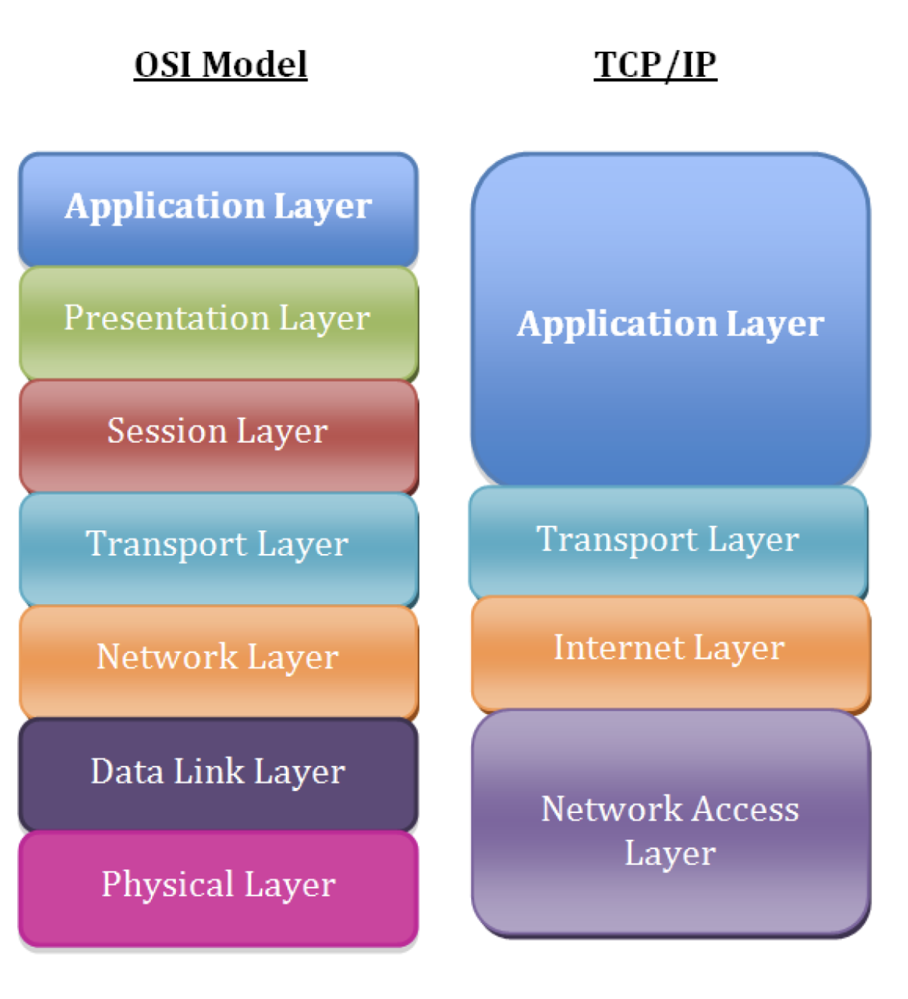

## OSI/TCP IP

TCP/IP model more accurately represents the suite of protocols that are deployed in modern networks.



The layers in the TCP/IP network model, in order, include:

Layer 5: Application <br>
Layer 4: Transport <br>
Layer 3: Network/Internet<br>
Layer 2: Data Link<br>
Layer 1: Physical<br>

### Layer 1: The physical layer

Identify the cable has been plugged in, but we can easily troubleshoot physical layer problems from the Linux command line.

```
ip link show
```
Any indication of DOWN in the above output for the eth0 interface. This result means that Layer 1 isn’t coming up.

We might try troubleshooting by bringing up the interface(eth0) just to rule out that network interface disabled can be ruled out. 

```
ip link set eth0 up
ip link show
ip -br link show # prints output in more readable format
ip -s link show eth0 # prints additional statistics about interface
``` 

**ethtool** utility is an excellent option. A particularly good use case for this command is checking to see if an interface has negotiated the correct speed. 

### Layer 2: The data link layer

The data link layer is responsible for local network connectivity. The most relevant Layer 2 protocol for most sysadmins is the Address Resolution Protocol (ARP), which maps Layer 3 IP addresses to Layer 2 Ethernet MAC addresses. When a host tries to contact another host on its local network (such as the default gateway), it likely has the other host’s IP address, but it doesn’t know the other host’s MAC address. ARP solves this issue and figures out the MAC address for us. 

If your localhost can’t successfully resolve its gateway’s Layer 2 MAC address, then it won’t be able to send any traffic to remote networks. This problem might be caused by having the wrong IP address configured for the gateway, or it may be another issue, such as a misconfigured switch port.

 ```
 ip neighbor show
 ```

Linux caches the ARP entry for a period of time, so you may not be able to send traffic to your default gateway until the ARP entry for your gateway times out.

```
 # ip neighbor show
192.168.122.170 dev eth0 lladdr 52:54:00:04:2c:5d REACHABLE
192.168.122.1 dev eth0 lladdr 52:54:00:11:23:84 REACHABLE
# ip neighbor delete 192.168.122.170 dev eth0
# ip neighbor show
192.168.122.1 dev eth0 lladdr 52:54:00:11:23:84 REACHABLE
```

### Layer 3: The network/internet layer

Layer 3 involves working with IP addresses. IP addressing provides hosts with a way to reach other hosts that are outside of their local network

```
ip -br address show
```

check the interfaces and see it has ipaddress associated with the interface.  The lack of an IP address can be caused by a local misconfiguration, such as an incorrect network interface config file, or it can be caused by problems with DHCP.

Layer 3 is the **ping** utility. Ping sends an ICMP Echo Request packet to a remote host, and it expects an ICMP Echo Reply in return. If you’re having connectivity issues to a remote host, ping is a common utility to begin your troubleshooting

Many might have blocked the ping hence you use **traceroute**. As with ICMP, intermediate routers may filter the packets that traceroute relies on, such as the ICMP Time-to-Live Exceeded message. But more importantly, the path that traffic takes to and from a destination is not necessarily symmetric, and it’s not always the same.

Another common issue that you’ll likely run into is a lack of an upstream gateway for a particular route or a lack of a default route. When an IP packet is sent to a different network, it must be sent to a gateway for further processing. The gateway should know how to route the packet to its final destination. The list of gateways for different routes is stored in a routing table.

```
ip route show
```

### Layer 4: The transport layer

The transport layer consists of the TCP and UDP protocols, with TCP being a connection-oriented protocol and UDP being connectionless. Applications listen on sockets, which consist of an IP address and a port. Traffic destined to an IP address on a specific port will be directed to the listening application by the kernel.

The first thing that you may want to do is see what ports are listening on the localhost

Another common issue occurs when a daemon or service won’t start because of something else listening on a port

```
ss -tunlp4
```

The telnet command attempts to establish a TCP connection with whatever host and port you give it. This feature is perfect for testing remote TCP connectivity

```
telnet database.example.com 3306
telnet nfs.example.com 2049
```

The **netcat** utility can be used for many other things, including testing TCP connectivity.Note that netcat may not be installed on your system, and it’s often considered a security risk to leave lying around. You may want to consider uninstalling it when you’re done troubleshooting

similarly, **nmap** which is capable of doing ..

- TCP and UDP port scanning remote machines.
- OS fingerprinting.
- Determining if remote ports are closed or simply filtered.


## How example.com works

- The client types www.example.com in his browser
- The operating system looks at /etc/host file,first for the ip address of www.example.com(this can be changed from /etc/nsswitch), then looks /etc/resolv.conf for the DNS server IP for that machine
- the dns server will search its database for the name www.example.com, if it finds it will give that back, if not it will query the root server(.) for the information.
- root server will return a referral to the .com TLD name server(these TLD name servers knows the address of name servers of all SLD's).In our case we searched for www.example.com so root server will give us referral to .com TLD servers.
- Now One of the TLD servers of .com will give us the referral to the DNS server resposible for example.com domain.
- The dns server for example.com domain will now give the client the ip address of www host(www is the host name.)

finally, type **dig +trace www.google.com**

## Linux DNS Client Troubleshooting

There are multiple potential points of failure during the DNS lookup process such as at the system performing the lookup, at the DNS cache, or on an external DNS server. 

**Local Server Configuration**

it’s important to understand the ‘hosts’ section of the /etc/nsswitch.conf file.
`
hosts: files dns myhostname
`

Essentially this means that host name resolution will be performed in the order specified, left to right. First files will be checked, followed by DNS. As files are first these will be checked first, this references the local /etc/hosts file which contains static host name to IP address mappings. This file takes priority over any DNS resolution, any changes to the file will be placed straight into the DNS cache of that local server.

If there is no entry in the hosts file DNS will be used next as per /etc/nsswitch.conf. The servers used for DNS resolution will be specified in the /etc/resolv.conf file

For DNS resolution to succeed the DNS server will need to accept TCP and UDP traffic over port 53 from our server. A port scanner such as the nmap tool can be used to confirm if the DNS server is available on port 53
```
nmap -sU -p 53 <dns server>
tcpdump -n host <dns server>
dig google.com
```

## Website DOWN

### Server is running?
```
ping 1.2.3.4 
ssh 1.2.3.4
```

### remote port opened ?
```
telnet 1.2.3.4 80
nmap -p 80 1.2.3.4
nc -vz 1.2.3.4 80
```

nmap states:
- Open: target machine is listening for connections/packets on that port 
- Filtered: A filtered nmap cannot determine whether the port is open because packet filtering prevents its probes from reaching the port.
- Closed: ports have no application listening on them, though they could open up at any time.
- unfiltered: Ports are classified as unfiltered when they are responsive to Nmap's probes, but Nmap cannot determine whether they are open or closed

### Test for Listening Ports

```
netstat -lnp | grep 80
```

Here the 0.0.0.0:80 tells us that the host is listening on all of its IPs for port 80 traffic.

### Command line response test

curl has an advantage over raw telnet for web server troubleshooting in that it takes care of the HTTP protocol for us and makes things like testing authentication, posting data, using SSL


```
curl http://1.2.3.4
```

## DNS troubleshooting

Utility tools

| Tool               | Purpose                         | When to Use             |
| ------------------ | ------------------------------- | ----------------------- |
| `dig`              | Detailed DNS query tool         | Primary debugging       |
| `nslookup`         | Simple DNS lookup               | Quick checks            |
| `host`             | Lightweight DNS lookup          | Fast validation         |
| `ping`             | Check resolution + reachability | Basic connectivity      |
| `getent hosts`     | OS-level resolver check         | Check NSS resolution    |
| `resolvectl`       | systemd-resolved debugging      | Modern Ubuntu           |
| `tcpdump`          | Packet-level DNS tracing        | Deep analysis           |
| `ss` / `netstat`   | Check DNS port usage            | DNS service issues      |
| `systemctl status` | Check DNS services              | Local resolver problems |
| `journalctl`       | DNS service logs                | Service debugging       |


| Tool       | What to Check               |
| ---------- | --------------------------- |
| ping       | Name resolution success     |
| host       | CNAME or A record           |
| nslookup   | DNS server used             |
| dig        | Status, TTL, answer section |
| dig @dns   | Compare DNS servers         |
| dig +trace | Resolution chain            |
| dig -x     | Reverse DNS                 |
| resolvectl | Local resolver              |
| tcpdump    | Packet flow                 |
| dig +tcp   | UDP blocking                |
| dig AAAA   | IPv6 issues                 |


### Application cannot reach mail.google.com


1. ping -> Basic Resolution Test -> did it resolve and any packet loss

```
➜  ~ ping -c2 mail.google.com
PING mail.google.com (142.250.77.37): 56 data bytes
64 bytes from 142.250.77.37: icmp_seq=0 ttl=119 time=18.928 ms
64 bytes from 142.250.77.37: icmp_seq=1 ttl=119 time=21.889 ms

--- mail.google.com ping statistics ---
2 packets transmitted, 2 packets received, 0.0% packet loss
round-trip min/avg/max/stddev = 18.928/20.409/21.889/1.481 ms
➜  ~
```

**Issues:**

If it says Temporary failure in name resolution → DNS issue. 
If IP resolves but no reply → network issue(firewall blocking), not DNS

2. host - Quick DNS Lookup

```
  ~ host mail.google.com
mail.google.com has address 142.250.77.37
mail.google.com has IPv6 address 2404:6800:4009:81c::2005
➜  ~
```

**Issues:**

If alias exists → follow CNAME chain.
If no address → DNS misconfiguration.

3. nslookup - Simple Resolver Query

Which DNS server responded?
What IP did it return?
Is it authoritative?

```nslookup mail.google.com
Server:		192.168.1.1
Address:	192.168.1.1#53

Non-authoritative answer:
Name:	mail.google.com
Address: 142.250.77.37

➜  ~
```

If wrong DNS server → resolver issue.

4. dig - primary DNS debug tool

```
~ dig mail.google.com

; <<>> DiG 9.10.6 <<>> mail.google.com
;; global options: +cmd
;; Got answer:
;; ->>HEADER<<- opcode: QUERY, status: NOERROR, id: 37108
;; flags: qr rd ra; QUERY: 1, ANSWER: 1, AUTHORITY: 0, ADDITIONAL: 1

;; OPT PSEUDOSECTION:
; EDNS: version: 0, flags:; udp: 4096
;; QUESTION SECTION:
;mail.google.com.		IN	A

;; ANSWER SECTION:
mail.google.com.	18	IN	A	142.250.77.37

;; Query time: 8 msec
;; SERVER: 192.168.1.1#53(192.168.1.1)
;; WHEN: Thu Feb 12 12:57:49 IST 2026
;; MSG SIZE  rcvd: 60

➜  ~
```

HEADER -> status: NOERROR

ANSWER SECTION -> 
Record type -> A
TTL value -> 18 seconds
correct ip returned -> 142.250.77.37

Query time -> 8 msec

if more than 200ms then DNS latency issue

SERVER -> confirms which DNS server responded(192.168.1.1)

5. query specific DNS server

```
➜  ~ dig @8.8.8.8 mail.google.com

; <<>> DiG 9.10.6 <<>> @8.8.8.8 mail.google.com
; (1 server found)
;; global options: +cmd
;; Got answer:
;; ->>HEADER<<- opcode: QUERY, status: NOERROR, id: 30080
;; flags: qr rd ra; QUERY: 1, ANSWER: 1, AUTHORITY: 0, ADDITIONAL: 1

;; OPT PSEUDOSECTION:
; EDNS: version: 0, flags:; udp: 512
;; QUESTION SECTION:
;mail.google.com.		IN	A

;; ANSWER SECTION:
mail.google.com.	81	IN	A	142.251.220.69

;; Query time: 25 msec
;; SERVER: 8.8.8.8#53(8.8.8.8)
;; WHEN: Thu Feb 12 13:04:30 IST 2026
;; MSG SIZE  rcvd: 60

```

```
➜  ~ dig @1.1.1.1 mail.google.com

; <<>> DiG 9.10.6 <<>> @1.1.1.1 mail.google.com
; (1 server found)
;; global options: +cmd
;; Got answer:
;; ->>HEADER<<- opcode: QUERY, status: NOERROR, id: 11108
;; flags: qr rd ra; QUERY: 1, ANSWER: 1, AUTHORITY: 0, ADDITIONAL: 1

;; OPT PSEUDOSECTION:
; EDNS: version: 0, flags:; udp: 1232
;; QUESTION SECTION:
;mail.google.com.		IN	A

;; ANSWER SECTION:
mail.google.com.	245	IN	A	142.251.222.165

;; Query time: 16 msec
;; SERVER: 1.1.1.1#53(1.1.1.1)
;; WHEN: Thu Feb 12 13:04:49 IST 2026
;; MSG SIZE  rcvd: 60

```

If public works but internal fails → internal DNS issue.

6. trace full resolution path

- Root servers response
- TLD (.com)
- Authoritative nameserver
- Final record

```
~ dig +trace mail.google.com

; <<>> DiG 9.10.6 <<>> +trace mail.google.com
;; global options: +cmd
.			499971	IN	NS	m.root-servers.net.
.			499971	IN	NS	h.root-servers.net.
.			499971	IN	NS	d.root-servers.net.
.			499971	IN	NS	j.root-servers.net.
.			499971	IN	NS	a.root-servers.net.
.			499971	IN	NS	b.root-servers.net.
.			499971	IN	NS	f.root-servers.net.
.			499971	IN	NS	c.root-servers.net.
.			499971	IN	NS	e.root-servers.net.
.			499971	IN	NS	g.root-servers.net.
.			499971	IN	NS	k.root-servers.net.
.			499971	IN	NS	l.root-servers.net.
.			499971	IN	NS	i.root-servers.net.
.			499971	IN	RRSIG	NS 8 0 518400 20260224220000 20260211210000 21831 . jHotSqe/L+74ckVYvjjBAKrwjrovZbppJ4aFruufW6TdLrqGbx3MPRDx tvFWlbhK8gMEG8MI0jTyc+m/ZxTCkmLbTUIO7ZFL093fEGBGdvHSo1Xe UTb0E1R1QAGkw2+S5qqkaQuq/RMAU+LuTNxwWkXI33fEQqXQb1mkjmjo 4c2KfkDVnbJl6rpHKGJQ6zVjXvTkooQ/wUSGwmOVCKZx6i6FRUuLXrvR JNEEDx0vqxAckaDL7zUlLRMiz46MKsUGC/d1A5zwg7sqA/31QjPpPJfg ReRYz7AFG55jiiAyjXgxZ8k2hXwvbcNurc7od5uyUugTbMjuVuue+jJJ N7bf9g==
;; Received 525 bytes from 192.168.1.1#53(192.168.1.1) in 8 ms

com.			172800	IN	NS	h.gtld-servers.net.
com.			172800	IN	NS	m.gtld-servers.net.
com.			172800	IN	NS	i.gtld-servers.net.
com.			172800	IN	NS	b.gtld-servers.net.
com.			172800	IN	NS	g.gtld-servers.net.
com.			172800	IN	NS	c.gtld-servers.net.
com.			172800	IN	NS	d.gtld-servers.net.
com.			172800	IN	NS	e.gtld-servers.net.
com.			172800	IN	NS	a.gtld-servers.net.
com.			172800	IN	NS	f.gtld-servers.net.
com.			172800	IN	NS	j.gtld-servers.net.
com.			172800	IN	NS	k.gtld-servers.net.
com.			172800	IN	NS	l.gtld-servers.net.
com.			86400	IN	DS	19718 13 2 8ACBB0CD28F41250A80A491389424D341522D946B0DA0C0291F2D3D7 71D7805A
com.			86400	IN	RRSIG	DS 8 1 86400 20260225050000 20260212040000 21831 . X/cQ1bCPaNoI5BWEG6MtuEwl1QsPr/oLjhFRuY/2lbRNzM7xl4CPdE8c R58+jbslIfnaqLgkhZ701BVzXibnMEkBMohiG5DkxiR+lh8XkeFCmZA+ cXqv3sMOur0kGu4hRWYVvbfeBfGH/FHtgA+9UGTYO/PN9lEt6YMNBbJ4 z+HhaMZJQp789bB7eoj09pX7vEKYDHLHh++zfKC96zwY7o+PPIwnKMLq jGxMaZQ5+7Am3GSTRPQkTjX/Pba91x0l0WtyIMbspcjpQVx6h7nxl/BM 9IyGldqlMhf3+vH+jVV32q+WkyVSdNE6EQjwfoCCozDRrw3G55cpi2nU zy53jQ==
;; Received 1178 bytes from 192.112.36.4#53(g.root-servers.net) in 120 ms

google.com.		172800	IN	NS	ns2.google.com.
google.com.		172800	IN	NS	ns1.google.com.
google.com.		172800	IN	NS	ns3.google.com.
google.com.		172800	IN	NS	ns4.google.com.
CK0POJMG874LJREF7EFN8430QVIT8BSM.com. 900 IN NSEC3 1 1 0 - CK0Q3UDG8CEKKAE7RUKPGCT1DVSSH8LL  NS SOA RRSIG DNSKEY NSEC3PARAM
CK0POJMG874LJREF7EFN8430QVIT8BSM.com. 900 IN RRSIG NSEC3 13 2 900 20260219002710 20260211231710 35511 com. Mvv0e2CAo+51hb57tq/ZXEzWjXkEfM8X3D6ADwGLSILhSJWvfQX1mLrG HfALHK8iWVGiXEQONeHDUytDqXVMIA==
S84BOR4DK28HNHPLC218O483VOOOD5D8.com. 900 IN NSEC3 1 1 0 - S84BR9CIB2A20L3ETR1M2415ENPP99L8  NS DS RRSIG
S84BOR4DK28HNHPLC218O483VOOOD5D8.com. 900 IN RRSIG NSEC3 13 2 900 20260216013314 20260209002314 35511 com. 458nY1ZPTiQMjwm578DuB+xnSPZBWY2vcyKJXEBgRZ8Aj0NHLrv6Vncp 7O5nLIWLxDEvc3ma9Acjso+RedbqTg==
;; Received 649 bytes from 192.42.93.30#53(g.gtld-servers.net) in 154 ms

mail.google.com.	300	IN	A	142.250.70.37
;; Received 60 bytes from 216.239.32.10#53(ns1.google.com) in 82 ms

```

If it fails at:
Root → network issue
TLD → domain misconfigured
Authoritative → zone issue

7. reverse lookup

PTR record exists?
Reverse DNS configured?

```
dig -x 142.250.77.37

; <<>> DiG 9.10.6 <<>> -x 142.250.77.37
;; global options: +cmd
;; Got answer:
;; ->>HEADER<<- opcode: QUERY, status: NOERROR, id: 56031
;; flags: qr rd ra; QUERY: 1, ANSWER: 1, AUTHORITY: 0, ADDITIONAL: 1

;; OPT PSEUDOSECTION:
; EDNS: version: 0, flags:; udp: 4096
;; QUESTION SECTION:
;37.77.250.142.in-addr.arpa.	IN	PTR

;; ANSWER SECTION:
37.77.250.142.in-addr.arpa. 68939 IN	PTR	bom07s26-in-f5.1e100.net.

;; Query time: 10 msec
;; SERVER: 192.168.1.1#53(192.168.1.1)
;; WHEN: Thu Feb 12 13:12:06 IST 2026
;; MSG SIZE  rcvd: 93
➜  ~
```

8. check OS resolver

```
cat /etc/resolv.conf`
```

Nameserver IP
Search domain
Multiple nameservers?

9. systemd-resolved Debug

Ubuntu

```resolvectl status```

Current DNS server
DNSSEC status
Domain routing

Flush cache if ip is pointing to wrong DNS servers

```sudo resolvectl flush-caches```

10. packaet capture

Is DNS query leaving?
Is response coming back?

```
sudo tcpdump -i eth0 port 53
```

Request sent but no reply → firewall or upstream DNS down
No request → local resolver issue

11. Check DNS over TCP 

Some firewalls block UDP 53:

```
dig +tcp main.google.com
```
if TCP works but UDP doesn’t → firewall blocking UDP.

What is difference between A and CNAME?

An A record maps a hostname directly to an IPv4 address, while a CNAME maps a hostname to another hostname. CNAME adds an extra resolution step and is typically used for aliasing services like CDNs or load balancers. However, a hostname cannot have both A and CNAME records simultaneously.