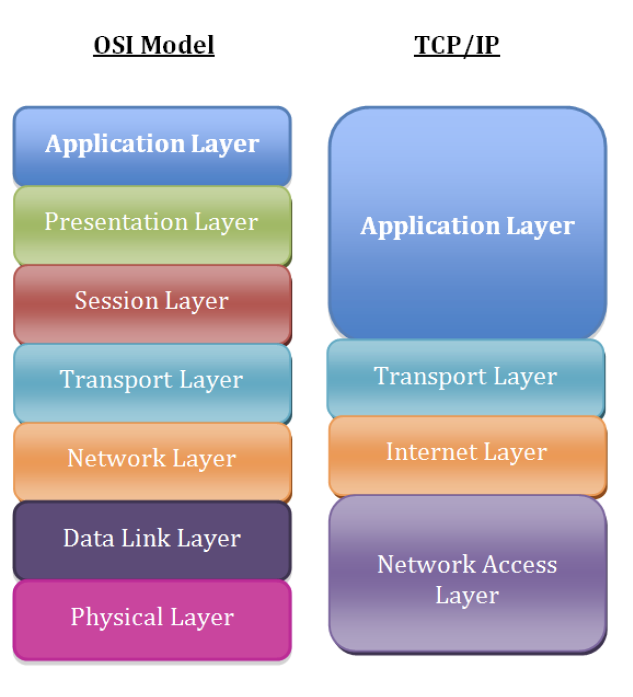
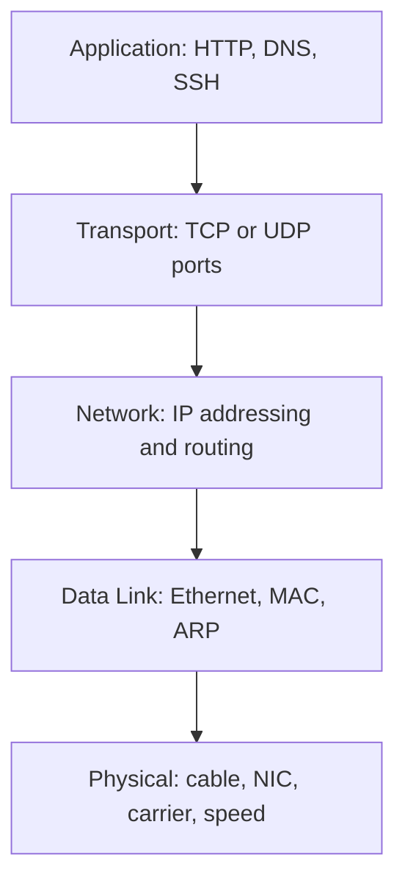
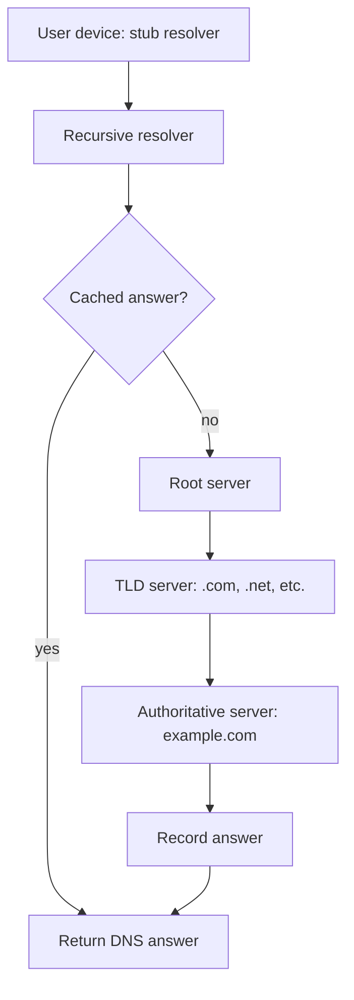
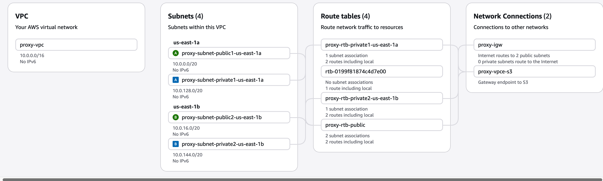

## TL;DR

Linux networking troubleshooting is easiest when you move layer by layer: physical link, local Ethernet/ARP, IP addressing and routes, transport ports, DNS, and finally application behavior. For an SRE, this matters because "the website is down" can mean many different things: DNS failure, route loss, firewall filtering, TLS failure, proxy misconfiguration, an overloaded service, or an application dependency problem. A disciplined network checklist prevents guesswork during incidents.

See also: [Linux basics](basics.md), [Linux security](security.md), [Linux troubleshooting](troubleshooting.md), and [Linux storage](storage.md).

## OSI/TCP IP

The TCP/IP model more accurately represents the suite of protocols deployed in modern networks. The OSI model is still useful as a troubleshooting mental model because it encourages you to test one layer at a time instead of jumping directly to the application. In production, most network incidents are resolved faster when you can say exactly which layer is healthy and which layer is failing.



The layers in the TCP/IP network model, in order, include:

Layer 5: Application <br>
Layer 4: Transport <br>
Layer 3: Network/Internet<br>
Layer 2: Data Link<br>
Layer 1: Physical<br>


```mermaid
flowchart TD
    A[Application: HTTP, DNS, SSH] --> B[Transport: TCP or UDP ports]
    B --> C[Network: IP addressing and routing]
    C --> D[Data Link: Ethernet, MAC, ARP]
    D --> E[Physical: cable, NIC, carrier, speed]
```

### Layer 1: The physical layer

Layer 1 confirms whether the physical or virtual network interface has carrier and can transmit frames. On bare metal this may involve cables, switch ports, optics, duplex, or NIC state. On cloud instances and virtual machines, the equivalent checks are whether the virtual NIC exists, is attached, and is administratively up.

Use this command to inspect link state for all interfaces.

```bash
# Show administrative and carrier state for all interfaces.
ip link show
```

Any `DOWN` indication for an interface such as `eth0` means the interface is not currently usable. It may be administratively disabled, missing carrier, blocked by virtualization configuration, or affected by driver issues.

Use these commands to bring an interface up and inspect concise and detailed link output.

```bash
# Bring eth0 up and inspect link state plus interface counters.
ip link set eth0 up
ip link show
ip -br link show
ip -s link show eth0
```

The `ethtool` utility is also useful at this layer. A particularly good use case is checking whether an interface negotiated the expected speed and duplex. For an SRE, a silent mismatch here can look like random packet loss, high retransmits, or poor throughput at higher layers.

### Layer 2: The data link layer

The data link layer is responsible for local network connectivity. The most relevant Layer 2 protocol for most Linux administrators is the Address Resolution Protocol (ARP), which maps Layer 3 IP addresses to Layer 2 Ethernet MAC addresses. When a host contacts another host on its local network, such as the default gateway, it usually knows the IP address but not the MAC address. ARP discovers that MAC address so Ethernet frames can be delivered locally.

If your localhost can’t successfully resolve its gateway’s Layer 2 MAC address, then it won’t be able to send any traffic to remote networks. This problem might be caused by having the wrong IP address configured for the gateway, or it may be another issue, such as a misconfigured switch port.

Use this command to view the ARP/neighbor table.

```bash
# Show the ARP/neighbor table for local network peers.
ip neighbor show
```

Linux caches the ARP entry for a period of time, so you may not be able to send traffic to your default gateway until the ARP entry for your gateway times out.

Use these commands to inspect and delete a stale neighbor entry.

```bash
# Show current neighbor entries.
ip neighbor show
192.168.122.170 dev eth0 lladdr 52:54:00:04:2c:5d REACHABLE
192.168.122.1 dev eth0 lladdr 52:54:00:11:23:84 REACHABLE

# Delete a stale neighbor entry for a specific host on eth0.
# ip neighbor delete 192.168.122.170 dev eth0

# Confirm the stale entry is removed.
ip neighbor show
192.168.122.1 dev eth0 lladdr 52:54:00:11:23:84 REACHABLE
```

### Layer 3: The network/internet layer

Layer 3 involves IP addresses, subnets, gateways, and routing. IP addressing provides hosts with a way to reach other hosts outside the local network. When this layer fails, symptoms often include "no route to host," traffic leaving the wrong interface, asymmetric routing, or a host that can reach local systems but not remote systems.

Use this command to show IP addresses in a concise format.

```bash
# Show configured IP addresses for all interfaces.
ip -br address show
```

Check whether each expected interface has the correct IP address. The lack of an IP address can be caused by local misconfiguration, an incorrect network interface configuration file, DHCP failure, cloud-init/network-manager issues, or an interface attached to the wrong network.

The classic Layer 3 test is the `ping` utility. Ping sends an ICMP Echo Request packet to a remote host and expects an ICMP Echo Reply in return. If you are troubleshooting remote connectivity, ping is a useful first test, but it is not definitive because many systems and firewalls intentionally block ICMP.

If ping is blocked, use `traceroute` or `tracepath` to inspect the path. Intermediate routers may also filter the packets that traceroute relies on, such as ICMP Time Exceeded responses. More importantly, network paths are not always symmetric, so the return path from the destination may differ from the forward path you observe.

Another common issue that you’ll likely run into is a lack of an upstream gateway for a particular route or a lack of a default route. When an IP packet is sent to a different network, it must be sent to a gateway for further processing. The gateway should know how to route the packet to its final destination. The list of gateways for different routes is stored in a routing table.

Use this command to inspect the routing table.

```bash
# Show the kernel routing table, including the default route.
ip route show
```

### Layer 4: The transport layer

The transport layer consists mainly of TCP and UDP. TCP is connection-oriented and provides reliable ordered delivery, while UDP is connectionless and leaves reliability to the application. Applications listen on sockets, which are combinations of IP address, protocol, and port.

The first thing to check is which ports are listening locally. This quickly answers whether the service process is actually bound to the expected IP address and port.

Another common issue occurs when a daemon or service cannot start because another process is already listening on the same port. This is common after failed restarts, duplicate service managers, or local test processes.

Use this command to show listening TCP/UDP sockets and owning processes for IPv4.

```bash
# Show listening TCP and UDP sockets with process information for IPv4.
ss -tunlp4
```

The `telnet` command attempts to establish a TCP connection to a host and port. It is useful as a quick connectivity test, although `nc` or `curl` is usually clearer for modern troubleshooting.

Use these commands to test remote TCP connectivity to common service ports.

```bash
# Try TCP handshakes to database and NFS service ports.
telnet database.example.com 3306
telnet nfs.example.com 2049
```

The `netcat` utility can test TCP connectivity, open simple listeners, and send raw payloads. It may not be installed by default, and some organizations consider it risky on production hosts because it can be abused as a generic network tool. Use it intentionally and remove it if your host-hardening policy requires that.

Similarly, `nmap` can help determine whether remote ports are open, closed, or filtered. Be careful with it in corporate and cloud environments because scanning can trigger security alerts.

- TCP and UDP port scanning remote machines.
- OS fingerprinting.
- Determining if remote ports are closed or simply filtered.


## How example.com works

This flow explains what happens when a user types `www.example.com` into a browser. It combines local name resolution, recursive DNS, authoritative DNS, TCP/TLS connection setup, and HTTP. During incidents, knowing this sequence helps you isolate whether the failure is client-side, DNS-side, network-side, or application-side.

- The client types `www.example.com` in the browser.
- The operating system checks `/etc/hosts` first for a static IP address mapping, depending on the order configured in `/etc/nsswitch.conf`.
- If no local hosts entry exists, the resolver checks `/etc/resolv.conf` or the local resolver manager to determine which DNS server to query.
- The DNS server searches its cache and local data. If it does not have the answer, a recursive resolver queries the root server (`.`) for a referral.
- The root server returns a referral to the `.com` TLD name servers. These TLD name servers know which authoritative name servers are responsible for domains under `.com`.
- One of the `.com` TLD servers returns a referral to the authoritative DNS server responsible for `example.com`.
- The authoritative DNS server for `example.com` returns the IP address for the `www` host record.

Use `dig +trace` to see the delegated DNS path.

```bash
# Trace DNS delegation from root to authoritative servers.
dig +trace www.google.com
```

## Linux DNS Client Troubleshooting

There are multiple potential points of failure during the DNS lookup process such as at the system performing the lookup, at the DNS cache, or on an external DNS server. 

### Local Server Configuration

It is important to understand the `hosts` section of `/etc/nsswitch.conf`.

```text
# Example NSS host lookup order: local files first, then DNS, then system hostname.
hosts: files dns myhostname
```

This means hostname resolution is performed from left to right. Local files are checked first, which references `/etc/hosts` and any static hostname-to-IP mappings in that file. Because `files` comes before `dns`, a stale `/etc/hosts` entry can override correct DNS records and create confusing application behavior.

If there is no entry in the hosts file, DNS is used next according to `/etc/nsswitch.conf`. The servers used for DNS resolution are commonly specified in `/etc/resolv.conf`, although modern systems may generate that file through NetworkManager, DHCP, or `systemd-resolved`.

For DNS resolution to succeed, the DNS server must accept UDP and sometimes TCP traffic on port `53` from the client. A port scanner such as `nmap`, a packet capture with `tcpdump`, and a direct query with `dig` can confirm whether requests are leaving and responses are returning.

```bash
# Check DNS port reachability, capture DNS packets, and run a basic DNS query.
nmap -sU -p 53 <dns server>
tcpdump -n host <dns server>
dig google.com
```

## Website DOWN

### Server is running?

Start by checking whether the server responds at the network and SSH layers. This does not prove the web application is healthy, but it confirms whether the host itself is reachable.

```bash
# Test basic reachability and administrative access to the server.
ping 1.2.3.4 
ssh 1.2.3.4
```

### remote port opened?

Next, test whether the expected remote service port accepts connections. A host may respond to ping while port `80` or `443` is blocked by a firewall, security group, load balancer, or local process state.

```bash
# Test whether TCP port 80 is reachable from the client.
telnet 1.2.3.4 80
nmap -p 80 1.2.3.4
nc -vz 1.2.3.4 80
```

nmap states:
- Open: target machine is listening for connections/packets on that port 
- Filtered: A filtered nmap cannot determine whether the port is open because packet filtering prevents its probes from reaching the port.
- Closed: ports have no application listening on them, though they could open up at any time.
- Unfiltered: ports are responsive to Nmap's probes, but Nmap cannot determine whether they are open or closed.

### Test for Listening Ports

On the server, verify that a process is actually listening on the expected port. If nothing is listening locally, the problem is inside the host or service manager rather than the network path.

```bash
# Show listening processes and filter for port 80.
netstat -lnp | grep 80
```

Here the 0.0.0.0:80 tells us that the host is listening on all of its IPs for port 80 traffic.

### Command line response test

`curl` has an advantage over raw `telnet` for web server troubleshooting because it understands HTTP and HTTPS. It can test status codes, headers, redirects, authentication, request bodies, TLS validation, and proxy behavior.

Use this command to test the HTTP response from the target server.

```bash
# Fetch the HTTP response from the server by IP address.
curl http://1.2.3.4
```

## DNS

DNS resolution converts a domain name into records such as IP addresses, mail exchangers, service records, or text records. For SREs, DNS is a dependency of almost every user-facing and service-to-service request. A broken record, stale cache, missing delegation, or resolver outage can look exactly like an application outage until you test it directly.

### Recursive query

In a recursive query, the client asks the DNS resolver for the complete answer. If the resolver has the answer cached, it returns it immediately. If not, the resolver takes responsibility for contacting root, TLD, and authoritative DNS servers until it can return either the final answer or an error.

### Iterative query

In an iterative query, a DNS server returns the best answer it has at the moment. If it does not have the final answer, it returns a referral to another server that may know more. Iterative queries are how recursive resolvers walk the DNS hierarchy from root to TLD to authoritative servers.

### DNS caching and TTL

To speed up the DNS resolution process, resolvers and servers cache the results of previous queries. When a resolver receives a query, it first checks its cache to see if the answer is already available. If it finds the cached information, it returns the answer without contacting other servers, saving time and reducing network traffic.

Each DNS record has an associated Time To Live (TTL) value, which specifies how long the record should be stored in cache. TTL is measured in seconds, and once the TTL expires, the cached information is removed or refreshed. Low TTLs help during migrations and failovers, while high TTLs reduce query load but make rollback slower.

### Negative caching

Negative caching is the process of caching the non-existence of a DNS record. When a resolver receives a query for a non-existent domain or record, it caches this information as a negative response, preventing repeated queries for the same non-existent resource. This reduces the load on DNS servers and improves overall performance.

DNS is essential for the smooth functioning of the internet. Some of its key benefits include:

- User-friendliness: domain names are easier to remember and type than IP addresses.
- Scalability: DNS is distributed and hierarchical, allowing it to handle a very large number of domains and records.
- Flexibility: DNS allows services to change IP addresses while users continue using the same domain name.
- Load balancing: DNS can distribute user requests across multiple records, CDNs, regions, or endpoints.

Domain names are human-readable addresses used to access websites and other network resources. They consist of labels separated by dots, such as `blog.example.com`.

TLDs, or Top-Level Domains, are the rightmost part of a domain name, such as `.com`. TLDs are managed by different organizations and can be divided into generic TLDs, such as `.com`, `.org`, and `.net`, and country-code TLDs, such as `.in` for India.

Subdomains are subdivisions of a domain name. For example, in `blog.example.com`, `blog` is a subdomain of `example.com`. SREs commonly use subdomains to separate environments, regions, services, or traffic entry points.

Root servers are the highest level of DNS servers and direct queries to the appropriate TLD servers. There are 13 named root server clusters worldwide, and each cluster is served by many physical or virtual instances for redundancy and reliability.

TLD servers store delegation information for domains within their specific TLD, such as `.com` or `.org`. When they receive a query, they direct the resolver to the authoritative name servers responsible for the domain.

Authoritative name servers: These servers hold the actual DNS records for a domain, including its IP address and other information. They provide the final answer to DNS queries, allowing users to access the desired website or resource.

A DNS resolver is any component responsible for translating a human-friendly domain name, such as `example.com`, into the requested DNS records.

### The DNS Lookup Process in Brief

Before diving into the types of DNS resolvers, it helps to have a high-level overview of the DNS lookup process:

- You request a domain name such as `example.com` from your computer or device.
- Your computer's resolver, also called a stub resolver, sends the request to a recursive resolver, often provided by your ISP, corporate network, or a public provider such as Google DNS.
- The recursive resolver checks its cache. If the answer is present and the TTL has not expired, it returns the cached result immediately.
- If the answer is not cached, the recursive resolver queries root DNS servers, then TLD DNS servers, then the authoritative DNS server for the domain.
- Once the IP address is found, the resolver returns it to your computer. Your computer can then connect to the web server at that IP address.


```mermaid
flowchart TD
    A[User device: stub resolver] --> B[Recursive resolver]
    B --> C{Cached answer?}
    C -- yes --> H[Return DNS answer]
    C -- no --> D[Root server]
    D --> E[TLD server: .com, .net, etc.]
    E --> F[Authoritative server: example.com]
    F --> G[Record answer]
    G --> H
```

1. **Stub Resolver**

A stub resolver is the minimal DNS client software running on your device that starts the DNS lookup process. It typically does not perform the full DNS query process by itself.

How it works:

- The stub resolver knows one or more DNS servers to send queries to. These DNS servers are often configured automatically (for example, via DHCP on your home router) or manually by users (e.g., configuring 8.8.8.8 for Google DNS).

- When your device needs to resolve a domain name, the stub resolver sends a request to the configured DNS server and waits for the response.

- The stub resolver takes the response (the IP address or an error) and hands it back to the application (like a web browser).


2. **Recursive Resolver**

A recursive resolver is a DNS server that actively performs the DNS query process on behalf of the client. It hunts down the IP address by querying multiple DNS servers until it gets the final answer.

- The recursive resolver receives a request from a stub resolver (or another forwarder).

- It first checks its local cache to see if the requested domain’s IP address is stored there. If found, it returns the cached answer immediately.

- If the record is not cached, the resolver queries the root DNS servers to learn which TLD server (e.g., .com, .org) to query next.

- It then queries the relevant TLD server to find the authoritative DNS server for the specific domain.

- Finally, it queries the authoritative server to obtain the required DNS records, such as an `A` record for IPv4.

- The resolved IP is cached for future requests and returned to the stub resolver.

Public DNS Resolver: Google Public DNS (8.8.8.8), Cloudflare DNS (1.1.1.1), and OpenDNS (208.67.222.222) are common public recursive resolvers.

3. **Caching-Only Resolver**

A caching-only resolver is a type of DNS server whose primary function is to cache DNS query results and reuse them to speed up subsequent lookups. It does not host any DNS zones (i.e., it is not authoritative for any domain) and typically performs recursive lookups on behalf of clients.

- Like a recursive resolver, a caching-only resolver forwards queries to other DNS servers if the record is not already in its cache.

- Once it obtains the result, it stores (caches) the DNS records for the duration specified by their TTL (Time to Live).

- Subsequent queries for the same domain within the TTL period are served faster from the cache, reducing the need for external lookups.

4. **Forwarder**

A forwarder is a DNS server that forwards all queries (or queries that it cannot resolve locally) to another DNS server instead of performing the complete recursive resolution process itself.

- A DNS server is configured to send queries to an upstream DNS server, often a well-known public DNS or an ISP DNS.

- The forwarder may still maintain a local cache to speed up DNS resolution for repeated queries.

- This setup is common in corporate networks to manage and log DNS queries centrally or apply custom policies (e.g., content filtering).

5. **Iterative (Non-Recursive) Resolver**

Sometimes called a non-recursive resolver, an iterative resolver typically gives back partial results or referrals, instructing the client to continue the resolution process on its own.

If a client asks this resolver for a record, the resolver either returns the answer if it is authoritative or has it cached, or returns a referral with the address of another DNS server. This prompts the client or recursive resolver to "try there next." This type is less common for end-user devices; it is often used by authoritative DNS servers to direct queries through the DNS hierarchy.


Finally, example:

1. Your Laptop (Stub Resolver) is set to use 8.8.8.8 (Google DNS).
2. You type `www.example.com` into your browser.
3. The stub resolver on your laptop sends the DNS query to 8.8.8.8 (a Public Recursive Resolver).
4. Google DNS checks its cache:
   - If `www.example.com` is cached, it returns the IP right away.
   - If not, it queries the root server, then `.com` TLD server, then the `example.com` authoritative server in turn.
5. Once found, the IP address is cached in Google’s DNS servers and returned to your laptop’s stub resolver.
6. Your laptop connects to the returned IP address, and the website loads.

### Utility tools

| Tool               | Purpose                         | When to Use             |
| ------------------ | ------------------------------- | ----------------------- |
| `dig`              | Detailed DNS query tool         | Primary debugging       |
| `nslookup`         | Simple DNS lookup               | Quick checks            |
| `host`             | Lightweight DNS lookup          | Fast validation         |
| `ping`             | Check resolution + reachability | Basic connectivity      |
| `getent hosts`     | OS-level resolver check         | Check NSS resolution    |
| `resolvectl`       | systemd-resolved debugging      | Modern Ubuntu           |
| `tcpdump`          | Packet-level DNS tracing        | Deep analysis           |
| `ss` / `netstat`   | Check DNS port usage            | DNS service issues      |
| `systemctl status` | Check DNS services              | Local resolver problems |
| `journalctl`       | DNS service logs                | Service debugging       |

Everyday tools for troubleshooting DNS queries:

| Tool       | What to Check               |
| ---------- | --------------------------- |
| ping       | Name resolution success     |
| host       | CNAME or A record           |
| nslookup   | DNS server used             |
| dig        | Status, TTL, answer section |
| dig @dns   | Compare DNS servers         |
| dig +trace | Resolution chain            |
| dig -x     | Reverse DNS                 |
| resolvectl | Local resolver              |
| tcpdump    | Packet flow                 |
| dig +tcp   | UDP blocking                |
| dig AAAA   | IPv6 issues                 |


### Application cannot reach mail.google.com

This scenario shows a practical DNS-first workflow for an application that cannot reach `mail.google.com`. The goal is to determine whether the problem is name resolution, packet loss, wrong resolver selection, public versus internal DNS disagreement, UDP/TCP filtering, or local resolver cache state.

1. `ping` -> Basic Resolution Test -> did it resolve and is there packet loss?

```text
# Run a basic resolution and reachability test.
➜  ~ ping -c2 mail.google.com
PING mail.google.com (142.250.77.37): 56 data bytes
64 bytes from 142.250.77.37: icmp_seq=0 ttl=119 time=18.928 ms
64 bytes from 142.250.77.37: icmp_seq=1 ttl=119 time=21.889 ms

--- mail.google.com ping statistics ---
2 packets transmitted, 2 packets received, 0.0% packet loss
round-trip min/avg/max/stddev = 18.928/20.409/21.889/1.481 ms
➜  ~
```

**Issues:**

If it says "Temporary failure in name resolution," treat it as a DNS issue. If the IP resolves but there is no reply, suspect network filtering, firewall behavior, or ICMP blocking rather than DNS.

2. `host` - Quick DNS Lookup

```text
# Query DNS quickly and show returned address records.
  ~ host mail.google.com
mail.google.com has address 142.250.77.37
mail.google.com has IPv6 address 2404:6800:4009:81c::2005
➜  ~
```

**Issues:**

If an alias exists, follow the CNAME chain. If no address is returned, investigate record configuration, search domains, resolver behavior, and authoritative DNS.

3. `nslookup` - Simple Resolver Query

Which DNS server responded?
What IP did it return?
Is it authoritative?

```text
# Use nslookup to see the responding resolver and returned address.
nslookup mail.google.com
Server:		192.168.1.1
Address:	192.168.1.1#53

Non-authoritative answer:
Name:	mail.google.com
Address: 142.250.77.37

➜  ~
```

If wrong DNS server → resolver issue.

4. `dig` - primary DNS debug tool

```text
# Use dig to inspect status, TTL, answer, server, and query latency.
~ dig mail.google.com

; <<>> DiG 9.10.6 <<>> mail.google.com
;; global options: +cmd
;; Got answer:
;; ->>HEADER<<- opcode: QUERY, status: NOERROR, id: 37108
;; flags: qr rd ra; QUERY: 1, ANSWER: 1, AUTHORITY: 0, ADDITIONAL: 1

;; OPT PSEUDOSECTION:
; EDNS: version: 0, flags:; udp: 4096
;; QUESTION SECTION:
;mail.google.com.		IN	A

;; ANSWER SECTION:
mail.google.com.	18	IN	A	142.250.77.37

;; Query time: 8 msec
;; SERVER: 192.168.1.1#53(192.168.1.1)
;; WHEN: Thu Feb 12 12:57:49 IST 2026
;; MSG SIZE  rcvd: 60

➜  ~
```

Header status `NOERROR` means the query succeeded.

The answer section shows record type `A`, TTL value `18` seconds, and the returned IP `142.250.77.37`.

Query time is `8 msec`.

If query time is consistently more than about `200ms`, investigate DNS latency, resolver load, network latency, or slow upstream recursion.

The `SERVER` field confirms which DNS server responded, in this case `192.168.1.1`.

5. query specific DNS server

```text
# Query Google Public DNS directly to compare resolver behavior.
➜  ~ dig @8.8.8.8 mail.google.com

; <<>> DiG 9.10.6 <<>> @8.8.8.8 mail.google.com
; (1 server found)
;; global options: +cmd
;; Got answer:
;; ->>HEADER<<- opcode: QUERY, status: NOERROR, id: 30080
;; flags: qr rd ra; QUERY: 1, ANSWER: 1, AUTHORITY: 0, ADDITIONAL: 1

;; OPT PSEUDOSECTION:
; EDNS: version: 0, flags:; udp: 512
;; QUESTION SECTION:
;mail.google.com.		IN	A

;; ANSWER SECTION:
mail.google.com.	81	IN	A	142.251.220.69

;; Query time: 25 msec
;; SERVER: 8.8.8.8#53(8.8.8.8)
;; WHEN: Thu Feb 12 13:04:30 IST 2026
;; MSG SIZE  rcvd: 60

```

```text
# Query Cloudflare DNS directly to compare resolver behavior.
➜  ~ dig @1.1.1.1 mail.google.com

; <<>> DiG 9.10.6 <<>> @1.1.1.1 mail.google.com
; (1 server found)
;; global options: +cmd
;; Got answer:
;; ->>HEADER<<- opcode: QUERY, status: NOERROR, id: 11108
;; flags: qr rd ra; QUERY: 1, ANSWER: 1, AUTHORITY: 0, ADDITIONAL: 1

;; OPT PSEUDOSECTION:
; EDNS: version: 0, flags:; udp: 1232
;; QUESTION SECTION:
;mail.google.com.		IN	A

;; ANSWER SECTION:
mail.google.com.	245	IN	A	142.251.222.165

;; Query time: 16 msec
;; SERVER: 1.1.1.1#53(1.1.1.1)
;; WHEN: Thu Feb 12 13:04:49 IST 2026
;; MSG SIZE  rcvd: 60

```

If public works but internal fails → internal DNS issue.

6. trace full resolution path

- Root servers response
- TLD (.com)
- Authoritative nameserver
- Final record

```text
# Trace the full delegation path from root to authoritative DNS.
~ dig +trace mail.google.com

; <<>> DiG 9.10.6 <<>> +trace mail.google.com
;; global options: +cmd
.			499971	IN	NS	m.root-servers.net.
.			499971	IN	NS	h.root-servers.net.
.			499971	IN	NS	d.root-servers.net.
.			499971	IN	NS	j.root-servers.net.
.			499971	IN	NS	a.root-servers.net.
.			499971	IN	NS	b.root-servers.net.
.			499971	IN	NS	f.root-servers.net.
.			499971	IN	NS	c.root-servers.net.
.			499971	IN	NS	e.root-servers.net.
.			499971	IN	NS	g.root-servers.net.
.			499971	IN	NS	k.root-servers.net.
.			499971	IN	NS	l.root-servers.net.
.			499971	IN	NS	i.root-servers.net.
.			499971	IN	RRSIG	NS 8 0 518400 20260224220000 20260211210000 21831 . jHotSqe/L+74ckVYvjjBAKrwjrovZbppJ4aFruufW6TdLrqGbx3MPRDx tvFWlbhK8gMEG8MI0jTyc+m/ZxTCkmLbTUIO7ZFL093fEGBGdvHSo1Xe UTb0E1R1QAGkw2+S5qqkaQuq/RMAU+LuTNxwWkXI33fEQqXQb1mkjmjo 4c2KfkDVnbJl6rpHKGJQ6zVjXvTkooQ/wUSGwmOVCKZx6i6FRUuLXrvR JNEEDx0vqxAckaDL7zUlLRMiz46MKsUGC/d1A5zwg7sqA/31QjPpPJfg ReRYz7AFG55jiiAyjXgxZ8k2hXwvbcNurc7od5uyUugTbMjuVuue+jJJ N7bf9g==
;; Received 525 bytes from 192.168.1.1#53(192.168.1.1) in 8 ms

com.			172800	IN	NS	h.gtld-servers.net.
com.			172800	IN	NS	m.gtld-servers.net.
com.			172800	IN	NS	i.gtld-servers.net.
com.			172800	IN	NS	b.gtld-servers.net.
com.			172800	IN	NS	g.gtld-servers.net.
com.			172800	IN	NS	c.gtld-servers.net.
com.			172800	IN	NS	d.gtld-servers.net.
com.			172800	IN	NS	e.gtld-servers.net.
com.			172800	IN	NS	a.gtld-servers.net.
com.			172800	IN	NS	f.gtld-servers.net.
com.			172800	IN	NS	j.gtld-servers.net.
com.			172800	IN	NS	k.gtld-servers.net.
com.			172800	IN	NS	l.gtld-servers.net.
com.			86400	IN	DS	19718 13 2 8ACBB0CD28F41250A80A491389424D341522D946B0DA0C0291F2D3D7 71D7805A
com.			86400	IN	RRSIG	DS 8 1 86400 20260225050000 20260212040000 21831 . X/cQ1bCPaNoI5BWEG6MtuEwl1QsPr/oLjhFRuY/2lbRNzM7xl4CPdE8c R58+jbslIfnaqLgkhZ701BVzXibnMEkBMohiG5DkxiR+lh8XkeFCmZA+ cXqv3sMOur0kGu4hRWYVvbfeBfGH/FHtgA+9UGTYO/PN9lEt6YMNBbJ4 z+HhaMZJQp789bB7eoj09pX7vEKYDHLHh++zfKC96zwY7o+PPIwnKMLq jGxMaZQ5+7Am3GSTRPQkTjX/Pba91x0l0WtyIMbspcjpQVx6h7nxl/BM 9IyGldqlMhf3+vH+jVV32q+WkyVSdNE6EQjwfoCCozDRrw3G55cpi2nU zy53jQ==
;; Received 1178 bytes from 192.112.36.4#53(g.root-servers.net) in 120 ms

google.com.		172800	IN	NS	ns2.google.com.
google.com.		172800	IN	NS	ns1.google.com.
google.com.		172800	IN	NS	ns3.google.com.
google.com.		172800	IN	NS	ns4.google.com.
CK0POJMG874LJREF7EFN8430QVIT8BSM.com. 900 IN NSEC3 1 1 0 - CK0Q3UDG8CEKKAE7RUKPGCT1DVSSH8LL  NS SOA RRSIG DNSKEY NSEC3PARAM
CK0POJMG874LJREF7EFN8430QVIT8BSM.com. 900 IN RRSIG NSEC3 13 2 900 20260219002710 20260211231710 35511 com. Mvv0e2CAo+51hb57tq/ZXEzWjXkEfM8X3D6ADwGLSILhSJWvfQX1mLrG HfALHK8iWVGiXEQONeHDUytDqXVMIA==
S84BOR4DK28HNHPLC218O483VOOOD5D8.com. 900 IN NSEC3 1 1 0 - S84BR9CIB2A20L3ETR1M2415ENPP99L8  NS DS RRSIG
S84BOR4DK28HNHPLC218O483VOOOD5D8.com. 900 IN RRSIG NSEC3 13 2 900 20260216013314 20260209002314 35511 com. 458nY1ZPTiQMjwm578DuB+xnSPZBWY2vcyKJXEBgRZ8Aj0NHLrv6Vncp 7O5nLIWLxDEvc3ma9Acjso+RedbqTg==
;; Received 649 bytes from 192.42.93.30#53(g.gtld-servers.net) in 154 ms

mail.google.com.	300	IN	A	142.250.70.37
;; Received 60 bytes from 216.239.32.10#53(ns1.google.com) in 82 ms

```

If it fails at root, suspect a network or resolver problem. If it fails at the TLD layer, suspect domain delegation. If it fails at the authoritative layer, suspect zone configuration or authoritative server health.

7. reverse lookup

PTR record exists?
Reverse DNS configured?

```text
# Query the reverse DNS PTR record for an IPv4 address.
dig -x 142.250.77.37

; <<>> DiG 9.10.6 <<>> -x 142.250.77.37
;; global options: +cmd
;; Got answer:
;; ->>HEADER<<- opcode: QUERY, status: NOERROR, id: 56031
;; flags: qr rd ra; QUERY: 1, ANSWER: 1, AUTHORITY: 0, ADDITIONAL: 1

;; OPT PSEUDOSECTION:
; EDNS: version: 0, flags:; udp: 4096
;; QUESTION SECTION:
;37.77.250.142.in-addr.arpa.	IN	PTR

;; ANSWER SECTION:
37.77.250.142.in-addr.arpa. 68939 IN	PTR	bom07s26-in-f5.1e100.net.

;; Query time: 10 msec
;; SERVER: 192.168.1.1#53(192.168.1.1)
;; WHEN: Thu Feb 12 13:12:06 IST 2026
;; MSG SIZE  rcvd: 93
➜  ~
```

8. check OS resolver

```bash
# Inspect the resolver configuration used by many Linux systems.
cat /etc/resolv.conf
```

Check the nameserver IPs, search domains, and whether multiple nameservers are configured. If `/etc/resolv.conf` is generated, do not edit it blindly; update the owning service such as NetworkManager or `systemd-resolved`.

9. systemd-resolved Debug

Ubuntu

```bash
# Show systemd-resolved DNS servers, routing domains, and DNSSEC status.
resolvectl status
```

Inspect the current DNS server, DNSSEC status, and domain routing. Split-horizon DNS issues often appear here when internal domains are routed to the wrong resolver.

Flush the cache if the hostname is pointing to stale or wrong DNS data.

```bash
# Clear the systemd-resolved DNS cache.
sudo resolvectl flush-caches
```

10. packet capture

Is DNS query leaving?
Is response coming back?

```bash
# Capture DNS traffic on eth0 to confirm request and response behavior.
sudo tcpdump -i eth0 port 53
```

If a request is sent but no reply arrives, suspect a firewall, routing issue, or upstream DNS outage. If no request leaves the host, suspect a local resolver or application configuration issue.

11. Check DNS over TCP 

Some firewalls block UDP 53:

```bash
# Force DNS over TCP to detect UDP-specific filtering.
dig +tcp mail.google.com
```

If TCP works but UDP does not, suspect firewall filtering or packet loss affecting UDP.

### What is difference between A and CNAME?

An A record maps a hostname directly to an IPv4 address, while a CNAME maps a hostname to another hostname. CNAME adds an extra resolution step and is typically used for aliasing services like CDNs or load balancers. However, a hostname cannot have both A and CNAME records simultaneously.


## Proxy

A proxy is an intermediary that forwards traffic between clients and destination services. Proxies are used for egress control, audit logging, caching, content filtering, private subnet access, and central policy enforcement. For an SRE, proxy failures often appear as application timeouts, TLS errors, `407 Proxy Authentication Required`, or traffic that works from one network but fails from another.

### Forward proxy

A forward proxy is a server that sits in front of one or more client machines and acts as an intermediary between clients and the internet. When a client requests a resource, such as a web page or package repository, the request is sent to the proxy first. The proxy forwards the request on behalf of the client, receives the response, and returns it to the client.

This demonstration uses an EC2 instance running Squid as a forward proxy. The pattern is common when private systems need controlled outbound internet access or when traffic must pass through a central audit point.


```mermaid
flowchart LR
    A[Laptop or private client] --> B[Squid forward proxy on EC2]
    B --> C[Internet destination]
    C --> B
    B --> A
```

1. Create a custom VPC with public and private subnets.



2. Create an EC2 instance, for example Ubuntu 24.04, in the public subnet with a public IP address attached. Allow security group access from your client IP to port `22` for SSH and port `3128` for Squid. Only allow port `443` if you have a specific service listening on the proxy host; the proxy itself listens on `3128`.

3. Log in to the EC2 instance using the public IP address and configure Squid.

```bash
# Install Squid and open its configuration file for a minimal allowlisted proxy setup.
sudo apt update
sudo apt install -y squid
sudo mv /etc/squid/squid.conf /etc/squid/squid.conf.original
sudo vim /etc/squid/squid.conf
```

```text
# Minimal Squid configuration that listens on 3128 and only allows your client IP.
http_port 3128

# Your client IP (update this!)
acl myip src <LAPTOP_PUBLIC_IP>/32

# HTTPS tunnel support
acl SSL_ports port 443
acl CONNECT method CONNECT

# Allow CONNECT to 443 only for your IP
http_access allow myip CONNECT SSL_ports

# Allow normal HTTP for your IP
http_access allow myip

# Deny everything else
http_access deny all
```

```bash
# Restart Squid and watch access logs while testing client traffic.
sudo systemctl restart squid
sudo tail -f /var/log/squid/access.log
```


**Testing**

Use `curl` with `-x` to send an HTTPS request through the proxy.

```text
# Test HTTPS proxy tunneling through the Squid instance.
➜  ~ curl -x http://13.221.194.201:3128 https://www.google.com -v

or

➜  ~ curl -X GET -x http://13.221.194.201:3128 https://www.google.com -v


*   Trying 13.221.194.201:3128...
* Connected to 13.221.194.201 (13.221.194.201) port 3128
* CONNECT tunnel: HTTP/1.1 negotiated
* allocate connect buffer
* Establish HTTP proxy tunnel to www.google.com:443
> CONNECT www.google.com:443 HTTP/1.1
> Host: www.google.com:443
> User-Agent: curl/8.7.1
> Proxy-Connection: Keep-Alive
>
< HTTP/1.1 200 Connection established
<
* CONNECT phase completed
* CONNECT tunnel established, response 200
* ALPN: curl offers h2,http/1.1
* (304) (OUT), TLS handshake, Client hello (1):
*  CAfile: /etc/ssl/cert.pem
*  CApath: none
* (304) (IN), TLS handshake, Server hello (2):
* (304) (IN), TLS handshake, Unknown (8):
* (304) (IN), TLS handshake, Certificate (11):
* (304) (IN), TLS handshake, CERT verify (15):
* (304) (IN), TLS handshake, Finished (20):
* (304) (OUT), TLS handshake, Finished (20):
* SSL connection using TLSv1.3 / AEAD-CHACHA20-POLY1305-SHA256 / [blank] / UNDEF
* ALPN: server accepted h2
* Server certificate:
*  subject: CN=www.google.com
*  start date: Jan 19 08:39:05 2026 GMT
*  expire date: Apr 13 08:39:04 2026 GMT
*  subjectAltName: host "www.google.com" matched cert's "www.google.com"
*  issuer: C=US; O=Google Trust Services; CN=WR2
*  SSL certificate verify ok.
* using HTTP/2
* [HTTP/2] [1] OPENED stream for https://www.google.com/
* [HTTP/2] [1] [:method: GET]
* [HTTP/2] [1] [:scheme: https]
* [HTTP/2] [1] [:authority: www.google.com]
* [HTTP/2] [1] [:path: /]
* [HTTP/2] [1] [user-agent: curl/8.7.1]
* [HTTP/2] [1] [accept: */*]
> GET / HTTP/2
> Host: www.google.com
> User-Agent: curl/8.7.1
> Accept: */*
>
* Request completely sent off
< HTTP/2 200
< date: Fri, 20 Feb 2026 04:00:43 GMT
< expires: -1
< cache-control: private, max-age=0
< content-type: text/html; charset=ISO-8859-1
< content-security-policy-report-only: object-src 'none';base-uri 'self';script-src 'nonce-i2hPbsYVMJV0kT-IsNrJ0g' 'strict-dynamic' 'report-sample' 'unsafe-eval' 'unsafe-inline' https: http:;report-uri https://csp.withgoogle.com/csp/gws/other-hp
< reporting-endpoints: default="//www.google.com/httpservice/retry/jserror?ei=a9yXaabCKI-g5NoPoIrd0AU&cad=crash&error=Page%20Crash&jsel=1&bver=2382&dpf=I0qA2q1Zg-5SxZAegZEdGIYXEUJxOGrccG_kcqSQlrI"
< accept-ch: Sec-CH-Prefers-Color-Scheme
< p3p: CP="This is not a P3P policy! See g.co/p3phelp for more info."
< server: gws
< x-xss-protection: 0
< x-frame-options: SAMEORIGIN
< set-cookie: __Secure-STRP=AD6Dogt9i7XASweFBmNTQF9gAZDVVRRbxVWLT3r3TsnW5ahXd-425gpnwZiZ1GuLWZ8D7vkKxx4fIBXZrJ7D7Bz9QRWWgNEAplbB; expires=Fri, 20-Feb-2026 04:05:43 GMT; path=/; domain=.google.com; Secure; SameSite=strict
< set-cookie: AEC=AaJma5tco9TRnmsynZ31OC7HI9Z8LzeMac36UIFJnW5izuQgIJCptYpd4A; expires=Wed, 19-Aug-2026 04:00:43 GMT; path=/; domain=.google.com; Secure; HttpOnly; SameSite=lax
< set-cookie: NID=529=XrnU6xOgTWqktw_8A87XZI3pb-Uh6R6YoRkrZmIrl7buLFzJLhhHS5QhfybcMH7M-kyCe6WBqvGNAN_nYnEgFnJJnHysK9YunfBIrtzNwVgx74A_ryzZeQt3hctoWl_nyjMXuXlZCQYftP64d5O5XYrrSwr68_TTwMG0gDDD8nOs428svQZThabqD1HwHvGR2-CfI_hZhQhXJ43Xzu_6FO_bmqz9pnp5LJgmIA; expires=Sat, 22-Aug-2026 04:00:43 GMT; path=/; domain=.google.com; HttpOnly
< set-cookie: __Secure-BUCKET=CKEE; expires=Wed, 19-Aug-2026 04:00:43 GMT; path=/; domain=.google.com; Secure; HttpOnly
< alt-svc: h3=":443"; ma=2592000,h3-29=":443"; ma=2592000
< accept-ranges: none
< vary: Accept-Encoding
<
..
..
..
```


HTTP/1.1 200 Connection established (from Squid)

Because you requested an HTTPS site through an HTTP proxy, curl uses the CONNECT method:

```text
# HTTPS through an HTTP proxy uses CONNECT to establish a TCP tunnel.
Your Laptop (public IP: X.X.X.X) → CONNECT google.com:443
        ↓
AWS EC2 Proxy (public IP: 13.221.194.201) → Client: 200 Connection established
```

This means: “Tunnel is created. Now you (client) talk TLS directly to google.com through me.”


After the tunnel is established, curl completes TLS with www.google.com and requests /, it responds with 
* Request completely sent off
< HTTP/2 200


Full flow summary for the above request:

1. TCP connect to proxy
2. CONNECT request to proxy
3. Proxy returns 200 (tunnel established)
4. TLS handshake with Google
5. Encrypted GET request
6. Google returns 200
7. Page delivered


```text
# Example Squid access log line for a successful HTTPS tunnel.
sudo tail -f /var/log/squid/access.log

timestamp       duration  client_ip  result/status  bytes  method  url  user  hierarchy/server_ip
1771560044.160    962 103.5.134.43 TCP_TUNNEL/200 23622 CONNECT www.google.com:443 - HIER_DIRECT/142.251.179.104 -
```

There are manual ways to troubleshoot the request with `telnet` or `nc`; `nc` is usually cleaner.

```text
# Manually send a plain HTTP request through the proxy.
nc 13.221.194.201 3128
GET http://example.com/ HTTP/1.1
Host: example.com

PRESS ENTER TWICE
```

The above works only for HTTP, not HTTPS.

Because HTTPS requires:

- CONNECT tunnel
- TLS handshake
- Encrypted GET

You cannot manually type a TLS handshake in a normal terminal, so `curl` does it automatically.

If you want to manually test HTTPS through the proxy, use `openssl s_client`.

```text
# Manually establish an HTTPS tunnel through the proxy and then send an HTTP request over TLS.
openssl s_client -proxy 13.221.194.201:3128 -connect google.com:443
GET / HTTP/1.1
Host: google.com


PRESS ENTER TWICE
```

Now you will see a proper HTTPS response if the proxy, TCP tunnel, TLS handshake, and remote server are all working.

## Common Pitfalls

- Starting at the application layer before checking link, address, route, and port state. Layered troubleshooting avoids chasing symptoms caused by a lower layer.
- Assuming `ping` failure always means the host is down. ICMP may be filtered even when TCP service ports work.
- Forgetting that DNS answers can differ between resolvers. Compare internal resolvers, public resolvers, and authoritative answers before blaming the application.
- Editing `/etc/resolv.conf` directly on systems where NetworkManager or `systemd-resolved` owns the file. The change may be overwritten.
- Treating `nmap` `filtered` as the same as `closed`. Filtered usually means a firewall or packet filter is preventing a definitive answer.
- Leaving a forward proxy open to the internet. Always restrict by source IP, authentication, security group, firewall, and Squid ACLs.
- Testing HTTPS proxy behavior with raw `nc` and expecting readable HTTP after CONNECT. HTTPS requires a TLS handshake after the tunnel is established.

## Interview Questions

- Walk through how you would troubleshoot a Linux host that cannot reach the internet.
- What is the difference between Layer 2 ARP failure and Layer 3 routing failure?
- How do TCP and UDP differ operationally?
- What does `ss -tunlp4` show, and why is it useful?
- Why can DNS work with `dig @8.8.8.8` but fail in an application?
- Explain recursive versus iterative DNS queries.
- What is DNS TTL, and how does it affect migrations and rollbacks?
- What is the difference between an A record and a CNAME?
- How does an HTTP forward proxy handle HTTPS traffic?
- What does `TCP_TUNNEL/200` mean in a Squid access log?

## Key Takeaways

Linux network troubleshooting works best as a layered workflow: validate link state, neighbor resolution, IP addresses, routes, listening sockets, DNS, HTTP/TLS, and proxy behavior in order. Each command should prove or eliminate one layer.

DNS and proxies are frequent hidden dependencies. Always confirm which resolver answered, whether cache or TTL is involved, whether UDP and TCP port `53` behave differently, and whether proxy ACLs or CONNECT handling are blocking traffic.

See also: [Linux basics](basics.md), [Linux security](security.md), [Linux troubleshooting](troubleshooting.md), and [Linux storage](storage.md).
