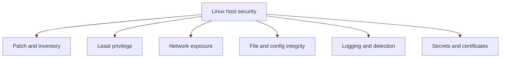
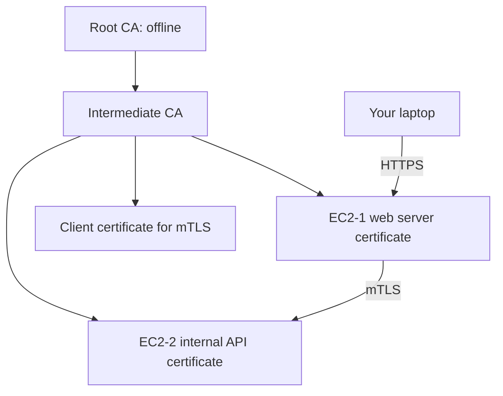

## TL;DR

Linux security is about reducing attack surface, enforcing least privilege, protecting credentials and keys, monitoring changes, and making compromise easier to detect. For an SRE, this matters because security controls must survive real operations: patching, deployments, emergency access, certificate rotation, service restarts, and incident response. A secure host is not just "locked down"; it is observable, recoverable, and predictable under pressure.

See also: [Linux basics](basics.md), [Linux networking](networking.md), [Linux troubleshooting](troubleshooting.md), and [Linux storage](storage.md).

## Linux security checklist

This checklist is a practical baseline for hardening Linux servers. Treat it as a starting point, then adapt it to the host role, data sensitivity, network exposure, compliance requirements, and recovery model. Production hardening should be automated through configuration management or images so that servers converge on the same secure state.

- Keep the system updated with the latest security patches. Patch cadence should be risk-based: critical remote-code-execution fixes need faster action than routine package updates. For fleets, use staged rollouts, canaries, and rollback plans so patching improves security without causing avoidable outages.
- Keep yourself updated with the latest vulnerabilities through mailing lists, vendor advisories, forums, CVE feeds, and security bulletins. SREs should know which advisories affect their kernel, OpenSSL, SSH, container runtime, webserver, language runtimes, and cloud agents. Vulnerability awareness is only useful when it is tied to asset inventory and ownership.
- Disable and stop unwanted services on the server. Every listening daemon expands the attack surface and adds patching responsibility. Use `ss`, `systemctl`, and firewall rules to confirm that only expected ports are exposed.
- Use `sudo` to limit root access. Shared root access destroys accountability and makes incident reconstruction harder. Give users named accounts, grant narrow sudo privileges, and log privileged commands centrally.
- Harden SSH security settings. Prefer key-based authentication, disable password login where feasible, restrict root login, use modern ciphers, and consider MFA or bastion access for production. SSH is usually the most important administrative control plane on a Linux host.
- Check the integrity of critical files using checksums. File integrity monitoring helps detect unexpected changes to binaries, configuration, libraries, and security-sensitive files. It is most useful when alerts are tuned and baselines are maintained through approved deployments.
- Tunnel all X Window sessions through SSH when graphical access is required. Direct X11 exposure is risky because it can leak keystrokes and allow clients to interact with other windows. Many production environments avoid X11 entirely and use CLI, browser-based consoles, or controlled remote desktop systems.
- Use SELinux if required. SELinux provides mandatory access control that can contain processes even when Unix permissions allow access. In production, avoid disabling SELinux blindly; use audit logs to understand denials and write appropriate policy or context fixes.
- Only create the required number of users. Dormant accounts, shared accounts, and unclear ownership create unnecessary risk. User lifecycle should include provisioning, group assignment, periodic review, and timely deprovisioning.
- Maintain a good firewall policy. Host firewalls should complement cloud security groups and network firewalls. Default-deny inbound rules are easier to reason about than broad allow rules.
- Configure SSL/TLS if you are using FTP. Better yet, prefer SFTP or HTTPS-based artifact transfer where possible. Plain FTP exposes credentials and data unless protected by TLS, and it is often harder to firewall because of separate control and data channels.
- Check file permissions across filesystems. Overly broad permissions on keys, logs, configuration, home directories, and application data can lead to privilege escalation or data exposure. Pay close attention to world-writable paths and sensitive files readable by service users.
- Use tools like AIDE for potential file state changes. AIDE can maintain a trusted database of file hashes and permissions, then report drift. This is useful for detecting unauthorized changes, but it must be initialized from a known-good state.
- Ensure the sticky bit is set on the `/tmp` directory. Shared writable directories need the sticky bit so users cannot delete or rename files owned by other users. `/tmp` should normally look like `drwxrwxrwt`.
- Check and lock users with blank passwords. Blank passwords are almost never acceptable on production systems. Audit local accounts and ensure PAM, shadow files, and identity provider policies prevent empty password authentication.
- Secure the bootloader and BIOS/UEFI settings. Attackers with console access can sometimes modify boot parameters, enter single-user mode, or boot alternate media. Use platform controls, disk encryption where appropriate, firmware passwords, and controlled console access.
- Give special attention to `portmap` and RPC-related services. Services such as NFS and older RPC workloads can expose dynamic ports and sensitive network surfaces. Restrict them by firewall, network segment, authentication, and explicit export policy.
- Deploy NFS shares with Kerberos authentication where appropriate. Kerberos-backed NFS improves identity assurance compared with trusting only client IP and numeric UID/GID mappings. This is especially important for shared enterprise filesystems.
- Enable remote logging. Local logs may be destroyed or altered during compromise, while centralized logs support detection, correlation, and incident response. Forward authentication, sudo, kernel, audit, and application logs to a protected logging platform.
- Disable root logins by editing `/etc/securetty` where applicable. This controls which terminals allow direct root login on some distributions. Also review SSH settings such as `PermitRootLogin` because remote root login is controlled separately.
- Keep a good password policy. Password policy should cover length, rotation expectations, lockout or rate limiting, reuse prevention, and break-glass handling. For most production access, pair this with SSH keys, MFA, and centralized identity.



## Setup self signed certificate on EC2

A self-signed certificate is useful for learning TLS, testing internal lab systems, or temporarily encrypting traffic before a proper CA-issued certificate is available. It should not be used for public production websites because browsers and clients cannot chain trust to a known Certificate Authority. Users will see a warning because the certificate is signed by itself instead of by a trusted CA.

Create an EC2 instance with a public IP and Nginx installed. When you access the public IP initially, it defaults to HTTP. Configure the security group to allow `80`, `443`, and `22` from appropriate sources. In production, `22` should be limited to a trusted administrative source, and `80`/`443` should be opened only when the instance is intended to serve web traffic.

Install Nginx after logging in to the EC2 machine.

```bash
# Update packages, install Nginx, start it, and enable it after reboot.
sudo yum update -y
sudo yum install nginx -y
sudo systemctl start nginx
sudo systemctl enable nginx
```

Use this command from your workstation to confirm the HTTP site responds before enabling TLS.

```bash
# Test the default HTTP endpoint before adding TLS.
curl http://<public-ip>
```

### Generate Self-Signed Certificate

These commands create a private key and a self-signed certificate for the Nginx server. The Common Name (CN) should match what the client connects to, although modern clients also expect Subject Alternative Name (SAN), so real certificates should include SANs.

```bash
# Create a directory for Nginx TLS material, generate a private key, and create a self-signed certificate.
sudo mkdir /etc/nginx/ssl
cd /etc/nginx/ssl
sudo openssl genrsa -out private.key 2048
sudo openssl req -new -x509 -key private.key -out certificate.crt -days 365

Common Name (CN): <public_ip>
.
.
.
```

This generates `private.key` and `certificate.crt`. Protect the private key carefully; if an attacker obtains it, they can impersonate the server for clients that trust the certificate.

Configure Nginx to load the TLS certificate.

```bash
# Open a new Nginx TLS virtual host configuration.
sudo vi /etc/nginx/conf.d/ssl.conf
```

```nginx
# Configure Nginx to listen on HTTPS and serve the default document root.
server {
    listen 443 ssl;
    server_name <public-ip>;

    ssl_certificate /etc/nginx/ssl/certificate.crt;
    ssl_certificate_key /etc/nginx/ssl/private.key;

    location / {
        root /usr/share/nginx/html;
        index index.html;
    }
}
```

Validate and restart Nginx after editing the configuration.

```bash
# Validate Nginx syntax and restart the service to apply TLS configuration.
sudo nginx -t
sudo systemctl restart nginx
```

Open `https://<public_ip>` in a browser. You will see that the connection is not private. Click Advanced and proceed only because this is a lab certificate that is self-signed rather than signed by a trusted CA.

```text
# Self-signed certificate trust flow in this lab.
    Client (Browser)
        |
        |  HTTPS Request
        v
EC2 + Nginx Server
        |
        |-- Sends Certificate
        |
Self-Signed Certificate
        |
         Signed by Itself
```

Verify the certificate from the CLI.

```bash
# Inspect the TLS handshake and confirm the self-signed certificate warning.
openssl s_client -connect <public_ip>:443
Verify return code: 18 (self signed certificate)
```

## Build Internal PKI

Internal PKI is used when an organization needs to issue and trust certificates for internal services, private domains, service-to-service mTLS, VPNs, databases, or Kubernetes/webhook infrastructure. The core idea is that clients trust a root CA, the root delegates issuing authority to an intermediate CA, and the intermediate signs server or client certificates. Keeping the root CA offline reduces blast radius if the issuing CA is compromised.

Build a secure internal architecture where:

- You create your own Root CA.
- You create an Intermediate CA.
- You sign server certificates.
- You enable HTTPS.
- You enable mTLS between services.
- You troubleshoot certificate issues.



```text
# Internal service trust path for the lab.
                   Your Laptop
                        |
                        | HTTPS
                        v
                EC2-1 (Web Server)
                        |
                        | mTLS
                        v
                EC2-2 (Internal API)
                        |
                        |
                Signed by Intermediate CA
                        |
                        |
                   Root CA (Offline)
```

### Setup

Create 2 EC2 machines, such as `t2.micro` instances.

EC2-1 is the public-facing web server. Its security group, `sg-1`, should allow:

- `22` for SSH from trusted administrative IPs.
- `443` for HTTPS from expected clients or the internet, depending on the lab goal.

EC2-2 is the private internal API. Its security group, `sg-2`, should allow:

- `22` for SSH from a bastion or trusted administrative source.
- `8443` for custom HTTPS.
- Inbound `8443` only from EC2-1's security group, not from the public internet.

```text
# AWS VPC layout for public web access and private internal API access.
                        Internet
                            |
                            |
                    +----------------+
                    |  Internet GW   |
                    +----------------+
                            |
                     -------------------
                     |                 |
              Public Subnet       Private Subnet
              (10.0.1.0/24)      (10.0.2.0/24)
                     |                 |
               +-------------+   +-------------+
               |   EC2-1     |   |   EC2-2     |
               | Web Server  |-->| Internal API|
               | Public IP   |   | No Public IP|
               +-------------+   +-------------+
                     |
              Security Group 1
              Allow:
                22 (SSH)
                443 (HTTPS)

                                  Security Group 2
                                  Allow:
                                  22 (SSH)
                                  8443 (HTTPS)
                                  Source = EC2-1 only
```

### Create Enterprise-Style PKI

Enterprise-style PKI separates the root CA from day-to-day issuing operations. The root CA should be offline or heavily restricted, while the intermediate CA signs workload certificates. This makes it possible to rotate or revoke an intermediate without replacing every root trust store.

```text
# Enterprise PKI signing hierarchy.
Root CA (offline)
        |
Intermediate CA
        |
Server Certificates
```

For production use, also plan certificate lifetime, SAN naming conventions, key sizes, revocation strategy, audit logs, renewal automation, and secret storage. Manual certificate handling is acceptable for a lab, but production PKI should be automated and observable.

## Common Pitfalls

- Disabling SELinux instead of reading audit denials. This hides policy problems and removes a valuable containment layer.
- Allowing SSH from `0.0.0.0/0` for convenience. Use trusted source ranges, bastions, VPN, SSM Session Manager, or another controlled access path.
- Storing private keys with broad permissions. TLS keys should be readable only by the service account or root as required.
- Using self-signed certificates in public production services. Clients cannot establish trust without manually trusting the certificate.
- Forgetting SANs in certificates. Modern TLS validation checks Subject Alternative Names, not just Common Name.
- Leaving old users, sudo rules, or SSH keys after personnel or ownership changes.
- Treating security groups as the only firewall layer. Host firewalls and service bind addresses still matter.
- Running internal PKI without renewal automation. Expired certificates are a very common cause of avoidable outages.

## Interview Questions

- What are the first Linux hardening steps you apply to a new server?
- How would you restrict root access without blocking emergency administration?
- Why is centralized logging important for security?
- What is the difference between discretionary access control and SELinux mandatory access control?
- Why does a browser warn about a self-signed certificate?
- What is the difference between a root CA and an intermediate CA?
- How does mTLS differ from normal server-side TLS?
- What certificate fields do clients validate during a TLS handshake?
- How would you troubleshoot `Verify return code: 18` from `openssl s_client`?
- What controls would you put around private key storage?

## Key Takeaways

Linux security is strongest when baseline hardening, access control, network policy, file integrity, logging, and certificate management work together. The goal is to reduce attack surface while preserving safe operations and recovery.

TLS and PKI are operational systems, not just cryptographic concepts. SREs need to understand trust chains, private keys, certificate validation, mTLS, rotation, and expiry monitoring because certificate mistakes routinely cause production incidents.

See also: [Linux basics](basics.md), [Linux networking](networking.md), [Linux troubleshooting](troubleshooting.md), and [Linux storage](storage.md).
