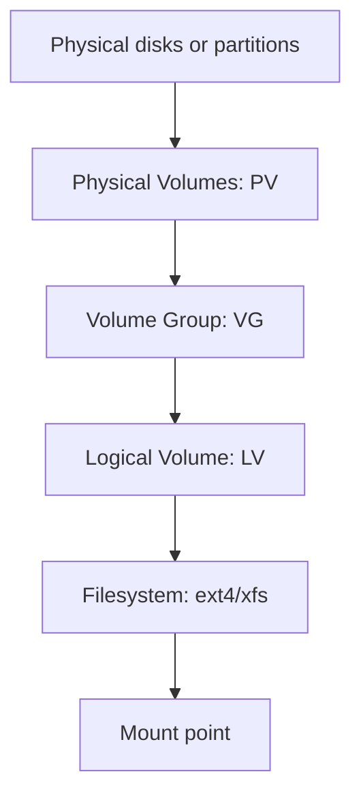
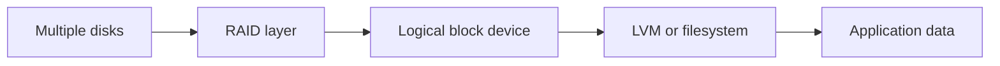
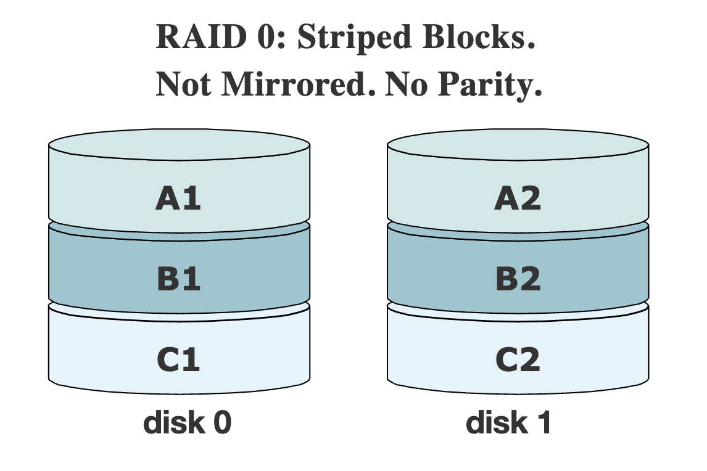
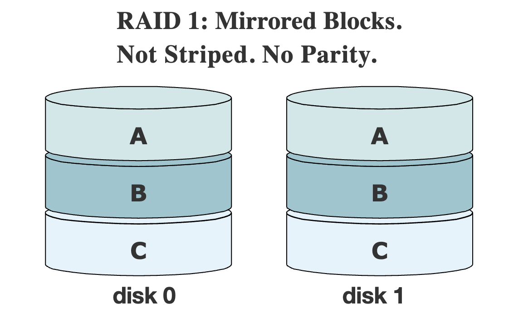
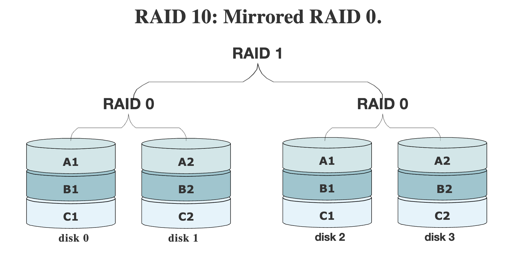
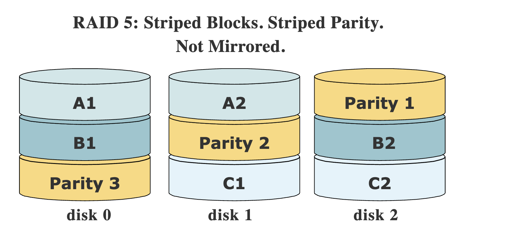

## TL;DR

Linux storage administration is about safely presenting block devices, grouping capacity, creating filesystems, mounting them reliably, and understanding failure behavior. LVM gives flexible volume management, while RAID gives performance and/or redundancy across multiple disks. For an SRE, storage work matters because mistakes can cause immediate data loss, long recovery times, degraded application latency, or failed boots.

See also: [Linux basics](basics.md), [Linux networking](networking.md), [Linux security](security.md), and [Linux troubleshooting](troubleshooting.md).

## logical volume manager

LVM allows flexible disk space management by separating physical storage from the logical volumes used by filesystems. It lets you add disk space to a logical volume and grow its filesystem while that filesystem is mounted and active, assuming the filesystem supports online growth. It also allows multiple disks or partitions to be collected into a single volume group and then divided into logical volumes.

For an SRE, LVM is useful when an application outgrows its disk, when a host needs separate mount points for logs/data/cache, or when storage must be expanded without rebuilding the server. The key operational discipline is knowing which operations are online-safe and which require downtime and backups.



The volume manager also allows reducing the amount of disk space allocated to a logical volume, but there are important requirements. First, the volume should be unmounted. Second, the filesystem itself must be reduced before the block device underneath it is reduced. Reducing an LV before shrinking the filesystem can destroy data.

### create volume

This flow creates a new physical volume, adds it to an existing volume group, creates a logical volume, formats it as `ext4`, labels it, and verifies the result.

```bash
# Inspect existing physical volumes.
pvs

# Initialize /dev/hdd as an LVM physical volume.
pvcreate /dev/hdd

# Inspect existing volume groups.
vgs

# Add the new physical volume to the MyVG01 volume group.
vgextend /dev/MyVG01 /dev/hdd

# Create a 50 GiB logical volume named Stuff in MyVG01.
lvcreate -L +50G --name Stuff MyVG01

# Create an ext4 filesystem on the logical volume.
mkfs -t ext4 /dev/MyVG01/Stuff

# Add a filesystem label named Stuff.
e2label /dev/MyVG01/Stuff Stuff

# Inspect logical volumes.
lvs
```

Before running commands like `mkfs`, double-check the device path. Formatting the wrong block device is one of the fastest ways to lose data.

### increase volume

Increasing an LVM volume is usually safer than reducing one because filesystems such as `ext4` and `xfs` support online growth. The process is still worth validating: confirm the underlying disk exists, add it to the volume group, extend the logical volume, then grow the filesystem.

```bash
# Inspect current physical volumes, volume groups, and logical volumes.
pvs
vgs
lvs

# Add /dev/hdd to the existing volume group.
vgextend /dev/MyVG01 /dev/hdd

# Increase the Stuff logical volume by 50 GiB.
lvextend -L +50G /dev/MyVG01/Stuff

# Grow the ext4 filesystem to use the larger logical volume.
resize2fs /dev/MyVG01/Stuff
```

For `xfs`, use `xfs_growfs` on the mounted filesystem instead of `resize2fs`. Filesystem type matters, and the wrong resize command will either fail or lead you down the wrong troubleshooting path.

### decrease volume

Decreasing a logical volume is riskier than increasing it. You must shrink the filesystem before shrinking the logical volume, and many filesystems, including XFS, do not support shrinking. Always take a backup or snapshot before reducing storage.

```bash
# Confirm current filesystem usage before shrinking.
df -h /testlvm1

# Unmount the filesystem before checking and shrinking it.
umount /testlvm1

# Force a filesystem check before resizing ext4.
e2fsck -f /dev/mapper/vg01-lv002

# Shrink the ext4 filesystem to 80 GiB before reducing the LV.
resize2fs /dev/mapper/vg01-lv002 80G

# Reduce the logical volume to match the new filesystem size.
lvreduce -L 80G /dev/mapper/vg01-lv002

# Check the filesystem again after reducing the LV.
e2fsck -f /dev/mapper/vg01-lv002

# Remount the filesystem.
mount /testlvm1

# Verify the new visible filesystem size.
df -h /testlvm1
```

In production, prefer creating a new smaller volume, copying data, validating the application, and switching mounts when downtime allows. It is often safer than in-place reduction.

## RAID

RAID stands for Redundant Array of Inexpensive/Independent Disks. It combines multiple disks into one logical storage device to improve performance, redundancy, or both. RAID is not a backup: it may protect against some disk failures, but it does not protect against accidental deletion, corruption, ransomware, application bugs, or regional/cloud failure.

For SREs, RAID decisions should be tied to workload characteristics: read/write pattern, rebuild time, acceptable data loss, hot spare availability, monitoring, controller behavior, and backup/restore objectives.



### Striped and/or Mirrored

Striping spreads data across disks for throughput. Mirroring writes duplicate data to more than one disk for redundancy. RAID levels combine these ideas differently, which changes usable capacity, performance, and failure tolerance.

### RAID 0

RAID 0 writes data across drives, also called striping. This means data can potentially be read from more than one drive concurrently, which can provide a real performance boost. The tradeoff is severe: any single disk failure can take out the whole array and all data on it.

RAID 0 is only appropriate when performance matters and long-term data durability does not, or when the data can be regenerated easily. Examples include scratch space, temporary processing, caches, or short-lived benchmark environments.



### RAID 1

RAID 1 is called mirroring because it is created with a pair of equal drives. Each time data is written to a RAID 1 device, it is written to both drives in the pair. If one disk fails, the mirror can continue serving data from the surviving disk.

RAID 1 is simple and reliable for boot disks and smaller critical volumes. The tradeoff is capacity efficiency: two 1 TB disks provide roughly 1 TB of usable space because the second disk stores a copy.



### RAID10

RAID 10 combines mirroring and striping. A common four-disk RAID 10 layout creates mirrored pairs and stripes data across those pairs. This provides better performance than RAID 1 and better rebuild characteristics than large parity arrays.

RAID 10 is commonly used for databases and latency-sensitive workloads because it gives good random I/O performance and can tolerate some disk failures depending on which disks fail. Its main tradeoff is capacity: usable space is usually about 50% of raw disk capacity.



### Parity

Parity-based RAID stores calculated recovery information alongside data. This improves usable capacity compared with mirroring but adds write overhead and can make rebuilds slower. During rebuild, the array is under extra stress and may be more vulnerable to another disk failure.

### RAID5

RAID 5 requires at least three equal-size drives to function. In practice, additional drives can be added, though very large RAID 5 arrays are risky because rebuild times and probability of a second failure increase. RAID 5 sets aside one drive's worth of space for checksum parity data, but parity is striped across all devices along with filesystem data.

Build RAID 5 from drives of identical size and speed where possible. Adding a larger drive will not increase usable capacity beyond the smallest member size, and performance is often limited by the slowest member. RAID 5 can recover with no data loss if one drive dies; if two or more drives fail, the array must be restored from backup.

### RAID6

RAID 6 is similar to RAID 5 but sets aside two disks' worth of parity data. That means RAID 6 can recover from two failed members. This makes it safer than RAID 5 for larger arrays, but writes are usually slower because more parity work is required.

RAID 5 gives more usable storage than mirroring, but at the price of some performance and rebuild risk. A quick way to estimate RAID 5 usable storage is total equal-sized drives minus one drive. For example, six 1 TB drives provide about 5 TB of usable RAID 5 space, or roughly 83%, compared with about 50% usable capacity for RAID 1-style mirroring.



## Common Pitfalls

- Treating RAID as a backup. RAID can keep a system running after some disk failures, but it cannot recover deleted, corrupted, or encrypted data.
- Shrinking an LVM logical volume before shrinking the filesystem. This can destroy data.
- Forgetting that XFS can grow online but cannot shrink. Plan migrations accordingly.
- Extending a logical volume but forgetting to grow the filesystem. The block device may be larger while `df -h` still shows the old filesystem size.
- Building RAID from mismatched disks. Capacity and performance are constrained by the smallest and slowest members.
- Ignoring rebuild time. Large disks can take many hours to rebuild, and degraded arrays are at higher risk during that window.
- Mounting by device name in `/etc/fstab` instead of stable identifiers. Device names can change across reboots.

## Interview Questions

- What problem does LVM solve compared with using raw partitions directly?
- Explain the relationship between PV, VG, LV, filesystem, and mount point.
- How do you safely grow an ext4 filesystem on an LVM logical volume?
- Why is shrinking a logical volume dangerous?
- What is the difference between RAID 0, RAID 1, RAID 5, RAID 6, and RAID 10?
- Why is RAID not a substitute for backups?
- What happens to RAID 5 if two disks fail?
- Why might RAID 10 be preferred for a database workload?
- What is the operational risk during a RAID rebuild?
- How would you investigate a filesystem that is full even after deleting files?

## Key Takeaways

LVM is a flexibility layer: it makes storage easier to grow, divide, and manage, but it does not remove the need for backups and careful device selection. Growing is usually straightforward; shrinking requires much more caution.

RAID is a resilience and performance layer, not a data protection strategy by itself. Choose RAID levels based on workload behavior, failure tolerance, rebuild risk, and recovery objectives, then monitor the array continuously.

See also: [Linux basics](basics.md), [Linux networking](networking.md), [Linux security](security.md), and [Linux troubleshooting](troubleshooting.md).
