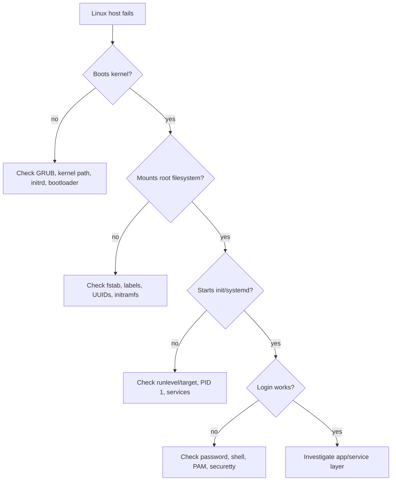

## TL;DR

Linux troubleshooting is about isolating the failing layer before changing the system. Boot failures usually involve firmware, GRUB, kernel/initramfs, root filesystem discovery, `/etc/fstab`, or PID 1. Login failures usually involve credentials, shell configuration, PAM, `/etc/passwd`, `/etc/shadow`, or terminal restrictions.

For an SRE, these scenarios matter because a failed boot or locked-out root account can turn a routine maintenance window into an outage. The safest recovery pattern is: capture the exact error, boot into rescue or single-user mode, mount filesystems carefully, take backups before editing, change only the broken configuration, and verify the next boot path.

See also: [Linux basics](basics.md), [Linux networking](networking.md), [Linux security](security.md), and [Linux storage](storage.md).



## kernel panic: not syncing attempting to kill init

This error means the kernel reached a point where it could not continue safely, often because it could not start or keep PID 1 alive. Common causes include a missing or wrong kernel image, broken initramfs, incorrect GRUB root parameters, missing root filesystem drivers, bad filesystem labels, or a corrupted `/sbin/init` or `systemd`. The exact panic text and the lines immediately before it are important.

The issue may be related to the kernel image or GRUB configuration. The system may not be able to locate the kernel, root filesystem, or label associated with it.

To recover, attempt to boot the Linux machine into single-user mode or rescue mode. Check the contents of `grub.conf` or the current GRUB configuration. A temporary edit from the GRUB menu can help bring up the system in runlevel 3 or a rescue target.

Once the machine is up, modify the persistent GRUB configuration accordingly and reboot to confirm the system starts without manual intervention. On modern systems, remember that direct edits to generated GRUB files may be overwritten; use the distribution's supported GRUB configuration workflow.

## linux booting drops into grub>

Dropping to the `grub>` prompt means GRUB started, but it could not automatically find or load the next boot configuration or second-stage boot path. This can happen after disk changes, partition renumbering, missing `/boot` files, corrupted GRUB configuration, or an incorrect root device. The goal is to manually point GRUB at the correct boot partition, kernel, and initrd so the system can boot once.

Run these commands from the GRUB prompt to manually boot the machine.

```text
# Manually select the boot partition, kernel, initrd, and boot the system.
grub> root(hd0,0)
grub> kernel /vmlinux<tab> ro root=LABEL=/1
grub> initrd /initrd<tab>
grub> boot
```

Once the machine boots, check where the second-stage boot loader and boot files are located. Then repair the persistent GRUB installation and configuration so the next reboot does not require manual commands.

## system keeps on rebooting

A system that keeps rebooting can be caused by hardware failure, kernel panic, watchdog resets, incorrect runlevel/target configuration, broken init scripts, failed service dependencies, or login/init problems. Capture console output if possible; without logs or console text, repeated reboots are easy to misdiagnose.

Try to boot the system into single-user mode. If you see an error such as `no more processes left in this runlevel`, the system is not able to start the expected processes for that runlevel. You may need to boot into rescue mode and inspect init configuration.

First, check the runlevel in `/etc/inittab` on SysV init systems. If the runlevel is incorrect, fix it. On modern `systemd` systems, check the default target with `systemctl get-default` after recovery.

Use rescue mode to mount and inspect the installed system.

```text
# Boot from ISO/DVD rescue mode, chroot into the installed system, inspect init and GRUB files, then reboot.
Mount ISO or DVD
: linux rescue
<skip>

chroot /mnt/sysimage
cd etc
ls | grep inittab
ls | grep /etc/grub/grub.conf
exit
reboot
```

If this is a production host in a cloud or autoscaling group, also consider whether replacement is safer than deep manual recovery. Immutable infrastructure should usually be rebuilt from a known-good image.

## checking filesystems fsck.ext3: unable to resolve **LABEL=/5**  [ FAILED ]

This error means the system tried to mount or check a filesystem by label, but the label could not be resolved to a block device. The filesystem may not have that label, the disk may be missing, the partition table may have changed, or `/etc/fstab` may reference an old label. A corrupted or incorrect `/etc/fstab` can stop the boot process because required filesystems cannot be mounted.

The immediate recovery path is to provide the single-user or rescue password, remount the root filesystem read-write if needed, and fix `/etc/fstab`.

Use these commands to inspect labels and repair `/etc/fstab`.

```bash
# Inspect fstab, verify the device label, remount root read-write, and edit the mount table.
cat /etc/fstab
<check for correct entries>
e2label /dev/sda3
mount -o remount,rw /
vim /etc/fstab
```

Prefer UUIDs for persistent mounts when possible because device names such as `/dev/sda3` can change across reboots or cloud instance types. After editing, test with `mount -a` before rebooting.

## Verifying DMI pool data

If the boot process stops around `Verifying DMI Pool Data`, the first-stage boot loader or boot handoff may be corrupted. This can happen after disk cloning, MBR damage, boot disk replacement, partitioning changes, or failed bootloader installation. The fix is often to reinstall GRUB to the correct boot disk from rescue mode.

Use rescue mode to chroot into the installed system and reinstall GRUB.

```bash
# Reinstall GRUB to /dev/sda from the rescue environment, then exit.
chroot /mnt/sysimage
grub-install /dev/sda
ctrl-d
```

Make sure `/dev/sda` is truly the boot disk before running `grub-install`. On systems with multiple disks, installing the bootloader to the wrong disk can leave the host unbootable.

## You lost your GRUB password, how would you recover ?

GRUB passwords protect boot entries from unauthorized editing. If the GRUB password is lost, recovery usually requires trusted console or rescue media access. This is why physical, hypervisor, and cloud-console access must be controlled: anyone with rescue access may be able to modify bootloader security.

From a Linux terminal, this command was historically used to generate an MD5-style GRUB password hash and append it to the GRUB configuration.

```bash
# Generate an old-style GRUB MD5 password hash and append it to grub.conf.
grub-md5-crypt >>/boot/grub/grub.conf
```

Prefix the generated hash with `password --md5 $jshhx.....` in the GRUB configuration. On newer systems, GRUB2 uses different tooling and configuration files, so use the distribution-supported approach.

If you need to recover from a lost GRUB password, insert an ISO image or DVD and type `linux rescue` at the boot prompt.

```bash
# Enter rescue mode, edit GRUB configuration, remove the password entry, and exit.
chroot /mnt/sysimage/
vim /etc/grub/grub.conf

Delete the line with any password entry, save and quit the file.

exit
```

After recovery, set a new bootloader password and document the break-glass process. Do not leave bootloader protection disabled on systems where console access is a security concern.

## root unable to login

Root login failures should be handled carefully because they may indicate misconfiguration, account compromise, expired credentials, PAM failure, or terminal restrictions. Avoid making broad changes until you confirm whether the problem affects only root or all users.

### password wrong

If the password is wrong, confirm whether another privileged user can log in and use `sudo`. If no privileged path exists, use single-user or rescue mode according to your access policy. In enterprise environments, root access may be disabled intentionally and replaced with named accounts plus sudo.

### bash not presented for root a/c

Symptom: when you type the root login password, the system gives you a non-login shell or immediately exits. This can happen if the root user's shell is missing, invalid, or incorrectly configured in `/etc/passwd`. It can also happen if profile scripts exit unexpectedly.

Solution: go to single-user mode and inspect `/etc/passwd`. Correct the root shell entry, such as `/bin/bash`, if it is wrong. The original note says to edit `/etc/password`, but the correct file is `/etc/passwd`.

```bash
# Inspect the root account entry and verify that the shell path exists.
grep '^root:' /etc/passwd
ls -l /bin/bash
```

### /etc/securetty file corrupted

If non-root users can log in but root cannot log in on a local terminal, the issue may be related to `/etc/securetty`. This file controls which terminals permit direct root login on some distributions. SSH root login is controlled separately through SSH daemon configuration.

Solution: boot into single-user mode and verify settings in `/etc/securetty`.

```bash
# Inspect securetty entries that control root login from local terminals.
cat /etc/securetty
```

## Common Pitfalls

- Editing bootloader or filesystem configuration without taking a copy first. A one-line mistake can make recovery harder.
- Confusing device names, labels, and UUIDs. Always verify the actual block device with tools such as `lsblk`, `blkid`, and filesystem label commands.
- Running `grub-install` against the wrong disk. Multi-disk systems need extra care.
- Assuming a GRUB rescue fix is permanent. Manual GRUB commands usually boot the system once; persistent configuration must still be repaired.
- Editing `/etc/fstab` and rebooting without testing `mount -a`.
- Treating root login failure as only a password issue. Shell, PAM, terminal restrictions, expired accounts, and filesystem state can all block login.

## Interview Questions

- What does `kernel panic: not syncing attempting to kill init` usually indicate?
- How would you recover a host that drops to the `grub>` prompt?
- What is the difference between single-user mode and rescue mode?
- How can an incorrect `/etc/fstab` prevent a system from booting?
- Why are UUIDs often safer than device names in `/etc/fstab`?
- What does `grub-install /dev/sda` do?
- How would you troubleshoot a system that keeps rebooting?
- Why might root login fail even with the correct password?
- What is `/etc/securetty` used for?
- When would you rebuild a host instead of repairing it manually?

## Key Takeaways

Boot troubleshooting is a chain-of-control problem: firmware hands off to GRUB, GRUB loads the kernel and initrd, the kernel mounts root, and PID 1 starts user space. Identify the broken handoff before applying a fix.

Login troubleshooting is an identity and session initialization problem. Check credentials, account files, shells, PAM, terminal restrictions, and logs before assuming the account itself is wrong.

See also: [Linux basics](basics.md), [Linux networking](networking.md), [Linux security](security.md), and [Linux storage](storage.md).
