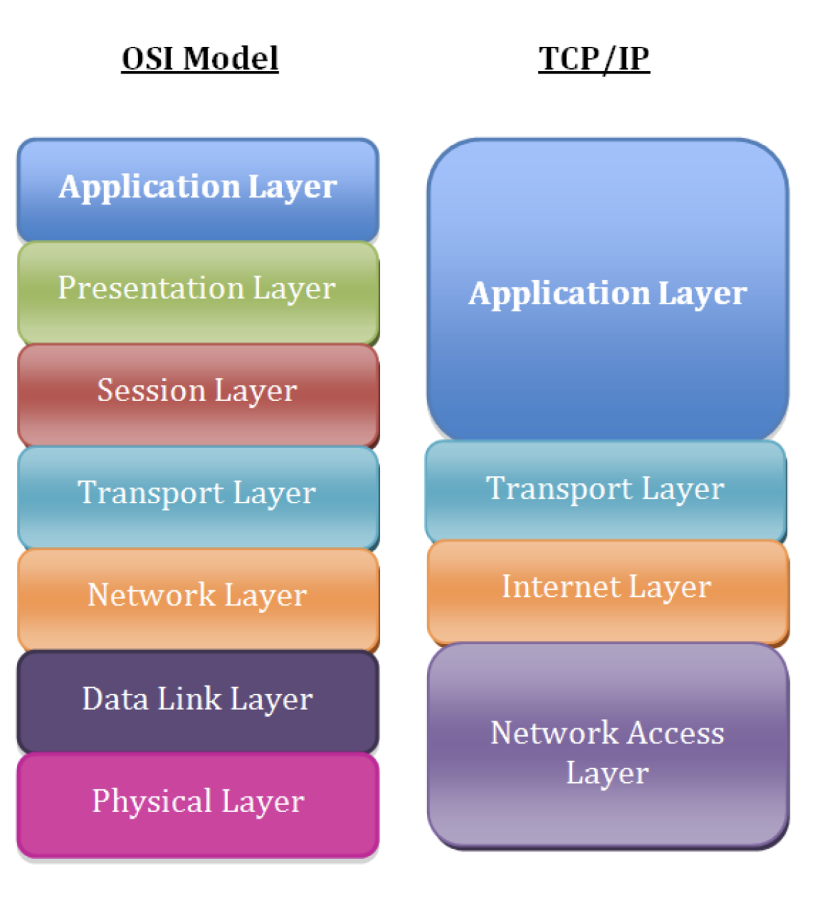

**<h1>Networking</h1>**

- [Linux Networking Troubleshooting(OSI/TCP IP)](#linux-networking-troubleshootingositcp-ip)
  - [Layer 1: The physical layer](#layer-1-the-physical-layer)
  - [Layer 2: The data link layer](#layer-2-the-data-link-layer)
  - [Layer 3: The network/internet layer](#layer-3-the-networkinternet-layer)
  - [Layer 4: The transport layer](#layer-4-the-transport-layer)
- [what happens when I type www.example.com in the address bar of the browser?](#what-happens-when-i-type-wwwexamplecom-in-the-address-bar-of-the-browser)
- [Linux DNS Client Troubleshooting](#linux-dns-client-troubleshooting)
- [Website DOWN](#website-down)
  - [Server is running?](#server-is-running)
  - [remote port opened ?](#remote-port-opened-)
  - [Test for Listening Ports](#test-for-listening-ports)
  - [Command line response test](#command-line-response-test)

## Linux Networking Troubleshooting(OSI/TCP IP)

TCP/IP model more accurately represents the suite of protocols that are deployed in modern networks.



The layers in the TCP/IP network model, in order, include:

Layer 5: Application <br>
Layer 4: Transport <br>
Layer 3: Network/Internet<br>
Layer 2: Data Link<br>
Layer 1: Physical<br>

### Layer 1: The physical layer

Identify the cable has been plugged in, but we can easily troubleshoot physical layer problems from the Linux command line.

```
ip link show
```
Any indication of DOWN in the above output for the eth0 interface. This result means that Layer 1 isn’t coming up.

We might try troubleshooting by bringing up the interface(eth0) just to rule out that network interface disabled can be ruled out. 

```
ip link set eth0 up
ip link show
ip -br link show # prints output in more readable format
ip -s link show eth0 # prints additional statistics about interface
``` 

**ethtool** utility is an excellent option. A particularly good use case for this command is checking to see if an interface has negotiated the correct speed. 

### Layer 2: The data link layer

The data link layer is responsible for local network connectivity. The most relevant Layer 2 protocol for most sysadmins is the Address Resolution Protocol (ARP), which maps Layer 3 IP addresses to Layer 2 Ethernet MAC addresses. When a host tries to contact another host on its local network (such as the default gateway), it likely has the other host’s IP address, but it doesn’t know the other host’s MAC address. ARP solves this issue and figures out the MAC address for us. 

If your localhost can’t successfully resolve its gateway’s Layer 2 MAC address, then it won’t be able to send any traffic to remote networks. This problem might be caused by having the wrong IP address configured for the gateway, or it may be another issue, such as a misconfigured switch port.

 ```
 ip neighbor show
 ```

Linux caches the ARP entry for a period of time, so you may not be able to send traffic to your default gateway until the ARP entry for your gateway times out.

 ```
 # ip neighbor show
192.168.122.170 dev eth0 lladdr 52:54:00:04:2c:5d REACHABLE
192.168.122.1 dev eth0 lladdr 52:54:00:11:23:84 REACHABLE
# ip neighbor delete 192.168.122.170 dev eth0
# ip neighbor show
192.168.122.1 dev eth0 lladdr 52:54:00:11:23:84 REACHABLE
```

### Layer 3: The network/internet layer

Layer 3 involves working with IP addresses. IP addressing provides hosts with a way to reach other hosts that are outside of their local network

```
ip -br address show
```

check the interfaces and see it has ipaddress associated with the interface.  The lack of an IP address can be caused by a local misconfiguration, such as an incorrect network interface config file, or it can be caused by problems with DHCP.

Layer 3 is the **ping** utility. Ping sends an ICMP Echo Request packet to a remote host, and it expects an ICMP Echo Reply in return. If you’re having connectivity issues to a remote host, ping is a common utility to begin your troubleshooting

Many might have blocked the ping hence you use **traceroute**. As with ICMP, intermediate routers may filter the packets that traceroute relies on, such as the ICMP Time-to-Live Exceeded message. But more importantly, the path that traffic takes to and from a destination is not necessarily symmetric, and it’s not always the same.

Another common issue that you’ll likely run into is a lack of an upstream gateway for a particular route or a lack of a default route. When an IP packet is sent to a different network, it must be sent to a gateway for further processing. The gateway should know how to route the packet to its final destination. The list of gateways for different routes is stored in a routing table.

```
ip route show
```

### Layer 4: The transport layer

The transport layer consists of the TCP and UDP protocols, with TCP being a connection-oriented protocol and UDP being connectionless. Applications listen on sockets, which consist of an IP address and a port. Traffic destined to an IP address on a specific port will be directed to the listening application by the kernel.

The first thing that you may want to do is see what ports are listening on the localhost

Another common issue occurs when a daemon or service won’t start because of something else listening on a port

```
ss -tunlp4
```

The telnet command attempts to establish a TCP connection with whatever host and port you give it. This feature is perfect for testing remote TCP connectivity

```
telnet database.example.com 3306
telnet nfs.example.com 2049
```

The **netcat** utility can be used for many other things, including testing TCP connectivity.Note that netcat may not be installed on your system, and it’s often considered a security risk to leave lying around. You may want to consider uninstalling it when you’re done troubleshooting

similarly, **nmap** which is capable of doing ..

- TCP and UDP port scanning remote machines.
- OS fingerprinting.
- Determining if remote ports are closed or simply filtered.


## what happens when I type www.example.com in the address bar of the browser?

- The client types www.example.com in his browser
- The operating system looks at /etc/host file,first for the ip address of www.example.com(this can be changed from /etc/nsswitch), then looks /etc/resolv.conf for the DNS server IP for that machine
- the dns server will search its database for the name www.example.com, if it finds it will give that back, if not it will query the root server(.) for the information.
- root server will return a referral to the .com TLD name server(these TLD name servers knows the address of name servers of all SLD's).In our case we searched for www.example.com so root server will give us referral to .com TLD servers.
- Now One of the TLD servers of .com will give us the referral to the DNS server resposible for example.com domain.
- The dns server for example.com domain will now give the client the ip address of www host(www is the host name.)

finally, type **dig +trace www.google.com**

## Linux DNS Client Troubleshooting

There are multiple potential points of failure during the DNS lookup process such as at the system performing the lookup, at the DNS cache, or on an external DNS server. 

**Local Server Configuration**

it’s important to understand the ‘hosts’ section of the /etc/nsswitch.conf file.
`
hosts: files dns myhostname
`

Essentially this means that host name resolution will be performed in the order specified, left to right. First files will be checked, followed by DNS. As files are first these will be checked first, this references the local /etc/hosts file which contains static host name to IP address mappings. This file takes priority over any DNS resolution, any changes to the file will be placed straight into the DNS cache of that local server.

If there is no entry in the hosts file DNS will be used next as per /etc/nsswitch.conf. The servers used for DNS resolution will be specified in the /etc/resolv.conf file

For DNS resolution to succeed the DNS server will need to accept TCP and UDP traffic over port 53 from our server. A port scanner such as the nmap tool can be used to confirm if the DNS server is available on port 53
```
nmap -sU -p 53 <dns server>
tcpdump -n host <dns server>
dig google.com
```

## Website DOWN

### Server is running?
```
ping 1.2.3.4 
ssh 1.2.3.4
```

### remote port opened ?
```
telnet 1.2.3.4 80
nmap -p 80 1.2.3.4
nc -vz 1.2.3.4 80
```

nmap states:
- Open: target machine is listening for connections/packets on that port 
- Filtered: A filtered nmap cannot determine whether the port is open because packet filtering prevents its probes from reaching the port.
- Closed: ports have no application listening on them, though they could open up at any time.
- unfiltered: Ports are classified as unfiltered when they are responsive to Nmap's probes, but Nmap cannot determine whether they are open or closed

### Test for Listening Ports

```
netstat -lnp | grep 80
```

Here the 0.0.0.0:80 tells us that the host is listening on all of its IPs for port 80 traffic.

### Command line response test

curl has an advantage over raw telnet for web server troubleshooting in that it takes care of the HTTP protocol for us and makes things like testing authentication, posting data, using SSL


```
curl http://1.2.3.4
```
