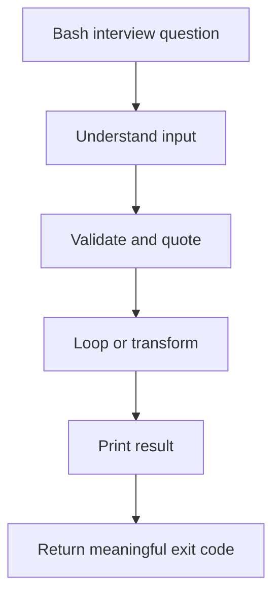

# Interview Questions

## TL;DR

This FAQ is a Bash interview and practice bank. The goal is to recognize common scripting patterns, explain why they work, and avoid the small mistakes that cause production automation to fail silently. For SRE and DevOps work, focus on quoting, input validation, exit codes, safe file handling, and predictable output.

[Bash cheat sheet](https://devhints.io/bash)

See also: [Bash overview](overview.md), [HackerRank Bash practice](hackerrank.md), [Linux admin basics](../admin/basics.md), and [Linux troubleshooting](../admin/troubleshooting.md).



## list files in directory

Use `-f` to print only regular files. Quote variables because paths may contain spaces.

```bash
# Print regular files directly under /etc.
for item in /etc/*; do
  if [[ -f "${item}" ]]; then
    echo "${item}"
  fi
done
```

## sum of integers

Use arithmetic expansion instead of `expr` for simple integer math. Validate that exactly two arguments were passed before using them.

```bash
# Sum two integer arguments after validating argument count.
#!/usr/bin/env bash
set -euo pipefail

if [[ "$#" -ne 2 ]]; then
  echo "Usage: $(basename "$0") <arg1> <arg2>" >&2
  exit 1
fi

a="$1"
b="$2"
sum=$((a + b))
echo "Result=${sum}"
```

## traverse array using len

Bash arrays are zero-indexed. `"${array[@]}"` preserves each element as a separate word, which is usually what you want.

```bash
# Show array length, elements, indexes, and indexed traversal.
array=("1" "2")
echo "${#array[*]}"

echo "${array[0]}"

for item in "${array[@]}"; do
  echo "${item}"
done

for index in "${!array[@]}"; do
  echo "${index}"
done

len="${#array[@]}"
for ((i = 0; i < len; i++)); do
  echo "index:${i},item:${array[$i]}"
done
```

More array operations:

```bash
# Demonstrate common indexed array operations.
Fruits=("Apple" "Banana" "Orange")
echo "${Fruits[0]}"
echo "${Fruits[-1]}"
echo "${Fruits[@]}"
echo "${#Fruits[@]}"
echo "${#Fruits[0]}"
echo "${Fruits[@]:1:2}"
echo "${!Fruits[@]}"

Fruits=("${Fruits[@]}" "Watermelon")
Fruits+=("Watermelon")
Fruits=("${Fruits[@]/Ap*/}")
unset 'Fruits[2]'
Fruits=("${Fruits[@]}")

Veggies=("Carrot" "Peas")
Fruits=("${Fruits[@]}" "${Veggies[@]}")
mapfile -t lines < "logfile"

for i in "${Fruits[@]}"; do
  echo "$i"
done
```

## traversing dicts

Bash associative arrays act like dictionaries. They require Bash 4 or newer.

```bash
# Create and traverse a Bash associative array.
declare -A sounds
sounds[dog]="bark"
sounds[cow]="moo"
sounds[bird]="tweet"
sounds[wolf]="howl"

echo "${sounds[dog]}"
echo "${sounds[@]}"
echo "${!sounds[@]}"
echo "${#sounds[@]}"
unset 'sounds[dog]'

for val in "${sounds[@]}"; do
  echo "$val"
done

for key in "${!sounds[@]}"; do
  echo "$key=${sounds[$key]}"
done
```

## diff between $@ and $*

`$*` and `$@` are identical when unquoted: both expand into positional arguments and then undergo word splitting. Quoted, they behave differently. `"$*"` expands to one word containing all arguments joined by the first character of `IFS`, while `"$@"` expands to separate quoted words, preserving argument boundaries.

In short, use `"$@"` when forwarding script arguments to another function or command.

```bash
# Demonstrate how $*, $@, "$*", and "$@" handle arguments with spaces.
#!/usr/bin/env bash

for i in $*; do
  echo "without quotes \$*: $i"
done

for i in $@; do
  echo "without quotes \$@: $i"
done

for i in "$*"; do
  echo "with quotes \"\$*\": $i"
done

for i in "$@"; do
  echo "with quotes \"\$@\": $i"
done

# ./specialvars.sh 1 2 "3 4"
```

## concat two str

Concatenate strings by placing variables next to each other or by appending inside a loop.

```bash
# Concatenate two scalar strings.
a="Sunil"
b="Kumar"
echo "${a} ${b}"
echo "${a}${b}"
```

```bash
# Concatenate array elements into one string.
array=("Sunil" "kumar")
strnew=""

for i in "${array[@]}"; do
  strnew+="${i}"
done

echo "${strnew}"
```

## function defn and args

Functions receive arguments through `$1`, `$2`, and so on, just like scripts.

```bash
# Define a function and pass the first script argument to it.
#!/usr/bin/env bash

f1() {
  echo "Hello $1"
}

f1 "$1"
```

## func return value

Bash function return codes should represent success or failure. To return text or numeric data, print it and capture stdout with command substitution.

```bash
# Capture function output in a variable.
#!/usr/bin/env bash

f1() {
  echo "Hello $1"
}

retval="$(f1 "$1")"
echo "${retval}"
```

## file types

File test operators let scripts check file type and permissions before acting.

| Operator | Description | Example |
| -------- | ----------- | ------- |
| `-b file` | Checks if file is a block special file. | `[ -b "$file" ]` |
| `-c file` | Checks if file is a character special file. | `[ -c "$file" ]` |
| `-d file` | Checks if file is a directory. | `[ -d "$file" ]` |
| `-f file` | Checks if file is a regular file. | `[ -f "$file" ]` |
| `-g file` | Checks if file has SGID set. | `[ -g "$file" ]` |
| `-k file` | Checks if file has sticky bit set. | `[ -k "$file" ]` |
| `-p file` | Checks if file is a named pipe. | `[ -p "$file" ]` |
| `-t fd` | Checks if file descriptor is associated with a terminal. | `[ -t 1 ]` |
| `-u file` | Checks if file has SUID set. | `[ -u "$file" ]` |
| `-r file` | Checks if file is readable. | `[ -r "$file" ]` |
| `-w file` | Checks if file is writable. | `[ -w "$file" ]` |
| `-x file` | Checks if file is executable. | `[ -x "$file" ]` |
| `-s file` | Checks if file has size greater than 0. | `[ -s "$file" ]` |
| `-e file` | Checks if file exists. | `[ -e "$file" ]` |

```bash
# Check whether FILE is a regular file.
test -f "${FILE}" && echo "File exists"
[ -f "${FILE}" ] && echo "File exists"
[[ -f "${FILE}" ]] && echo "File exists"
```

## odd/even

Brace expansion can generate numeric sequences, and arithmetic expansion can sum them.

```bash
# Print and sum odd and even numbers.
for i in {0..10..2}; do
  echo "${i}"
done

evensum=0
for i in {0..5..2}; do
  evensum=$((evensum + i))
done
echo "${evensum}"

for i in {1..10..2}; do
  echo "${i}"
done

oddsum=0
for i in {1..5..2}; do
  oddsum=$((oddsum + i))
done
echo "${oddsum}"
```

## reverse string

Reverse a string with Bash slicing or with `rev`.

```bash
# Reverse a string using Bash substring extraction.
s="sunil"
revstr=""

for ((i = ${#s} - 1; i >= 0; i--)); do
  revstr+="${s:$i:1}"
done

echo "${revstr}"

# Reverse a string with rev.
echo "${s}" | rev
rev <<< "${s}"
```

## for and while

Use `for` when the iteration space is known. Use `while` when looping until a condition changes.

```bash
# Print numbers with for and while loops.
for ((i = 1; i <= 10; i++)); do
  echo "$i"
done

i=0
while [[ "$i" -le 10 ]]; do
  echo "$i"
  ((i++))
done
```

## factorial

Factorial multiplies a number by every positive integer below it.

```bash
# Calculate factorial for a fixed counter value.
counter=5
factorial=1

while [[ "$counter" -gt 0 ]]; do
  factorial=$((factorial * counter))
  counter=$((counter - 1))
done

echo "${factorial}"
```

## reverse of num

Use modulo and integer division to reverse digits.

```bash
# Reverse the digits of an integer.
n=123456
revnum=0

while [[ "$n" -gt 0 ]]; do
  rem=$((n % 10))
  revnum=$((revnum * 10 + rem))
  n=$((n / 10))
done

echo "${revnum}"
```

## password strength

Password strength checks usually verify length and character classes. Real production password policy should be enforced by identity systems, PAM, or application auth rather than ad hoc shell scripts.

```bash
# Check basic password strength requirements.
password="${1:-}"

if [[ "${#password}" -lt 12 ]]; then
  echo "Weak: password must be at least 12 characters"
elif [[ ! "${password}" =~ [A-Z] ]]; then
  echo "Weak: password must include an uppercase letter"
elif [[ ! "${password}" =~ [a-z] ]]; then
  echo "Weak: password must include a lowercase letter"
elif [[ ! "${password}" =~ [0-9] ]]; then
  echo "Weak: password must include a number"
elif [[ ! "${password}" =~ [^a-zA-Z0-9] ]]; then
  echo "Weak: password must include a symbol"
else
  echo "Strong enough for this basic check"
fi
```

## line count in file

Use `while read` when you need to process each line. Use `wc -l` when you only need a count.

```bash
# Count lines in a file with a while loop.
file="$1"
count=0

while IFS= read -r _line; do
  ((count++))
done < "${file}"

echo "Count: ${count}"
```

## return lines from func

Print values from a function and capture stdout.

```bash
# Return a line count from a function via stdout.
count() {
  local file="$1"
  local count=0

  while IFS= read -r _line; do
    ((count++))
  done < "${file}"

  echo "${count}"
}

echo "Count: $(count "$1")"
```

## discard comments in file

Skip lines that start with `#`.

```bash
# Print non-comment lines from ./passwd.
while IFS= read -r line; do
  [[ "${line}" = \#* ]] && continue
  printf '%s\n' "${line}"
done < ./passwd
```

## retain the last 50 lines in logfile

This pattern trims a log file to a fixed number of recent lines. It must be run carefully because it overwrites the original log file.

```bash
# Keep only the last N lines of /var/log/messages.
#!/usr/bin/env bash
set -euo pipefail

LOG_DIR="/var/log"
ROOT_UID=0
DEFAULT_LINES=50
E_WRONGARGS=85
E_XCD=86
E_NONROOT=87

if [[ "${UID}" -ne "${ROOT_UID}" ]]; then
  echo "Must be root to run this script!" >&2
  exit "${E_NONROOT}"
fi

case "${1:-}" in
  "") lines="${DEFAULT_LINES}" ;;
  *[!0-9]*) echo "Usage: $(basename "$0") #lines_to_cleanup" >&2; exit "${E_WRONGARGS}" ;;
  *) lines="$1" ;;
esac

cd "${LOG_DIR}" || {
  echo "Cannot change to directory" >&2
  exit "${E_XCD}"
}

tail -n "${lines}" messages > messages.tmp
mv messages.tmp messages

echo "Log files cleaned up"
```

## random num generator 200-500

`RANDOM` returns a pseudo-random integer between 0 and 32767. Use modulo arithmetic for simple labs, but prefer stronger randomness for security.

```bash
# Generate ten pseudo-random numbers between MIN and MAX.
#!/usr/bin/env bash

MIN=200
MAX=500
scope=$((MAX - MIN + 1))

if [[ "${scope}" -le 0 ]]; then
  echo "Error: MAX less than MIN" >&2
  exit 1
fi

for _ in {1..10}; do
  result=$((RANDOM % scope + MIN))
  echo "Random number between Min/Max: ${result}"
done
```

## email disk alert

This script checks disk usage and sends an alert when usage crosses thresholds. The critical check should run before warning because `95` is also greater than `90`.

```bash
# Alert when filesystem usage crosses warning or critical thresholds.
#!/usr/bin/env bash
set -euo pipefail

WARNING=90
CRITICAL=95
EMAIL="<youremailid>"

df -H | awk 'NR > 1 && $1 !~ /^\/dev\/loop/ && $1 != "tmpfs" && $1 != "udev" { print $5, $1 }' |
while read -r use partition; do
  usep="${use%\%}"

  if [[ "${usep}" -ge "${CRITICAL}" ]]; then
    echo "CRITICAL: Require immediate attention on ${partition} - ${usep}%"
    echo "Disk ${partition} is ${usep}% full" | mail -s "Alert: Critical disk usage" "${EMAIL}"
  elif [[ "${usep}" -ge "${WARNING}" ]]; then
    echo "WARNING: Running out of space ${partition} - ${usep}%"
  fi
done
```

## fibonacci series

Do not return Fibonacci values through function exit codes because exit codes are limited to 0-255. Print the value instead.

```bash
# Print the first 20 Fibonacci numbers.
#!/usr/bin/env bash

f0=0
f1=1

echo "0: ${f0}"
echo "1: ${f1}"

for count in $(seq 2 20); do
  f2=$((f0 + f1))
  echo "${count}: ${f2}"
  f0="${f1}"
  f1="${f2}"
done
```

Infinite Fibonacci stream:

```bash
# Print Fibonacci numbers until interrupted.
#!/usr/bin/env bash

fibonacci() {
  echo "$(($1 + $2))"
}

F0=0
F1=1
count=0

while :; do
  echo "${count}: ${F0}"
  F2="$(fibonacci "${F0}" "${F1}")"
  F0="${F1}"
  F1="${F2}"
  ((count++))
  sleep 0.1
done
```

## del last line in multiple files

Avoid using interactive editors in scripts. `sed -i '$d'` deletes the final line in place.

```bash
# Delete the last line from every regular file under sub/.
for file in sub/*; do
  if [[ -f "${file}" ]]; then
    sed -i '$d' "${file}"
  fi
done
```

## replace string multiple places in multiple files

Use `sed -i` for in-place replacement. Test without `-i` first if the change is risky.

```bash
# Replace 2018 with 2019 in every regular file in the current directory.
for file in ./*; do
  if [[ -f "${file}" ]]; then
    sed -i 's/2018/2019/g' "${file}"
  fi
done
```

## verify string not null

Use `-n` to check for non-empty strings. Trim whitespace if a single space should count as empty.

```bash
# Check whether strings contain non-space content.
str1="Not Null"
str2=" "
str3=""
message="is not null nor a space"

for name in str1 str2 str3; do
  value="${!name}"
  if [[ -n "${value}" && "${value}" != " " ]]; then
    echo "${name} ${message}"
  fi
done
```

## Read contents in a file line by line

Prefer `while read` for line-by-line processing because command substitution splits on whitespace.

```bash
# Read hosts.txt one line at a time.
while IFS= read -r host; do
  echo "${host}"
done < hosts.txt
```

## bash substitutions

Parameter expansion can substitute defaults, assign defaults, conditionally expand values, and fail with an error message.

```bash
# Demonstrate common Bash substitution forms.
v1=1
echo "substitute value of v1: ${v1}"

echo "${v2:-2}"
echo "Value not set for v2: ${v2:-}"

echo "${v3:=3}"
echo "value is assigned: ${v3}"

v4=1234
echo "value is substituted: ${v4:+44}"
echo "value is unchanged: ${v4}"

v5=5
echo "no error printed as v5 is set: ${v5:?5555}"

echo "print error if value is undefined:"
echo "${v6:?Value unable to find}"
```

## $* & $# example script

`$#` is the number of positional parameters. `"$@"` is usually the correct way to forward arguments.

```bash
# Print argument behavior for $*, $@, "$*", and "$@".
#!/usr/bin/env bash

echo "argument count: $#"

for i in $*; do
  echo "without quotes \$*: $i"
done

for i in $@; do
  echo "without quotes \$@: $i"
done

for i in "$*"; do
  echo "with quotes \"\$*\": $i"
done

for i in "$@"; do
  echo "with quotes \"\$@\": $i"
done
```

## design help menu

`getopts` is the standard Bash way to parse short options.

```bash
# Implement -h and -v flags with getopts.
#!/usr/bin/env bash

help() {
  echo "Syntax: ./script [-h|-v]"
  echo
  echo "options:"
  echo "-h  Print this help."
  echo "-v  Print software version and exit."
}

while getopts ":hv" option; do
  case "${option}" in
    h) help; exit 0 ;;
    v) echo "12.10.10"; exit 0 ;;
    *) echo "Error: Invalid Option" >&2; exit 1 ;;
  esac
done
```

Another compact help pattern reads specially marked comments from the script itself.

```bash
# Print inline help comments or a version string.
[[ -z "${1:-}" ]] && grep "^#:" "$0" | sed -e 's/#://' && exit
[[ "${1}" == "-h" ]] && grep "^#:" "$0" | sed -e 's/#://' && exit
[[ "${1}" == "-v" ]] && echo "12.10.10" || { echo "Error: Invalid Option"; exit 1; }
```

## log

Redirect stdout and stderr to a log file, while keeping original descriptors available for restoration.

```bash
# Redirect script output to log.out and write timestamped log messages.
#!/usr/bin/env bash

exec 3>&1 4>&2
trap 'exec 2>&4 1>&3' EXIT
exec 1>log.out 2>&1

log() {
  local msg="$1"
  local date
  date="$(date '+%b %e %H:%M:%S')"
  echo "INFO: ${date} ${msg}"
}

log "Hello World"
log "Alice and Bob want to talk to each other in secure communication"
```

## design calculator

Use arithmetic expansion instead of `expr` for basic math.

```bash
# Simple basic calculator for two integer arguments.
#!/usr/bin/env bash
set -euo pipefail

if [[ "$#" -ne 2 ]]; then
  echo "Usage: ./calculator.sh <arg1> <arg2>" >&2
  exit 1
fi

a="$1"
b="$2"

echo "Sum: (${a}+${b})=$((a + b))"
echo "Difference: (${a}-${b})=$((a - b))"
echo "Multiplication: (${a}*${b})=$((a * b))"

if [[ "${b}" -eq 0 ]]; then
  echo "Division: cannot divide by zero" >&2
else
  echo "Division: (${a}/${b})=$((a / b))"
fi
```

## seq numbers

There are multiple ways to print a numeric sequence.

### first method

```bash
# Print 1 through 3 with a while loop.
i=1
while [[ "$i" -le 3 ]]; do
  echo "$i"
  i=$((i + 1))
done
```

### second method

```bash
# Print 1 through 3 by reading seq output.
seq 1 3 | while read -r i; do
  echo "$i"
done
```

### third method

```bash
# Print 1 through 3 with command substitution.
for i in $(seq 1 3); do
  echo "$i"
done
```

## Common Pitfalls

- Forgetting quotes around variables and array expansions.
- Using function return codes to carry numeric results larger than 255.
- Reading files with `for item in $(cat file)` and losing whitespace.
- Running `sed -i` on many files without testing first.
- Checking warning thresholds before critical thresholds.
- Using `htpasswd -c`, `eval`, or destructive shell flags without understanding side effects.
- Writing scripts that print errors to stdout instead of stderr.

## Interview Questions

- Why is `"$@"` usually safer than `"$*"`?
- How do you iterate over array indexes in Bash?
- What is an associative array?
- What is the difference between stdout and stderr?
- Why should line-by-line file reading use `while IFS= read -r line`?
- How do you test whether a path is a regular file?
- Why should scripts quote file paths?
- How do you safely check disk usage thresholds?
- Why should function data be returned through stdout instead of `return`?
- What makes `sed -i` risky?

## Key Takeaways

Most Bash interview questions are really about safe shell habits: quote variables, validate inputs, preserve argument boundaries, use arithmetic expansion, and make failures visible.

For SRE work, prefer scripts that are boring, explicit, and easy to debug. A clever one-liner is useful at a terminal; a production script should be readable six months later during an incident.

See also: [Bash overview](overview.md), [HackerRank Bash practice](hackerrank.md), [Linux admin basics](../admin/basics.md), and [Linux troubleshooting](../admin/troubleshooting.md).
