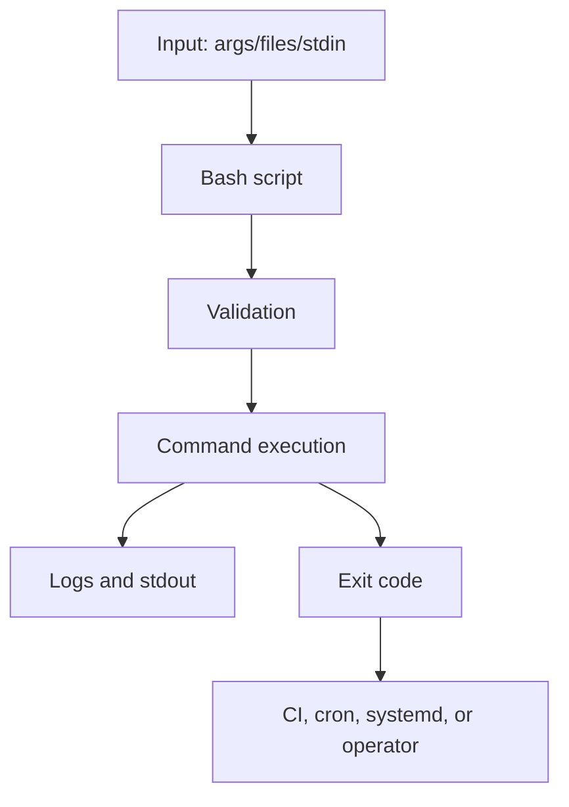

# Bash Overview

## TL;DR

Bash scripting is the glue language of Linux operations. It is used for deployment hooks, health checks, log cleanup, incident triage, file processing, and small automation tasks that do not justify a larger program. For an SRE, the goal is not just to make a script work once; it is to make failure visible, inputs safe, output predictable, and behavior repeatable.

See also: [Scripting FAQ](faq.md), [HackerRank Bash practice](hackerrank.md), [Linux admin basics](../admin/basics.md), and [Linux troubleshooting](../admin/troubleshooting.md).



## Simple script to git checkout

This script demonstrates a common automation pattern: accept arguments, derive a local directory name, clone a repository if needed, check out a branch, and count files. In production scripts, always quote variables, validate arguments, and fail clearly when a command cannot continue.

```bash
# Clone a Git project if missing, check out a branch, and count files.
#!/usr/bin/env bash
set -euo pipefail

project="${1:?Usage: $0 <git-url> <branch>}"
branch="${2:?Usage: $0 <git-url> <branch>}"
base_dir="/home/bob/git"
project_dir="$(basename "${project}" .git)"

clone_project() {
  if [[ ! -d "${base_dir}/${project_dir}" ]]; then
    cd "${base_dir}"
    git clone "${project}"
  fi
}

git_checkout() {
  cd "${base_dir}/${project_dir}"
  git checkout "${branch}"
}

find_files() {
  find . -type f | wc -l
}

clone_project
git_checkout
find_files
```

## redirecting streams

A file descriptor is a unique identifier that the operating system assigns to an open file, pipe, socket, or terminal stream. Shell scripts commonly work with three standard descriptors:

- `0`: stdin, standard input.
- `1`: stdout, standard output.
- `2`: stderr, standard error.

Redirection controls where output and errors go. This matters for cron jobs, CI pipelines, and incident scripts because logs need to capture both normal output and failures.

Common redirection forms:

- `>` redirects stdout to a file.
- `2>` redirects stderr to a file.
- `2>&1` redirects stderr to wherever stdout currently points.
- `&>` redirects both stdout and stderr in Bash.

Example:

```bash
# Send stdout to file1.txt and then send stderr to the same destination as stdout.
ls -z > file1.txt 2>&1
```

Order matters. `ls -z 2>&1 > file1.txt` first points stderr at the current stdout, usually the terminal, and only then redirects stdout to the file. The common script pattern is:

```bash
# Discard both normal output and error output.
ls -z > /dev/null 2>&1
```

### single line modifications

You can open a custom file descriptor with `exec`, read from it, write to it, and then close it. This is useful when a script needs controlled read/write access to a file without reopening it repeatedly.

```bash
# Open a file as descriptor 3, read four characters, insert a dot, and close the descriptor.
echo "Suni lkumar@gmail.com" > email_file.txt
cat email_file.txt
# Suni lkumar@gmail.com -> observe there is a missing 4th letter.

exec 3<> email_file.txt
read -r -n 4 <&3
echo -n "." >&3
exec 3>&-

cat email_file.txt
# Suni.lkumar@gmail.com -> you can now see it is updated.
```

### multiline modifications

Here documents, or heredocs, let you provide multiple lines of input to a command. They are often used for remote SSH execution, config generation, and test fixtures.

```bash
# Run multiple commands on a remote server through SSH using a heredoc.
ssh root@server1 <<'EOF'
mkdir -p ~/heredocs
echo "heredocs" > ~/heredocs/heredocs.txt
EOF
```

Quote the heredoc delimiter, as in `<<'EOF'`, when you do not want the local shell to expand variables before sending the content.

## pipes

Pipes connect the stdout of one command to the stdin of another. They are the foundation of Unix text processing and are heavily used in operational one-liners.

### named-style redirection

This example sends a file into `sort` and writes the sorted result to another file.

```bash
# Sort abc.txt and write the sorted output to sorted_text.txt.
sort < abc.txt > sorted_text.txt
```

### anonymous pipes

Anonymous pipes pass output from one process directly to another process.

```bash
# Search for lines containing "o" and sort the matching output.
grep -i "o" filename.txt | sort
```

Avoid unnecessary `cat` when a command can read a file directly, but do not be dogmatic; readability matters.

One problem with pipelines is that failures in earlier commands may be hidden by later successful commands.

```bash
# Demonstrate that a later command can still run even when the earlier command fails.
ls -z | echo "hello"
```

In another example, the pipeline may fail at `sort`, but the final command can still make the overall result look successful.

```bash
# Without pipefail, the pipeline status can hide earlier command failures.
sort somefile.xtxt | uniq && echo "hello"
echo "$?"
```

### pipefail

`set -o pipefail` makes a pipeline fail if any command in the pipeline fails. This is important in scripts that run under CI, cron, deployment automation, or incident tooling.

```bash
# Enable pipefail so pipeline failures are visible.
set -o pipefail
sort somefile.xtxt | uniq && echo "hello"
echo "$?"
```

Use explicit exit codes when a pipeline failure should terminate the script.

```bash
# set-fail.sh: exit with a known code when a pipeline fails.
#!/usr/bin/env bash
set -o pipefail

sort newfile.txt | uniq || exit 80
```

```bash
# Run the script and inspect the custom exit code.
./set-fail.sh
echo "$?"
```

`noclobber` prevents accidental overwrite with `>`.

```bash
# noclobber.sh: prevent accidental file overwrite.
#!/usr/bin/env bash
set -o noclobber

echo "line1" > file1.txt
echo "line2" > file1.txt

sort somefile.txt | uniq || exit 100
```

`eval` executes a string as shell code. Use it rarely because it can turn data into executable code and create command injection risk.

```bash
# eval.sh: demonstrate eval, but avoid this pattern with untrusted input.
#!/usr/bin/env bash
cmd="ls -l"
eval "$cmd"
```

## arrays

Bash arrays store ordered values. Associative arrays store key-value pairs and require Bash 4 or newer. Arrays are useful for server lists, command arguments, filenames, and lookup maps.

```bash
# Demonstrate indexed arrays, array slicing, sorting, and associative arrays.
#!/usr/bin/env bash

declare -a servers
servers=("server1" "coding" "structure tests")

new_servers=("${servers[@]:0:1}" "server1.5" "${servers[@]:1}")
echo "${new_servers[@]}"

unset 'servers[1]'
echo "${servers[@]}"

declare -a array=("One" "Two" "Three")
array+=("Four" "Five" "Six")
echo "${array[@]}"

declare -a numbers=(5 1 3 2 4)
printf "%s\n" "${numbers[@]}" | sort -n

declare -A fruits
fruits=([apple]="red" [banana]="yellow" [cherry]="red")
echo "${fruits[apple]}"

fruits["green"]="pear"
echo "${fruits[green]}"

fruits["apple"]="new apple"
echo "${fruits[@]}"

unset 'fruits[banana]'
echo "${fruits[@]}"

for key in "${!fruits[@]}"; do
  echo "$key: ${fruits[$key]}"
done
```

Always quote `"${array[@]}"` when passing array values to commands. This preserves spaces inside values.

## variable expansion

Parameter expansion lets you provide defaults, assign defaults, slice strings, replace substrings, and inspect lengths without spawning external commands.

```bash
# Demonstrate default values, assignment, substring extraction, replacement, and string length.
#!/usr/bin/env bash

echo "Hello ${name1:-unknown}"

name="John Doe"
echo "Hello ${name:=unknown}"

echo "Hello, ${name:0:4}"

path="/Users/example/Downloads/file.txt"
echo "${path/Downloads/Documents}"

echo "Length: ${#path}"
```

`${var:-default}` uses a default without changing the variable. `${var:=default}` assigns the default if the variable is unset or empty.

## parameter expansion

`#` removes matching prefixes, and `%` removes matching suffixes. Double forms such as `##` and `%%` remove the longest match.

```bash
# Extract filenames and remove extensions with Bash parameter expansion.
#!/usr/bin/env bash

path="/home/user/Downloads"
echo "Path: ${path##*/}"

greeting="Hello World"
echo "${greeting#H}"
# ello World

echo "${greeting%d}"
# Hello Worl

my_text_file="/home/my_username/text_file.txt"
my_python_file="/usr/bin/app.py"

echo "${my_text_file##*/}"
echo "${my_python_file##*/}"
echo "${my_python_file%.*}"
```

Parameter expansion is faster and safer than shelling out to `basename`, `dirname`, `cut`, or `sed` for simple string operations.

## examples

Examples are where Bash habits become operational muscle memory. The scripts below intentionally show validation, logging, file handling, and exit behavior because those are the patterns that prevent automation from silently doing the wrong thing.

## bash unit testing

This script is a small file-processing example with helper functions. It validates arguments, checks file type, reads uncommented lines, rotates a log file, and logs output.

```bash
# Validate one filename argument, read uncommented lines, trim a log, and append output to app.log.
#!/usr/bin/env bash
set -euo pipefail

help() {
  local scriptname
  scriptname="$(basename "$0")"
  echo "Syntax: ${scriptname} <filename>"
  exit 1
}

validateOnlyOneArgument() {
  if [[ "$#" -ne 1 ]]; then
    echo "FAILED: exactly one argument is required" >&2
    return 1
  fi

  echo "PASSED: one argument passed"
  return 0
}

validateFileOnly() {
  local filename="$1"

  if [[ -f "${filename}" ]]; then
    echo "PASSED: file only"
    return 0
  fi

  if [[ -d "${filename}" ]]; then
    echo "FAILED: directory provided" >&2
    return 1
  fi

  echo "FAILED: file does not exist" >&2
  return 1
}

readUnCommentLinesInFile() {
  local filename="$1"

  while IFS= read -r line; do
    [[ "${line}" = \#* ]] && continue
    printf "%s\n" "${line}"
  done < "${filename}"
}

cleanLogFiles() {
  local logfile="$1"
  local default_lines=50

  [[ -f "${logfile}" ]] || touch "${logfile}"
  tail -n "${default_lines}" "${logfile}" > "${logfile}.tmp"
  mv "${logfile}.tmp" "${logfile}"
  echo "Info: housekeeping on ${logfile} completed"

  return 0
}

countNumberOfLinesInFile() {
  local count=0
  local filename="$1"

  while IFS= read -r _line; do
    ((count++))
  done < "${filename}"

  echo "${count}"
}

whoExecutesThisScript() {
  if [[ "${UID}" -ge 500 ]]; then
    echo "Info: non-root users can execute this script"
  fi
}

main() {
  local filename="$1"
  local logfilename="./app.log"
  local linecountinfile

  whoExecutesThisScript
  linecountinfile="$(countNumberOfLinesInFile "${filename}")"
  echo "lines in file: ${linecountinfile}"

  validateOnlyOneArgument "$@"
  validateFileOnly "${filename}"
  cleanLogFiles "${logfilename}"
  readUnCommentLinesInFile "${filename}"
}

[[ "$#" -ne 1 ]] && help
main "$1" | tee -a app.log
```

## Good practices

Good Bash scripts fail loudly, validate inputs, quote variables, avoid unsafe temp files, and return meaningful exit codes. They should be readable enough for a tired operator to understand during an incident.

### Bash reserved exit codes

```text
# Common shell exit codes.
0    success
1    general error
2    misuse of shell builtins
126  cannot execute
127  command not found
128  invalid exit argument or fatal signal base
130  script terminated by Ctrl-C
```

Useful strict-mode options:

- `set -e`: exits on unhandled command error.
- `set -u`: exits when an unset variable is used.
- `set -o pipefail`: catches errors in piped commands.

### set -e

Incorrect Bash script:

```bash
# safe.sh: without set -e, a failed command can be followed by a misleading success.
#!/usr/bin/env bash

ehco "hello"
exit 0
```

Correct Bash script:

```bash
# safe.sh: set -e exits when ehco fails.
#!/usr/bin/env bash
set -e

ehco "hello"
exit 0
```

### set -u

Incorrect Bash script:

```bash
# safe1.sh: unset last_name expands to an empty value by default.
#!/usr/bin/env bash

name="Sunil"
# last_name="Kumar"

echo "My full name is ${name} ${last_name}..!!"
exit 0
```

Corrected Bash version:

```bash
# safe1.sh: set -u fails when last_name is unset.
#!/usr/bin/env bash
set -u

name="Sunil"
echo "My full name is ${name} ${last_name}..!!"
exit 0
```

### set -o pipefail

Without `pipefail`, an earlier failure can be hidden by a later command in the pipeline.

```bash
# pipefail.sh: pipeline failure can be hidden without pipefail.
#!/usr/bin/env bash

cat non-existent-file.txt | sort | uniq
exit 0
```

The `echo` should not run if `cat` fails, but it can without `pipefail`.

```bash
# pipefail.sh: this echo can run even though cat fails.
#!/usr/bin/env bash

cat non-existent-file.txt | sort | uniq && echo "this line should not be executed"
exit 0
```

Use strict mode and an explicit termination function for clearer failure behavior.

```bash
# pipefail.sh: fail safely when a pipeline command fails.
#!/usr/bin/env bash
set -euo pipefail

readonly PIPE_ERROR=156

terminate() {
  local -r msg="${1}"
  local -r code="${2:-160}"
  echo "${msg}" >&2
  exit "${code}"
}

cat non-existent-file.txt | sort | uniq || {
  terminate "error in piped command" "${PIPE_ERROR}"
}

exit 0
```

## no-op command

The no-op command `:` is a shell builtin that intentionally does nothing and returns success. It is useful as a placeholder in branches, loops, or parameter expansion.

```bash
# Use : as a placeholder for a branch that intentionally does nothing.
#!/usr/bin/env bash

if [[ "${1:-}" = "start" ]]; then
  :
else
  echo "invalid string"
fi
```

## logging

Scripts should log useful events with timestamps. This is especially important when a script runs from cron, CI, or `systemd`.

```bash
# Define a simple UTC timestamped logger.
#!/usr/bin/env bash

log() {
  echo "$(date -u +"%Y-%m-%dT%H:%M:%SZ")" "$@"
}

log "hello world"
```

## awk

`awk` is a domain-specific language for streaming text operations. It expects input from stdin, pipes, or files, splits records into fields, and runs actions against those records. Single quotes around awk programs prevent the shell from expanding awk variables such as `$1`.

```bash
# Print the first colon-separated field from /etc/passwd using awk.
awk -F ":" '{print $1}' /etc/passwd
awk -F ":" '{print $1}' < /etc/passwd
awk -F ":" '{print $1}' /etc/passwd
```

### built-in variables

- `NR`: total number of records, usually lines, processed so far across all input files.
- `NF`: number of fields in the current record.
- `FILENAME`: current file being processed.

Program block: `BEGIN`

Action block: `{print $1}`

```bash
# Print line number and full line for each record.
cat > file1.txt <<'EOF'
apple
banana
cherry
EOF

awk '{ print NR, $0 }' file1.txt
```

```bash
# Print field count and full line for each record.
cat > file2.txt <<'EOF'
apple banana cherry
grape mango
EOF

awk '{ print NF, $0 }' file2.txt
```

```bash
# Show how FILENAME and NR behave across multiple files.
cat > file1.txt <<'EOF'
apple
banana
EOF

cat > file2.txt <<'EOF'
grape
mango
EOF

awk '{ print FILENAME, NR, $0 }' file1.txt file2.txt
```

```bash
# Print filename, record number, field count, and line content.
awk '{ print "File:", FILENAME, "Record:", NR, "Fields:", NF, "Line:", $0 }' file1.txt file2.txt
```

### Field separator

Use `-F` to set the field separator.

```bash
# Print username and shell from /etc/passwd.
awk -F ":" '{print $1, $7}' /etc/passwd
```

Use `-v` to define an awk variable before executing the program.

```bash
# Pass shell variables into awk with -v.
awk -v var="Hello world" 'BEGIN { print var }'

awk -F ":" -v label="Users home directory:" '{print label, $1, $6}' /etc/passwd
```

```bash
# Print users with UID >= 100, then users with UID between 100 and 300.
awk -F ":" -v user="username:" -v uid="100" '$3 >= uid {print user, $1, $3}' /etc/passwd
awk -F ":" -v user="username:" -v uid="100" -v uidlow="300" '$3 >= uid && $3 <= uidlow {print user, $1, $3}' /etc/passwd
```

### using awk-file

You can use an awk program file, but shell expansions such as globbing and command substitution are not available inside awk unless explicitly invoked.

```awk
# hello.awk: executable awk script.
#!/usr/bin/env awk -f
BEGIN {
  print "hello"
}
```

```bash
# Run an inline awk program from Bash.
#!/usr/bin/env bash

awk -v hello="Hello" 'BEGIN {
  print hello
}'
```

## sed

`sed` processes text from the keyboard, files, or pipes and writes transformed output to stdout by default. It is useful for line-based edits, filtering, deletion, and simple substitutions.

```bash
# Print each input line twice because sed prints automatically and the p command prints explicitly.
sed 'p'
```

Use `-n` to suppress automatic printing.

```bash
# Print only the second line.
sed -n '2p' filename.txt
```

Delete lines with `d`.

```bash
# Delete one line or a range of lines and print the remaining output.
sed '2d' filename.txt
sed '2,5d' filename.txt
```

Use `-i` for in-place edits.

```bash
# Delete lines 2 through 5 in-place.
sed -i '2,5d' filename.txt
```

Search patterns usually use `/pattern/` followed by a command such as `p`.

```bash
# Search for root-like patterns in /etc/passwd.
sed -n '/broot/p' /etc/passwd

# Use a word boundary around root.
sed -n '/\broot\b/p' /etc/passwd

# Use -e for multiple sed expressions.
sed -n -e '/\broot\b/p' -e '/\bsunil\b/p' /etc/passwd

# Delete root lines and print sunil lines while editing /tmp/passwd in-place.
sed -i -e '/\broot\b/d' -e '/\bsunil\b/p' /tmp/passwd
```

## Common Pitfalls

- Forgetting to quote variables, especially paths or array elements that contain spaces.
- Ignoring exit codes in scripts used by cron, CI, or deployment automation.
- Using pipelines without `set -o pipefail`.
- Using `eval` with untrusted input.
- Editing files in place with `sed -i` without a backup or test run.
- Parsing structured formats such as JSON or YAML with fragile `grep | awk | sed` chains when a real parser is available.
- Returning values through function exit codes instead of stdout. Exit codes should indicate success or failure, not large numeric data.

## Interview Questions

- What do stdin, stdout, and stderr map to?
- Why does redirection order matter in `2>&1 > file`?
- What does `set -euo pipefail` do?
- Why can pipelines hide failures?
- What is the difference between `"${array[*]}"` and `"${array[@]}"`?
- How does `${path##*/}` work?
- When would you use awk instead of sed?
- What is `NR` and `NF` in awk?
- What does `sed -n` do?
- Why is `eval` risky?

## Key Takeaways

Bash is powerful because it composes Linux commands quickly. It is dangerous for the same reason: small quoting, redirection, and exit-code mistakes can have large effects.

For SRE-grade scripting, prefer strict mode, explicit validation, quoted variables, meaningful logs, clear exit codes, and focused use of awk/sed for text streams. When data becomes structured or logic becomes complex, move to Python, Go, or a purpose-built tool.

See also: [Scripting FAQ](faq.md), [HackerRank Bash practice](hackerrank.md), [Linux admin basics](../admin/basics.md), and [Linux troubleshooting](../admin/troubleshooting.md).
