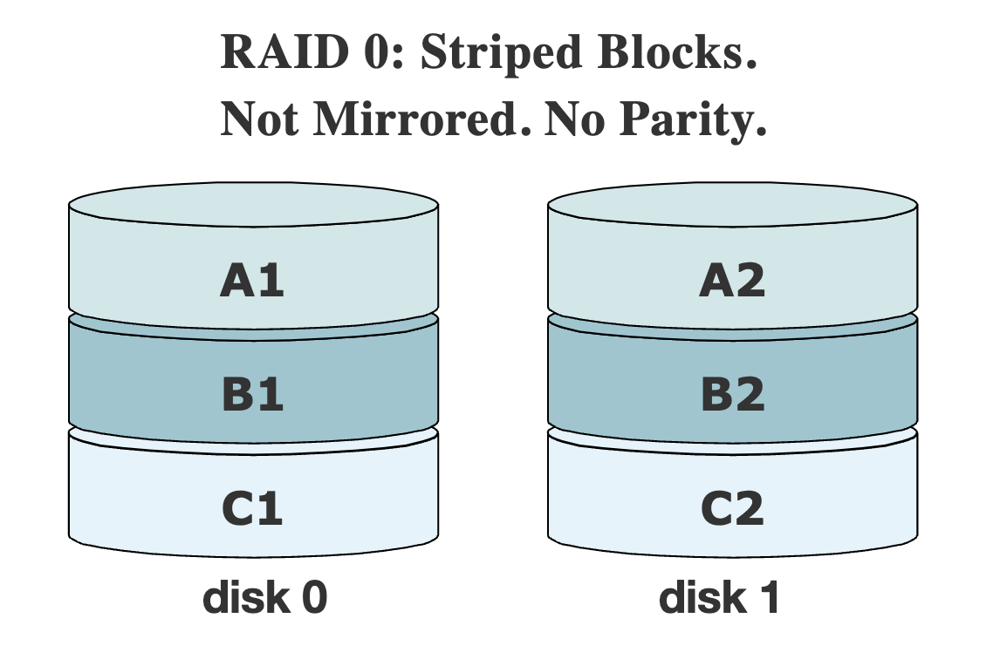
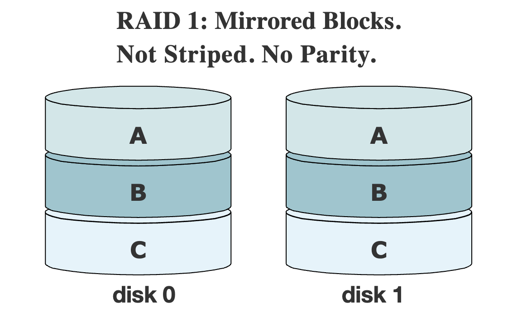
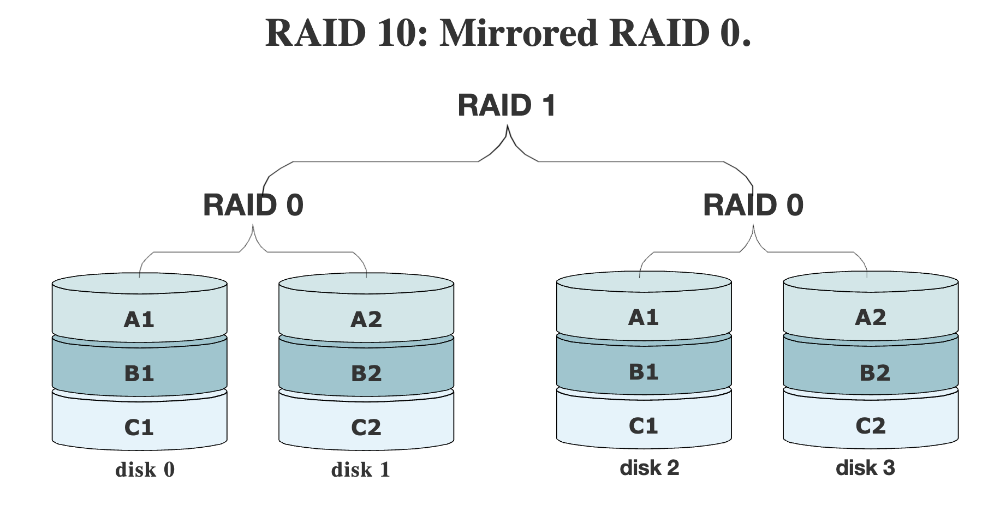
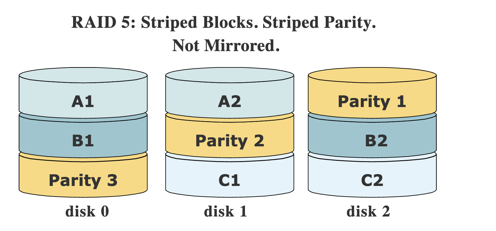

**<h1>Storage</h1>**

- [LVM](#lvm)
  - [How would you create a new LVM ?](#how-would-you-create-a-new-lvm-)
  - [How would you increase the LVM file size?](#how-would-you-increase-the-lvm-file-size)
  - [How would you decrease the LVM ?](#how-would-you-decrease-the-lvm-)
- [Please explain about the RAID, types of RAID in linux?](#please-explain-about-the-raid-types-of-raid-in-linux)
  - [Striped and/or Mirrored (RAID 0, 1, or 10)](#striped-andor-mirrored-raid-0-1-or-10)
  - [Parity (RAID 5 or RAID 6)](#parity-raid-5-or-raid-6)

## LVM

LVM allows for very flexible disk space management. It provides features like the ability to add disk space to a logical volume and its filesystem while that filesystem is **mounted and active** and it allows for the collection of multiple physical hard drives and partitions into a single volume group which can then be divided into logical volumes.

The volume manager also allows reducing the amount of disk space allocated to a logical volume, but there are a couple requirements. First, the **volume must be unmounted**. Second, the filesystem itself must be reduced in size before the volume on which it resides can be reduced.

### How would you create a new LVM ?

**Create a new LVM**

```
pvs
pvcreate /dev/hdd
vgs
vgextend /dev/MyVG01 /dev/hdd
lvcreate -L +50G --name Stuff MyVG01
mkfs -t ext4 /dev/MyVG01/Stuff
e2label /dev/MyVG01/Stuff Stuff
lvs
```

### How would you increase the LVM file size?

**Increase size of LVM**

```
pvs
vgs
lvs
vgextend /dev/MyVG01 /dev/hdd
lvextend -L +50G /dev/MyVG01/Stuff
resize2fs /dev/MyVG01/Stuff
```

### How would you decrease the LVM ?

**Reduce the  size of LVM**

```
df -h /testlvm1
umount /testlvm1
e2fsck -f /dev/mapper/vg01-lv002
resize2fs /dev/mapper/vg01-lv002 80G
lvreduce -L 80G /dev/mapper/vg01-lv002
e2fsck -f /dev/mapper/vg01-lv002
mount /testlvm1
df -h /testlvm1
```

## Please explain about the RAID, types of RAID in linux?

RAID stands for Redundant Array of Inexpensive/Independent Disks

### Striped and/or Mirrored (RAID 0, 1, or 10)

RAID 0, data is written across the drives, or “striped”. This means it can potentially be read from more
than one drive concurrently. That can give us a real performance boost. Now we have two drives that
could fail, taking out all our data. So, RAID 0 is only useful if we want a performance boost but don’t
care about long-term storage.



We refer to RAID level 1 as “mirrored” because it is created with a pair of equal drives.
Each time data is written to a RAID 1 device, it goes to both drives in the pair.



We can create a RAID 10 device with four disks: one pair of disks in RAID 0, mirroring another pair of disks in RAID 0



### Parity (RAID 5 or RAID 6)

RAID 5 requires at least three equal-size drives to function. In practice, we can add several more, though rarely more than ten are used.
RAID 5 sets aside one drive’s worth of space for checksum parity data. It is not all kept on one drive, however; instead, the parity data is striped across all of the devices along with the filesystem data.

This means we usually want to build our RAID out of a set of drives of identical size and speed. Adding a larger drive won’t get us more space, as the RAID will just use the size of the smallest member. Similarly, the RAID’s performance will be limited by its slowest member.

RAID 5 can recover and rebuild with no data loss if one drive dies. If two or more drives crash, we’ll have to restore the whole thing from backups.

RAID 6 is similar to RAID 5 but sets aside two disks’ worth for parity data. That means a RAID 6 can recover from two failed members.

RAID 5 gives us more usable storage than mirroring does, but at the price of some performance. A quick way to estimate storage is the total amount of equal-sized drives, minus one drive. For example, if we have 6 drives of 1 terabyte, our RAID 5 will have 5 terabytes of usable space. That’s 83%, compared to 50% of our drives were mirrored in RAID 1.



---