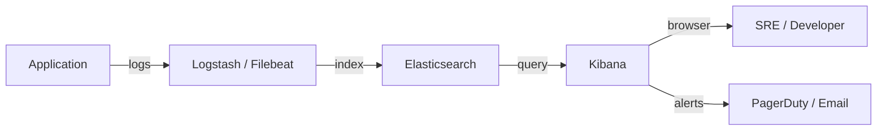

## TL;DR

Kibana is the browser-based visualisation and management layer of the ELK stack. It connects to Elasticsearch and provides: a Dev Tools console for running queries interactively, Discover for ad-hoc log exploration, Lens and Visualize for building charts and dashboards, Alerts for rule-based notifications, and a suite of management UIs for index lifecycle management, security, and monitoring. For SREs, Kibana is the primary interface for log-based incident response, building SLO dashboards on Elasticsearch data, and managing cluster settings.

See also: [Elasticsearch Install & Setup](../elasticsearch/01_install.md) | [Logstash Overview](../logstash/overview.md)

---

## What Is Kibana?

Kibana is the "K" in the ELK stack (Elasticsearch, Logstash, Kibana). It is a Node.js web application that runs as a separate process alongside Elasticsearch and exposes a browser-based UI for interacting with Elasticsearch data. Every feature in Kibana is ultimately an abstraction over Elasticsearch's REST API — what you can do in the Kibana UI, you can also do directly against the Elasticsearch API.

**Why does this matter for an SRE?** During an incident, you will query Elasticsearch logs through Kibana's Discover interface. During post-incident analysis, you will build timelines from log data in Kibana. For ongoing reliability, you will create Kibana dashboards that visualise error rates, latency distributions, and log volumes over time — the same way you build Grafana dashboards for metrics.



---

## Accessing Kibana

After starting Kibana (`bin/kibana` from the install directory), open your browser to:

```
http://localhost:5601/app/home#/
```

Log in with the `elastic` superuser credentials generated during Elasticsearch's first startup. In production, create role-specific users with minimal permissions (e.g., a read-only `sre-readonly` role for dashboard access, a `sre-operator` role with write access to dashboards and alerts).

---

## Key Tools for SREs

### Dev Tools Console

The primary interface for running Elasticsearch queries directly. Found at **Menu → Management → Dev Tools → Console**.

The Dev Tools console handles authentication and TLS automatically. Each request is a pair: the HTTP verb + path on the first line, and the optional JSON body below. Press **Ctrl+Enter** to run the selected request.

```json
// Check cluster health — always start here during an incident
GET /_cluster/health

// Search for ERROR logs in the last 15 minutes
GET /app-logs-*/_search
{
  "query": {
    "bool": {
      "must": [
        { "match": { "level": "ERROR" } },
        { "range": { "@timestamp": { "gte": "now-15m", "lt": "now" } } }
      ]
    }
  },
  "sort": [{ "@timestamp": "desc" }],
  "size": 50
}
```

### Discover

Found at **Menu → Analytics → Discover**. The log exploration interface for interactive, ad-hoc queries. It provides a timeline histogram of document counts and a streaming log view.

**SRE incident workflow:**

```
1. Set time range to: [incident_start - 5min, now]
2. Filter: level:ERROR AND service.name:"payment-api"
3. Add columns: @timestamp, error.message, trace.id, http.response.status_code
4. Sort by @timestamp desc to see most recent errors first
5. Click a trace.id to pivot into APM for the full distributed trace
```

### Lens and Dashboards

Found at **Menu → Analytics → Dashboards**. Kibana Lens is the drag-and-drop visualisation builder. Recommended panels for a service-level SRE dashboard:

- **Metric panel** — Total error count in the time window
- **Line chart** — Error rate over time (errors / total requests)
- **Bar chart** — Errors broken down by `service.name`
- **Data table** — Top 10 most frequent error messages
- **Log viewer** — Last 100 raw ERROR logs from the affected service

### Alerts and Rules

Found at **Menu → Management → Rules**. Create rules that query Elasticsearch on a schedule and fire actions (email, Slack, PagerDuty webhook) when conditions are met.

**SRE use case:** Alert when a specific error pattern appears (e.g., `OOMKilled`), or when a log index has not received data for more than N minutes (indicating a broken log pipeline).

```
Example: "No data" alert for broken log pipelines
- Type: Elasticsearch query rule
- Query: count of docs in logs-payment-api-* in last 5 minutes
- Condition: count < 1   (no logs = pipeline is broken)
- Action: Slack #ops-alerts
- Schedule: every 5 minutes
```

### Index Management

Found at **Menu → Management → Stack Management → Index Management**. Shows all indices with sizes, document counts, and health. Used for managing index lifecycle policies (ILM) to automatically roll over, archive, or delete old indices.

---

## Data Views (Index Patterns)

Before you can explore data in Discover or build visualisations, create a **Data View** that tells Kibana which Elasticsearch indices to query and which field is the timestamp.

```
Create a data view:
1. Menu → Stack Management → Data Views → Create data view
2. Index pattern: app-logs-*  (wildcard matches daily indices like app-logs-2025-08-01)
3. Timestamp field: @timestamp
4. Save
```

---

## Common Pitfalls

**Not creating a data view before using Discover.** Discover requires a data view matching your index names.

**Using Kibana as a replacement for metric-based alerting.** Kibana alert rules query Elasticsearch on a schedule and have latency. Use Kibana alerts for log-pattern detection; use Prometheus/Alertmanager for real-time SLI-based alerting.

**Not setting the time range correctly.** Kibana defaults to "last 15 minutes." During incident investigations spanning hours, always set the time range explicitly.

**Dashboard sprawl.** Maintain 1-2 canonical dashboards per service: one dense technical view for on-call engineers and one summary view for management.

---

## Interview Questions

1. **What is Kibana and how does it relate to Elasticsearch?** (Browser-based UI layer over Elasticsearch's REST API. Everything Kibana does can also be done directly via the Elasticsearch API.)

2. **How would you use Kibana to investigate a spike in 500 errors on the payment service?** (Open Discover, select the log data view, set time to incident window, filter for `level:ERROR AND service.name:"payment-api"`, add trace_id and error.message columns, group by error message to find the dominant failure.)

3. **What is a data view in Kibana and why is it needed?** (Defines which Elasticsearch indices to query and which field is the timestamp. Required before using Discover or visualisations.)

4. **How would you detect a broken log pipeline using Kibana Alerts?** (Create a query rule that fires when the document count in the log index is zero over a 5-minute window.)

---

## Key Takeaways

- **Kibana is the UI layer over Elasticsearch.** Understanding the underlying API makes you more effective in Kibana and beyond it.
- **Dev Tools console is your most important SRE tool in Kibana.** Full Elasticsearch query syntax with no UI limitations.
- **Discover is for incident investigation; dashboards are for ongoing monitoring.**
- **Data views connect Kibana to your indices.** Always create one for each log family before trying to visualise data.
- **Kibana Alerts complement, not replace, Prometheus alerting.** Use Kibana for log-pattern detection; use Prometheus for real-time SLI-based alerting.

---

## Kibana