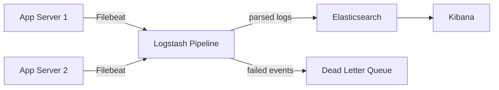

## TL;DR

Logstash is the "L" in the ELK stack — a server-side data processing pipeline that ingests data from one or more sources, transforms it, and sends it to one or more destinations. In the context of SRE and observability, Logstash sits between your applications (or log shippers like Filebeat) and Elasticsearch, handling log parsing, enrichment, field normalisation, and routing. Understanding Logstash is essential for building reliable log ingestion pipelines, debugging why logs are not appearing in Kibana, and designing scalable observability infrastructure.

See also: [Elasticsearch Install & Setup](../elasticsearch/01_install.md) | [Kibana Overview](../kibana/overview.md)

---

## What Is Logstash?

Logstash is a JVM-based data processing pipeline. It reads events from inputs, processes them through an ordered chain of filters, and writes them to outputs. In a typical ELK deployment, Logstash receives logs from Filebeat agents, parses unstructured log lines into structured JSON fields, enriches events, routes them to different Elasticsearch indices, and handles backpressure when Elasticsearch is temporarily unavailable.

**Why does this matter for an SRE?** A broken Logstash pipeline means logs stop flowing to Elasticsearch, which means Kibana shows nothing, which means you are flying blind during an incident. Logstash pipeline health is a critical observability dependency — monitor it the same way you monitor your application.



---

## Pipeline Architecture

A Logstash pipeline is defined in a `.conf` configuration file with three required sections: `input`, `filter`, and `output`. Logstash can run multiple pipelines simultaneously (defined in `pipelines.yml`), allowing different log sources to follow different processing paths.

```
Logstash Pipeline:

  Input Plugins      Filter Plugins       Output Plugins
  +------------+     +-------------+      +---------------+
  | beats      | --> | grok        | -->  | elasticsearch |
  | file       |     | mutate      |      | s3            |
  | kafka      |     | date        |      | kafka         |
  | http       |     | geoip       |      | stdout        |
  | syslog     |     | drop / if   |      +---------------+
  +------------+     +-------------+
```

---

## Configuration Structure

All three sections are required even if `filter` is empty.

```ruby
# /etc/logstash/conf.d/my-pipeline.conf
# Minimal pipeline: receive from Beats, send to Elasticsearch

input {
  beats {
    port => 5044      # Filebeat agents connect to this port
    ssl  => true      # Always enable TLS in production
  }
}

filter {
  # Filters are applied sequentially -- order matters
}

output {
  elasticsearch {
    hosts    => ["https://localhost:9200"]
    index    => "app-logs-%{+YYYY.MM.dd}"  # Daily index rotation
    user     => "logstash_writer"
    password => "${LOGSTASH_ES_PASSWORD}"  # Never hardcode credentials
    ssl_certificate_verification => true
  }
}
```

---

## Input Plugins

**beats** — Receives data from Filebeat, Metricbeat, and other Elastic Beats agents. The standard input for shipping logs from application servers.

**kafka** — Reads messages from Apache Kafka topics. Used in high-throughput architectures where Kafka acts as a buffer and provides durability and backpressure handling.

**file** — Reads from files on the Logstash host's filesystem. Useful when log files are local rather than shipped from remote agents.

**http** — Exposes an HTTP endpoint that applications can `POST` log events to directly.

**syslog** — Listens for syslog messages (UDP/TCP port 514). Useful for network devices, load balancers, and legacy applications.

```ruby
# Example: receiving from both Beats and Kafka simultaneously
input {
  beats {
    port => 5044
    tags => ["from_beats"]
  }
  kafka {
    bootstrap_servers => "kafka1:9092,kafka2:9092"
    topics            => ["app-logs"]
    group_id          => "logstash-consumers"
    tags              => ["from_kafka"]
  }
}
```

---

## Filter Plugins

### grok — Parse Unstructured Text

Grok is the most important filter. It uses named regular expression patterns to parse unstructured log lines into structured fields. Test patterns at [grokdebugger.com](https://grokdebugger.com) before deploying.

```ruby
filter {
  # Parse an Apache Combined Log Format line
  # Input: 192.168.1.1 - frank [10/Oct/2000:13:55:36 -0700] "GET /index.html HTTP/1.0" 200 2326
  grok {
    match => {
      "message" => '%{IPORHOST:client_ip} %{USER:ident} %{USER:auth} \[%{HTTPDATE:timestamp}\] "%{WORD:method} %{URIPATHPARAM:request} HTTP/%{NUMBER:http_version}" %{NUMBER:response_code:int} %{NUMBER:bytes:int}'
    }
    tag_on_failure => ["_grokparsefailure"]  # Tag events that fail to parse -- monitor this!
  }
}
```

### mutate — Modify Fields

Renames, removes, converts, and modifies fields. Essential for field normalisation across different log sources.

```ruby
filter {
  mutate {
    rename       => { "host" => "hostname" }           # Avoid collision with ES host object
    convert      => { "response_code" => "integer" }   # Enable range queries
    add_field    => { "pipeline" => "web-access-logs" } # Identify the source pipeline
    remove_field => ["agent", "input", "log", "ecs"]   # Remove unnecessary fields
  }
}
```

### date — Parse Timestamps

Parses a timestamp string into `@timestamp`. **Critical:** without this, `@timestamp` defaults to the time Logstash received the event, not when the event was generated. This makes incident timelines impossible.

```ruby
filter {
  date {
    match        => ["timestamp", "dd/MMM/yyyy:HH:mm:ss Z"]
    target       => "@timestamp"
    timezone     => "UTC"
    remove_field => ["timestamp"]  # Remove the original string field after parsing
  }
}
```

### geoip — Enrich with Geographic Data

Looks up an IP address in the MaxMind GeoLite2 database and adds geographic fields. Useful for visualising traffic origins on a Kibana map.

```ruby
filter {
  geoip {
    source => "client_ip"
    target => "geoip"
    fields => ["city_name", "country_name", "location"]
  }
}
```

### Conditional Routing

Use `if/else` to apply different filters or route to different outputs based on field values.

```ruby
filter {
  if [level] == "ERROR" {
    mutate { add_tag => ["error_log"] }
  }

  if "from_beats" in [tags] {
    grok { ... }  # Beats-specific parsing
  } else if "from_kafka" in [tags] {
    json { source => "message" }  # Kafka messages are already JSON
  }
}
```

---

## Output Plugins

**elasticsearch** — The primary output. Writes events to Elasticsearch using the bulk index API.

**kafka** — Writes events to Kafka topics for downstream consumers.

**s3** — Writes compressed JSON to AWS S3 for long-term archive storage.

**stdout** — Prints to standard output. Invaluable for debugging pipeline configuration locally.

```ruby
output {
  # All events go to daily Elasticsearch indices
  elasticsearch {
    hosts    => ["https://es1:9200", "https://es2:9200"]
    index    => "app-logs-%{+YYYY.MM.dd}"
    user     => "logstash_writer"
    password => "${LOGSTASH_ES_PASSWORD}"
  }

  # Error events also go to a dedicated high-priority index
  if "error_log" in [tags] {
    elasticsearch {
      hosts  => ["https://es1:9200"]
      index  => "error-logs-%{+YYYY.MM.dd}"
      user     => "logstash_writer"
      password => "${LOGSTASH_ES_PASSWORD}"
    }
  }

  # Uncomment for debugging:
  # stdout { codec => rubydebug }
}
```

---

## Dead Letter Queue

The Dead Letter Queue (DLQ) captures events that Logstash fails to write to the output (e.g., documents rejected by Elasticsearch due to a mapping conflict). Without a DLQ, these events are silently dropped. Enable it in all production deployments.

```yaml
# logstash.yml
dead_letter_queue.enable: true
dead_letter_queue.max_bytes: 1gb
path.dead_letter_queue: /var/lib/logstash/dead_letter_queue
```

```ruby
# Re-process DLQ events after fixing the root cause
input {
  dead_letter_queue {
    path           => "/var/lib/logstash/dead_letter_queue"
    commit_offsets => true
    pipeline_id    => "main"
  }
}
output {
  elasticsearch { ... }
}
```

---

## Monitoring Pipeline Health

A broken Logstash pipeline is an observability outage. Monitor the built-in monitoring API:

```bash
# Check pipeline stats via the Logstash monitoring API (port 9600)
curl http://localhost:9600/_node/stats/pipelines?pretty

# Key metrics to alert on:
# events.in   -- events received by input
# events.out  -- events written to output
# If events.in >> events.out: backpressure or output failure
# dead_letter_queue.queue_size_in_bytes > 0: Elasticsearch rejecting events
```

Export these metrics to Prometheus via the Logstash Prometheus exporter and alert when `events.out` drops to zero or DLQ size exceeds a threshold.

---

## Common Pitfalls

**Not parsing `@timestamp` correctly.** If you skip the `date` filter, `@timestamp` is the time Logstash received the event, not when it was generated. This makes log correlation with the actual incident timeline impossible.

**Hardcoding credentials in pipeline configs.** Always use environment variables or the Logstash keystore (`bin/logstash-keystore`). Pipeline configs are often committed to version control.

**Not enabling the Dead Letter Queue.** Events rejected by Elasticsearch are silently dropped without the DLQ. Enable it in all production deployments.

**Grok parsing failures accumulating silently.** Grok adds a `_grokparsefailure` tag to events it cannot parse. Monitor for this tag and alert if it exceeds a threshold.

**Running Logstash on the same host as Elasticsearch.** Logstash is JVM-based and memory-intensive. Co-locating it with Elasticsearch causes resource contention. For simple pipelines, consider using Filebeat with Elasticsearch Ingest Pipelines instead.

---

## Interview Questions

1. **Describe the three stages of a Logstash pipeline.** (Input: ingest events. Filter: transform/enrich/route. Output: send to destination.)

2. **What is the grok filter and when would you use it vs. the json filter?** (Grok: parse unstructured text using named regex patterns. json: parse pre-formatted JSON. Use json when your app already emits structured JSON — it is much faster.)

3. **A developer reports their logs show the wrong timestamp in Kibana.** (Add a `date` filter that parses the timestamp from the log line into `@timestamp`.)

4. **What is the Dead Letter Queue and why is it important?** (Captures events that cannot be written to output, preventing silent data loss. Essential for diagnosing Elasticsearch mapping conflicts.)

5. **How would you route ERROR logs to a separate Elasticsearch index?** (Use `if [level] == "ERROR" { ... }` in the output block with a separate `elasticsearch` output targeting the error-specific index.)

---

## Key Takeaways

- **Logstash is the transformation layer between raw logs and searchable Elasticsearch data.** The three stages: input, filter, output.
- **Grok is the most commonly needed filter.** Always test patterns in the Kibana Grok Debugger before deploying.
- **Always parse `@timestamp` with the date filter.** Without it, log timestamps in Kibana reflect ingestion time, not event time.
- **Enable the Dead Letter Queue in production.** Silent event loss from Elasticsearch rejections is one of the hardest observability bugs to diagnose.
- **Monitor Logstash pipeline health (`/_node/stats/pipelines`)** the same way you monitor your application. A broken pipeline is an observability outage.
- **Never hardcode credentials in pipeline configs.** Use environment variables or the Logstash keystore.

---

## Logstash