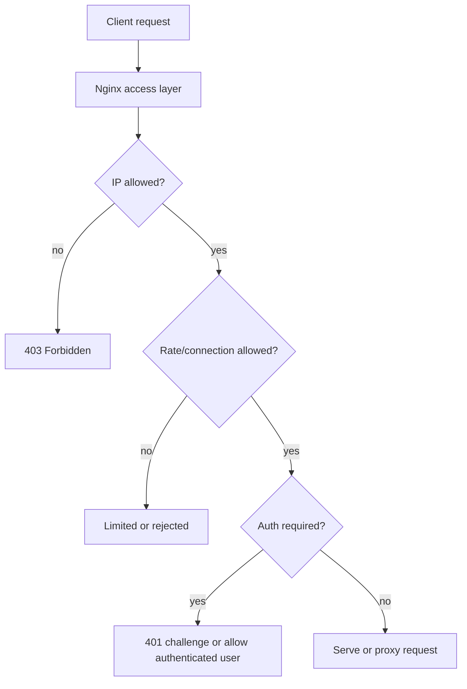
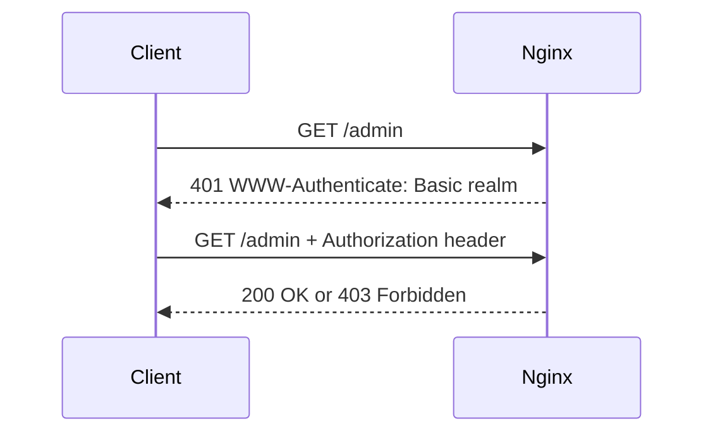

## TL;DR

Nginx access control limits who can reach a resource, how fast they can consume it, and whether they must authenticate first. Common controls include IP allowlists/denylists, bandwidth limits, connection limits, and HTTP Basic Auth. For an SRE, these controls matter because they can protect sensitive endpoints and stabilize traffic, but misconfiguration can also lock out users, hide real client IPs, or create confusing `401`, `403`, and `429` behavior.

See also: [Nginx overview](nginx_overview.md), [HTTP protocol](http_protocol.md), [Reverse proxy](reverse_proxy.md), [Logging](logging.md), [Load balancer](load_balancer.md), and [Cryptography](cryptography.md).



## whitelisting

Whitelisting, more commonly called allowlisting, permits only specified clients or networks to reach a resource. In Nginx, this is usually done with `allow` and `deny` directives. It is useful for admin pages, internal dashboards, staging environments, health endpoints, and temporary incident controls.

Be careful when Nginx is behind a load balancer or reverse proxy. `$remote_addr` may be the proxy IP, not the real client IP, unless real IP handling is configured correctly.

Use this example to allow one client IP and deny everyone else.

```nginx
# Create an allowlist snippet and include it in a protected location.
vim /etc/nginx/conf.d/whilelist.conf
allow 192.168.56.101;
deny all;

vim /etc/nginx/conf.g/nginx.conf
server {
    server_name localhost.com;

    location /admin {
        root /var/www/html/webroot;
        index admin.html;
        include /etc/nginx/conf.d/whilelist.conf;
    }
}

nginx -t
systemctl restart nginx

curl -I localhost.com/admin
```

The original filename `whilelist.conf` appears to mean `whitelist.conf`. The name does not matter to Nginx as long as the include path matches, but clear names help future operators.

## limit connections

Bandwidth and connection limits prevent one client or request class from consuming too much server capacity. For example, if a server has 100 Mbps of available network bandwidth and ten users are downloading large files, one high-bandwidth client can dominate the connection. Nginx can reduce this risk with `limit_rate`.

Use `limit_rate` to cap download speed for a location.

```nginx
# Limit download bandwidth for the /download location.
vim /etc/nginx/conf.g/nginx.conf
server {
    server_name localhost.com;

    location /download {
        limit_rate 50k;
    }
}

nginx -t
systemctl restart nginx
```

Rate limiting bandwidth helps, but the same IP can still open many simultaneous connections and consume worker connections, file descriptors, upstream connections, or disk I/O. Use `limit_conn_zone` and `limit_conn` to restrict concurrent connections.

Use this example to allow only one concurrent connection per client IP for `/download`.

```nginx
# Define a shared memory zone keyed by client IP and limit /download to one connection per IP.
vim /etc/nginx/conf.g/nginx.conf

# global config section
limit_conn_zone $binary_remote_addr zone=addr:10m;

# where:
# $binary_remote_addr is the compact binary form of the remote client address.
# zone=addr:10m creates a 10 MB shared memory zone named addr.

server {
    server_name localhost.com;

    location /download {
        limit_rate 50k;
        limit_conn addr 1;
    }
}

# where:
# For the download directory, the addr zone can have only 1 connection.

nginx -t
systemctl restart nginx
```

For production, test limits with realistic traffic before enabling them broadly. Aggressive limits can harm users behind NAT, corporate proxies, or mobile carriers because many real users may share one apparent source IP.

## basic auth

HTTP authentication commonly includes Basic, Digest, and NTLM-style authentication. Basic Auth is simple and widely supported. The client requests a protected resource such as `GET /admin`; the server responds with `401 Unauthorized` and a `WWW-Authenticate: Basic realm="..."` header; the browser prompts for username and password; the browser sends an `Authorization` header on the next request.

Basic Auth does not encrypt credentials by itself. It base64-encodes them, which is reversible. Always use HTTPS when Basic Auth protects anything sensitive.



### Configuration

Install `apache2-utils` or the equivalent package that provides `htpasswd`, then create users in a password file.

```bash
# Install htpasswd tooling and create users for Basic Auth.
sudo htpasswd -c /etc/nginx/.htpasswd user1
sudo htpasswd /etc/nginx/.htpasswd user2
```

Use this Nginx configuration to combine IP-based access rules and Basic Auth for `/api`.

```nginx
# Protect /api with both IP access rules and Basic Auth.
vim /etc/nginx/conf.g/nginx.conf

http {
    server {
        listen 192.168.1.23:8080;
        root   /usr/share/nginx/html;

        location /api {
            satisfy all;

            deny  192.168.1.2;
            allow 192.168.1.1/24;
            allow 127.0.0.1;
            deny  all;

            auth_basic           "Administrator's Area";
            auth_basic_user_file /etc/nginx/.htpasswd;
        }
    }
}
```

The `satisfy all` directive means all access modules must allow the request. In this example, the client must match the IP access rules and pass Basic Auth. With `satisfy any`, either condition can allow access, which is useful for allowing trusted internal IPs while requiring passwords for everyone else.

## hashing

Hashing converts data into a fixed-size value called a hash value or hash code. Hash functions are designed to be fast, deterministic, and to distribute values well for a given input set. In security contexts, cryptographic hashes are used for integrity checks, password storage, signatures, and challenge-response protocols.

Hashing is used for:

- Data storage.
- Data security.
- Cryptography.

Different hashing algorithms:

- MD5: 128-bit hash value. MD5 is considered broken for collision resistance and should not be used for modern security-sensitive designs.
- SHA-1: 160-bit hash value. SHA-1 is also deprecated for collision-sensitive security uses.
- SHA-2: a stronger family that includes SHA-256 and SHA-512.

For password storage, use password-hashing algorithms such as bcrypt, scrypt, Argon2, or well-supported `htpasswd` formats rather than plain fast hashes. Fast hashes are poor password stores because attackers can brute-force them quickly.

## digest authentication

Digest authentication is a method for authenticating users in network communication protocols, especially web servers and clients. It improves on HTTP Basic Authentication by avoiding sending the password itself over the network. Instead, the client sends a computed digest based on the username, password, server nonce, and other request details.

### how it works

When a client, typically a web browser, sends a request to a server that requires authentication, the server responds with `401 Unauthorized` and a challenge. The challenge includes a nonce, which is a random value used once or for a limited window.

After receiving the `401`, the client prompts the user for a username and password, similar to Basic Auth. Instead of sending the password directly, the client computes a cryptographic hash over values such as username, password, nonce, method, and URI. This hash is called a digest.

The client sends the digest, username, nonce, and required parameters to the server in another request. The server recalculates the digest using its copy of the password or password-equivalent material. If the values match, the server authenticates the user.

Digest authentication offers several advantages over Basic Authentication:

### Security

Passwords are not sent directly over the network, making digest authentication less susceptible to simple eavesdropping than Basic Auth over plain HTTP. However, HTTPS is still strongly recommended because Digest does not protect all metadata and older algorithms may be weak.

### Nonce

The use of a nonce makes replay attacks harder because each nonce is valid only for a single authentication attempt or limited scope. Correct nonce handling matters; weak or reusable nonces reduce the value of Digest Auth.

### Flexibility

Digest authentication can integrate with some existing authentication mechanisms and is compatible with proxies and caching in certain deployments. In practice, many modern systems prefer OAuth/OIDC, SAML, mTLS, or application-level sessions.

Note: Nginx does not support dynamic digest authentication in the same simple built-in way as Basic Auth. If you need stronger modern authentication, consider an identity-aware proxy, OAuth/OIDC gateway, mTLS, or application-native auth.

## Common Pitfalls

- Relying on Basic Auth without HTTPS. Base64 is not encryption.
- Using IP allowlists behind proxies without configuring real client IP handling.
- Blocking legitimate users behind NAT by setting per-IP connection limits too low.
- Forgetting semicolons in Nginx directives.
- Using `htpasswd -c` repeatedly and accidentally overwriting the password file.
- Trusting client-supplied forwarding headers for access control.
- Treating MD5 or SHA-1 as acceptable for modern security-sensitive hashing.

## Interview Questions

- How do `allow` and `deny` work in Nginx?
- What is the difference between allowlisting and authentication?
- What does `limit_rate` do?
- How do `limit_conn_zone` and `limit_conn` work together?
- What happens during an HTTP Basic Auth challenge?
- Why must Basic Auth use HTTPS?
- What does `satisfy all` mean in Nginx?
- What is a nonce in Digest Authentication?
- Why are MD5 and SHA-1 discouraged for modern security?
- How would you protect an internal admin endpoint exposed through Nginx?

## Key Takeaways

Nginx access control combines network identity, request limits, and authentication. Each control solves a different problem: IP rules restrict who can reach a path, rate/connection limits protect capacity, and authentication verifies a user or client.

For production, access controls must account for proxies, NAT, TLS, logging, and operational recovery. Test controls before rollout, log denials clearly, and keep a break-glass path for administrators.

See also: [Nginx overview](nginx_overview.md), [HTTP protocol](http_protocol.md), [Reverse proxy](reverse_proxy.md), [Logging](logging.md), [Load balancer](load_balancer.md), and [Cryptography](cryptography.md).
