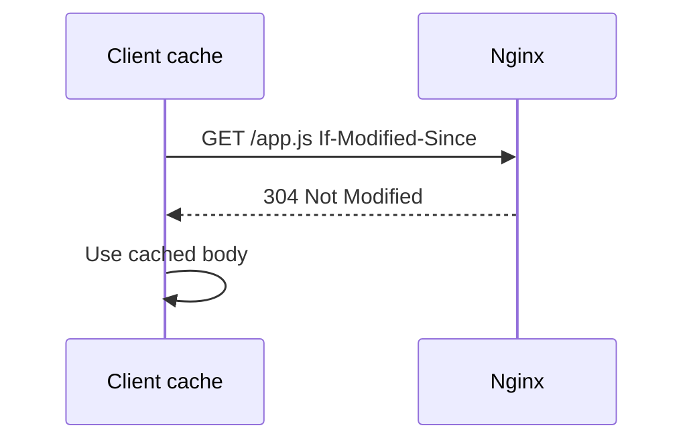

## TL;DR

HTTP caching stores reusable responses closer to the client so future requests can be served faster and with less backend load. Nginx can influence browser caches with response headers and can also act as a shared proxy cache in front of upstream applications. For an SRE, caching matters because it improves latency and availability, but bad cache rules can serve stale content, leak private data, or hide application failures.

See also: [HTTP protocol](http_protocol.md), [Nginx overview](nginx_overview.md), [Reverse proxy](reverse_proxy.md), [Static assets](static_assets.md), [HTTP compression](http_compression.md), and [Logging](logging.md).

## Overview

Caching reduces repeated work. Instead of generating or downloading the same response every time, the client, browser, CDN, reverse proxy, or Nginx cache can reuse a response that is still valid. The challenge is correctness: the cache must know when it is safe to reuse a response and when it must revalidate or fetch fresh content.


### Benefits

- It reduces the overhead of server resources. Cached responses avoid repeated application execution, database reads, template rendering, and file I/O.
- It decreases network bandwidth. Static assets such as images, CSS, JavaScript, and downloads can be reused instead of transferred repeatedly.
- Pages load faster. When browsers or edge caches reuse valid content, users see lower latency and fewer blocking network requests.
- It improves resilience. During partial upstream degradation, a shared cache may continue serving known-good cacheable responses.

## caching subsystems

Caching can happen at several layers. Browser caches are private to one user agent. CDN and proxy caches are shared by many clients. Nginx can set headers that control downstream caches, and it can also cache upstream responses when configured as a reverse proxy cache.

The main operational question is always: "Who is allowed to cache this response, and for how long?"

### caching control(headers)

Cache-control headers specify directives for caching mechanisms. They define caching policies such as whether a page can be cached, whether it must be revalidated, and whether it is safe for shared caches. These headers are interpreted by browsers, CDNs, proxies, and sometimes application clients.

Use cases:

- Do not store any kind of cache at all.
- Store the cache, but verify with the webserver whether the file is modified.
- Store the cache for 24 hours.

Common cache-control headers:

- `Cache-Control: no-store`
- `Cache-Control: no-cache`
- `Cache-Control: no-store, must-revalidate`
- `Cache-Control: public`
- `Cache-Control: private`

Configure all `.png` files so the browser should not store them in cache.

```nginx
# Add Cache-Control: no-store to PNG responses served by Nginx.
server {
    listen       80;
    server_name  localhost;

    location / {
        root   /usr/share/nginx/html;
        index  index.html index.htm;
    }

    location ~ \.(.png) {
       root   /usr/share/nginx/html;
       add_header Cache-Control no-store;
    }

}

systemctl restart nginx
```

From your client CLI, request the `.png`. When you check the response headers, you should see the cache header.

```bash
# Fetch only response headers to verify Cache-Control behavior.
curl -I http://your-web-server/myseed.png
```

For production, `no-store` is appropriate for sensitive responses such as account pages, tokens, private documents, and personalized API output. It is usually not appropriate for versioned static assets because it prevents useful browser caching.

### if modified header

Conditional requests let a client ask whether a cached resource is still valid. The client sends headers such as `If-Modified-Since` or `If-None-Match`. Nginx or the upstream server compares those values with `Last-Modified` or `ETag` and can return `304 Not Modified` when the cached copy is still valid.

The original note says Nginx returns a `302` when there is no change, but the usual HTTP response is `304 Not Modified`. A `302` means redirect, not cache validation. This distinction matters when troubleshooting because a `304` is a successful revalidation response while a `302` changes the requested URL.



Use conditional requests for assets that may change but do not need to be downloaded repeatedly. This is common for static files that have `Last-Modified` or `ETag` headers.

### cache control header

The cache-control header can define how long a webpage or asset should remain fresh. Fresh responses can be reused without contacting the origin server. Stale responses require revalidation or refetching depending on policy.

Use `expires` to make PNG files cacheable for one hour.

```nginx
# Cache PNG responses for one hour by setting Expires and Cache-Control headers.
location ~ \.(.png) {
    root   /usr/share/nginx/html;
    expires 1h;
}
```

Verify the response headers from the client.

```bash
# Fetch headers and inspect Expires and Cache-Control values.
curl -I http://your-web-server/myseed.png
```

For static assets with fingerprinted filenames, such as `app.3f4a9c.js`, long cache lifetimes are safe because content changes create a new URL. For non-versioned files like `/app.js`, long cache lifetimes can make rollbacks and deployments painful.

### cache: no-store, must-revalidate

`no-store` tells caches not to store the response at all. This is the strongest common directive for sensitive content. `must-revalidate` tells caches they must not serve stale content after it expires without checking with the origin.

Use this for sensitive or correctness-critical responses.

```nginx
# Prevent storage and require revalidation for sensitive responses.
location /account {
    add_header Cache-Control "no-store, must-revalidate";
}
```

This is useful for account pages, admin panels, payment flows, and private API responses. Do not use it broadly on all static assets unless you intentionally want to disable caching.

### cache: max-age, s-max-age

`max-age` defines freshness lifetime in seconds for all caches. `s-maxage` applies to shared caches such as CDNs and reverse proxies and overrides `max-age` for those shared caches. This lets you give browsers one policy and shared caches another.

```nginx
# Allow browsers to cache for 5 minutes and shared caches for 1 hour.
location /public-api {
    add_header Cache-Control "public, max-age=300, s-maxage=3600";
}
```

This is useful when a CDN can absorb load safely but browsers should revalidate sooner. Be careful with user-specific responses; shared caches should not cache private data.

### cache time

Cache time is the period during which a cached response is considered fresh. Short cache times reduce stale-content risk but increase origin load. Long cache times improve performance and reduce backend work but make mistakes and emergency changes slower to correct.

A practical pattern:

- HTML: short TTL or no cache, because it controls which assets users load.
- Versioned static assets: long TTL, because content-addressed filenames are safe to cache.
- Public API responses: short to moderate TTL, depending on correctness requirements.
- Private or personalized responses: `private`, `no-store`, or no shared caching.

### expires headers

The `Expires` header is an older HTTP caching mechanism that sets an absolute date/time when the response becomes stale. Nginx's `expires` directive can generate both `Expires` and `Cache-Control` headers. Modern systems usually reason more directly with `Cache-Control`, but `Expires` is still widely seen.

```nginx
# Set a seven-day cache lifetime for common static assets.
location ~* \.(css|js|png|jpg|jpeg|gif|svg)$ {
    expires 7d;
    add_header Cache-Control "public";
}
```

When using `expires`, ensure server time is correct. Bad system time can produce confusing cache behavior.

### keep-alive connections

Keep-alive is not caching, but it affects HTTP performance. It allows a client to reuse a TCP connection for multiple HTTP requests instead of opening a new connection each time. This reduces connection setup overhead and can improve page load performance, especially when a browser loads many assets.

```nginx
# Keep idle HTTP connections open for reuse for 65 seconds.
keepalive_timeout 65;
```

For SREs, keep-alive tuning matters under high concurrency. Longer keepalives improve reuse but consume more worker connections and file descriptors.

### date-time expires

Date-time expiration uses an absolute time rather than a relative duration. This can be useful for event-specific content, maintenance banners, or temporary assets that should expire at a known time.

```nginx
# Set an absolute expiration time for a response.
expires @23h30m;
```

Use absolute expiration carefully. If deployments, time zones, or server clock sync are inconsistent, relative TTLs like `1h` or `7d` are usually easier to reason about.

## Common Pitfalls

- Caching personalized content in a shared cache. This can leak user data.
- Using long TTLs on non-versioned assets. Users may keep stale JavaScript or CSS after deployment.
- Misunderstanding `no-cache`. It does not mean "do not store"; it means store but revalidate before reuse.
- Treating `304 Not Modified` as an error. It is a successful cache validation response.
- Forgetting `Vary` headers when responses differ by `Accept-Encoding`, language, or other request headers.
- Changing cache rules without checking browser, CDN, and Nginx behavior together.
- Forgetting that cache invalidation needs a runbook.

## Interview Questions

- What is the difference between browser cache and shared cache?
- What does `Cache-Control: no-store` mean?
- What does `Cache-Control: no-cache` actually mean?
- How does `If-Modified-Since` lead to `304 Not Modified`?
- What is the difference between `max-age` and `s-maxage`?
- Why are fingerprinted static asset filenames useful?
- What is the purpose of the `Expires` header?
- How can caching cause a production incident?
- Why does `Vary: Accept-Encoding` matter?
- How would you debug users seeing stale content after a deployment?

## Key Takeaways

Caching is a correctness contract. Every cache rule should say who may cache the response, how long it is fresh, and whether stale content can be reused or must be revalidated.

For Nginx operations, cache headers are often the first step. Use long caching for versioned public assets, short or revalidated caching for mutable content, and `no-store` for sensitive responses.

See also: [HTTP protocol](http_protocol.md), [Nginx overview](nginx_overview.md), [Reverse proxy](reverse_proxy.md), [Static assets](static_assets.md), [HTTP compression](http_compression.md), and [Logging](logging.md).
