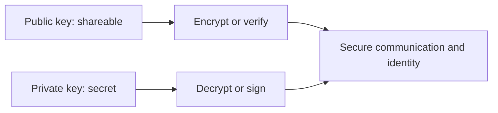
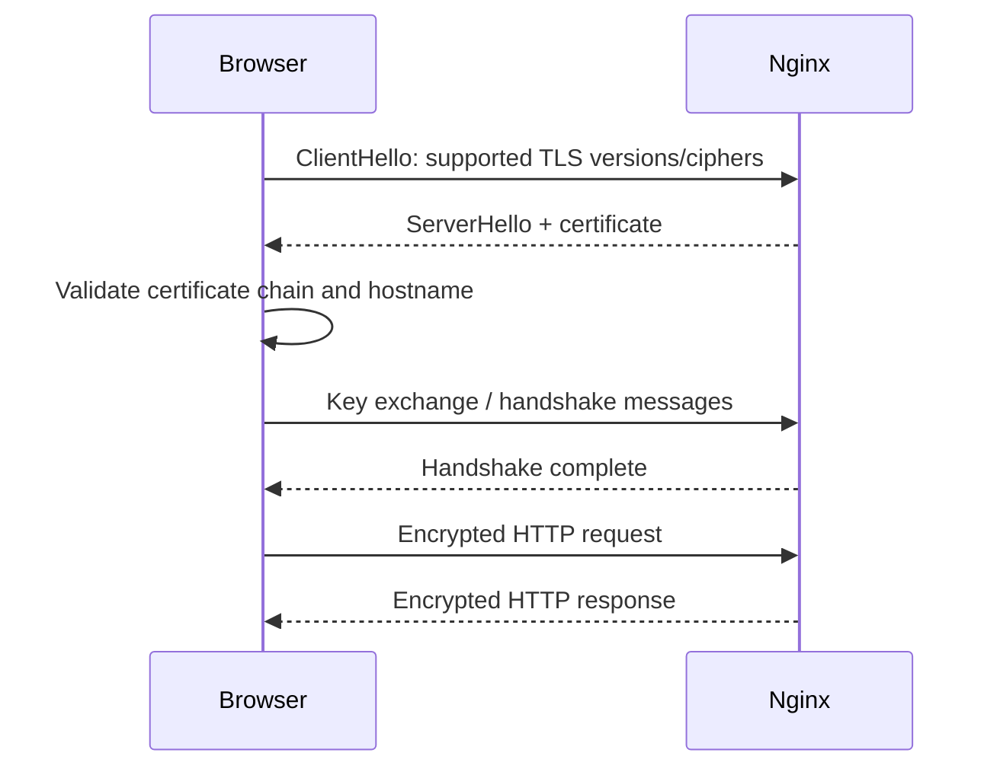

## TL;DR

Cryptography in Nginx usually means TLS: proving server identity with certificates, negotiating encryption, protecting data in transit, and managing certificate lifecycle. Asymmetric cryptography solves identity and key agreement; symmetric cryptography protects bulk data after the handshake. For an SRE, TLS matters because expired certificates, missing intermediates, weak protocols, hostname mismatch, or broken OCSP behavior can take a site down even when the application is healthy.

See also: [HTTP protocol](http_protocol.md), [Nginx overview](nginx_overview.md), [Reverse proxy](reverse_proxy.md), [Access control](access_control.md), [HTTP compression](http_compression.md), and [Logging](logging.md).

## asymmetric cryptography

Asymmetric public-key encryption, often called asymmetric cryptography or public-key cryptography, uses pairs of keys: a public key and a private key. Unlike symmetric encryption, where the same key is used for both encryption and decryption, asymmetric encryption uses different keys for these operations. This enables systems to prove identity and exchange secrets without first sharing a secret key over the network.

Each user or server generates a key pair: a public key and a private key. The public key can be shared with anyone who needs to verify or encrypt data for that identity. The private key must remain secret and should be protected with strict filesystem permissions, secret management, and limited operational access.



### Encryption

- When User A wants to send a secure message to User B, User A uses User B's public key to encrypt the message.
- The encryption process uses mathematical algorithms that are easy to perform in one direction with the public key but computationally difficult to reverse without the corresponding private key.

In TLS, modern handshakes typically do not encrypt the full session key directly with the server public key in the old RSA style. Instead, they commonly use ephemeral key exchange such as ECDHE to agree on shared secrets while the certificate proves server identity. The important operational idea remains: the private key must stay private, and the certificate binds a public key to a hostname.

### Decryption

- User B receives the encrypted message and uses their private key to decrypt it.
- Since the private key is kept secret, only User B can decrypt the message.

Private key exposure is a serious incident. If an Nginx TLS private key is leaked, rotate the key and certificate, revoke the old certificate where possible, and investigate how the key was accessed.

Because of its advantages, asymmetric cryptography is used in a variety of protocols such as PGP, SSH, Bitcoin, TLS, and S/MIME.

## https

HTTPS is HTTP over TLS. It protects confidentiality, integrity, and server identity for web traffic. Nginx commonly terminates HTTPS at the edge, then either serves content locally or proxies the request to upstream applications.



### handshake

- When a user's browser initiates a connection to a website over HTTPS, a process called the SSL/TLS handshake begins.
- The browser requests a secure connection to the server, and the server responds by sending its SSL/TLS certificate to the browser.
- The certificate contains the server's public key and information about the website, including the domain name and the certificate authority (CA) that issued the certificate.
- The browser verifies the certificate to ensure it is valid and trusted. This verification involves checking the certificate's digital signature against a list of trusted CAs stored in the browser or operating system, ensuring the certificate has not expired, and confirming that the domain name matches the one the user is trying to connect to.

For SREs, the certificate chain is a frequent failure point. If the server sends only the leaf certificate and omits required intermediate certificates, some clients may fail TLS validation even though browsers on your laptop appear to work.

### key exchange

- After verifying the certificate, the browser and server establish shared key material for the session.
- In older RSA key exchange, the browser could generate a session key, encrypt it with the server's public key from the certificate, and send it to the server.
- In modern TLS, especially TLS 1.2 with ECDHE and TLS 1.3, both sides use ephemeral key exchange to derive shared secrets without sending the final symmetric key over the network.
- The server uses its private key to prove identity during the handshake.

Ephemeral key exchange provides forward secrecy. If the server private key is compromised later, old captured traffic should still be protected when forward-secret cipher suites were used.

### data transfer

- Once the secure connection is established, data transferred between the browser and server is encrypted using symmetric encryption with the negotiated session keys.
- Symmetric encryption is used for bulk data because it is much faster than asymmetric encryption.
- This encryption ensures that if an attacker intercepts the data, they cannot decipher it without the session keys.

Nginx TLS settings should be version-controlled and reviewed. Disable obsolete protocols such as SSLv2, SSLv3, TLS 1.0, and TLS 1.1 unless legacy requirements explicitly force an exception.

## install certs

Certbot can request and install Let's Encrypt certificates for Nginx. This is useful for public domains that can complete HTTP-01 or DNS-01 validation. In production, automate renewal and alert well before expiry.

```bash
# Install the Certbot Nginx plugin, request a certificate, validate Nginx config, and restart Nginx.
yum install certbot-nginx
certbot --nginx -d yourdomain.com

# configure your configurations
# will add ssl_certs in the nginx.conf..

nginx -t
systemctl restart nginx
```

After installing certificates, verify the live endpoint from a client perspective.

```bash
# Inspect the served certificate chain and TLS handshake from the command line.
openssl s_client -connect yourdomain.com:443 -servername yourdomain.com
```

For Nginx, the certificate file should usually include the full chain, not just the leaf certificate. The private key file should be readable only by root or the Nginx runtime model required by your distribution.

## certs revokcations

Certificate revocation is the process of marking a certificate as no longer trustworthy before its expiration date. This may happen after private key compromise, mistaken issuance, domain ownership changes, or CA policy events. Revocation is important, but real-world client behavior varies, so do not rely on revocation alone as your only response to a key compromise.

### CRL

Certificate Revocation List (CRL) is a method used by CAs to maintain a list of revoked digital certificates.

### working

- The CA periodically publishes a CRL, which contains the serial numbers of certificates revoked before their expiration date.
- When a user wants to verify the validity of a certificate, they can check the CRL to see if the certificate's serial number is listed as revoked.
- CRLs are typically distributed and accessed via HTTP, LDAP, or other protocols.

### drawbacks

- CRLs can become large and cumbersome to manage, especially for CAs with a large number of certificates.
- There can be delays between when a certificate is revoked and when it appears on the CRL, leaving a window of vulnerability.
- Frequent downloads of large CRLs can lead to network congestion and performance issues.

### OCSP

Online Certificate Status Protocol (OCSP) provides a near real-time method for checking the revocation status of a digital certificate.

### working

- When a user wants to verify a certificate, their system sends a request to the CA's OCSP responder, providing the certificate's serial number.
- The OCSP responder checks its records to see if the certificate is still valid or has been revoked.
- The responder sends a response back to the user's system indicating the current status of the certificate, such as valid, revoked, or unknown.
- OCSP provides more timely validation, reducing the window of vulnerability compared to CRLs.
- It can be more efficient than downloading and parsing large CRLs, especially for individual certificate checks.

### drawbacks

- OCSP requests can introduce additional latency into certificate validation, especially if the OCSP responder is slow.
- OCSP relies on the availability and reliability of the CA's OCSP responder. If the responder is unavailable, validation may fail or become soft-failed depending on client behavior.
- OCSP requests can leak information about which certificates a user is accessing, potentially compromising privacy.

OCSP stapling can reduce client latency and privacy leakage by having the server periodically fetch an OCSP response and staple it to the TLS handshake. Nginx supports OCSP stapling when configured with the correct certificate chain and resolver.

## Common Pitfalls

- Installing only the leaf certificate instead of the full certificate chain.
- Letting certificates expire without alerting and automated renewal.
- Forgetting the `-servername` SNI flag when testing with `openssl s_client`.
- Storing private keys with broad permissions or in source control.
- Using obsolete TLS protocols or weak cipher suites.
- Assuming certificate revocation works consistently across all clients.
- Terminating TLS at Nginx and then sending sensitive traffic to upstreams over an untrusted network.

## Interview Questions

- What is the difference between symmetric and asymmetric cryptography?
- Why does TLS use both asymmetric and symmetric cryptography?
- What is inside an X.509 certificate?
- What does a browser validate during an HTTPS handshake?
- What is a certificate chain?
- What is SNI, and why does it matter?
- What is forward secrecy?
- What is the difference between CRL and OCSP?
- What is OCSP stapling?
- How would you troubleshoot a certificate mismatch or expired certificate in Nginx?

## Key Takeaways

TLS is both cryptography and operations. Nginx must serve the right certificate chain, protect private keys, support safe protocols, and renew certificates before expiry.

Asymmetric cryptography proves identity and helps establish secrets; symmetric cryptography protects the actual data stream efficiently. Certificate lifecycle, validation, and revocation behavior are just as important as the handshake itself.

See also: [HTTP protocol](http_protocol.md), [Nginx overview](nginx_overview.md), [Reverse proxy](reverse_proxy.md), [Access control](access_control.md), [HTTP compression](http_compression.md), and [Logging](logging.md).
