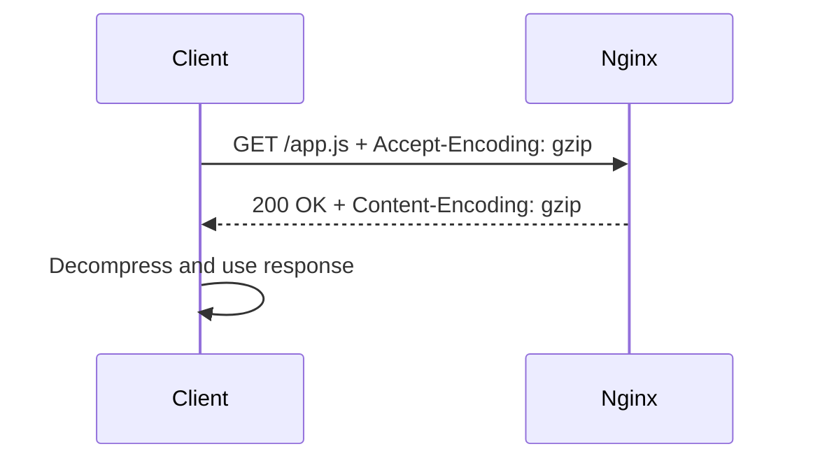

## TL;DR

HTTP compression reduces response size by compressing eligible content before sending it to the client. Clients advertise supported encodings with `Accept-Encoding`, and servers respond with `Content-Encoding` when compression is applied. For an SRE, compression matters because it can reduce bandwidth and improve latency, but overly aggressive compression can waste CPU, break already-compressed assets, or complicate caching.

See also: [HTTP protocol](http_protocol.md), [Caching](caching.md), [Static assets](static_assets.md), [Nginx overview](nginx_overview.md), [Reverse proxy](reverse_proxy.md), and [Logging](logging.md).

## Overview

When data is transferred from server to client, larger responses require more packets after segmentation by MTU and TCP behavior. Compression reduces the number of bytes sent over the network, which can reduce transfer time and bandwidth usage. This is most useful for text-based responses such as HTML, CSS, JavaScript, JSON, XML, and plain text.

Compression is less useful for files that are already compressed, such as JPEG, PNG, GIF, MP4, ZIP, and many font formats. Compressing these again usually saves little and can waste CPU.



### Client

After the TCP/TLS handshake, the client sends an HTTP request such as `GET /`. The request can include an `Accept-Encoding` header, for example `Accept-Encoding: gzip, deflate, br`. This tells the server which compression formats the client can decode.

### Server

The server reads the request headers and decides whether the response is eligible for compression. If Nginx compresses the response, it sends a header such as `Content-Encoding: gzip`. Once the client receives the response, it uses the matching decoder to decompress the body.

Compression reduces bytes between server and client, but it does not change the semantic media type of the content. For example, a compressed text response can still have `Content-Type: text/plain`; the `Content-Encoding` describes transfer encoding, while `Content-Type` describes the content itself.

Note:

- If the client does not send an `Accept-Encoding` header, the server should not assume it can use every compression mechanism. In practice, modern browsers send this header automatically.
- Although the server sends compressed data back to the client, the `Content-Type: text/plain` or similar type remains the original content type.
- Compression changes caching behavior because caches must account for different encodings. `Vary: Accept-Encoding` is important when compressed and uncompressed responses can both exist.

## configure

The following example enables gzip compression in Nginx and configures text-like MIME types. Compression level `9` gives maximum compression but can use more CPU; production systems often use a middle value such as `4`, `5`, or `6` unless measurements prove otherwise.

```nginx
# Enable gzip compression for text-based responses in the HTTP context.
vim /etc/nginx/conf.d/nginx.conf
http {
    <snip>
    gzip on;
    gzip_types text/plain text/css text/xml text/javascript application/javascript application/json;
    gzip_disable "MSIE [1-6]\\.";
    gzip_comp_level 9;
}

service nginx restart
```

For production, run `nginx -t` before reloading or restarting. Also consider `gzip_min_length` so very small responses are not compressed unnecessarily.

### testing

Use `curl` to compare response sizes with and without an explicit `Accept-Encoding` header.

```bash
# Fetch the same file without and with gzip support, then compare downloaded file sizes.
curl http://<your-web-server>/<somefile> > c1.txt
curl -H "Accept-Encoding:gzip" http://<your-web-server>/<somefile> > c2.txt

ls -l *.txt
```

Check their sizes; you should see differences when the file is compressible and Nginx applies gzip. You can also inspect headers directly.

```bash
# Inspect response headers and verify Content-Encoding when gzip is negotiated.
curl -I -H "Accept-Encoding: gzip" http://<your-web-server>/<somefile>
```

## referer

The `Referer` header tells a server which page linked to the requested resource. Nginx can use this header for basic hotlink protection, where images or other assets should not be embedded by unauthorized external websites. This can help reduce bandwidth theft and discourage casual copying, but it is not strong security because headers can be omitted or spoofed.

### Usecase

When someone copies your website or blog content and embeds your images directly, their visitors consume bandwidth from your server. You can restrict Nginx so images are not loaded when the request comes from unauthorized websites or URLs.

```nginx
# Block image hotlinking unless the Referer is empty, blocked, or matches allowed domains.
vim /etc/nginx/conf.d/nginx

server {
    location ~ \.(jpe?g|png|gif)$ {
        valid_referers none blocked servera.com *.serverb.com;
        if ($invalid_referer) {
            return 403;
        }
    }
}

systemctl restart nginx
```

The original directive was written as `valid_referes`; the Nginx directive is `valid_referers`. Test this carefully because hotlink rules can accidentally block legitimate traffic from search, social previews, documentation sites, or browser privacy modes.

## accept-language

The `Accept-Language` request header lets a client express preferred languages. Browsers usually set it based on user language preferences. Applications can use it to choose localized content, although many production systems prefer explicit URL paths, cookies, or user profile settings for deterministic language selection.

Use these requests to test language negotiation behavior.

```bash
# Send English and Japanese language preferences to the webserver.
curl -H "Accept-Language: en" <your-webserver.com/index.html>
curl -H "Accept-Language: jp" <your-webserver.com/index.html>
```

If content varies by language, caches must account for it with `Vary: Accept-Language`. Without the correct `Vary` header, a shared cache might serve one user's language variant to another user.

## Common Pitfalls

- Compressing already-compressed assets such as JPEG, PNG, ZIP, and MP4.
- Using `gzip_comp_level 9` without measuring CPU impact.
- Forgetting `Vary: Accept-Encoding`, causing caches to mix compressed and uncompressed variants incorrectly.
- Assuming `Referer` is reliable security. It is useful for hotlink reduction, not strong authorization.
- Accidentally blocking legitimate image loads with strict referer rules.
- Varying content by `Accept-Language` without cache-aware headers.
- Restarting Nginx without validating config first.

## Interview Questions

- How does HTTP compression negotiation work?
- What is the difference between `Content-Type` and `Content-Encoding`?
- Why should images usually not be gzip-compressed?
- What does `Accept-Encoding` tell the server?
- Why does `Vary: Accept-Encoding` matter?
- What is hotlink protection?
- Why is `Referer` not a strong security control?
- What does `Accept-Language` do?
- How can language negotiation interact badly with caching?
- How would you test whether Nginx gzip is working?

## Key Takeaways

Compression is a performance optimization with CPU and caching tradeoffs. Use it for text-like responses, measure the impact, and make sure caches understand response variants.

Referer and Accept-Language are request headers Nginx can use for behavior decisions, but both require caution. Referer can be spoofed or absent, and language-varying responses must be cache-aware.

See also: [HTTP protocol](http_protocol.md), [Caching](caching.md), [Static assets](static_assets.md), [Nginx overview](nginx_overview.md), [Reverse proxy](reverse_proxy.md), and [Logging](logging.md).
