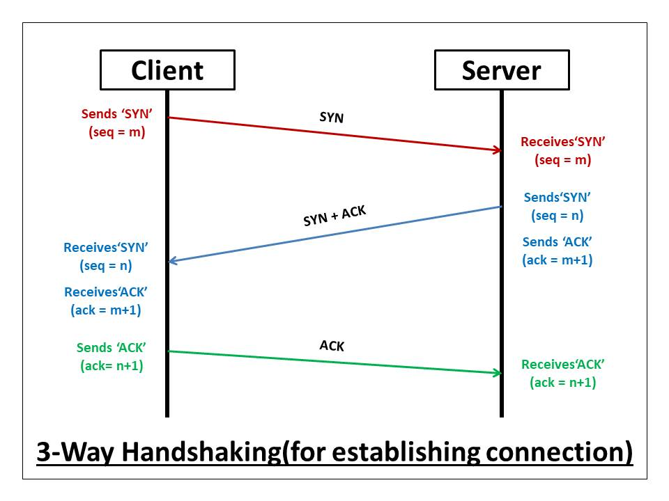

## protocols introduction

system of rules that allow two or more entities of a communications system to transmit information.

- File Transfer Protocol (FTP)
- Domain Name System Protocol (DNS)
- Transmission Control Protocol (TCP)
- Secure File Transfer Protocol (SFTP)
- Hyper Text Transfer Protocol  (HTTP)
- Internet Protocol (IP)

## http protocol

HTTP is a TCP/IP-based communication protocol, that is used to deliver data (HTML files, image files, query results, etc.) on the World Wide Web. The default port used for HTTP is TCP 80, but other ports can be used as well based on the requirements.




### HTTP GET

try to connect to the telnet port and check if the server is responding to the request

```
[root@centos ~]# telnet 192.168.56.10 80
Trying 192.168.56.10...
Connected to 192.168.56.10.
Escape character is '^]'.
GET /sample.html HTTP/1.1  -> you have to type here
Host: 192.168.56.10 -> you have to type here [ press enter two times to get the response]

HTTP/1.1 200 OK
Server: nginx/1.20.1
Date: Tue, 26 Mar 2024 13:07:45 GMT
Content-Type: text/html
Content-Length: 57
Last-Modified: Tue, 26 Mar 2024 12:57:00 GMT
Connection: keep-alive
ETag: "6602c61c-39"
Accept-Ranges: bytes

<h1> nginx tutorial </h1>
<p> line1 </p>
<p> line2 </p>
```
### partial GET

The partial GET method is used to retrieve only specific content instead of everything

```
# returns 20 bytes from the webserver

[root@centos ~]# curl --header "Range: bytes=0-20" http://192.168.56.10/sample.html
<h1> nginx tutorial <[root@centos ~]#

# returns complete data from the webserver as response

[root@centos ~]# curl -I http://192.168.56.10/sample.html
HTTP/1.1 200 OK
Server: nginx/1.20.1
Date: Tue, 26 Mar 2024 13:12:52 GMT
Content-Type: text/html
Content-Length: 57
Last-Modified: Tue, 26 Mar 2024 12:57:00 GMT
Connection: keep-alive
ETag: "6602c61c-39"
Accept-Ranges: bytes
```

### conditional GET

The conditional GET method is used to fetch the information with a condition.

```
[root@centos ~]# curl --header "If-Modified-Since: Tue, 26 Mar 2024 12:57:00 GMT" http://192.168.56.10/sample.html
[root@centos ~]#

[root@centos ~]# curl -I --header "If-Modified-Since: Tue, 26 Mar 2024 12:57:00 GMT" http://192.168.56.10/sample.html
HTTP/1.1 304 Not Modified
Server: nginx/1.20.1
Date: Tue, 26 Mar 2024 13:23:19 GMT
Last-Modified: Tue, 26 Mar 2024 12:57:00 GMT
Connection: keep-alive
ETag: "6602c61c-39"
[root@centos ~]#

[root@centos ~]# curl --header "If-Modified-Since: Tue, 26 Mar 2024 12:50:00 GMT" http://192.168.56.10/sample.html
<h1> nginx tutorial </h1>
<p> line1 </p>
<p> line2 </p>
[root@centos ~]#
```

### HTTP POST

POST method is used to send some information which will be processed by the web-server in some way.

```
POST /login.php HTTP/1.1  
   user=admin password=test123
```

### HTTP HEAD

HEAD method is used to **fetch only the HTTP headers** as part of the response.

HEAD method is identical to GET method, except that the server MUST NOT return a message-body in the response

```
[root@centos ~]# curl -I http://192.168.56.10/sample.html
HTTP/1.1 200 OK
Server: nginx/1.20.1
Date: Tue, 26 Mar 2024 13:12:52 GMT
Content-Type: text/html
Content-Length: 57
Last-Modified: Tue, 26 Mar 2024 12:57:00 GMT
Connection: keep-alive
ETag: "6602c61c-39"
Accept-Ranges: bytes
```

### HTTP TRACE

'TRACE' is a HTTP request method used for debugging which echo's back input back to the user.


### HTTP OPTIONS

OPTION  method is used to describe the communication option for the target resource.
nginx doesn't support as security concern.

```
[root@centos ~]# curl -X "OPTIONS" http://192.168.56.10 -i
HTTP/1.1 405 Not Allowed
Server: nginx/1.20.1
Date: Wed, 27 Mar 2024 02:31:35 GMT
Content-Type: text/html
Content-Length: 157
Connection: keep-alive

<html>
<head><title>405 Not Allowed</title></head>
<body>
<center><h1>405 Not Allowed</h1></center>
<hr><center>nginx/1.20.1</center>
</body>
</html>
[root@centos ~]#
```
## conclusion

HTTP defines a set of request methods to indicate the desired action to be performed for a given resource

| HTTP Method | Description |
|-------------|-------------|
| GET         | To retrieve data from the server. |
| POST        | Send input data to the server. |
| HEAD        | Exactly like GET, but server only responds with Headers. |
| PUT         | Write documents to the server. |
| DELETE      | Deletes resource from the server. |
| OPTIONS     | Asks server on which methods it supports. |
| TRACE       | ECHOS the Receive Request from the Web Server |


**HTTP Response Status Code**

| Status Code | Description |
|-------------|-------------|
| 100         | Continue |
| 101         | Switching Protocols |
| 200         | OK |
| 201         | Created |
| 202         | Accepted |
| 204         | No Content |
| 300         | Multiple Choices |
| 301         | Moved Permanently |
| 302         | Found |
| 304         | Not Modified |
| 400         | Bad Request |
| 401         | Unauthorized |
| 403         | Forbidden |
| 404         | Not Found |
| 500         | Internal Server Error |
| 501         | Not Implemented |
| 502         | Bad Gateway |
| 503         | Service Unavailable |