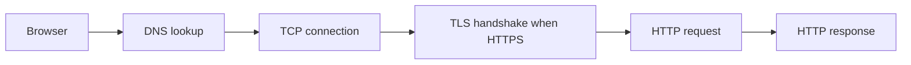
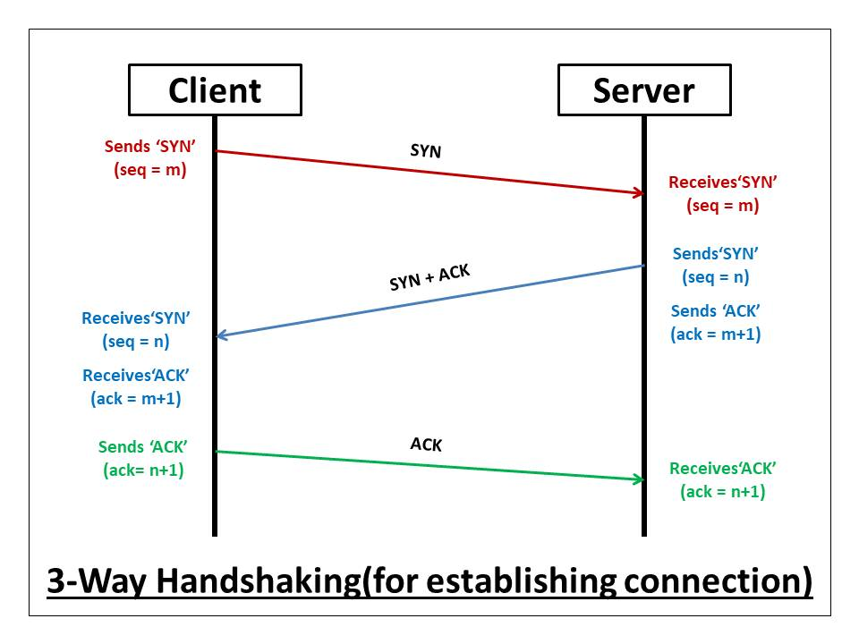
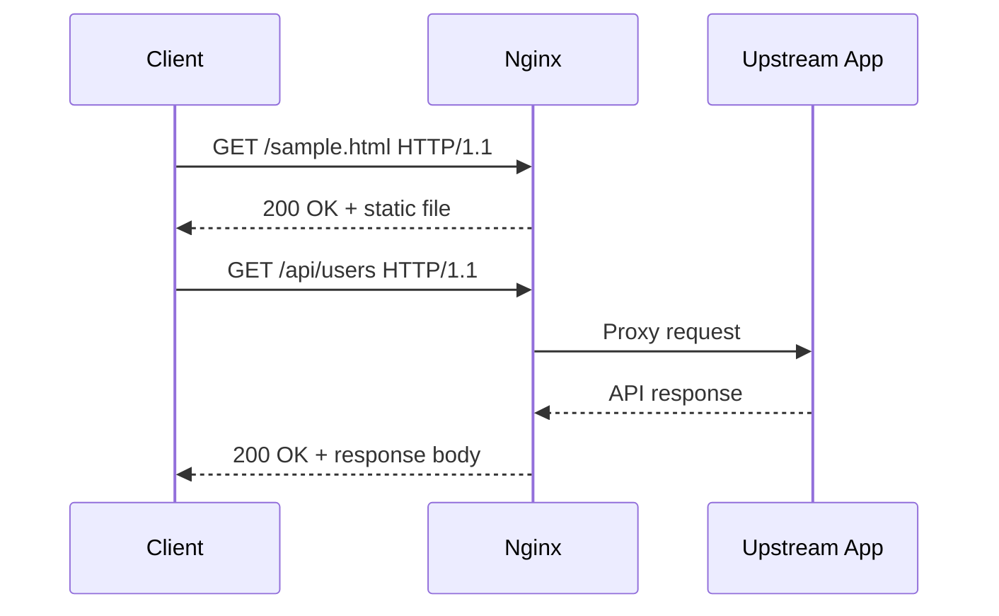

## TL;DR

HTTP is the application protocol that lets clients request resources and servers return responses. Nginx speaks HTTP as a web server, reverse proxy, cache, and TLS termination point, so understanding HTTP methods, headers, status codes, conditional requests, and range requests makes Nginx troubleshooting much easier. For an SRE, HTTP knowledge turns vague symptoms like "site is slow" or "API is broken" into observable facts: method, path, status, headers, latency, body size, cache behavior, and upstream response.

See also: [Webserver overview](webserver_overview.md), [Nginx overview](nginx_overview.md), [Reverse proxy](reverse_proxy.md), [Caching](caching.md), [HTTP compression](http_compression.md), [Logging](logging.md), and [Cryptography](cryptography.md).

## protocols introduction

A protocol is a system of rules that allows two or more entities in a communication system to transmit information. Protocols define message formats, ordering, expected behavior, error handling, and sometimes security properties. In web operations, multiple protocols cooperate for a single page load: DNS resolves the name, IP routes packets, TCP establishes a connection, TLS may encrypt it, and HTTP carries the request and response.

Common protocols include:

- File Transfer Protocol (FTP)
- Domain Name System Protocol (DNS)
- Transmission Control Protocol (TCP)
- Secure File Transfer Protocol (SFTP)
- Hyper Text Transfer Protocol (HTTP)
- Internet Protocol (IP)


```mermaid
flowchart LR
    A[Browser] --> B[DNS lookup]
    B --> C[TCP connection]
    C --> D[TLS handshake when HTTPS]
    D --> E[HTTP request]
    E --> F[HTTP response]
```

## http protocol

HTTP is a TCP/IP-based communication protocol used to deliver data such as HTML files, image files, CSS, JavaScript, API responses, and query results on the World Wide Web. The default port for HTTP is TCP `80`, while HTTPS commonly uses TCP `443`. Other ports can be used depending on deployment requirements, such as `8080` for a lab service.

HTTP is request/response oriented. A client sends a request line, headers, and optionally a body. The server returns a status line, headers, and optionally a response body. Nginx can generate the response itself for static files or proxy the request to an upstream application.




```mermaid
sequenceDiagram
    participant C as Client
    participant N as Nginx
    participant A as Upstream App
    C->>N: GET /sample.html HTTP/1.1
    N-->>C: 200 OK + static file
    C->>N: GET /api/users HTTP/1.1
    N->>A: Proxy request
    A-->>N: API response
    N-->>C: 200 OK + response body
```

### HTTP GET

`GET` retrieves a resource from the server. It should be safe and idempotent, meaning a normal GET request should not change server state. Browsers, caches, CDNs, and proxies rely heavily on this behavior.

The example below uses `telnet` to manually open a TCP connection and type an HTTP request. This is useful for learning the wire format, but `curl` is better for day-to-day troubleshooting because it handles HTTP details more safely.

```text
# Manually send an HTTP GET request over a telnet TCP connection.
[root@centos ~]# telnet 192.168.56.10 80
Trying 192.168.56.10...
Connected to 192.168.56.10.
Escape character is '^]'.
GET /sample.html HTTP/1.1  -> you have to type here
Host: 192.168.56.10 -> you have to type here [ press enter two times to get the response]

HTTP/1.1 200 OK
Server: nginx/1.20.1
Date: Tue, 26 Mar 2024 13:07:45 GMT
Content-Type: text/html
Content-Length: 57
Last-Modified: Tue, 26 Mar 2024 12:57:00 GMT
Connection: keep-alive
ETag: "6602c61c-39"
Accept-Ranges: bytes

<h1> nginx tutorial </h1>
<p> line1 </p>
<p> line2 </p>
```

Important response fields in this example:

- `HTTP/1.1 200 OK` means the request succeeded.
- `Server` identifies the server software. In production, some teams hide or standardize this header.
- `Content-Type` tells the client how to interpret the body.
- `Content-Length` tells the client how many bytes are in the response body.
- `Last-Modified` and `ETag` support caching and conditional requests.
- `Accept-Ranges: bytes` tells the client that range requests are supported.

### partial GET

A partial GET retrieves only a specific byte range instead of the full resource. This is useful for resumable downloads, video seeking, large file transfer, and clients that need only part of an object. The server uses the `Range` request header and may respond with `206 Partial Content` when serving a range.

Use this example to request only the first 21 bytes of a file and then compare with a header-only request.

```bash
# Return bytes 0 through 20 from the webserver.
[root@centos ~]# curl --header "Range: bytes=0-20" http://192.168.56.10/sample.html
<h1> nginx tutorial <[root@centos ~]#

# Return only response headers from the webserver.
[root@centos ~]# curl -I http://192.168.56.10/sample.html
HTTP/1.1 200 OK
Server: nginx/1.20.1
Date: Tue, 26 Mar 2024 13:12:52 GMT
Content-Type: text/html
Content-Length: 57
Last-Modified: Tue, 26 Mar 2024 12:57:00 GMT
Connection: keep-alive
ETag: "6602c61c-39"
Accept-Ranges: bytes
```

For SREs, range behavior matters when debugging media delivery, large downloads, object storage proxies, and CDN interactions. Broken range support can cause videos to fail seeking or downloads to restart from zero.

### conditional GET

A conditional GET fetches information only if a condition is true. Clients commonly use `If-Modified-Since` or `If-None-Match` to avoid downloading unchanged content. If the resource has not changed, the server can return `304 Not Modified` without a body, saving bandwidth and improving latency.

Use these examples to test conditional behavior with `If-Modified-Since`.

```bash
# Request the file only if it has changed since the given timestamp.
[root@centos ~]# curl --header "If-Modified-Since: Tue, 26 Mar 2024 12:57:00 GMT" http://192.168.56.10/sample.html
[root@centos ~]#

# Show headers for a resource that has not changed and returns 304.
[root@centos ~]# curl -I --header "If-Modified-Since: Tue, 26 Mar 2024 12:57:00 GMT" http://192.168.56.10/sample.html
HTTP/1.1 304 Not Modified
Server: nginx/1.20.1
Date: Tue, 26 Mar 2024 13:23:19 GMT
Last-Modified: Tue, 26 Mar 2024 12:57:00 GMT
Connection: keep-alive
ETag: "6602c61c-39"
[root@centos ~]#

# Use an older timestamp so the server returns the full resource body.
[root@centos ~]# curl --header "If-Modified-Since: Tue, 26 Mar 2024 12:50:00 GMT" http://192.168.56.10/sample.html
<h1> nginx tutorial </h1>
<p> line1 </p>
<p> line2 </p>
[root@centos ~]#
```

Conditional requests are central to HTTP caching. When a deployment appears successful but users still see old assets, check cache headers, ETags, `Last-Modified`, CDN behavior, browser cache, and whether asset filenames are versioned.

### HTTP POST

`POST` sends information to the server for processing. It is commonly used for form submissions, login requests, API writes, file uploads, and actions that create server-side state. Unlike GET, POST usually has a request body.

This simplified example shows a POST request line and body.

```http
# Example HTTP POST request payload for a login endpoint.
POST /login.php HTTP/1.1
user=admin password=test123
```

Avoid sending credentials in plaintext HTTP. Login and sensitive POST requests should use HTTPS, secure cookies, CSRF protection where applicable, and safe server-side logging that does not leak secrets.

### HTTP HEAD

`HEAD` fetches only the HTTP headers as part of the response. It is identical to GET except that the server must not return a message body. This is useful for health checks, metadata inspection, cache validation, content length checks, and testing whether a resource exists without downloading it.

Use this command to fetch only headers from the sample page.

```bash
# Request only the response headers for a resource.
[root@centos ~]# curl -I http://192.168.56.10/sample.html
HTTP/1.1 200 OK
Server: nginx/1.20.1
Date: Tue, 26 Mar 2024 13:12:52 GMT
Content-Type: text/html
Content-Length: 57
Last-Modified: Tue, 26 Mar 2024 12:57:00 GMT
Connection: keep-alive
ETag: "6602c61c-39"
Accept-Ranges: bytes
```

### HTTP TRACE

`TRACE` is an HTTP request method used for diagnostics; it echoes the received request back to the client. It is usually disabled on production systems because it can expose headers and interact badly with old cross-site tracing attack patterns. If you do not need it, keep it disabled.

### HTTP OPTIONS

`OPTIONS` asks the server which communication options or methods are available for the target resource. APIs often use `OPTIONS` for CORS preflight requests. Some simple Nginx static configurations may return `405 Not Allowed` because OPTIONS is not explicitly supported for that resource.

Use this command to test how Nginx responds to an OPTIONS request.

```bash
# Send an OPTIONS request and print response headers and body.
[root@centos ~]# curl -X "OPTIONS" http://192.168.56.10 -i
HTTP/1.1 405 Not Allowed
Server: nginx/1.20.1
Date: Wed, 27 Mar 2024 02:31:35 GMT
Content-Type: text/html
Content-Length: 157
Connection: keep-alive

<html>
<head><title>405 Not Allowed</title></head>
<body>
<center><h1>405 Not Allowed</h1></center>
<hr><center>nginx/1.20.1</center>
</body>
</html>
[root@centos ~]#
```

If browser-based API calls fail before reaching the application, check CORS preflight behavior. A missing or blocked `OPTIONS` response can break cross-origin frontend requests even when GET or POST works with `curl`.

## conclusion

HTTP defines a set of request methods to indicate the desired action to be performed for a given resource.

| HTTP Method | Description |
|-------------|-------------|
| GET | Retrieve data from the server. |
| POST | Send input data to the server. |
| HEAD | Exactly like GET, but server only responds with headers. |
| PUT | Write or replace documents/resources on the server. |
| DELETE | Delete a resource from the server. |
| OPTIONS | Ask the server which methods/options it supports. |
| TRACE | Echo the received request from the web server. |

### HTTP Response Status Code

Status codes are grouped by class. The first digit tells you the broad category: `1xx` informational, `2xx` success, `3xx` redirection, `4xx` client/request problem, and `5xx` server/upstream problem.

| Status Code | Description |
|-------------|-------------|
| 100 | Continue |
| 101 | Switching Protocols |
| 200 | OK |
| 201 | Created |
| 202 | Accepted |
| 204 | No Content |
| 300 | Multiple Choices |
| 301 | Moved Permanently |
| 302 | Found |
| 304 | Not Modified |
| 400 | Bad Request |
| 401 | Unauthorized |
| 403 | Forbidden |
| 404 | Not Found |
| 500 | Internal Server Error |
| 501 | Not Implemented |
| 502 | Bad Gateway |
| 503 | Service Unavailable |

In Nginx operations, `502`, `503`, and `504` deserve special attention. They often mean Nginx itself is reachable but the upstream application, load balancer, DNS, or network dependency is failing.

## Common Pitfalls

- Confusing TCP connectivity with HTTP success. A port can accept connections while returning `404`, `502`, or invalid responses.
- Sending credentials over plain HTTP. Sensitive requests should use HTTPS.
- Assuming GET requests are harmless when the application incorrectly mutates state on GET.
- Forgetting that browser CORS failures often involve `OPTIONS` preflight behavior.
- Misreading `304 Not Modified` as an error. It is a successful cache validation response.
- Ignoring headers during troubleshooting. Headers often explain caching, content type, redirects, compression, and upstream behavior.

## Interview Questions

- What is the difference between HTTP and HTTPS?
- What happens before an HTTP request can be sent over TCP?
- Explain GET, POST, HEAD, OPTIONS, and TRACE.
- What is a conditional GET, and why does `304 Not Modified` matter?
- What is a range request, and when would clients use it?
- How would you manually send an HTTP request with telnet or netcat?
- What is the difference between `4xx` and `5xx` status codes?
- Why can an API fail in the browser but work with `curl`?
- What headers are useful for debugging caching?
- How does Nginx use HTTP when acting as a reverse proxy?

## Key Takeaways

HTTP troubleshooting is about reading the request and response precisely: method, path, host, headers, status, body, and timing. Nginx makes these details visible through access logs, error logs, and upstream behavior.

GET, HEAD, range requests, and conditional requests are especially important for static assets and caching. POST, OPTIONS, and status codes are especially important for APIs, authentication flows, and browser behavior.

See also: [Webserver overview](webserver_overview.md), [Nginx overview](nginx_overview.md), [Reverse proxy](reverse_proxy.md), [Caching](caching.md), [HTTP compression](http_compression.md), [Logging](logging.md), and [Cryptography](cryptography.md).
