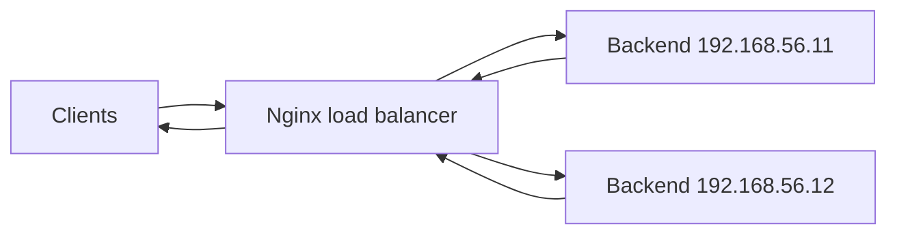

## TL;DR

Nginx can act as an HTTP load balancer by distributing requests across a group of upstream backend servers. Load balancing improves availability, spreads traffic, supports maintenance, and provides a control point for retries, failover, TLS termination, and traffic shaping. For an SRE, load balancer behavior directly affects user-facing reliability because unhealthy backends, bad timeouts, uneven weights, and retry storms can quickly become incidents.

See also: [Nginx overview](nginx_overview.md), [Reverse proxy](reverse_proxy.md), [Webserver overview](webserver_overview.md), [HTTP protocol](http_protocol.md), [Logging](logging.md), [Caching](caching.md), and [Access control](access_control.md).

## Overview

LB means load balancer: a system that distributes traffic across a set of multiple servers. The goal is not only throughput, but also resilience. If one backend fails, the load balancer should stop or reduce traffic to that backend and continue serving requests through healthy instances.

Advantages of LB:

- Traffic distribution using multiple algorithms to backend servers. This prevents a single backend from taking all traffic when multiple replicas are available.
- Health checks of backend applications. Health checks help remove broken instances from rotation and reduce visible user errors.
- Support for SSL/TLS termination. Nginx can accept HTTPS from clients and proxy to backends over HTTP or HTTPS depending on the trust boundary.



## implementation

### load balancing

The `upstream` block specifies a group of servers to which Nginx can send load-balanced traffic. A `server` or `location` block then uses `proxy_pass http://upstream_name;` to send requests to that group.

By default, open source Nginx uses round-robin load balancing across upstream servers. That means requests are distributed in order across available backends unless weights, failure state, or other algorithms change the selection.

### nginx server

This example shows a reverse proxy configuration with two direct backend targets. It is close to load balancing, but true upstream load balancing is usually cleaner when multiple servers serve the same route.

```nginx
# Example proxy config that routes / to one backend and /admin to another backend.
[root@centos conf.d]# cat proxy.conf.backend
server {
    listen       80;
    server_name  localhost;

    location / {
        proxy_pass http://192.168.56.11;
        proxy_set_header X-Real-IP $remote_addr;
        proxy_set_header Host-Header $host;
    }

    location /admin {
        proxy_pass http://192.168.56.12;
        proxy_set_header X-Real-IP $remote_addr;
      }
}
[root@centos conf.d]#
```

When you hit the Nginx load balancer, traffic is distributed to the backend servers.

```bash
# Test each backend directly, then send repeated requests through the load balancer.
[root@centos conf.d]# curl 192.168.56.11
This is application server backend
[root@centos conf.d]# curl 192.168.56.12
this is backend server
[root@centos conf.d]#
[root@centos conf.d]# for i in `seq 1 7`
> do
> curl http://192.168.56.10
> done
this is backend server
This is application server backend
this is backend server
This is application server backend
this is backend server
This is application server backend
this is backend server
[root@centos conf.d]#
```

The alternating responses show traffic spreading across the two backends. In production, you would usually verify this through access logs, upstream address logging, metrics, and backend request counters rather than response text.

## health checks

Health checks monitor the health of HTTP servers in an upstream group such as `backend`. If a server is not responding, Nginx can stop sending requests to it for a period of time. This reduces user impact when a backend is down or refusing connections.

Let's say one backend server has stopped. Nginx should route traffic to the healthy node.

Stop Nginx on one backend server.

```bash
# Stop Nginx on one backend to simulate a failed upstream.
[root@centos html]# systemctl stop nginx
[root@centos html]# systemctl status nginx
● nginx.service - nginx - high performance web server
   Loaded: loaded (/usr/lib/systemd/system/nginx.service; enabled; vendor preset: disabled)
   Active: inactive (dead) since Fri 2024-03-29 07:49:31 UTC; 5s ago
     Docs: http://nginx.org/en/docs/
  Process: 20660 ExecStop=/bin/sh -c /bin/kill -s TERM $(/bin/cat /var/run/nginx.pid) (code=exited, status=0/SUCCESS)
  Process: 607 ExecStart=/usr/sbin/nginx -c /etc/nginx/nginx.conf (code=exited, status=0/SUCCESS)
 Main PID: 614 (code=exited, status=0/SUCCESS)

Mar 27 12:36:31 centos systemd[1]: Starting nginx - hig...
Mar 27 12:36:32 centos systemd[1]: Can't open PID file ...
Mar 27 12:36:32 centos systemd[1]: Started nginx - high...
Mar 29 07:49:31 centos systemd[1]: Stopping nginx - hig...
Mar 29 07:49:31 centos systemd[1]: Stopped nginx - high...
Hint: Some lines were ellipsized, use -l to show in full.
[root@centos html]#
```

From the load balancer server, direct access to the stopped backend fails.

```bash
# Confirm that one backend is refusing direct connections.
[root@centos conf.d]# curl http://192.168.56.12
curl: (7) Failed connect to 192.168.56.12:80; Connection refused
[root@centos conf.d]#
```

Since one server is down, the Nginx load balancer routes requests to the healthy node. This behavior is part of passive health checks.

```bash
# Send repeated requests through the load balancer and observe that only the healthy backend responds.
[root@centos conf.d]# for i in `seq 1 7`; do curl http://192.168.56.10; done
This is application server backend
This is application server backend
This is application server backend
This is application server backend
This is application server backend
This is application server backend
This is application server backend
[root@centos conf.d]#
```

Once the node is back up, traffic is routed across backends again.

```bash
# Restart Nginx on the failed backend and confirm it is active.
[root@centos html]# systemctl start nginx
[root@centos html]# systemctl status nginx
● nginx.service - nginx - high performance web server
   Loaded: loaded (/usr/lib/systemd/system/nginx.service; enabled; vendor preset: disabled)
   Active: active (running) since Fri 2024-03-29 07:52:10 UTC; 13s ago
     Docs: http://nginx.org/en/docs/
  Process: 20660 ExecStop=/bin/sh -c /bin/kill -s TERM $(/bin/cat /var/run/nginx.pid) (code=exited, status=0/SUCCESS)
  Process: 20673 ExecStart=/usr/sbin/nginx -c /etc/nginx/nginx.conf (code=exited, status=0/SUCCESS)
 Main PID: 20674 (nginx)
   CGroup: /system.slice/nginx.service
           ├─20674 nginx: master process /usr/sbin/ngin...
           └─20675 nginx: worker process

Mar 29 07:52:10 centos systemd[1]: Starting nginx - hig...
Mar 29 07:52:10 centos systemd[1]: Can't open PID file ...
Mar 29 07:52:10 centos systemd[1]: Started nginx - high...
Hint: Some lines were ellipsized, use -l to show in full.
[root@centos html]#
```

Test repeated requests through the load balancer again.

```bash
# Confirm traffic is distributed again after the backend recovers.
[root@centos conf.d]# for i in `seq 1 7`; do curl http://192.168.56.10; done
This is application server backend
This is application server backend
this is backend server
This is application server backend
this is backend server
This is application server backend
this is backend server
[root@centos conf.d]#
```

### active and passive

Active health checks are available in Nginx Plus, which is paid. In active checks, Nginx sends special health check requests, such as `GET /`, to each upstream server and evaluates the response. If the response matches expected status codes or conditions, the server remains healthy; otherwise it is marked unhealthy.

Passive health checks are available in open source Nginx. Nginx monitors real communication between clients and upstream servers. If an upstream server times out, refuses connections, or returns configured failure responses, passive health checks can mark the server temporarily unavailable.

For SREs, the difference is important. Active health checks can detect a dead backend before user traffic reaches it. Passive checks learn from failed real requests, which means some user requests may fail before the backend is removed from rotation.

### passive healthcheck parameters

You can configure passive checks in the Nginx upstream config.

`max_fails` sets the number of failed attempts that must occur during the `fail_timeout` period for the server to be marked unavailable.

`fail_timeout` sets both the time window during which failures are counted and the time for which the server is marked unavailable after crossing the failure threshold.

```nginx
# Configure passive health check thresholds for two upstream backend servers.
[root@centos conf.d]# cat load-balancer.conf
upstream backend {
  server 192.168.56.11 max_fails=2 fail_timeout=30s;
  server 192.168.56.12 max_fails=2 fail_timeout=30s;
}

server {
    listen       80;
    server_name  localhost;

    location / {
        proxy_pass http://backend;
 }
}
[root@centos conf.d]#systemctl restart nginx
```

Until the `30s` window has passed for `2` failed attempts, Nginx will avoid sending requests to that server. Tune these values carefully. Too sensitive, and transient blips remove healthy servers; too loose, and users experience repeated failures.

You can use ApacheBench (`ab`) from the `httpd-tools` package to send many requests to Nginx.

```bash
# Send 1000 requests to the Nginx load balancer.
ab -n 1000 localhost/
```

### server weights

Weights allow you to customize request distribution from Nginx to upstream backends. For example, you might send more traffic to a larger instance, a newer node during canary validation, or a backend with more capacity.

```nginx
# Send proportionally more traffic to 192.168.56.12 by giving it weight=2.
upstream backend {
  server 192.168.56.11;
  server 192.168.56.12 weight=2;
}
```

In this example, `192.168.56.12` receives roughly twice as many requests as `192.168.56.11`, assuming both are healthy and the request pattern is large enough for distribution to become visible.

## Common Pitfalls

- Confusing reverse proxying with load balancing. A reverse proxy can point to one backend; load balancing distributes across an upstream group.
- Leaving health check behavior at defaults without understanding failure thresholds.
- Using passive health checks and expecting Nginx to detect failures before user traffic hits them.
- Forgetting to log upstream address and upstream status. Without those fields, it is harder to know which backend served or failed a request.
- Setting weights without matching real backend capacity.
- Using restart instead of graceful reload after config validation.
- Missing upstream timeout settings, which can cause requests to hang too long or fail too aggressively.

## Interview Questions

- What is an Nginx `upstream` block?
- What load balancing algorithm does open source Nginx use by default?
- What is the difference between active and passive health checks?
- Explain `max_fails` and `fail_timeout`.
- How do server weights affect traffic distribution?
- How would you verify that traffic is being balanced across backends?
- What logs or metrics would you add for load balancer troubleshooting?
- Why can passive health checks still allow some user-visible failures?
- How would you remove one backend for maintenance?
- How would you troubleshoot intermittent `502` responses from a load-balanced service?

## Key Takeaways

Nginx load balancing is built around upstream groups and proxying. The simplest setup distributes traffic round-robin, while weights and passive health checks shape traffic based on capacity and failures.

Load balancers improve reliability only when they are observable and tuned. Log upstream details, validate health check behavior, set appropriate timeouts, and test failure scenarios before an incident.

See also: [Nginx overview](nginx_overview.md), [Reverse proxy](reverse_proxy.md), [Webserver overview](webserver_overview.md), [HTTP protocol](http_protocol.md), [Logging](logging.md), [Caching](caching.md), and [Access control](access_control.md).
