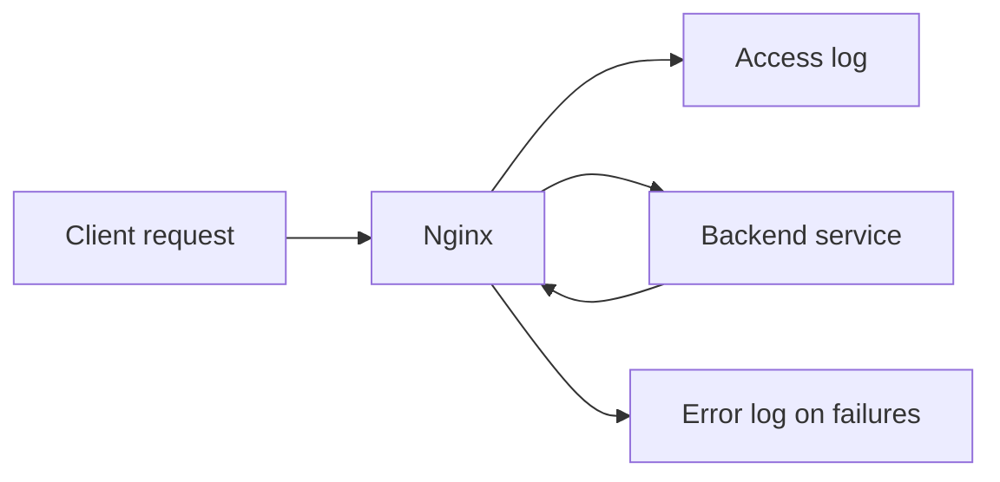

## TL;DR

Nginx logs are one of the fastest ways to understand production traffic: who called, what path they requested, which status code was returned, how many bytes were sent, how long upstreams took, and what failed. Access logs explain request behavior; error logs explain Nginx and upstream failures. For an SRE, good Nginx logging turns incidents from guesswork into evidence.

See also: [Nginx overview](nginx_overview.md), [HTTP protocol](http_protocol.md), [Reverse proxy](reverse_proxy.md), [Load balancer](load_balancer.md), [Caching](caching.md), and [Access control](access_control.md).

## access logs

Nginx access logs record one line per request when enabled. They are useful for traffic analysis, incident response, debugging client behavior, identifying abusive callers, measuring status-code rates, and correlating a request across proxy and backend layers. A well-designed access log format should include enough context to troubleshoot without leaking secrets.

From Nginx access logs, we can determine:

- IP address of the requester.
- Date and time of the request.
- Type of request, such as `GET`, `POST`, or `PUT`.
- Path requested by the client.
- Response status of the request.
- Browser or user agent from which the request was sent.
- Referrer, request size, response size, and forwarded client headers if configured.
- Upstream address, upstream status, and upstream response time when Nginx is proxying.



The `log_format` directive defines the fields and layout of an access log line.

```nginx
# Define a named access log format that can be referenced by access_log directives.
log_format main "" ...
```

A more practical reverse-proxy log format includes upstream fields.

```nginx
# Example access log format with client, request, response, and upstream timing fields.
log_format main '$remote_addr - $remote_user [$time_local] "$request" '
                '$status $body_bytes_sent "$http_referer" '
                '"$http_user_agent" "$http_x_forwarded_for" '
                'rt=$request_time uct=$upstream_connect_time '
                'uht=$upstream_header_time urt=$upstream_response_time '
                'ua="$upstream_addr" us="$upstream_status"';
```

For SRE work, `request_time`, `upstream_response_time`, `upstream_status`, and `upstream_addr` are especially valuable. They help distinguish a slow client, slow Nginx processing, slow upstream application, and failed backend selection.

## configure custom logs

Custom logs let each virtual host or service write to its own file. This is useful when multiple applications share one Nginx instance and need separate troubleshooting, retention, or ingestion pipelines.

Open the virtual host configuration file and add an `access_log` directive.

```nginx
# Configure a virtual host to write access logs using the main log format.
vim /etc/nginx/conf.d/virualhost.conf
access_log /var/log/nginx/example.log main;
```

After traffic reaches that server block, `/var/log/nginx/example.log` will contain requests in the defined format.

```bash
# Verify the custom access log file exists and is receiving log lines.
ls /var/log/nginx/example.log
tail -f /var/log/nginx/example.log
```

Always validate and reload Nginx after logging configuration changes.

```bash
# Validate Nginx configuration and gracefully reload it.
nginx -t
systemctl reload nginx
```

## logging

Nginx error logs capture startup failures, configuration problems, upstream connection errors, permission problems, file-not-found issues, TLS failures, and worker-level diagnostics. Error logs are usually the first place to check when Nginx returns `500`, `502`, `503`, or `504`, or when the service fails to start.

### logging levels

Nginx supports multiple error log severity levels:

- `emerg`: system is unusable.
- `alert`: action must be taken immediately.
- `crit`: critical condition.
- `error`: error condition.
- `warn`: warning condition.
- `notice`: normal but significant condition.
- `info`: informational messages.
- `debug`: detailed debug output, usually for short-term troubleshooting.

The original note says no custom error logs can be configured, but custom error log paths and levels can be configured at multiple levels depending on context. Be careful with `debug` because it can generate large volumes and may expose sensitive request details.

```nginx
# Configure different error log files and severity thresholds.
vim /etc/nginx/conf.d/nginx.conf

error_log /var/log/nginx.log emerg;
error_log /var/log/example.log crit;
error_log /var/log/domain_info.log info;
```

In practice, each `error_log` directive logs messages at the configured severity and more severe levels. For example, `crit` includes critical, alert, and emergency messages, but not ordinary warnings.

## Common log investigations

Use access logs to answer request-path questions:

- Which clients are generating the most traffic?
- Which endpoints have the highest error rate?
- Are `4xx` errors caused by a specific path, user agent, or client IP?
- Are `5xx` errors coming from one upstream address?
- Did latency increase in Nginx, the upstream app, or both?

Use error logs to answer failure-cause questions:

- Did Nginx fail to connect to an upstream?
- Did the upstream time out before sending headers?
- Did Nginx lack permission to read a file or certificate?
- Did a config reload fail syntax validation?
- Did TLS handshake or certificate validation fail?

## Common Pitfalls

- Logging too little. Without upstream status and timing fields, reverse proxy incidents are much harder to diagnose.
- Logging too much. Query strings, headers, cookies, and request bodies can contain secrets.
- Forgetting log rotation. Nginx logs can fill disks quickly under traffic spikes or debug logging.
- Using local logs only. Centralized logging is safer for incident response and host loss.
- Enabling debug logging permanently. It is expensive and noisy.
- Not validating Nginx config after changing log formats.

## Interview Questions

- What is the difference between Nginx access logs and error logs?
- Which fields would you include in an access log format for a reverse proxy?
- How do you tell whether a `502` came from Nginx or an upstream backend?
- What does `$request_time` measure?
- Why are `$upstream_response_time` and `$upstream_addr` useful?
- What are the Nginx error log severity levels?
- What security risks exist in HTTP logging?
- How would you prevent logs from filling a disk?

## Key Takeaways

Access logs show what happened for each request; error logs explain why Nginx or upstream handling failed. Good log formats include client identity, request details, response status, timing, and upstream fields.

For SREs, logging is not just storage of text files. It is an observability contract that must support debugging, alerting, auditing, capacity planning, and incident review without leaking sensitive data.

See also: [Nginx overview](nginx_overview.md), [HTTP protocol](http_protocol.md), [Reverse proxy](reverse_proxy.md), [Load balancer](load_balancer.md), [Caching](caching.md), and [Access control](access_control.md).
